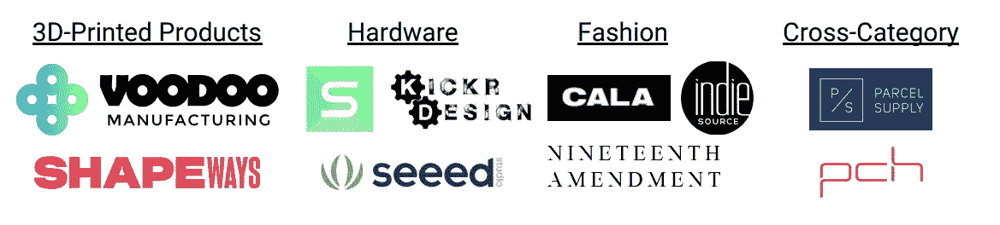
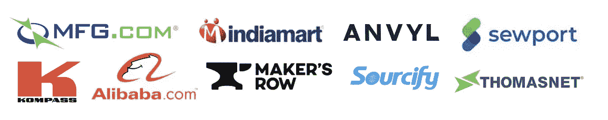
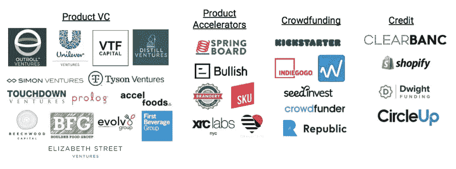
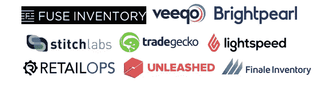
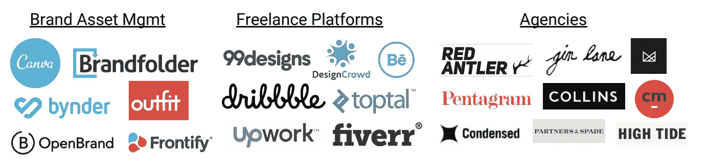
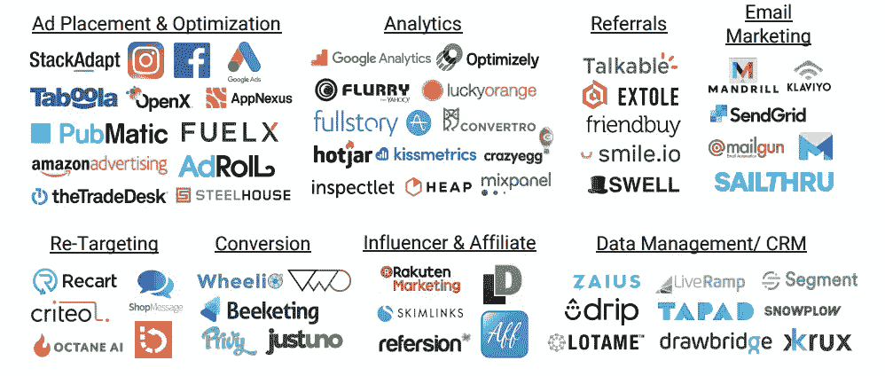
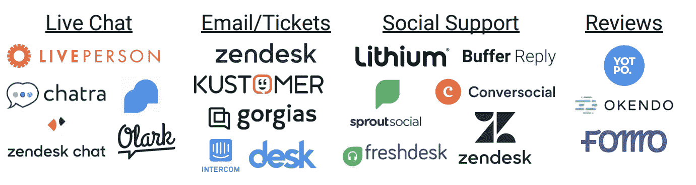
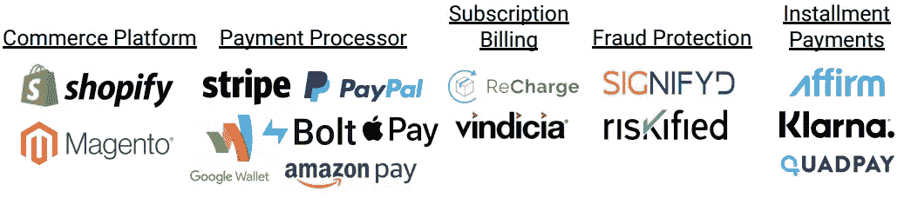
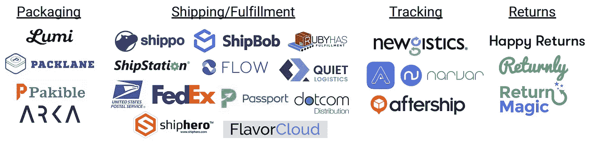
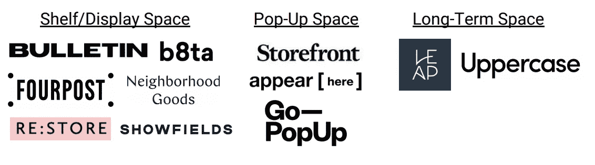

# D2C 2.0:基础设施的崛起

> 原文：<https://medium.com/hackernoon/d2c-2-0-the-rise-of-infrastructure-d2172fdf59d4>

在过去的十年里，数十亿美元的风险资本涌入了直接面向消费者(D2C)的品牌，资助了数百个新贵品牌挑战几乎每个产品类别的现有品牌。这些曾经被投资者忽视的品牌[现在正在筹集数百万美元的预发行资金，并招募顶尖人才。](http://fortune.com/2014/11/21/into-the-gloss/)

毫无疑问，围绕 D2C 空间有大肆宣传，但我们看到对允许这些品牌扩展的基础设施的兴趣要少得多。D2C 品牌独一无二地拥有其生产和分销过程的每一步——从产品设计到包装到营销再到履行。新品牌可能很难将所有这些东西整合在一起，而老牌品牌面临的挑战包括如何服务于国际观众，以及以资本高效的方式保持增长。

我们看到了为这些品牌提供更好服务的工具的巨大机会，我们很高兴分享我们对该领域公司的研究，以及我们希望看到进一步发展的领域。如果你正在 D2C 的基础设施领域工作，请发电子邮件到 twins@crv.com 给我们——我们很乐意与你交谈！

# **新品牌行动手册**

根据我们与几十个品牌的对话和来自 [**Siftery**](https://siftery.com/) **的数据，我们整理了一份 D2C 品牌目前使用的工具清单。**

## *产品设计&开发*

大多数品牌在内部处理产品的设计和开发，有时需要客户的大量投入，Glossier [在这方面做得很好](https://www.marketingweek.com/2018/06/25/glossier-ripping-up-marketing-playbook/)(更多的品牌正在通过 Instagram 故事和调查进行探索)。开发过程通常包括寻找在该领域有专长的工厂或制造合作伙伴，并与他们密切合作。

然而，我们已经发现一些创业公司打算在产品开发过程中使用技术。 [**巫毒制造**](https://voodoomfg.com/)**[**Shapeways**](https://www.shapeways.com/)**为 3D 打印产品提供这种，而 [**形状原型**](https://www.shapeprototype.com/) **、** [**Kickr 设计**](https://www.kickrdesign.com/) **、**[**Seeed 工作室**](https://www.seeed.cc/#/) 为硬件做同样的事情。****[**IndieSource**](https://indiesource.com)**[**第十九修正案**](https://www.nineteenthamendment.com/) 都专注于时尚，做小批量生产，周转时间快。 [**包裹供应**](http://www.parcel.supply/) (客户包括*Birchbox、S'well* 和*蓝围裙*)，以及 [**PCH 国际**](https://www.pchintl.com/)(*Walker and Company、Fitbit、* *Blaze* )都跨行业工作。**********

********

## *****制造业*****

****许多品牌通过他们的个人网络或推荐找到制造商，但也有一些将公司与国内外工厂联系起来的成熟市场—[**【MFG.com】**](https://www.mfg.com/)[**Kompass**](https://www.kompass.com/)[**阿里巴巴**](https://www.alibaba.com/)[**IndiaMart**](https://www.indiamart.com/)和 [**ThomasNet**](https://www.thomasnet.com/) 就是几个例子。一些新的玩家迎合了关注环保、质量控制和社会责任的年轻品牌——[**【Anvyl】**](https://anvyl.com/)**(*LOLA，Hims，S'well* ， *Native* ， [**Sourcify**](https://www.sourcify.com/) ， [**Maker's Row**](https://makersrow.com/) ，以及 [**Sewport**](https://sewport.com/)******

********

## *****融资*****

****有许多公司专注于消费品牌，其中许多公司将投资与孵化或品牌、广告或其他支持相结合。CircleUp 是这一领域的主要参与者——该公司提供信用贷款、股权和融资选择，Indie.vc、indie . VC 和 indie . VC 分别提供股权、股权和融资选择。 [**组合品牌**](https://www.assembledbrands.com/) 是一家较新的公司，专注于年收入超过 100 万美元的品牌。****

****其他基金包括[**Outroll Ventures**](https://outroll.com/)[**Unilever Ventures**](http://www.unileverventures.com/)[**Touchdown Ventures**](http://www.touchdownvc.com/)[**Beechwood Capital**](http://www.beechwoodcap.com/)[**Simon Capital**](https://simonventures.co/)**[**Elizabeth Street**](https://elizabethstreet.vc/)**和**[**Accel foods**](http://www.accelfoods.com/)**[**第一饮料集团**](https://firstbev.com/)**[**distilt Ventures**](https://www.distillventures.com/)**专门投资食品饮料。**[**The Brandery**](https://www.brandery.org/)[**SKU**](http://sku.is/)**[**XRC 实验室**](https://www.xrclabs.com/)**和 [**丝芙兰加速**](https://www.sephorastands.com/accelerate/) (美颜为主)全部充当加速器**********************

****[**Kickstarter**](http://kickstarter.com) 和 [**Indiegogo**](http://indiegogo.com) 仍然是为最初的生产运作提供资金的一种流行方式，还有股权众筹平台，如 [**SeedInvest**](https://www.seedinvest.com/) 、[**crowd under**](https://www.crowdfunder.com/)、 [**Republic**](https://republic.co/) 和 wef under**。除了像小企业贷款这样的传统信贷选项(也通过像 [**Fundbox**](https://fundbox.com/partner/019b/?utm_campaign=g_s_fundbox_beta1&utm_source=google&utm_medium=cpc&utm_term=inventory%20loans&ad=262409582081&mt=b&adpos=1o2&content=desktop&gclid=EAIaIQobChMIwaL_47mK4AIV-SCtBh3Vig6sEAMYAiAAEgICK_D_BwE) 、 [**SnapCap**](https://snapcap.com/inventory-loans) 和 [**Kickfurther**](https://www.kickfurther.com/) 这样的初创公司提供)，还有一些直接迎合 D2C 品牌的新信贷选项。其中包括 [**CircleUp 信用顾问**](https://circleup.com/credit/) ， [**德怀特融资**](https://www.dwightfunding.com/) (营运资金)，以及 [**Clearbanc**](https://clearbanc.com/) (营销融资)。[**Shopify Capital**](https://www.shopify.com/capital)**通过商户现金垫款和贷款做同样的事情。********

********

## *****库存管理*****

****库存管理和预测对于缺乏现金和存储空间的年轻品牌来说至关重要。预测是复杂的，因为这些品牌可能会有难以预测的“病毒式”时刻，并导致长时间的等待。****

****像大多数其他软件类别一样，现有库存管理解决方案(Netsuite、Workday、SAP 等。).然而，定价、功能和实施通常不适用于早期、高增长的公司。少数迎合 D2C 品牌的创业平台——[**Fuse 库存**](http://fuseinventory.com/) ( *Glossier，LOLA，MeUndies* ， *Snowe* ，[**Stitch Labs**](https://www.stitchlabs.com/)(*Brooklinen，Thinx* )。在电子商务中更广泛流行的其他选项有[**trade gecko**](https://www.tradegecko.com/)[**Finale**](https://www.finaleinventory.com/)[**light speed**](https://www.lightspeedhq.com/ecommerce/features/)[**Retail Ops**](https://www.retailops.com/)[**Unleashed**](https://www.unleashedsoftware.com/)[**vee qo**](https://www.veeqo.com/)和 [**Brightpearl**](https://www.brightpearl.com/)****

********

## *****品牌化*****

****许多品牌在内部做这件事，尤其是如果他们的团队中有一个设计师，或者可以很容易地咨询专家。 [**Canva**](http://canva.com) **，**[**brand folder**](https://brandfolder.com/)**，**[**by nder**](https://www.bynder.com/en/brand-management/)**，** [**装**](https://outfit.io/) **，**[**open brand**](https://openbrand.com/)，以及[**Frontify**](https://frontify.com/)**在[**99 designs**](https://99designs.com/)**[**design crowd**](https://www.designcrowd.com/)[**Dribbble**](https://dribbble.com/)[**Behance**](https://www.behance.net/)[**Upwork**](https://www.upwork.com/)[**top tal**](https://www.toptal.com/)等平台上雇佣自由职业者也很常见********

****许多设计机构因与 D2C 顶级品牌合作而声名鹊起——**(*Casper、Allbirds、Keeps、Brandless* )和[**Gin Lane**](https://www.ginlane.com/)(*Hims、Sweetgreen、Harry’s、Stadium Goods* )是其中最受欢迎的两个。其他还包括****(*布菲，嫩绿，翅膀* ) **，** [**凝聚**](https://condensed.io/) ( *双眼镜，小水小水，饲养员* ) **，** [**伙伴&铲****(*全鸟，火烈鸟***](http://partnersandspade.com/) ***[**座右铭**](https://wearemotto.com/) ( *连，基特萨，皇冠&扣*)， [**马克西穆斯竞技场**](https://circusmaximus.com/) ( *罗曼，轰炸*)，以及 [**高潮**](http://s3.amazonaws.com/high-tide-stage/wp-content/uploads/2017/09/07151631/ht-seo-logo.png) ( *沃比帕克，卡斯珀，罗拉)*。*************

********

## *****营销*****

****像传统的电子商务公司一样，许多 D2C 品牌将大部分营销资金投入到脸书、Instagram 和谷歌。有大量营销软件工具可供新品牌管理这一支出。为了了解早期和晚期品牌都在使用什么，我们使用了 [**Siftery**](http://siftery.com) 来查看资金最充足的 15 个 D2C 品牌的营销堆栈，以及去年筹集了风险投资种子轮的 29 个品牌。我们列出了该组中五个或更多品牌使用的以下平台。****

********

****我们调查的大多数品牌在上面的每个子类别中至少使用了一个选项，这使得它成为我们迄今为止检查的堆栈中最复杂的区域。种子阶段的品牌更有可能尝试类似的早期营销平台(也许是因为他们最渴望获得客户！)—尤其是在超出基本范畴的领域，如推荐、重新定位和转化。****

****我们知道许多品牌也在使用工具来安排和发布内容到社交媒体，这不会出现在 Siftery 堆栈中。示例包括 [**后期**](https://later.com/) (Instagram 调度器)[**Tweetdeck**](https://tweetdeck.twitter.com/)(Twitter 调度器)以及跨平台调度器[**Sprout Social**](https://sproutsocial.com/)**和[**Buffer**](https://buffer.com/reply/)——我们已经将它们包含在下面的“客户成功”图中，因为它们也支持客户服务。******

## *****客户成功*****

****与营销类似，许多为传统电子商务构建的客户成功平台似乎也在为 D2C 品牌服务。然而，与营销不同，我们发现大多数 D2C 品牌使用了一套相当严密的客户成功解决方案——最常见的是一个实时聊天工具( [**Olark**](https://www.olark.com/) 和[**Zendesk**](https://www.zendesk.com/chat/)**是前两个)，一个电子邮件/票务系统([**【Zendesk**](https://www.zendesk.com/)**，**[**Kustomer**](https://www.kustomer.com/)**，**和 和一个以社交为中心的服务平台([**【conversiocial】**](https://www.conversocial.com/)****[**萌芽**](https://sproutsocial.com/) ) **。************

********

****我们还将客户评论系统归入了“客户成功”类别——尽管它们也可以被认为是“营销”工具。迄今为止，Yotpo 和 [**Okendo**](https://www.okendo.io/) 是这一类别中使用最多的平台。****

## *****商业&支付*****

****我们调查的几乎所有种子期 D2C 品牌都使用 [**Shopify**](https://www.shopify.com/) 或 [**Magento**](https://magento.com/) 作为他们的商务平台，而后期品牌通常使用 [**Stripe**](https://stripe.com/) 来处理支付。我们考察的 43 个品牌中，约有一半也使用了以下一种或多种: [**谷歌钱包**](https://pay.google.com/about/)**[**Paypal**](https://www.paypal.com/us/home)**[**Apple Pay**](https://www.apple.com/apple-pay/)**和**亚马逊支付** **。**[**Bolt Payments**](https://bolt.com/)**是另一个处理结账、分析和欺诈保护的更新选项。************

******除了核心支付处理功能之外，我们研究的几乎所有基于订阅的 D2C 品牌都使用**进行充值支付，一些后期品牌使用了欺诈保护解决方案，如[**risk ified**](https://www.riskified.com/)**和**[**signify id**](https://www.riskified.com/)**。**拥有较高价格商品的品牌也经常实施解决方案，允许客户在一段时间内付款，如 [**Affirm**](https://www.affirm.com/) 、 [**Klarna**](https://www.klarna.com/us/) 和 [**Quadpay**](https://www.quadpay.com/) 等平台。************

********

## *****履约、发货、&退货*****

****我们已经在上面讨论了库存管理，因此在这个类别中，我们将重点放在包装、运输和履行以及退货上。在包装方面，可以说最知名的品牌是**(*降落伞，内裤，令人敬畏的火箭*)但许多早期品牌都在为米露的价格和最低价格而挣扎，转而选择 [**包装**](https://packlane.com/) **。**[**Arka**](https://www.arka.com/)**和**[**Pakible**](https://pakible.com/)**在这个空间也有相当的牵引力。************

******在运输方面，[**Shippo**](https://goshippo.com/)(*MeUndies、Ipsy、Hims* )、 [**ShipStation**](https://new.shipstation.com/) 和[**shipbab**](https://www.shipbob.com/)是三种最受欢迎的选择，尽管一些品牌直接通过美国邮政或联邦快递运输。 [**Darkstore**](https://www.darkstore.com/#/) 帮助企业提供当天送达服务。 [**Flexe**](https://www.flexe.com/) ， [**ShipHero**](https://shiphero.com/) ，[**ruby has**](https://rubyhas.com/)， [**安静物流**](http://quietlogistics.com/) ， [**ID 物流**](https://www.id-logistics.com/en/) ， [**Dotcom 分销**](https://dotcomdist.com/) **，**和[**福斯迪克**](http://www.fosdickfulfillment.com/)******

********

****[**护照运输**](https://passportshipping.com/) **，** [**流量**](https://www.flow.io/) **，**，**[**flavor cloud**](https://flavorcloud.com)专注于国际运输，这对于各种规模的品牌来说仍然是一个巨大的问题。品牌商利用 [**到货**](https://tryarrive.com/)**[**Newgistics**](https://newgistics.com/)**[**after ship**](https://www.aftership.com/)**和 [**Narvar**](https://corp.narvar.com/) 等平台帮助客户跟踪订单。退货方面， [**Returnly**](https://returnly.com/) 和 [**快乐退货**](https://www.happyreturns.com/) (有时一起用！)是我们发现的两个最受欢迎的选项，其他常见选项有[**【return magic】**](https://www.returnmagic.com/)**和 [**Narvar**](http://narvar.com) 。**************

## *****砖&砂浆空间*****

****正如我们在之前[所写的，D2C 品牌越来越多地尝试实体零售空间——通常是通过弹出式商店或在早期租赁货架空间，然后在更远的地方建立永久性商店。在过去的几年里，已经出现了许多创业公司，它们的目标是帮助品牌解决这个问题，而不必雇佣经纪人或房地产经纪人。](https://hackernoon.com/how-and-why-d2c-brands-are-moving-into-physical-retail-lessons-learned-from-casper-warby-64fcf9b0398a)****

********

****在货架或展示空间类别中，一些最大的竞争者是**(在纽约有一个在线市场和三家商店)[**【b8ta】**](https://b8ta.com/)(专注于消费硬件) [**Fourpost**](https://www.fourpost.com/) (在埃德蒙顿和明尼阿波利斯) [**邻里商品**](https://neighborhoodgoods.com/) (德克萨斯州普莱诺) [**展示区**在短期或弹出端，](https://www.showfields.com/) [**店面**](https://www.thestorefront.com/)**[**外观这里**](https://www.appearhere.us/)****[**Go-弹出**](https://www.gopopup.com/en/) 全部提供解决方案。 [**Leap**](https://leapinc.co/) 与 [**大写**](https://uppercasehq.com/) (前身为 thisopenspace)，一家 CRV 投资组合公司，也帮助较小的品牌寻找短期和货架空间。************

********(客户包括 *Outdoor Voices、Casper、Bonobos、*和 *Stance* )也帮助 D2C 品牌零售——但重点是将公司与能够管理商店运营的供应商和服务提供商联系起来。这包括维护、活动、干洗和其他定制服务，品牌可能没有时间或专业知识来建立自己。********

# ******还剩下什么要建？******

******我们认为，在现有解决方案的基础上，有几个领域还有相当大的改进空间，还有其他几类问题有待解决。以下是我们特别感兴趣的几个机会领域:******

*   ********发现。**insta gram 和脸书上的 CAC 继续上升——尽管消费者仍然对尝试新品牌感到兴奋，但很难打破社交媒体上的噪音。许多品牌正转向与其他品牌的交叉促销，以降低收购成本，像**这样的网站已经出现，以聚合品牌。我们还看到新进入者专注于主导特定的产品类别(例如美容领域的 [**Supergreat**](https://supergreat.reviews/) )或通过朋友推荐进行分销(例如 [**MASSE**](https://masse.app/) )。我们很高兴看到更多可扩展的、基于软件的品牌解决方案到达正确的客户。********
*   ****国际航运。令人惊讶的是，大大小小的品牌都很难在国际上销售——看看 [**Grabr**](https://grabr.io/en/) 上的各种产品就知道了！由于 D2C 品牌在社交媒体上大量投放广告，内容可以在全球范围内共享(即使广告针对的是国内受众)，因此能够服务这些潜在客户尤为重要。我们对 [**护照**](https://passportshipping.com/)**[**flavor cloud**](https://flavorcloud.com)**[**Flow**](https://www.flow.io/)开始着手解决这个问题感到非常兴奋，并期待看到这些解决方案扩展到更多品牌。********
*   ******融资。**我们继续看到 D2C 品牌难以为其库存融资，特别是考虑到他们经常无法在早期与制造商谈判有利的付款条件。这导致许多公司筹集的风险资金(和稀释的风险)超过了它们扩大规模的需要。 [**Clearbanc**](https://clearbanc.com/) 、[**组装品牌**](https://www.assembledbrands.com/) 、 [**德怀特基金**](https://www.dwightfunding.com/) 和 [**CircleUp**](https://circleup.com/credit/) 在为品牌提供营运资金方面取得了进展，我们有兴趣观察这个领域如何演变。****
*   ******资源聚合。**正如上面的许多类别所示，品牌必须拼凑和管理大量不同的资源，才能推出第一款产品。这对于资金有限的小团队来说尤其难以承受，因为他们与大型零售商没有合作关系或合同。这可能需要更多的时间和资金，但我们很高兴看到更接近端到端的解决方案(即使只是一个类别！)那简化品牌运营。 [**OceanX**](https://oceanx.com/) 就是一个例子——除了作为 [**Ladder**](https://weareladder.com/?) 、 [**Cora**](https://cora.life) 和 [**Seed**](https://seed.com) 等品牌的订阅平台，他们还提供履行、客户服务和商业智能。****

******感谢阅读！如果你正在这个领域做些什么，请发邮件到 twins@crv.com 给我们——我们很乐意收到你的来信！******

****喜欢这个帖子？**为它鼓掌**帮助更多人看到我们的故事，分享给你的朋友们！****

****有兴趣阅读我们的更多内容吗？你可以订阅我们的每周时事通讯，**加速版**，了解更多关于千禧一代和 Z 世代的趋势:[https://accelerated.carrd.co/](https://accelerated.carrd.co/)****

*****感谢萨尔·古尔对这篇文章的帮助。*****