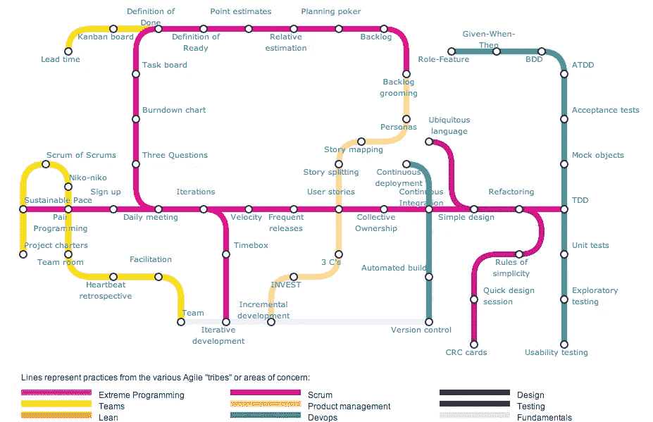

# 日常站立 Scrum 中最被误解的事件

> 原文：<https://medium.com/hackernoon/daily-standup-most-misunderstood-events-of-scrum-2562a9b3a1d8>

TLDR:那些想要最大化实现冲刺目标的机会的人，请阅读章节 ***我的每日站立技巧*** 和它上面的引用。

首先，对于铁杆 Scrum 实践者来说，根据 [ScrumGuide](https://www.scrumguides.org/) ，这个活动被正式称为*每日 Scrum* 。然而，在本文中，我将称之为*日常站立*，因为我想单独解决这个事件，不管是在 Scrum 框架内部还是外部。

根据我的经验，日常站立是 Scrum 中最容易被误解甚至滥用的事件。“你在使用 Scrum 或者其他敏捷框架吗？哦，对了，我们每天都有站立表演🤦‍♀️(加分点，第二多的 facepalm 答案是“哦耶，我们用 Jira”)

# 对于非敏捷

对于那些没有使用敏捷，或者只是名义上的敏捷的人来说，他们喜欢每日站立，因为这是一个控制“团队”的工具，而这个“团队”不是朝着同一个目标工作，或者，甚至是跨不同的团队(当然是朝着不同的目标工作)。他们将这一活动视为一个机会，可以从那些与他们不密切合作但仍有互动和/或监督的人那里获得每日报告。当然，问题是“你昨天做了什么？你今天要做什么？”(有些团队记得问第三个问题“你有什么困难？”).我不反对这种用法，除非相关人员觉得这是过多的微观管理，可能会建议将频率减少到每周一次。

# 对于敏捷(-想成为)

我有一个问题，就是那些想要使用 Scrum 框架成熟起来的团队，却在每日站立会议中继续使用“3 个问题”的旧格式:

1.  我昨天做了什么？
2.  我今天要做什么？
3.  我看到什么障碍了吗？

它甚至出现在“敏捷地铁地图”中

Agile Subway Map

观众们，你们看到这三个问题中缺少了什么吗？

2 个东西，“团队”和“目标”。以下引用自 ScrumGuide(当前版本，2017 年 11 月)

1.  我昨天做了什么帮助开发团队实现了 Sprint 目标？
2.  我今天将做什么来帮助开发团队实现 Sprint 目标？
3.  我是否看到了任何阻碍我或开发团队实现 Sprint 目标的障碍？

更令人不安的是，实践者忘记了这个事件的原因(“优化开发团队满足 Sprint 目标的概率”)并将焦点转移到管理和报告(“谁做什么”)。在指导一个团队使用更合适的每日 Scrum 格式后(见下文)，我收到了这个反馈

> 在旧的形式中，依次，那些得到令牌的人在压力下报告她/他做了什么和将要做什么，或者面对成为搭便车者的批评。基本上，他们希望忙碌，但不一定有效率，这有时会导致冲刺目标失败。

# 我的每日站立技巧

首先，每日站立是一个回顾和计划，不是一个报告事件。这是一个计划或重新计划工作的机会，以最大限度地提高实现冲刺目标的机会。

1.  总是以“我们的(冲刺)目标是什么？”
2.  把主要话题从*人*转移到 ***工作*** 。不要一个接一个地检查每个团队成员，而是一个接一个地检查“工作”(SBI、票证、子任务、问题，不管你怎么称呼它们)。
    a .自从上次每日混战以来，这个 SBI 做了什么？在这次每日的混战之后，这个 SBI 会有什么下场？c .是否有任何阻碍 SBI 完工的因素？
3.  基于文本的远程每日站立几乎不起作用，因为，再说一次，我们不再做“报告”，而是进行计划和再计划的对话。

**更新**:我向 [ScrumGuide](https://scrumguide.uservoice.com/forums/241958-general/suggestions/36534277-daily-scrum-replace-3-questions-even-when-they-a) 和[@ kschwaber](http://twitter.com/kschwaber)(Scrum 的联合创始人)提出了这个建议，并标注“已开始”，请求进一步的 up 投票和讨论。

示例:

> -我们的冲刺目标是什么？
> -人们可以在线程中回复松弛消息。
> -好的，数据库模式怎么样了？
> -完成，所以 John 你可以从 BE 端开始，而我和 Anna 将处理迁移脚本
> -哦，如果你要从 BE 端开始，那么让我们定义第一个 GraphQL 模式
> -等等，我的 FE 版本坏了，不知道，你们能在这次站立后帮我吗？
> ……
> -好的，关于这张票呢？它没有通过一个验收标准，所以我们需要返工。
> -记得把这个问题也带到复古(spective)上，我们不想让 ACs 一直不及格！好的，那么你们认为我们可以从任何开放(还没有开始)的票开始吗？是的，我想是的！/不，我认为我们应该先把这些票“搞定”！

这篇文章是免费的，你的拍手也是免费的👏。你知道你可以按拍手键吗👏按钮 50 次？