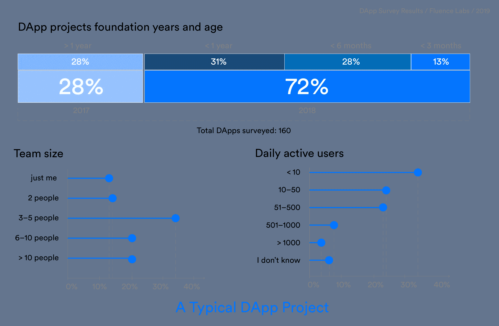
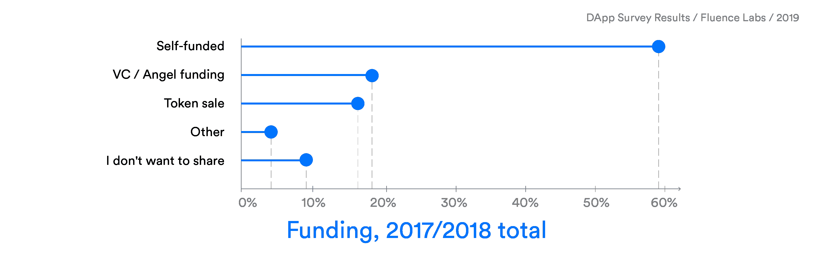
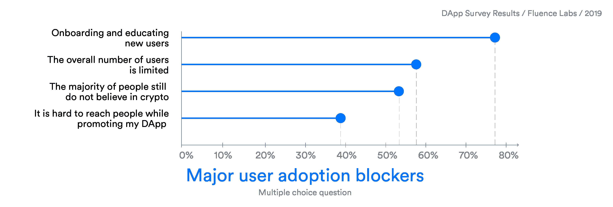
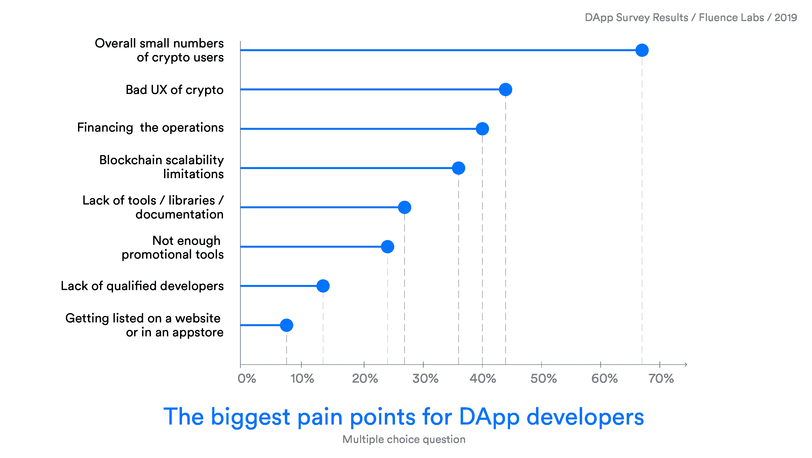
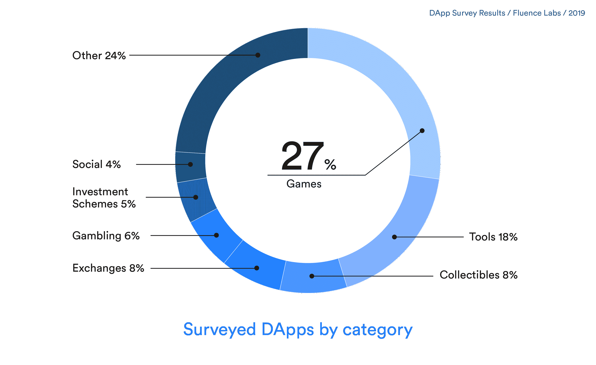

# DApp 开发商调查结果

> 原文：<https://medium.com/hackernoon/dapp-developers-survey-results-1c763901e756>

像任何新技术一样，区块链也有成长的烦恼。在世界范围内，这个新市场遭受了挫折，很多都是它自己造成的。从监管不稳定，到投资者做空市场，再到象征性价值下跌，再到糟糕的技术表现，许多这些痛苦都是自己造成的。许多人没有看到或听到的是，我们行业面临的最大障碍是沟通问题。俗话说:“你可以把马牵到水边，但你不能强迫它喝水。”

分散式应用(DApps)被视为区块链技术最大的潜在用途之一，因为它们开启了一个全新的消费者和商业产品世界，这些产品利用智能合约来创建前所未有的新功能。

在 2018 年底，我们着手调查和研究[DApp](/fluence-network/dapp-survey-results-2019-a04373db6452)的发展状况，希望解读这个对区块链科技整体发展至关重要的市场的现状。我们最初汇总了 1，624 个 DApp 开发项目，但只找到了 900 个项目的联系信息。其中，160 个项目填写了我们的 40 个问题调查。最初的目标是将事实与猜测和谣言分开。有多少个活跃的 DApp 项目，他们在做什么，他们在建立 dapp 时有什么挑战？这些问题是我们研究的核心。

我们发现，DApp 社区年轻而充满热情，但也有许多短期和长期的挑战需要解决。通过我们的研究，我们收集了相当多的见解，但突出的 3 个要点是:

# **1。DApps 在 2018 年启动**

2017 年，区块链世界充满了希望和炒作，似乎几乎任何使用区块链的想法都可以通过 ICO 模型筹集大量资本，只需一份白皮书和一个梦想。虽然区块链世界的许多标志性平台和项目都是在这种炒作下创建的，但值得注意的是，这一时期缺乏以消费者为中心的 DApp 应用程序，如游戏或社交网络应用程序。

随着炒作在 2018 年开始消退，DApps 仍在推出。尽管市场环境恶劣，但完成我们调查的项目中几乎有四分之三(72%)是在 2018 年开始的，41%是在过去六个月开始的。

在资金方面，2017 年的 DApps 主要是自筹资金 **(38%)** 或通过代币销售资助**(**31%)**，而 VC 投资的项目只做了 **24%** 。而在 2018 年，自费 DApps 的数量翻了一番，达到近 **68%** ，其中 **47%** 的团队有 3-5 人，只有一小部分通过代币销售 **(10%)** 或风险投资 **(16%)** 获得资金。**

**这告诉我们，DApps 是由较小的团队组成的，他们可以用最少的资金快速推出一个想法，就像移动应用程序开发的早期一样，一个小团队可以启动一个伟大的消费者应用程序想法，建立一个用户群，然后筹集资金。**

# ****2。DApps 需要使用“集中式”解决方案…目前****

**虽然我们愿意想象区块链创造的去中心化革命会在一夜之间发生，但现实是这项技术的基础设施仍在建设中。对于 DApp 的一个项目，我们发现开发人员现在正在使用集中式解决方案，同时预计将来可能会切换到分散式解决方案。65%的项目正在使用存储、数据库或后端等集中式组件。43%的公司除了智能合同之外，还拥有至少一个分散的组件。68%的人表示他们将来可能会使用分散存储或数据库。**

# ****3。用户入职和教育是目前最大的障碍****

**DApp 开发者报告的头号问题是加密/区块链世界的用户数量整体较低。随着比特币的推出，加密货币世界已经开始了近十年，可访问性和可用性仍然是增长的最大障碍。对于铁杆加密爱好者来说似乎很直观的活动，如创建钱包或保存您的私钥(密码)，对许多人来说是主要障碍。事实上，对于大多数消费者来说，没有“恢复密码”选项是一个问题，加密盲的普遍性仍然很高。**

**这个问题非常普遍，78%的被调查者认为是应用程序采用的主要障碍。创建一个钱包，获得加密和理解私钥，交易和天然气是用户增长的巨大障碍。**

****

> **让他们从一个钱包开始，并向他们解释他们必须使用各种各样的软件“登录”该钱包，其中一些软件的欺诈和失败发生率很高，并且他们永远不会丢失(或改变！)密码，否则他们将永远无法访问任何内容。如果没有非常好的入职工具，这是很难推销的。”—匿名受访者**

**此外，DApp 开发人员报告其应用程序的总体 DAU(每日活跃用户)较低，考虑到新用户的入职和培训问题，这并不奇怪。**

****

**我们的另一个关键发现是，以游戏为中心的 DApps 的流行率高得惊人。在返回的调查中，27%的 DApp 项目专注于基于区块链技术的某种形式的游戏。虽然这些可能不是梦想家的梦想，但对于行业的短期增长来说，这是一个非常好的消息。从世界范围来看，游戏是一个价值十亿美元的产业，鉴于其当前的用户数量，这是一个潜在增长率最高的领域。与其希望非传统的区块链用户有一天醒来，有一个“啊哈”的时刻，更合理的做法是相信他们会因为熟悉某个应用程序而进入区块链空间。毕竟，视频游戏玩家和赌徒比律师和金融家要多上百万。**

****

**从这份报告中吸取的教训对 DApp 工业来说是利大于弊的。虽然我们主要关注技术挑战，但整体情绪似乎是，在 UX 等问题得到改善，许多项目越来越接近解决这一问题后，唯一的出路是上升和增长。如果对非传统用户的 DApps 的可用性给予适当的关注和资源，加密知识不是白日梦，而是一个潜在的现实。为了在 DApp 市场实现更高的采用率，这些项目必须关注客户旅程，关注用户体验。毕竟，纵观计算机行业(甚至智能手机行业)，直到 UX 得到改善，日常用户的大规模增长才被真正看到。**

*****了解更多查看完整*** [***DApp 调查结果 2019***](/fluence-network/dapp-survey-results-2019-a04373db6452)**