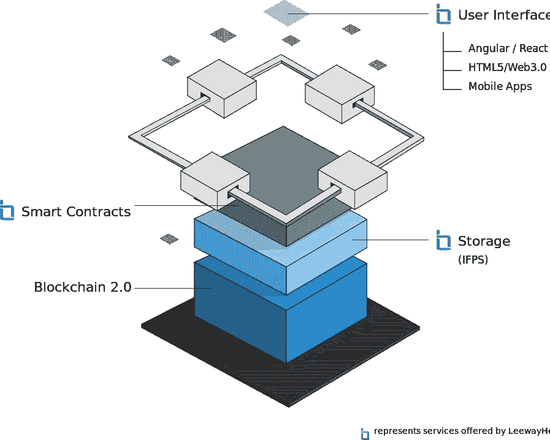

# dApp 开发——创新者和企业家的简单指南

> 原文：<https://medium.com/hackernoon/dapp-development-a-simple-guide-for-innovators-and-entrepreneurs-46922f98a6f2>

随着人们对区块链技术越来越感兴趣，dApps(分散式应用程序)对全世界的开发者来说变得越来越重要。它不同于基于 Android 和 iOS 的传统应用，因为它可以直接将开发者与用户联系起来，而不需要中介来管理用户数据和代码。

# dApp 架构

Image Source LeewayHertz

构建 dApp 不需要许可，也没有公司可以改变平台的规则。dApp 的后端代码运行在分散的对等网络上。dApp 的前端代码可以用任何向后端发送 API 调用的语言编写。要了解 dApp 开发流程，你要知道 dApp 开发和传统 App 开发的区别是什么。

# dApp 开发和传统 App 开发的区别

传统应用程序开发和 dApp 开发之间的巨大差异在于代码在进入生产之前应该被检查的级别。开发 dApp 可能与硬件开发有关，这需要严格的原型制作和测试。

召回硬件需要大量的时间和金钱来解决问题。类似地，在 dApp 开发的情况下，一旦在 mainnet 上部署了智能合约，就很难修改它。智能合约中的 bug 影响 dApp 开发者的声誉。

与 dApp 相反，传统应用强调快速迭代周期，座右铭是快速行动，打破 dApp 开发中不精确发生的事情。

# 以下是可用于 dApp 开发的区块链平台:

1.  **以太坊:**
    由 Vitalik Buterin (22 岁的俄裔加拿大开发者)于 2013 年提出，以太坊是一个基于区块链的开源分布式计算平台。一种叫做以太的本地加密货币用于运行整个以太坊生态系统。
2.  **Hyperledger 锯齿:**
    由 IBM 和 Digital Asset 出资，由 Linux 基金会推出，Hyperledger 锯齿是一个模块化平台，旨在创建、部署和执行分布式分类账。其 PoET 共识允许锯齿与被称为“可信执行环境”的硬件安全解决方案相集成。
3.  **Hyperledger Fabric:**
    Hyperledger Fabric 面向开发人员，允许他们使用模块化架构构建区块链应用。网络设计者可以插入他们选择的组件，如共识和成员服务。它是专门为许可网络设计的，只允许授权身份在系统内贡献。
4.  **EOS:** 作为开源软件于 2018 年推出，EOS 的目标是提供 dApps 的托管、企业解决方案的分散存储和智能合约功能。它解决了以太坊和比特币中发现的可扩展性问题。EOS 区块链通过多线程和授权的利益证明算法达成共识。

dApp 开发不能改变开发者构建 App 的方式。与领先的 [dApp 开发公司](https://www.leewayhertz.com/dapp-development-services/?utm_source=Leewayhertz_medium)联系，他们了解区块链技术和分散化，可以帮助您提供无风险和稳健的解决方案。