# dApps 是新的狂野西部:寻找可靠的衡量标准

> 原文：<https://medium.com/hackernoon/dapps-are-the-new-wild-west-in-search-of-reliable-metrics-710f7ed57991>

在某个时候，游戏是区块链技术大规模采用的主要希望之一。人们预见到了令人惊叹的游戏和去中心化应用(DAPPs)的出现，这将把互联网推向 web 3.0 的边缘。

现在，2019 年已经过去了将近一半，区块链赌博游戏正在以超过屋顶的成交量和关键指标摧毁所有 DAPP 排名网站。但是他们真的像数字显示的那样成功吗？

在这篇文章中，我将分享我对市场现状的主要发现。

## **数据集**

为了了解 dapp 的现状，我访问了 dapp.review，分析了按流量排名的前 100 名 DAPP 和按日活跃用户排名的前 50 名 DAPP(DAU)。

删除重复项后，我得到了一个 118 DAPPs 的数据集。

然后我添加了来自 Alexa 的网站数据信息作为额外的参考点。

为了完成这项研究，我深入研究了产品，并查看了它们的赌注记录。我使用了他们的解决方案，测试了他们的 UX/UI，并获得了对 DAPPs 的定性理解，以补充我收集的数据。

## **基线**

为了建立一些基线来比较 DAPPs，我进行了相关性分析，并试图寻找异常值，以便我可以检测操纵和虚假数据。

## **DAU**

大多数 DAPPs 是根据他们的 DAU 排名的。DAU 是通过查看与 DAPP 智能合同交易的唯一钱包地址的数量来确定的，因此项目有明显的动机操纵 DAU，以便在排行榜上排名更高，并获得潜在的新用户。

看看一些令人发指的例子:

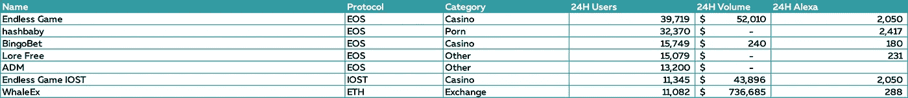

一个拥有 15k 用户的网上赌场，怎么可能在 Alexa 的数据库里只有 180 个日访客，投注量这么小？或者是零到零流量的交换？

此外，在两种情况下，DAU 与体积和 Alexa 数据的相关性都小于 0.03。

正是因为这个原因(主要是),我认为 DAU，正如目前跟踪的，是一个 DAPP 健康的糟糕指标。

## **音量**

好吧，如果衡量独特的钱包不是 DAPP 健康的好指标，那么交易量呢？

首先，数量是一个很难标准化的指标，因为一些 DAPPs(尤其是游戏或社交平台)不会产生很高的数量。

以 Steemit 为例:

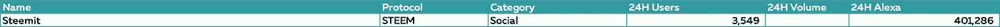

第二，即使我们试图判断诸如区块链赌场这样的与交易量相关的类别，我们也能找到操纵和夸大交易量的明显证据。

一些人认为，由于几乎所有的赌场都实行红利代币，所以“清洗交易”(在这种情况下是清洗赌注)不符合赌场的最佳利益，因为他们最终将向用户支付一定比例的交易量。但是这些人混淆了房子边缘和交易费用。赌场支付的红利并不与玩家下注量直接相关，它们是从赌场边缘(或游戏中用户的净损失)支付的。

此外，我们可以找到一个明确的激励，让玩家在风险最低的期权上下大赌注，只是为了“挖掘”代币。以下是来自网站的截图示例。

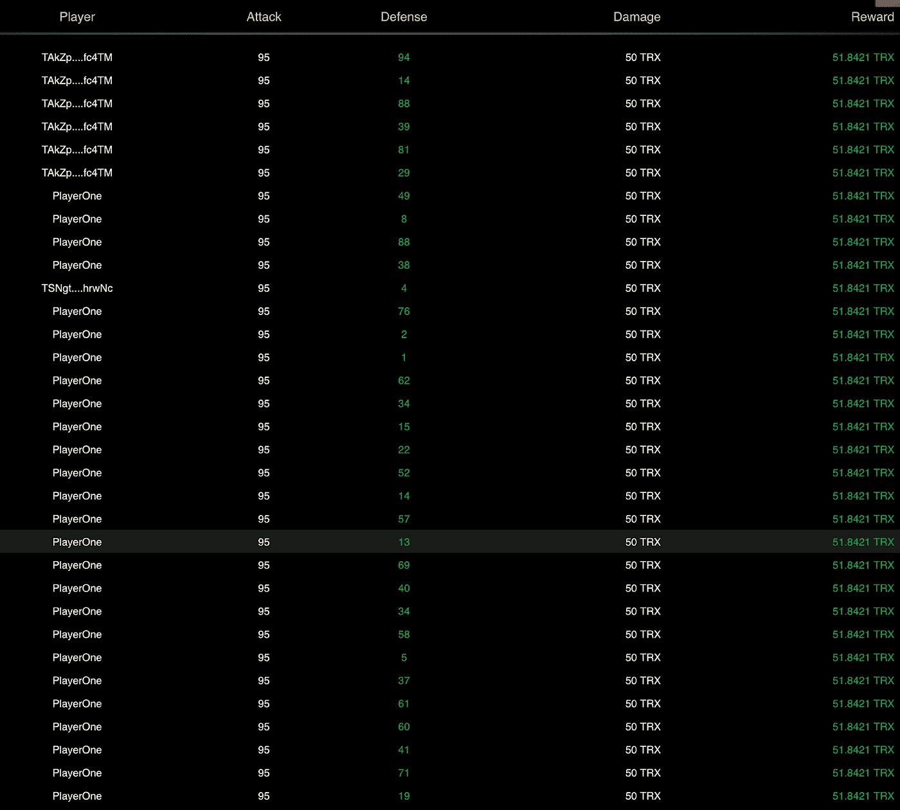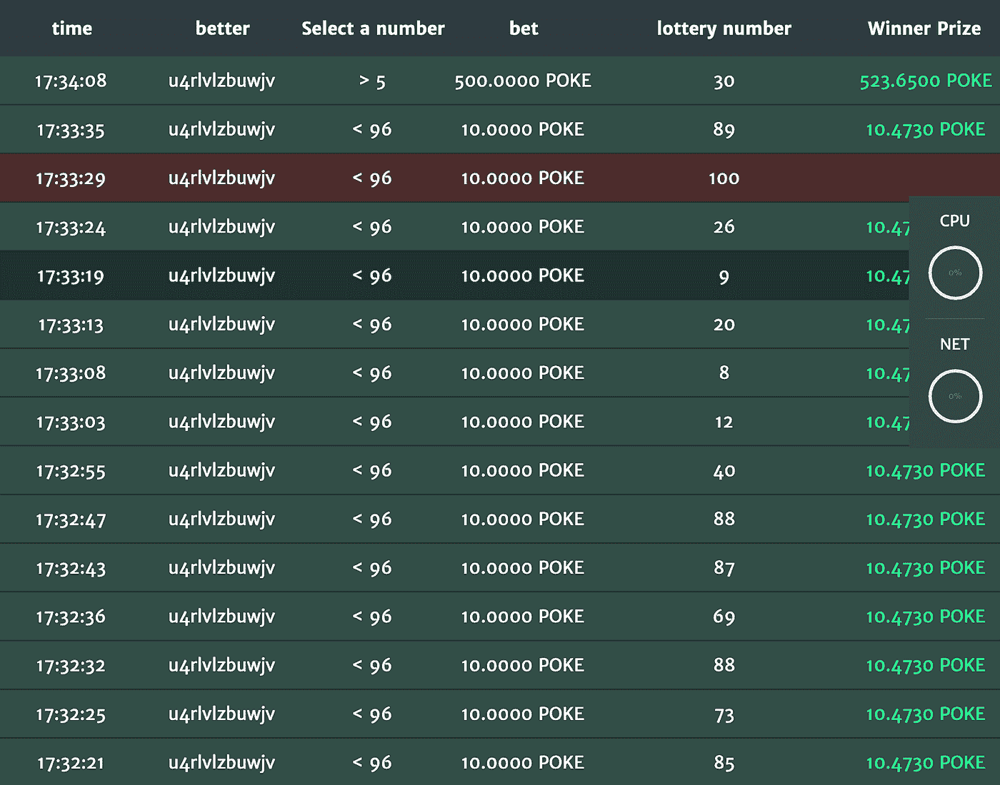

正如你所看到的，所有最近的赌注都设置在可能的最大阈值(95%)来“挖掘”红利。

## **那么用什么呢？**

我认为，我们需要开发某种混合指标，将 Alexa 访客数据、链上和社交分析结合起来。此外，Alexa 是一个第三方数据收集网站，其数据相对中立，这一点也很有帮助。

正是因为这个原因，我使用 Alexa 访客数据作为主要指标对 DAPPs 进行排名。

## **类别排名**

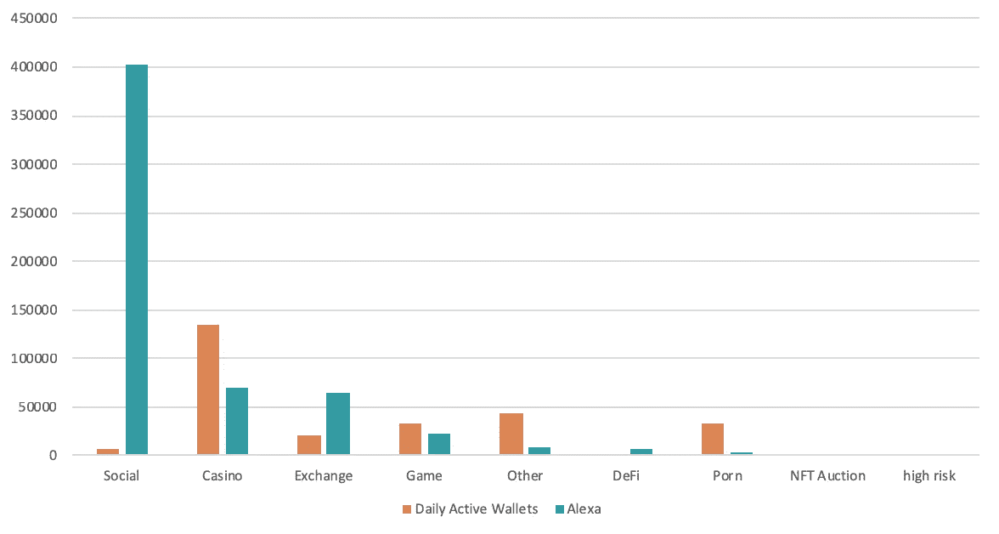

从图中我们可以看到**社交**遥遥领先，但让我们双击它:

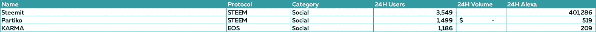

Steemit 占访问的 99.3%。此外，DAU 号码对 Steemit 也很有意义，因为用户无需交易就可以享受这项服务。

尽管如此，区块链在社交媒体上的实施才刚刚迈出第一步。我们将看到 EOS 的声音将如何表现。

## **赌场**

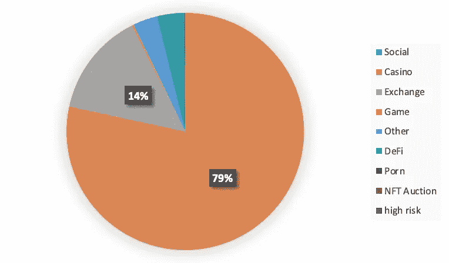

在整个生态系统中，赌场创造了最大的交易量。在这个特定的数据集中，他们占总交易量的 79%。

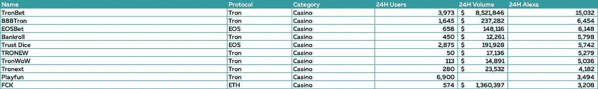

除了 Playfun(出于某种原因，交易量无法通过 Playfun 的区块链进行跟踪)，Alexa 数据+前 10 大社交赌场游戏的交易量之间似乎存在相关性。这 10 个网站几乎占据了赌博 DAPPs 分析量的 50%,仅 TRONbet 就占据了 39%的巨大份额。

但排行榜上的情况有些不同。

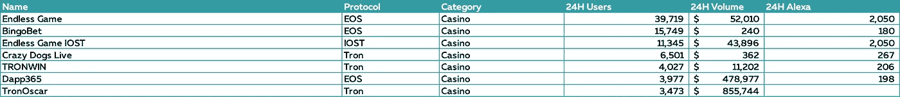

看看这个钱包和 Alexa 用户的比例。许多项目都在利用股息的流行来攫取现金并逃离，给他们的代币持有者留下一袋垃圾。

总的来说，我非常相信区块链在赌博中的应用。TRONbet 已经证明，人们想要玩，即使在游戏的生命周期中“玩中采矿”变得越来越困难。不过，最终我们需要的是更好的产品，而不仅仅是一些基本赌博机制之上的分红。

你可以期待在不久的将来我会有一篇关于区块链赌博的专门文章。

## **交易所**

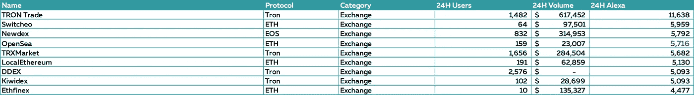

在这里，我们可以看到一个更均匀的分布，标志着更健康的市场条件。此外，由于我们正在谈论 DEXes，不同的协议有不同的交换集，使市场上的机会更加均等。

此外，我们可以注意到 Alexa 用户中钱包的健康比例——20986 个活跃钱包对 65212 个访客。完全说得通。人们使用交易所来检查价格，并不是每个人都每天交易。

## **游戏**

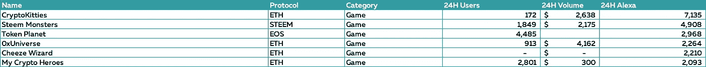

区块链游戏更是难以估计。
首先，如果我们谈论可收藏的游戏，由于与游戏互动的不同性质，DAU 和参与度指标是完全不同的。

其次，随着游戏行业向移动游戏发展，许多游戏可以通过移动钱包访问，这使得跟踪指标变得更加困难。

总体而言，Dapper Labs 凭借其 2017 年的成功——CryptoKitties，仍然处于行业的前沿。尽管对 NFTs 的大肆宣传已经降温。

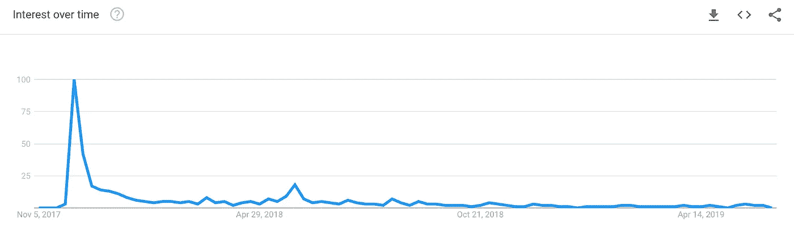

Google trends for Crypto Kitties

我们很快就会看到更广泛的观众对他们的 heeze 巫师的反应，但我已经读过的一些评论相当恭维。

总而言之，游戏体验比用于创建游戏的底层技术重要得多。看起来神话游戏的人理解这一点，我期待他们发布一些伟大的作品。

## **协议排名**

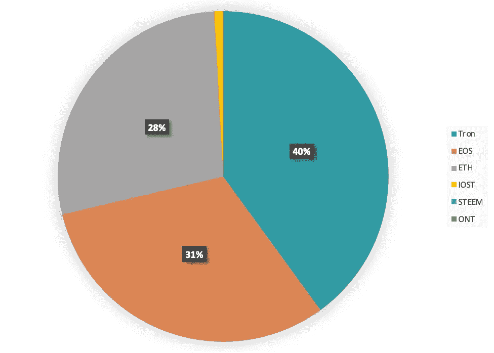

On-chain Transaction Volume

从量的角度来看，我们的前 3 个协议是 Tron、EOS 和 ETH。我们之前讨论的大多数流行的赌博应用程序也是建立在这些协议之上的。

然而，真正有趣的是，协议是如何被唯一活跃的钱包和网站访问者排序的。

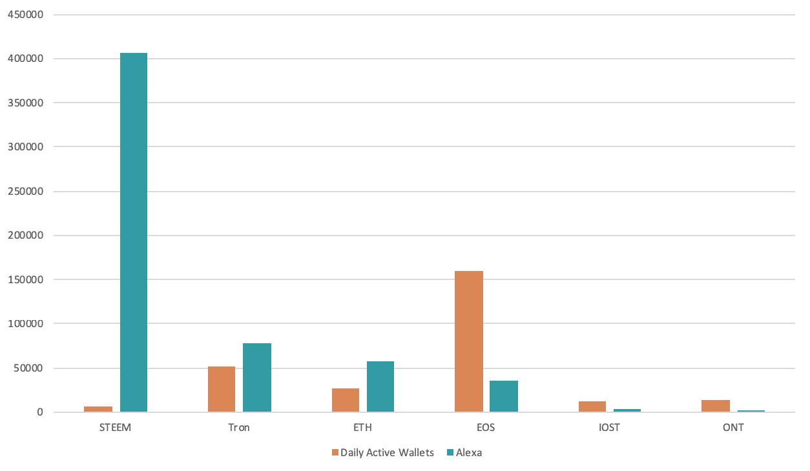

再说一次，我认为网站访问者的数量应该比活跃钱包更重要。从图来看，好像是【Alexa 评分？]和日常活跃钱包相当接近。STEEM 有点过了，考虑到我们之前对 STEEM 的分析，这是可以理解的。

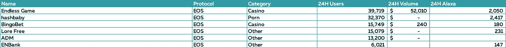

然而，从我的角度来看，EOS 的衡量标准非常值得怀疑。也就是说，我没有太多接触 EOS 社区和 DAPPs，所以我邀请你分享你的想法。

**个人排名**

根据 Alexa 的数据，我们在这里列出了 10 大最受欢迎的 DAPPs。

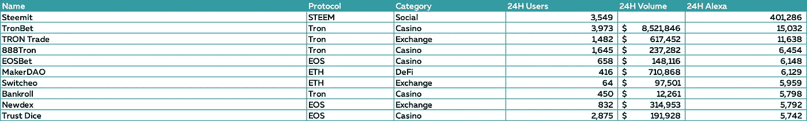

你可以喜欢或讨厌 TRON 的经营方式，以及 Justin 的整体外观，但 TRONbet 是目前排名第一的赌博 DAPP，它们得到了几家为 ANTE token 提供良好流动性的交易所的支持。

重要的是要记住，尽管 DAPPs 已经存在好几年了，但我们仍处于区块链的早期阶段。我相信人们终于开始明白，如果区块链不能有意义地改善用户体验或解决问题，它就没有什么价值。

我们 Squilla Capital 密切关注 DAPPs 的新兴趋势，并计划在区块链领域进行几项投资。如果你有有趣的想法或知道有潜力的 DAPPs，请联系我:

[http://twitter.com/DanilMyakin](http://twitter.com/DanilMyakin)

电子邮件:danil@squilla.io

**附言**

这是我第一次尝试找出一个更好的指标来评估 DAPPs，我将进一步努力开发一个更好的方法。下一步是自动化数据收集过程，并添加指标，如电报组、Twitter 关注者等。

任何建议和建设性的批评都非常欢迎。