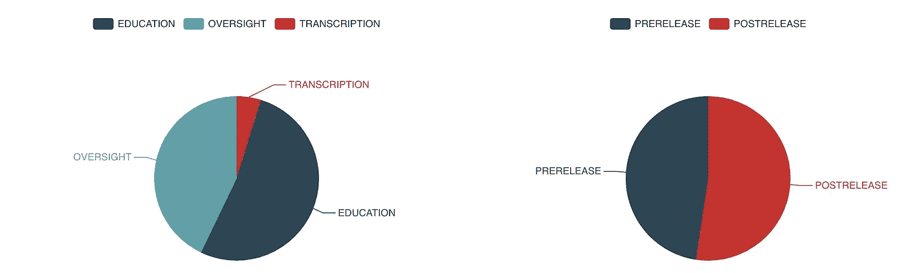
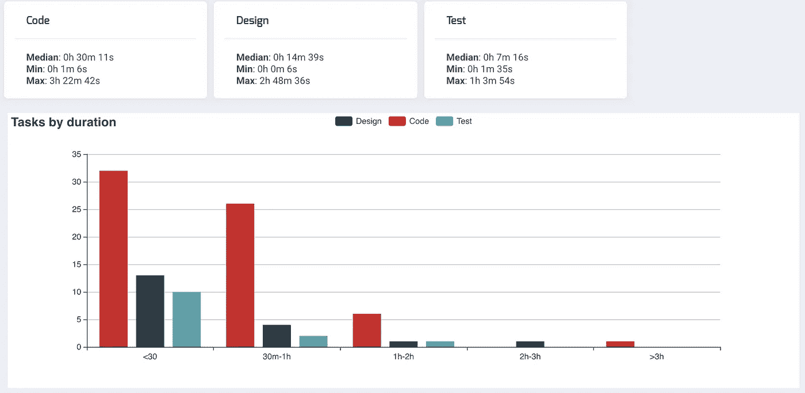

# 关于数据驱动的开发人员个人回顾

> 原文：<https://medium.com/hackernoon/data-driven-personal-retrospectives-for-developers-845e6b59cee6>

Photo by [Jon Tyson](https://unsplash.com/photos/fD3L5wxiEoo?utm_source=unsplash&utm_medium=referral&utm_content=creditCopyText) on [Unsplash](https://unsplash.com/?utm_source=unsplash&utm_medium=referral&utm_content=creditCopyText)

回顾的目的是寻找改进的机会。记忆并不像我们想象的那样可靠，有许多已知的记忆偏差。

为了克服这个问题，系统跟踪给你提供了原始数据，你可以客观地看待这些数据，以便做出更好的决策。

**个人回顾**

你应该跟踪你的表现，看看你在实现目标的过程中有多有效。

> "一个人不可能学到他认为已经知道的东西。"—爱比克泰德

没有适当的反馈，就不可能认识到何时调整到所需的行为。不可能发现哪些有效的行为需要强化。

你花了大部分时间在哪些代码领域？接下来你想知道的是，什么有可能提高生产率？引入什么样的 bug？在测试或设计阶段花费更多时间会有什么后果？

CoderMirror report on defects

回顾是确保你问自己这些问题的机会。在过去的一两个星期里，你可能对这些问题的答案有一个粗略的想法。

根据经验，我发现我们经常忘记细节。感知与现实不符。我们对长期以来发生的事情有一个错误的认识。

**认知偏差:对客观数据的需求**

一些问题的罪魁祸首是你的记忆力。凭记忆来看，你是一个糟糕的法官，你的大脑把事情想得很全面，喜欢做假设。

一个已知的记忆认知偏差是乐观的回顾。乐观的回顾是一种倾向，能比事情发生时更好地记住和回忆事情。在个人发展背景下，个人可能不太可能适当地修正自己的行为。他们对它们的记忆比以前更加美好。

另一个偏见是峰端法则。我们的判断基于我们在高峰期和期末的感受，而没有使用其他信息。

在分析和解释过去的事件时，后见之明偏差也会产生问题。它让你看到事件是可预测的，从今天的角度来判断一切。事情看起来比原来容易，你可能低估了你过去的成就。

**有效数据收集**

收集尽可能多的数据来生成指标和日志是对抗我们认知偏差的最好方法。我们在回顾中所掌握的客观数据的深度和广度有助于我们进行全面而富有成效的反思。

度量作为一种诊断工具，可以帮助您了解如何在项目上花费时间，以及如何组织优先级。

当你长时间收集数据后，你会知道每个变化如何影响项目或你的行为，哪些指标发生了变化，它如何影响底线。

此外，当度量显示需要改变或消除不希望的行为时，它们会激活认知知识和策略，帮助提出改进。

很长一段时间，我都是在电子表格中手动跟踪大部分数据。它们非常灵活，在测试哪些数据是最有用的指标时非常有效，但是手动跟踪非常耗时且容易出错。

现有的时间跟踪器如 RescueTime 帮助收集了一些信息。但是作为通用工具，它们关注的是关于时间浪费或拖延的报告。他们错过了很多对开发者很有价值的数据收集。

我创建了 [Codermirror](https://www.codermirror.com/) 的原因是需要收集指标来回答持续改进的问题。它避免了手动数据收集的必要性，并收集了所有类型的度量标准，这些度量标准导致对开发人员执行其工作的意想不到的洞察。

CoderMirror report on task types

**结论**

多做已经有效的事情，少做错误的事情，避免基于已经发生的事情的微小损失。

在每一次回顾中，都有可能做出一些小的选择，这些选择可能并不显著，但从长远来看却是累积的。

为了最大限度地利用你的回顾，收集数据来显示开发过程中发生的事情的准确情况。

请访问[开发者个人回顾](https://hackernoon.com/personal-retrospectives-for-developers-e5d86813d65a)，了解更多关于如何进行个人回顾的信息。