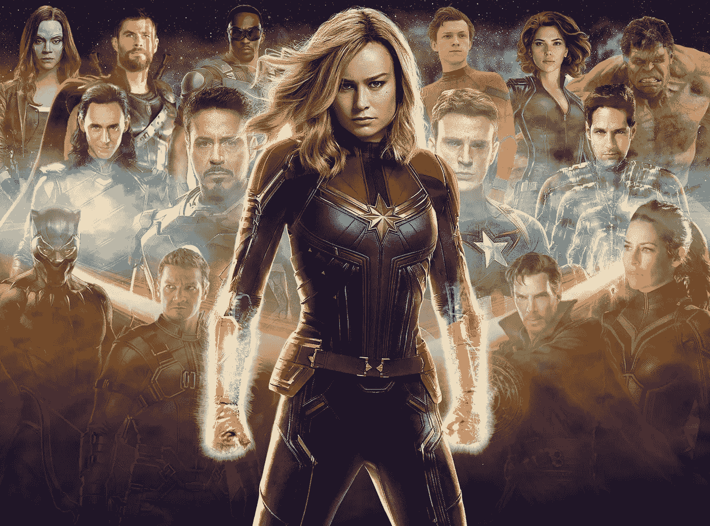
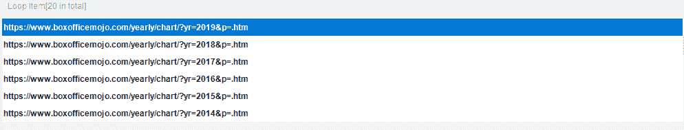
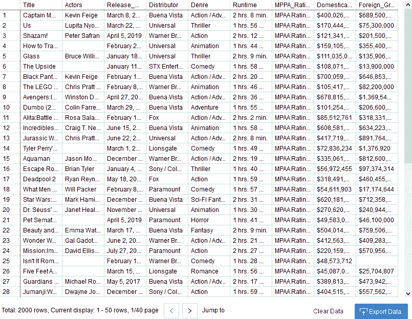
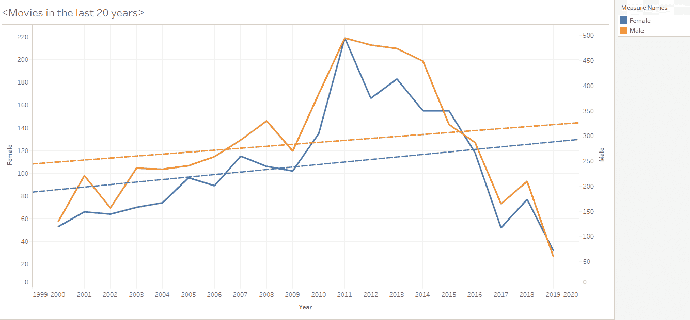
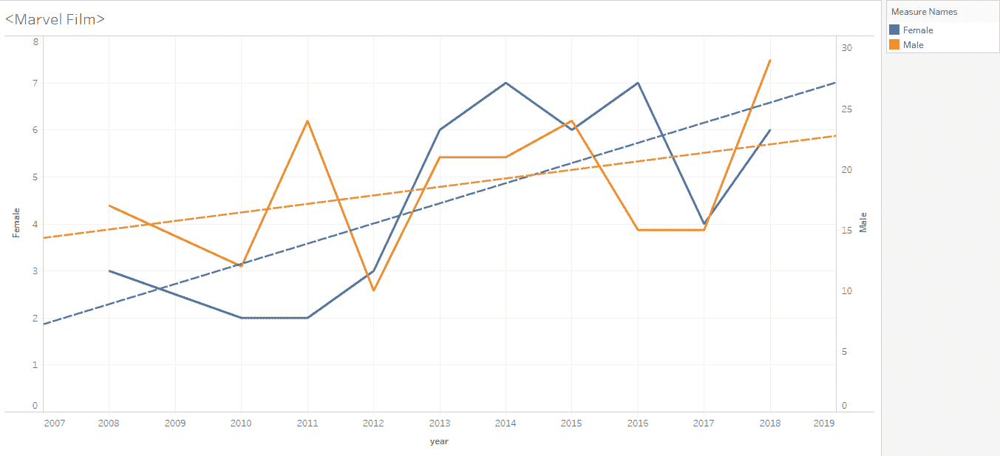

# 数据分析:超级英雄电影的未来

> 原文：<https://medium.com/hackernoon/data-science-do-people-have-trouble-buying-into-superheroine-movies-5f7dbdd4f0d9>

《神奇女侠》在银幕上和票房上都获得了巨大成功，尽管它不是有意在国际妇女节上映的。相比之下，惊奇队长在其女权主义营销活动中引发了许多争议。人们很难接受超级英雄电影吗？这种女性领导的超级英雄的新趋势会终结超人吗？

为了回答这个问题，我将使用 python 来分析过去二十年中两千部电影的性别比例数据。

***的实现可以分解成三个部分:***

1.  在过去的 20 年里，每年都要刮出一张排名前 100 的电影名单。
2.  **对名人名字使用性别分析，用 python 统计性别。**
3.  **得到结果，可视化电影行业包括英雄电影中女性角色的变化。**

**先从** [**票房 mojo**](https://www.boxofficemojo.com/yearly/chart/?page=1&view=releasedate&view2=domestic&yr=2019&p=.htm) **中刮出电影信息使用**[**octoporse**](http://www.octoparse.com)。Mojo 中年度票房的 URL 遵循一个固定的模式，在末尾有一个固定的主机名和一个年份标签。例如，票房的网址是

[https://www.boxofficemojo.com/yearly/chart/?yr=2019&p =。htm](https://www.boxofficemojo.com/yearly/chart/?yr=2019&p=.htm)*2019 年[*https://www.boxofficemojo.com/yearly/chart/?yr=2018&p =。htm*](https://www.boxofficemojo.com/yearly/chart/?yr=2018&p=.htm)*2018 年。**

**也就是说，如果我们遵循这种模式，我们应该能够获得 2000 年至 2019 年的 URL 列表，如下所示:**

****

**用 Octoparse 加载这个列表。它会自动创建一个循环提取列表，并指导您在一年内创建另一个电影提取列表。点击提取数据包括**片头、演员、发行商、国内 _ 总 _ 总、国外 _ 总。大约 20 分钟后，我们得到了 2000 部电影的所有细节。****

****

# **关于过去 20 年的电影，数据说明了什么？**

**这里的想法是取一个名字性别库，返回到演员的名字，并统计女性和男性在列表中的出现频率。 **(** *完整版:*[https://gist . github . com/octo parse/3 ABC 6771 a 87 e 49 e 34 c 9 fa 18 F2 ed 7d 91 e # file-gender _ analysis _ on _ movies-py](https://gist.github.com/octoparse/3abc6771a87e49e34c9fa18f2ed7d91e#file-gender_analysis_on_movies-py))**

****首先**，**用 Python 加载 Mojo 和漫威的电影列表。****

****二、文字预处理** ( [文字处理请查看详情。](https://www.octoparse.com/blog/text-mining-and-sentiment-analysis-using-python))以获得标记化名称的列表。**

**然后我们将按年份分析所有电影的演员性别。为此，导入分析名字并返回性别的[性别库](https://genderapi.io/)。**

****之后，我们将能够获得女性和男性的数量，以将数据可视化如下:****

**实线表示实际数字。虚线反映了发展趋势。**

****

**Movies in the last 20 years. Solid lines indicate the actual numbers. Dotted lines reflect the developing trend.**

**男性和女性的数量变化方向相同。两条曲线在 2010 年前都向上移动，在 2011 年达到峰值，此后向下移动。演员的数量总体上在减少。这可能预示着电影业的衰落。两者之间的差距总体上呈缩小趋势，但 2011 年和 2015 年之间的差距有所扩大。也就是说，尽管性别差异在电影业根深蒂固，但男女演员的数量还是趋于平等。**

# **让我们仔细看看漫威的电影:**

****

**Marvel films. Solid lines indicate the actual numbers. Dotted lines reflect the developing trend.**

**相比之下，自 2012 年以来，两条线都向上移动，在 2012 年和 2013 年之间有一个陡峭的增长。在经济复苏时期，英雄电影越来越受欢迎。与 2012 年之前的数字相比，女演员的数量迅速增加。而且在这些奇迹中，女性角色有增加的趋势。这可能说明了一个事实，即电影业试图通过在超级英雄系列中引入更多女性演员来提高经济复苏期间的票房。这一举措在美国这样的地方确实奏效，那里的人们喜欢超级英雄，并为他们自由、民主和权力的身份感到自豪。**

**如果我们看看《分歧者》(2014 年)和《侠盗一号:一个星球大战的故事》(2016 年)，《饥饿游戏》(2012 年)，《露西》(2014 年)，《疯狂的麦克斯:狂暴之路》(2015 年)和《神奇女侠》(2017 年)，很明显我们在电影屏幕上有不同的超级英雄。女性开始推动剧情向前发展，而不是成为超人的助手。它确实说明了女性超级英雄是一个新的救赎角色。**

**超级英雄电影是打击犯罪、社会正义和自我牺牲的象征。当惊奇队长发布时，我欣喜若狂。这不仅是因为我是一个女人，而且我也喜欢超级女性的想法，因为它显示了性别平等方面的某些进步，无论是好还是坏的超级英雄。我无法表达足够的感激，因为有更多像疯狂的麦克斯和惊奇队长的芙丽欧莎这样坚强独立的女性成为她们自己的英雄，还有不太漂亮但软弱的玛丽·简，她注定要被蜘蛛侠拯救。**