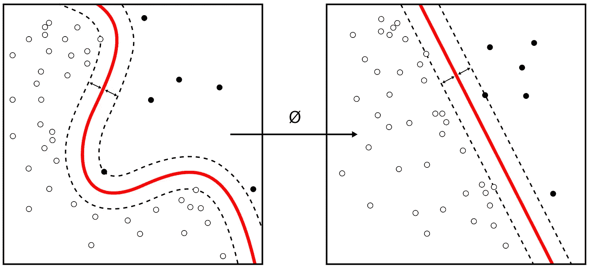

# 数据科学工具包(概念+代码)

> 原文：<https://medium.com/hackernoon/data-science-toolkit-concepts-code-20628af23cd>

source : [https://en.wikipedia.org/wiki/Data_science#/media/File:Kernel_Machine.svg](https://en.wikipedia.org/wiki/Data_science#/media/File:Kernel_Machine.svg)

嗨伙计们！！在这篇文章中，我将讨论可以用来解决数据科学问题的基本工具和软件。如果你是 ML 或数据科学或统计学的新手，可以点击下面的链接来看看我在 ML 上的另一个博客。