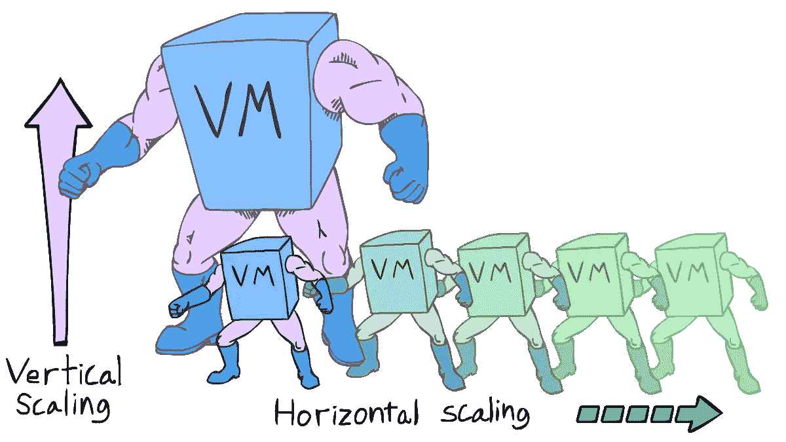
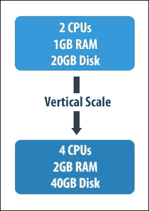
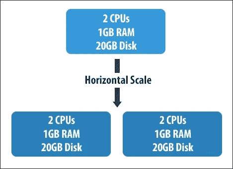
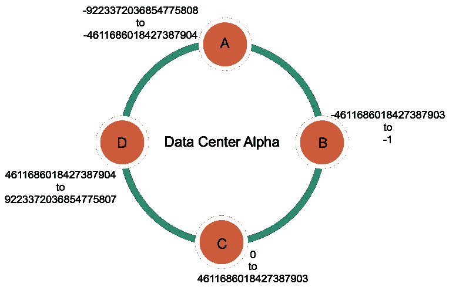

# 数据库缩放:水平和垂直缩放

> 原文：<https://medium.com/hackernoon/database-scaling-horizontal-and-vertical-scaling-85edd2fd9944>

## 数据库的可扩展性。水平缩放和垂直缩放有什么区别？哪个更好，为什么？

Photo by [Campaign Creators](https://unsplash.com/photos/IKHvOlZFCOg?utm_source=unsplash&utm_medium=referral&utm_content=creditCopyText) on [Unsplash](https://unsplash.com/search/photos/database?utm_source=unsplash&utm_medium=referral&utm_content=creditCopyText)

我们每天都在[产生](https://hackernoon.com/tagged/generating)数据。世界上几十亿人也是如此。每一个[数据库](https://hackernoon.com/tagged/database)都必须被扩展以处理每天产生的大量数据。

简而言之，数据库需要**可伸缩**，以便它在任何时候都**可用**。当数据库的内存耗尽时，或者当它无法处理多个请求时，它是不可伸缩的。

> 可伸缩性是指系统、网络或流程处理不断增长的工作量的能力，或其被扩大以适应这种增长的潜力。
> 
> — [维基百科](https://en.wikipedia.org/wiki/Scalability)

缩放可分为**垂直缩放和水平缩放。**

# 弹性

> 弹性是系统通过以按需方式供应和取消供应资源来适应工作负载变化的程度，
> 
> 在每个时间点，可用资源尽可能与当前需求相匹配。— NuoDB

当一个系统能够被**容易地扩展以满足正在使用的应用程序的资源需求**时，它就是弹性的。

# 缩放类型

Source : [Turbonomic Blog](https://blog.turbonomic.com/blog/on-technology/the-essentials-of-database-scalability-vertical-horizontal)

想象你正在购买一辆全新的汽车。你有一辆能容纳 4 个人的尼桑车。现在，假设你和你的 10 个朋友需要去度假。你会怎么做？

> 你会买一辆更大的汽车吗？—垂直缩放
> 
> 你会多买一辆尼桑车吗？—水平缩放

这是对两种类型的基本解释。让我们了解一下每种类型可以用在什么地方，哪种更好。

# 垂直扩展—向上扩展

Source : [Packt](https://subscription.packtpub.com/)

当数据库无法处理大量数据时，就采用垂直扩展。

假设您有一个 10GB 内存的数据库服务器，它已经耗尽了内存。现在，为了处理更多的数据，你需要购买一台昂贵的 2TB 内存的服务器。您的服务器现在可以处理大量数据。

这被称为**垂直缩放**。它正在购买一台昂贵且更大的服务器。

该过程包括增加更多的能力，如 CPU 和磁盘能力，以增强您的存储过程。

## 现在，这有用吗？

*   取决于应用及其用途。

以 Instagram 为例。当它被发明出来的时候，它只是针对一小群人。因此，一台服务器就足够了。但是现在，数百万人使用这个应用程序。不可能买到这样一台能存储所有数据的服务器。

*   其次，数据也应该被查询。当单个节点面临大量查询时，很难处理。
*   对于包含大量查询的大型应用程序来说，垂直伸缩是绝对不允许的
*   如果您的应用程序涉及有限范围的用户和最少的查询，您可以继续进行这种类型的伸缩。
*   **关系数据库**大多采用垂直伸缩。

## 优势

*   **简单，**因为一切都存在于一台服务器中。无需管理多个实例。
*   **性能提升**，因为你每次更新都有更快的 RAM 和内存功率。
*   同样的代码。**无变化** —您根本不需要改变您的实现或代码。

## 不足之处

*   难以同时执行多个查询。
*   当服务器超过最大负载时，停机的可能性很高。
*   价格昂贵。硬件资源毕竟成本高。

# 水平扩展—向外扩展

Source : [Packt](https://subscription.packtpub.com/)

水平扩展，如图所示，是通过**添加更多机器来水平扩展服务器。**

它划分数据集，并将数据分布在多个服务器上，即 ***碎片。***

每个碎片都是一个独立的数据库。

您购买的不是一台 2 TB 的服务器，而是两百台 10 GB 的服务器。

垂直扩展侧重于增加能力和内存，而水平扩展则增加机器数量。

## 同样的问题。怎么有用？

*   还记得我们之前讨论的 Instagram 问题吗？让我们为它找到一个解决办法。假设 it 部门购买了多台大小和功能相同的机器，而不是一台服务器。

假设一个服务器存储用户简档信息，另一个存储故事和精彩镜头，另一个存储图像。

现在，查询被发送到特定的服务器，这**减少了服务器**的负载，并给了**更好的性能。**

很棒吧。

*   如果您的应用程序涉及原子事务，最好使用垂直伸缩。如果您的应用程序允许冗余并且包含较少的连接，那么您可以使用水平伸缩。
*   **NoSQL** 数据库大多采用水平缩放。它不太适合 RDBMS，因为它依赖于严格的一致性和原子性规则。

## 优势

*   与垂直扩展相比，它是便宜的 T21。
*   负载更少，性能更好。
*   停机的机会更少。
*   弹性和容错能力。

## 不足之处

*   进行连接是困难的，因为它可能涉及跨服务器的通信。
*   最终的一致性只有在。它可能不太适合同时发生的银行交易。
*   我们无法轻松地将每个服务器的每个功能进行分类。有时，图像占用的空间可能会超出单个服务器的处理能力。

# 为什么人们选择水平缩放？

1.  简单来说，横向伸缩就是**弹性。如前所述，弹性是处理工作量变化的能力。**
2.  而且，是**动态的。**您可以保持现有资源在线，并根据需要添加任意数量的服务器。因为他们每个人都是独立的，所以不会造成伤害。
3.  **大数据**大部分存储在 NoSQL 数据库中，遵循数据库的水平分片。

这就是 NoSQL 使用水平缩放或分片的原因。

因为它遵循了**去正常化**的概念，所以不需要单一的真理点。它可以存储**副本。**

例如，如果您想获取经常使用的标签数量，您可以保存一个单独的表，其中包含用户 ID 和使用的标签。

NoSQL 没有外键或规范化的概念。

# 通过复制实现高可用性

伸缩是为了增加我们处理数据和查询的资源。复制是为了存储最新数据的备份，以克服节点故障。

## RDBMS 中的复制

*   RDBMS 中的复制大多是**主从复制**，它涉及多个副本拥有一个主副本。
*   主设备执行并记录写入，然后将更新的信息传递给从设备(副本)。
*   从机可以随时执行读取。这是为了减少主副本服务器上的负载。
*   当主节点出现故障时，任何一个副本都将成为主节点。

这种方法的缺点是，如果主设备在执行写操作时关闭，那么从设备副本上的**信息可能不会更新**。所以最后的交易可能会丢失。

## NoSQL 的复制

以卡珊德拉为例。

*   在 Cassandra 中，使用虚拟节点**进行复制，虚拟节点**随机包含数据行。
*   通过对主键进行哈希运算，可以将特定行分类到某个节点。
*   群集中的每个节点都有一个指定的范围。行的结果哈希值决定了它的节点位置。

考虑这个分区键及其 Murmur3 哈希值的例子。

Example data from [DataStax documentation](https://docs.datastax.com/en/cassandra/3.0/cassandra/architecture/archDataDistributeHashing.html)

Each data value is stored according to the range value of the node it falls in. Source : [DataStax documentation](https://docs.datastax.com/en/cassandra/3.0/cassandra/architecture/archDataDistributeHashing.html)

*   没有主节点。
*   读取过程通过读取所有副本并返回最新值来进行。然后对其他值执行**读取修复**，以防其过时。

## 我写关于生活课程、编码和技术的故事。要阅读更多内容，请在 [Twitter](https://twitter.com/snandhini98) 和 [Medium 上关注我。](/@nandhus05)