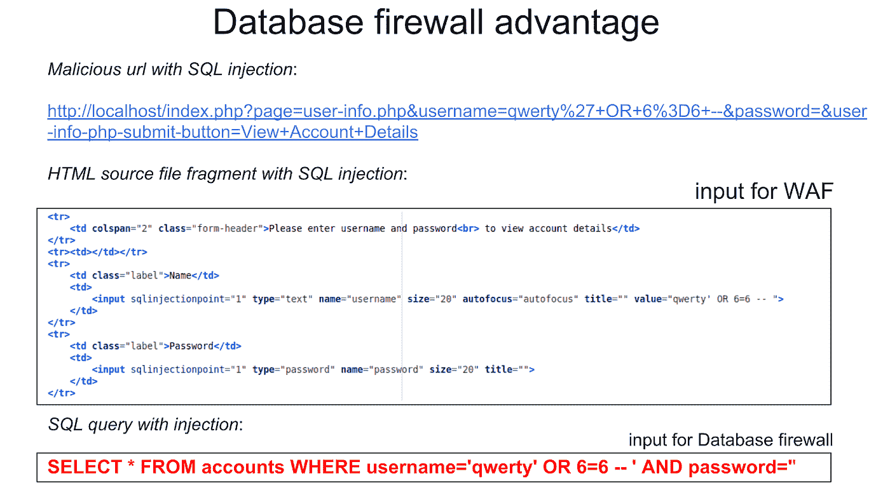
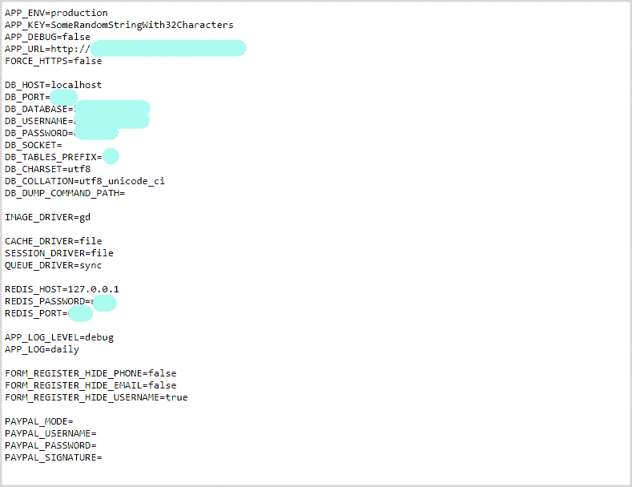

# 一个关于 web 应用程序数据泄漏以及如何防止它们的简短恐怖故事

> 原文：<https://medium.com/hackernoon/database-security-vs-web-app-leaks-26cd35d9ce5a>

## 如何提高数据库的安全性

# 哔哔。

你听到闹钟的声音。醒来后首先看到的是一个通知。你的 WordPress*应用程序的整个用户群已经泄露到 Darknet 中。根据 [GDPR](https://www.cossacklabs.com/blog/gdpr-for-engineers.html) 的说法，你既是[的数据控制者又是处理器](https://www.gdpreu.org/the-regulation/key-concepts/data-controllers-and-processors/)，所以现在你面临着一些罚款和法庭听证。一点都不好玩。

在库伯勒-罗斯悲痛应对阶段的“讨价还价”阶段，你手里拿着咖啡，正在查看你泄露的网络应用程序的日志。以下是你最有可能看到的。

# 第一天:SQL 注入

SQL 注入(SQLi)是[最常见的网络攻击机制之一](https://security.berkeley.edu/resources/best-practices-how-articles/system-application-security/how-protect-against-sql-injection)，攻击者利用它从数据库中窃取数据。这是 OWASP 十大最关键的 Web 应用程序安全风险中的头号风险。

当注入到 SQL 查询中的代码假装是数据的正常部分，然后被解释为命令并执行时，就会发生 SQLi。SQLi 通常用于窃取数据或错误配置系统。恶意命令可以隐藏在 SQL、NoSQL、操作系统和 LDAP 查询中。任何数据源都可以用于这种攻击。SQL 注入命令列表本质上与数据库命令列表相同，包括潜在的灾难性命令，如 DROP TABLE。

> 如何判断您的 web 应用程序是否容易受到 SQL 注入的攻击？您的后端可以执行 SQL 查询。

玩笑归玩笑，要开始保护你的应用免受 SQLi 攻击，你需要使用:

*   自动化 SQL 注入预防工具(即 [Sqlmap](http://sqlmap.org/) 或[jSQL Injection](https://github.com/ron190/jsql-injection))；
*   输入验证/清理，以确保数据是允许的，具有正确的格式，并且允许查询访问指定的表。
*   [预备语句和存储过程](https://www.owasp.org/index.php/SQL_Injection_Prevention_Cheat_Sheet#Defense_Option_1:_Prepared_Statements_.28with_Parameterized_Queries.29)。

考虑使用 web 应用防火墙(WAF)或/和 SQL 防火墙来帮助过滤掉恶意数据。WAF 工作在应用程序级别，而 SQL firewall 工作在更接近数据库的位置(因此它可以更多地访问原始数据)。

深入挖掘这些防火墙类型之间的差异，WAF 试图检测已知的攻击或攻击模式，并验证输入签名(在应用程序的边界)，在网络流量级别过滤请求，因此有许多方法可以绕过 WAF 防火墙。最流行的 waf 之一是 [ModSecurity](https://www.modsecurity.org/) 。

SQL 防火墙比 WAF 防火墙有许多优点，但是它们使用起来更复杂，而且没有多少(好的)SQL 防火墙。例如，有 [Oracle SQL 防火墙](https://www.oracle.com/technetwork/database/security/ovw-oracle-database-firewall-1447166.pdf)，它是 Oracle 套件的一部分。如果你看看开源— [Acra 数据库保护套件](https://www.cossacklabs.com/acra/)有一个[内置的 SQL 防火墙(AcraCensor)](https://docs.cossacklabs.com/pages/documentation-acra/#acracensor-acra-s-firewall) ，它支持过滤 PostgreSQL 和 MySQL 的 SQL 注入。

*Check out how SQL firewalls work in real-time in an open source* [*OWASP-based demo*](https://github.com/cossacklabs/acra-censor-demo)*.*

受到这些信息的鼓舞，你开始工作。解决了所有与 SQLi 相关的问题后，你心满意足地去睡觉了。

# 哔哔。

第二天早上闹钟会叫醒你。你首先看到的是你的用户群已经通过你的 web app 泄露了。又来了。这次会出什么问题呢？你昨天把一切都修好了，对吗？你煮更浓的咖啡，然后开始修理东西。

# 第二天:特权数据库访问

这次是什么让攻击者获得了特权数据库访问权限？可能的原因是您执行了以下操作:

*   保留默认的登录/密码组合，
*   将公共字段或表留在数据库中，
*   左公共配置文件(如。env 文件)供任何人篡改，
*   对服务器或数据库的左或硬编码的访问凭据。

保留默认甚至公共访问凭据是一个典型的错误，会导致大量数据泄露，甚至更大的公司也被发现犯了这种错误。根据[物联网搜索引擎 Shodan](https://www.shodan.io/) 的说法，错误配置的 MongoDB 数据库总计 [24 TB](https://twitter.com/shodanhq/status/1012835194024480768?lang=en) 的公司数据在某一点上暴露给任何人，其中一个最著名的 MongoDB 相关泄漏是[通过一个流行的保姆应用程序中未受保护的数据库暴露 2Gb 的个人数据](https://blog.shodan.io/security-researchers-find-vulnerable-iot-devices-and-mongodb-databases-exposing-corporate-data/)。互联网上大量开放的亚马逊网络服务(AWS)是另一个你永远不应该对待你的数据库的例子。

*Screenshot of an .env file left public in the root folder of a real functioning website. We haven’t checked, but we believe that these credentials are totally valid.*

为了避免在你的 web 应用程序中出现如此明显但潜在的灾难性错误，请确保你的代码库中没有任何硬编码的凭证。使用像 [clouseau](https://github.com/cfpb/clouseau) 这样的开源代码扫描工具可以帮助你在你的 repo 甚至 git 历史中找到被遗忘的凭证。

阻止潜在攻击者的另一个预防措施是[更改数据库的默认登录](https://www.shoutmeloud.com/how-to-change-wordpress-default-username-security.html)和[根密码](https://docs.bitnami.com/installer/infrastructure/mongodb/administration/change-reset-password/)，以及将管理页面的默认 URL 更改为不太明显的名称(即从默认的" */admin* 或" */root* "更改为类似" */opensesame* ")。

一个好主意是使用[开发-运营](https://www.sqreen.io/checklists/devops-security-checklist) [清单](https://www.sqreen.io/checklists/devsecops-security-checklist)检查你的应用程序，以确保你没有忘记将一些重要数据标记为私人敏感文件。您可能还想了解这些数据库加固实践。

今天都做完了吗？但愿如此。

# 哔哔。

闹钟叫醒你。再过一天，你的应用程序仍在泄露敏感数据。绝望中，你问自己——现在该怎么办？和昨天一样—煮更多的咖啡，修复您的 web 应用程序中的更多漏洞。

# 第 3 天:忘记备份、日志、SQL 转储

因为暴露的凭证而让攻击者获取数据库的一些内容已经够糟糕了。以纯文本形式暴露存储在网上某处的整个数据库(或其完整备份)是一场灾难。

> *[*如果有人在你的服务器上发现了备份的数据库文件，*](https://perishablepress.com/scanning-for-backup-files/)*
> 
> *[*游戏结束了。*](https://perishablepress.com/scanning-for-backup-files/)*

*然而，许多数据泄漏始于明文存储的备份，并被遗忘在服务器的某个地方，任何人都可以拿走。这是典型的疏忽。例如，即使是 [WhatsApp 也使用明文云备份](https://www.independent.co.uk/life-style/gadgets-and-tech/news/whatsapp-update-latest-encrypted-messages-privacy-security-read-chat-a8510701.html)——如果 Android 用户设置了云备份，WhatsApp 会将他们所有的信息和附件以明文形式存储在 Google Drive 中。另一个例子是现已倒闭的加拿大小商品零售商 NCIX，它被发现存储了超过 50 万人的未加密金融交易数据和信用卡信息。*

**

***日志**是另一个寻找明文密码公开流通的地方。这似乎是一个新手的错误，但它仍然发生在 Twitter 和苹果 macOS 上。*

***SQL dump 攻击**通常由“第一天”中描述的 SQL 注入触发，它允许恶意攻击者染指您的数据库或其备份的内容。任何[泄露的敏感数据信息](https://www.cossacklabs.com/blog/what-we-need-to-encrypt-cheatsheet.html)都会让你立即成为 GDPR 相关诉讼的候选人。幸运的是，有很多现成的工具(即 [Everything CLI](https://www.everythingcli.org/secure-mysqldump-script-with-encryption-and-compression/) 和 [Mysqldump-secure](https://github.com/cytopia/mysqldump-secure) )来加密你的 [SQL 转储](https://blog.jooq.org/2013/11/05/using-sql-injection-vulnerabilities-to-dump-your-database/)，或者你可以使用[开源加密库](https://www.cossacklabs.com/themis/)编写自己的脚本。*

*有没有简单的方法来完全保护您的 web 应用程序及其数据库和备份免受这些漏洞的攻击？是也不是。它更多的是关于拥有一致的安全开发流程:设置正确的访问策略，测试备份及其恢复，清除旧文件。保护数据是一个过程，而不是一次性的活动，为了提高效率，我们建议完全加密数据文件并保管好密钥。*

*我们建议使用加密，但要明智地使用它。首先也是最重要的，不要使用你自己的密码，使用有信誉的可靠的加密工具。此外，仅仅依靠数据库端加密并没有真正的帮助，因为如果数据库被黑客攻击/访问，数据就会泄漏。仅应用程序端加密也没有帮助，因为黑客攻击 web 应用程序甚至比黑客攻击数据库更容易，而且，一旦被黑客攻击，加密方案可能会改变，数据将会泄露。*

*可靠的现代方法是在 web 后端加密数据(以不允许 web 后台应用程序解密数据的方式)，并将其传输和存储在加密的数据库中。为了解密数据，需要一个单独的解密代理；它确保应用程序有权限读取这段数据，防止 SQL 注入，并解密数据。*

*如果你对尝试现代方式感到好奇，你可以直接进入 [Acra](https://www.cossacklabs.com/acra/) (开源数据加密套件)的[单行工程演示](https://github.com/cossacklabs/acra-engineering-demo)。它说明了代理是单一信任点，因此整个数据库可能会泄露而不会产生任何后果，因为数据库的内容是安全加密的，应用程序和数据库都无法解密，因为它们无法访问解密密钥。*

*感觉有点不知所措，但更聪明，你渐渐入睡，带着新发现的灵感在第二天更深入地挖掘令人兴奋的加密世界。*

# *哔哔。*

*突然，你再次被闹钟惊醒，意识到所有的泄密和诉讼不过是一场噩梦。但是所有的弱点和问题仍然存在。你给自己泡了一杯咖啡，开始阅读并处理你现在意识到的网络应用程序安全中的所有问题。*

**

# *后记及推荐阅读*

*开始的步骤并不是故事的结尾。除了本文概述的基本 web 应用程序安全原则之外，您还可以学习和实施很多东西来保证数据的安全。*

*检查你的应用程序的基础设施是否存在已知的漏洞——大多数 web 应用程序漏洞都是由已知的漏洞引起的，只要稍加小心和关注，这些漏洞是完全可以避免的。*

*确保您:*

*   *使用应用程序组件的安全配置；*
*   *定期检查和测试所有组件、库、嵌套依赖、DBMS、运行时环境、其他第三方元素的兼容性，如果它们是最新的，则使用安全 APIs*
*   *经常使用工具扫描漏洞(你可以在开源软件中找到[的一些漏洞)，了解最新的漏洞发现(至少是那些与你正在使用的平台/组件直接相关的漏洞)，根据需要进行修复和升级。](https://snyk.io/)*
*   *在适当的位置实施适当的[测井、监测](https://www.bmc.com/blogs/siem-vs-log-management-whats-the-difference/)和[追踪](https://www.cossacklabs.com/blog/how-to-implement-distributed-tracing.html)工具。*

*采取必要的预防措施:*

*   *将数据与 web 应用程序逻辑分离；*
*   *在 SQL 注入攻击成功的情况下，限制可能的数据暴露。*

*首先，我们强烈建议进行深思熟虑的阅读:*

*   *OWASP 十大最关键的 Web 应用安全风险；*
*   *OWASP [SQL 注入预防小抄](https://www.owasp.org/index.php/SQL_Injection_Prevention_Cheat_Sheet)；*
*   *维基[网络应用安全指南/清单](https://en.wikibooks.org/wiki/Web_Application_Security_Guide/Checklist)；*
*   *[12+1 想法如何保证后端安全](https://www.cossacklabs.com/blog/backend-data-security-modern-ideas.html)；*

*此外，请查看 OWASP 建议的前瞻性列表"[OWASP 2018 年十大前瞻性控制措施](https://www.owasp.org/index.php/OWASP_Proactive_Controls)"，了解可用安全原则的最新进展。*

*保持安全！*

**

***我们之所以使用 WordPress 的例子，只是因为它是一个拥有庞大用户群的平台，以及数量惊人的已知漏洞* *和安全问题***。*[*【27%的互联网由 WordPress 提供动力】*](https://www.whoishostingthis.com/compare/wordpress/stats/) *。但是，如果你不认真对待安全性，其他网络平台和应用程序也会以类似的方式让你失望。***

*****如果你有关于网络安全基础知识的补充，或者想分享你在网络应用数据泄露后成功或缓解的故事，请通过***[***info@cossacklabs.com***](http://info@cossacklabs.com/)***或***[***@ cossacklabs***](https://twitter.com/cossacklabs)***联系我们。我们希望收到您的来信！*****