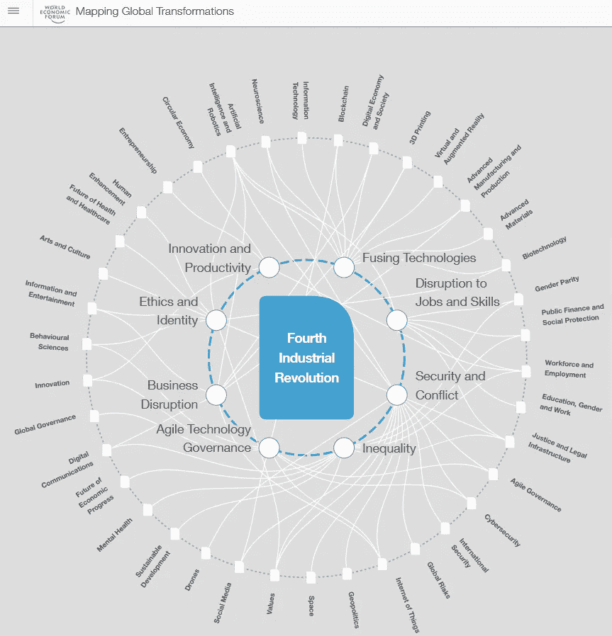
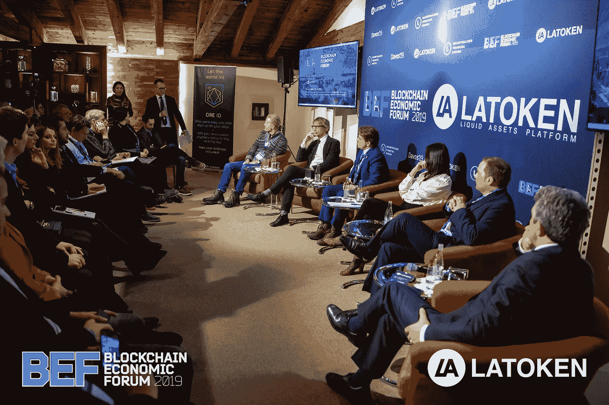
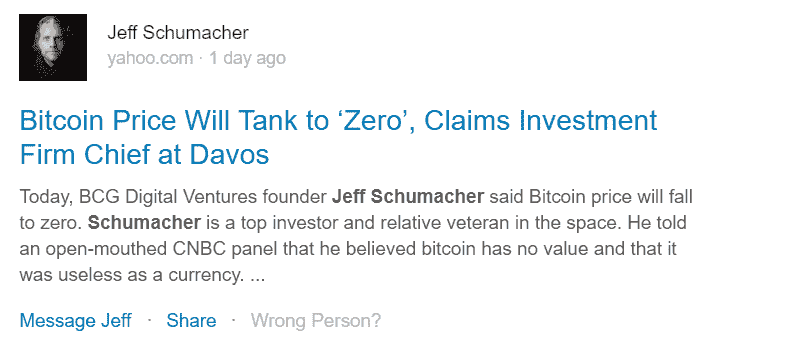
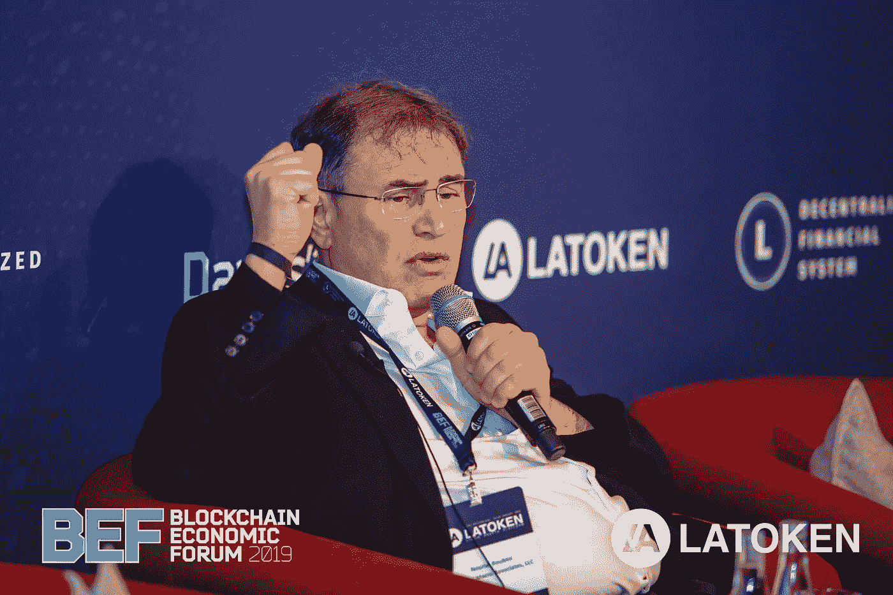
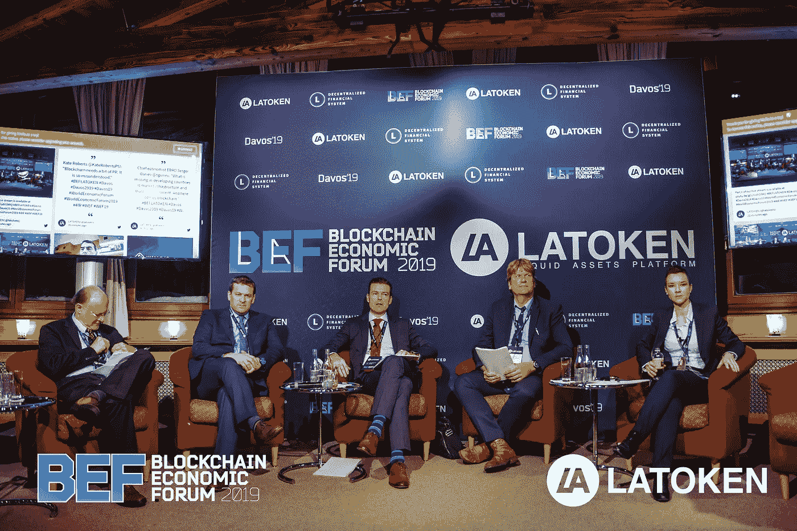
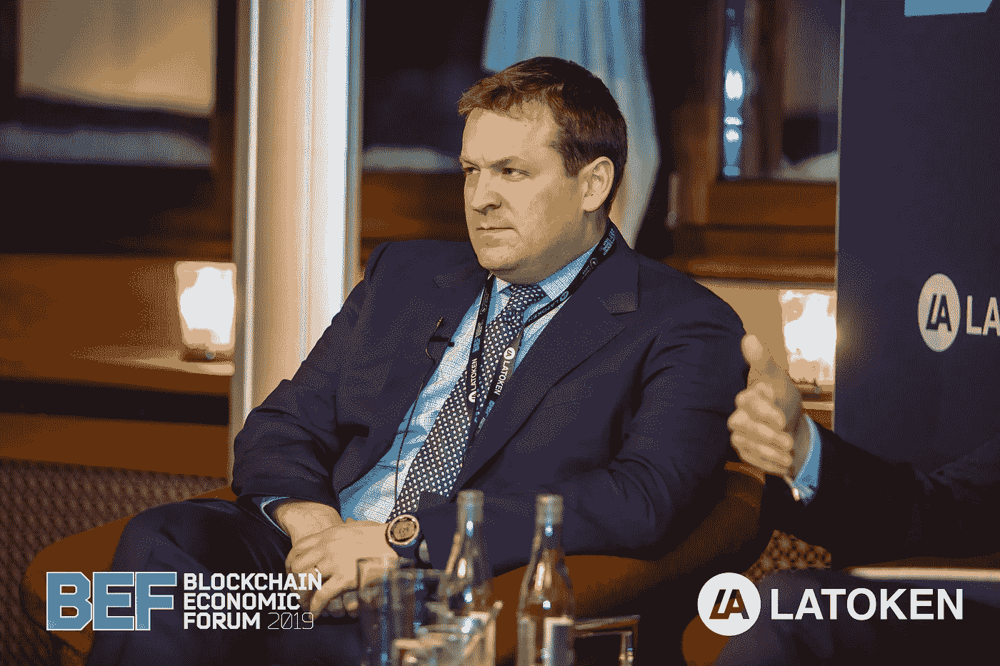

# 达沃斯 2019:来自长廊的寓言

> 原文：<https://medium.com/hackernoon/davos-2019-parables-from-the-promenade-e116d3f03fb>

On the train ride to Davos, the influential Swiss town in the middle of nowhere. I flew into Zurich from Bangkok so I was not ready for the cold at all.

在 2019 年达沃斯世界经济论坛之前，经济情绪并不乐观。我们在风险曲线上走得很远，只剩下缺乏“阿尔法”来发现，这使得美国经济在特朗普意外反弹后处于最脆弱的状态。经常有人问我把国库放在哪里，我能提供的信息很少(不是股票，也不是黄金)。今天的世界仍然受到神秘的 2008 年事件的伤害，最近的市场打击让我们信心不足。我们的集体记忆和旋律是神秘的，与现实无关，但会将我们玫瑰色的眼镜变成湿透的红色光学镜。我们对一夜之间经济不确定性的回忆，为这个公司操纵和亿万富翁私利的反乌托邦世界中秩序的必要性奠定了基础。自由公平的市场规则无法支持和维护美国梦——所以规则是必需的，愤怒是有理由的。在我们对造成的和被排斥的不公正的新的恐惧中，我们期待当局惩罚作恶者并回到一个更安全的过去。这种自由与机制的对立让人想起了一个更加暴力的时代的相似之处:

> “在 30 年战争的年代，托马斯·霍布斯被感动到庆祝利维坦国家，以合法武力的垄断作为社会的救赎。当然，为了人身和财产的安全，最好是向君主国家让步，而不是让秩序淹没在内乱中。”
> 
> 铁王国:普鲁士的兴衰，1600-1947

然而，如果我必须在今年的达沃斯指出一种模式，那不是关于机构或组织。在我们讨论的问题和我们构思的句子中，语言已经发生了显著的下游转移。从主题上来说，幸运的是，我个人在达沃斯听到的许多对话都是关于第四次工业革命背景下的*个人*:即**心理健康、区块链、慈善、自由贸易。**我承认这很可能是选择偏差，但网络力量的主题讨论植根于个人用户层面。我们开始不看机构，而是看我们自己——管理我们的健康和工作。正是通过这些信念，我们展望未来的一年，将国际新年决议融入我们的个人目标。

WEF’s online topic map of the next revolution that was a [preamble to Davos 2019](https://toplink.weforum.org/knowledge/insight/a1Gb0000001RIhBEAW/explore/summary)

**漫步长廊**

今年达沃斯的散步场所充满了热烈的讨论和对新年的兴奋。特朗普的推文是很好的对话破冰方式，他的缺席为更富有成效、以问题为导向的讨论减少了一个干扰。

典型的讨论范围从以某种方式解决所有问题的技术到美中贸易战的持久性，特别关注心理健康(强生公司、惠康信托公司、纳斯达克和其他一些公司的掌声超过 50 次)、慈善事业(任何拥有+1000 万美元的人)和自由贸易和言论(贸易转移、国家，我猜每个人都是？)当然还有区块链(GBBC、康森西、凯斯宾周、贸易班，我猜每个人？)

尤其是最重要的话题，心理健康，我们看到社交网络不一定是关于谁与谁有联系，而是谁与 T2 没有联系。结构性漏洞出现，某些地区的快速和缓慢增长的梯度开始出现，就像第一次工业革命一样。这种等级制度不可避免地会在我们的新经济中出现。在个人层面，我们看到了类似的民粹主义、对抗性贸易和有辱人格的心理健康的例子。尽管我想说达沃斯是关于科技和区块链的，但它更多的是关于第四次工业革命将使用何种“语言”。是的，科技对话变得有点沉闷*(人工智能，人工智能，诸如此类)，但人们对这里发生的对话给予了太多的怀疑——决策者愿意倾听，只要他们能消化这个问题。*

*休息室:我花了一些时间穿着康塞斯的新衣服，Tradeshift 非常强大的存在，里海周刊对 OBOR 以外的欧亚大陆贸易的关注，所有新闻主办的纳斯达克俏皮品牌聚会(首席执行官是一个摇滚明星)，最后是区块链经济论坛:演讲嘉宾讨厌 BTC(舒默，鲁比尼)和喜欢公平治理和人类不信任的人群。我喜欢我们现在默认的事实，如果有人*可以*变得邪恶，那么在这个寻求关注者和 twitter 传教士的时代，一个*就会*变得邪恶。*

*从达沃斯的所有迹象来看，淡化的“羊群即将到来”叙事在区块链之旅中处于第五档(在最近的新闻中，[三星加剧了泡菜溢价](https://toplink.weforum.org/knowledge/insight/a1Gb0000001RIhBEAW/explore/summary))。然而，除了收养，还有其他含义。也许在加密熊市的绝望中，人们越来越依赖于机构，这最终将使参与者偏离正轨——我从 BEF 的对话中看到了明显的分歧和令人惊讶的和解。Arjun Balaji 关于冲突的观点的演讲正如火如荼地进行着，但并不像人们想象的那样激烈。*

***区块链经济论坛***

**

*LAToken invited various anti-crypto dialogue despite their own blockchain— when I inquired to Matias, the Senior Content Manager at LAToken about the invitees, he said “it’s mostly good for the ecosystem to argue.” Refreshing to hear.*

*在周末的时候，我来到了区块链经济论坛，在那里，LAToken 慷慨地邀请([和搭档](https://hackernoon.com/hacker-noon-company-updates-from-coo-linh-dao-smooke-a26d114ccb59) ) Hackernoon 查看评论现场:我来报道。我听到了很多矛盾的想法和摇头，但也有很多握手和恭敬的跟进。*

**

*首先，BCG Digital 的杰夫·舒马赫(Jeff Schumacher)说 BTC 在美国消费者新闻与商业频道毫无用处，并在 BEF 再次强调了这一点。更深入地看动机，这可能是一个间接的营销噱头，有利于 DFinity 的用例，因为该集团在该计划中的参与度过大。所以，区块链万岁，BTC 万岁。*

*第二个亮点是主旨发言人鲁比尼，无论他去哪里，他总是带着他的争议。作为一名从华尔街起步的从业者(但现在是区块链的改宗者)，我可以理解他的一些主要观点:中央银行和部分银行确实可以提供更深的流动性池和集中效率，只要它们保持“独立于”政府(因此全球央行加密货币将摧毁所有竞争对手)。他是对的，银行系统做得很好——它运转得很好。然而，2008 年的创伤在他的思想中回荡。我们对中央集权的依赖仅仅是为了**通过 2008 年后政府权力机构广泛采用的权力集中来防止**混乱(多德-弗兰克法案移交给 MiFID)。我们不能继续贴创可贴来保护参与者的利益。*

*正如诺贝尔经济学奖得主阿马蒂亚·森(Amartya Sen)所描述的那样，鉴于经济学家和反社会者(社会白痴)完全功利的心态，他们并不那么容易区分——你会在所有离岸银行网站上看到阴谋论者、菲亚特极简主义者和经济学博士之间所有这些令人愉快的讨论。鲁比尼把结果放在建设过程中，并且确切地知道非连锁银行系统可以创造什么。是的，它是基于经验和理论价值的——但只在我们已知的世界里。中央银行和部分银行的确是目前获得美国-利维坦世界秩序所需的深度流动性的最佳系统，我也不一定反对这种系统。我在预备队的朋友查理描述了冷战期间每天的恐惧摄入是什么样的，听起来并不那么美味。*

**

*[Nouriel Roubini](https://en.wikipedia.org/wiki/Nouriel_Roubini), New York University Stern School of Business.*

*正如在一场名为“封锁链经济论坛”的活动中所预期的那样，公众以焦虑不安的方式用他们的问题进行报复:从新西兰失败的中央密码货币、津巴布韦政府推动的通货膨胀和委内瑞拉对 BTC 的需求中寻找例子。对他们来说，这些例子说明了政府和铸造权威之间的鸿沟，从长远来看，这是一条脆弱的“推荐”路线，将不可改变的治理置于“纯粹”效率之上。当然，我喜欢这种胆大妄为，什么样的爱失败者的美国人不喜欢。但我不喜欢他们将银行业和证券业为实现今天的成就而不得不经历的所有痛苦抛在一边。大多数金融法律通常是被动的，而不是先发制人的——从格拉斯-斯蒂格尔法案(银行业)到谢尔曼法案(垄断)，再到真正的中国墙法案(真正开始于 2001 年的内幕交易法)——更糟糕的是，对内幕交易规则更深入的研究并不是该行为是“不道德的”，而是它将阻碍市场流动性:功利主义而非道德主义。从长远来看，我同意公众的观点，因为反应过程有其局限性。我想看到更实际的方法。一个更加平衡的小组(我将在后面描述)以一种和解的方式进入问题的现实。*

*尽管如此，在未来走向的问题上，鲁比尼还是显得有些欠缺。他声称 fintech 是解决未来问题的有用设备。我同意。纵观历史，M1 的供应本质上是由自动取款机创造的，一种“fintech”产品。不过，在问答环节，鲁比尼表示，我们可以依靠互联网来获得创新和金融技术驱动的流动性。然而互联网最初被设计成分散的，现在他拒绝了同样的提议。如果互联网归一家公司所有，如果它不是通向公共空间的开放门户，它就不会有 J 曲线剑桥爆炸。但是过了一段时间，每个人才最终接受太阳是我们行星系统的真正中心。虽然集中式系统可能是一种具有立竿见影的有益效果的稳健解决方案，但分散式流程会产生一种反脆弱性，这种脆弱性会导致不可估量的生态系统。出现的是这种“机构过剩”的心态。*

***机构供过于求***

*在获奖著作《在新兴市场赢得*([克里希纳·帕莱普](https://www.google.com/search?client=firefox-b-ab&q=Krishna+Palepu&stick=H4sIAAAAAAAAAOPgE-LSz9U3SC-pNK0qUuIEsTMMyvOytWSyk630k_Lzs_XLizJLSlLz4svzi7KtEktLMvKLFrHyeRdlFmfkJSoEJOakFpQCAAcopxZIAAAA&sa=X&ved=2ahUKEwjX-ceCgpvgAhVrs1kKHWj-AywQmxMoATATegQIBxAK)，[塔伦·卡纳](https://www.google.com/search?client=firefox-b-ab&q=Tarun+Khanna&stick=H4sIAAAAAAAAAOPgE-LSz9U3SC-pNK0qUgKzs5PSC3PTtWSyk630k_Lzs_XLizJLSlLz4svzi7KtEktLMvKLFrHyhCQWleYpeGck5uUlAgD8laRORwAAAA&sa=X&ved=2ahUKEwjX-ceCgpvgAhVrs1kKHWj-AywQmxMoAjATegQIBxAL))中，作者创造了“制度空白”一词:新兴市场中的结构性痛点，企业应该专注于用巧妙的解决方案来解决这些痛点，以释放前所未有的价值。例如，可以使用订单手册+本地交付(甚至骡车)来克服山区、农村道路基础设施，以此与大型超市交付系统竞争。**

**事实:美国不是一个新兴市场。反驳:也许在自动驾驶卡车摧毁所有美国中部微观经济城市之后。在每个人对机构资金进入区块链的异想天开的梦想中扮演陪衬角色的是过度机构化的危险——我们在《太大而不能倒》中也看到了同样的事情。**

**2008 年后，我们试图“稳定银行”，但我会告诉你，站在另一边，受影响最大的是银行的法律和信贷部门，而不仅仅是交易员和银行家(权力刚刚从银行转移到私募股权公司)。为那些淹没在超过 1，000 页的监管文件中的人祈祷，为那些刚刚毕业的可怜的法学毕业生祈祷，以考验他们的耐心，为纸牺牲树木(免责声明:我们在 ABC 平台推动绿色实践)。**

**这成为了一场世界范围的运动，有点黑格尔辩证法的味道:政府用过度转向的反动法律膨胀了大型银行和巨型公司->银行互相收购，公司立即转向税收倒置(2013-2014)，人民随后受到推动离岸银行业的下游成本的影响。然后问题堆积如山，从中央集权的恶性循环开始，把中央集权的问题堆积在另一个中央集权的政党身上。Satoshi 没有看到所有这些附带损害的结果——他只是看到了下降的开始，并决定为集中的问题创建一个分散的解决方案。正如 Haseeb Qureshi 最近所说的，中央集权并不像人们想象的那么邪恶。但是我跑题了。**

**鲁比尼持有的思维是短期的，并不承认去中心化系统作为创造新形式流动性的手段的未来力量，这种流动性不仅仅是一种全球化的资源，而是通过可靠的信任。可信的投机可能是一种非常强大的消费力量。然而，加密货币的被告也是如此刀枪不入——在我们都成为“赢家”之前，他们还有一些严重的问题要解决区块链公众看到了一个更长的视野，有更多的道义根源，从长远来看，不变的治理和廉洁的法律创造的经济盈余取代了中央集权制度。没有一个“经济模型”能够推断出 80 年代个人计算时代在 90 年代创造互联网现象的成功。我们不得不相信，我们面临着一个最后通牒(尽管是简化论者的最后通牒),而且选择很少…**

1.  **我们继续依赖国家中央银行系统(美国，也许中国？等。)**
2.  **我们依赖国内系统(联合国、银行联盟、特别提款权、世界银行)**
3.  **我们依赖于参与者驱动的网络(分散协议)**

**…但是我们真的被逼到墙角了吗？Ariel 说我不应该先问“哪种货币”,而应该先问“什么用途”——是的，先生。**

****合成就在字里行间****

****

**Round Table: **The Board and Monetary Policy for Decentralized Currency** [Prof. Dr. Ansgar Belke](https://www.makro.wiwi.uni-due.de/en/team/ansgar-belke/), Author Monetary Economics in Globalized Financial Markets,
[Joshua Aizenman](https://scholar.google.com/citations?user=zJni9EUAAAAJ&hl=en), National Bureau of Economic Research, co-editor Journal of International Money and Finance
[Stephen Murchison](https://www.bankofcanada.ca/profile/stephen-murchison/), Advisor to the Governor of the Bank of Canada
[Ariel Zetlin-Jones](https://www.cmu.edu/tepper/faculty-and-research/faculty-by-area/profiles/zetlin-jones-ariel.html), Associate Professor of Economics
[Linda Schilling](https://sites.google.com/site/lindamarleneschilling/home), Assistant Professor for Financial Economics, Ecole Polytechnique CREST**

**这就是拉托肯的选拔团队在汇集不同意见并达成一致方面做得很好的地方。虽然鲁比尼的观点经常在他参加的每次会议上重复，但这个小组令人耳目一新，因为他们积极思考对事先发生的辩论的可能补救措施——一种新的思维框架。**

**卡耐基梅隆大学的副教授 Ariel 指出了当前区块链政权的一些主要问题，询问了可行性，而不是忽视了这一切的不可能性——我们不需要把婴儿从洗澡水中抛弃。**

**想法是这样的:**

1.  **使 crypto 的基本租户工作，就像作为一个适当的交换媒介**
2.  **决定我们是否需要/想要一种全球加密货币**
3.  **了解如何管理或控制代币的供应(不一定是财政政策，但一般交易的可行性)**

****

**[Ariel Zetlin-Jones](https://www.cmu.edu/tepper/faculty-and-research/faculty-by-area/profiles/zetlin-jones-ariel.html), Associate Professor of Economics @ CMU. I spoke with him before the event, and he’s been quite involved with a few blockchain initatives like Sweetbridge and PNC Bank —so not his first rodeo**

**我们真的需要一种单一的全球加密货币吗？这个理事会恳求以需求为基础的第一方法来解决一个简单的问题:世界需要它吗？为什么不拥抱我们的异质性，而不是强加这种增加多样化风险的同质性呢？比如说，秘鲁的经济与亚美尼亚的贸易有关联吗？它能保证两国都生活在一种货币之下吗？我在理论上完全同意，但在格式和字体上可能不太同意:这种制图练习不仅限于 21 世纪的地缘政治，还包括更具创造性的划分，如行业纵向和共同流动性横向。过去，在主权建立之前，人们会通过武力来寻求他们的福利。为了压制这种暴力现实，国家的至高无上的重要性在这个世界上不再有效，因此，不应该成为我们今天所有政策的轮廓。也许合作经济的潜在动机是基于共同利益:在虚拟视频游戏世界或赌博比赛中。已发行的货币可能不与另一个国家或国家内部挂钩，而是具有内在的经济价值，这正是我们在 ABC 平台上自己的专有算法中所做的。这可能有点难以想象，因为我们总是用美元或欧盟或任何其他货币来给我们的东西定价。但在此之前，我们必须确保这种(加密)货币能够作为一种适当的交易媒介，就像官员们所说的那样。**

**点击这里了解更多关于 2019 年达沃斯论坛的信息，他们应该会在本周上传视频。**

**在过去的时代，霍布斯可能会推动一个统一的监管国家，因为这是两害相权取其轻的更好选择，如无政府状态。当我们看到西方民主后国家的公民质疑他们自己的投票机制的结果时，2020 年达沃斯将有一个更长的问题列表来面对他们的十年。我们开始意识到，人们不能再推卸这些责任，必须自己解决——也许该轮到我们从阿尔戈英雄那里偷金羊毛了，但这一次，它被分割成共享的货物，不仅仅是为杰森。例如，我们在 ABC 平台寻找机会，现在退出这种霍布斯式的“较小的邪恶”，不依赖于集中化流程(即由政府控制的银行进行的贸易融资)，并通过授权用户参与者，而不是信任监管者，完全退出和重新发明系统。世界大部分地区和达沃斯的领导人似乎都在朝着这个现代化的方向思考。我很高兴看到技术将我们带向何方，但我更高兴看到人们如何在这个新的现实中自我组织。当通过发明者和社区的镜头讲述时，计算机的历史不是更令人兴奋吗？图灵、恩格尔巴特、乔布斯、盖茨、伯纳斯-李、诺依曼等。**

**我对在达沃斯度过的这一周很满意。我获得了一些终身的联系，建立了一些伟大的行业合作伙伴关系，并就我们自己的平台的想法进行了一些富有成效的对话，我们将在未来几个月内通过我的公司 [ABC Platform](http://abcplatform.com/) 宣布这一平台。我再次感谢 LAToken 平台让这次活动成为可能，感谢 [Hackernoon](http://hackernoon.com) 邀请我。我祝愿他们在下次比赛中一切顺利。你可以在他们的网站【www.latoken.com 上了解更多关于 STOs 和 token tradability 的信息。**

**向前看，**

***-D***