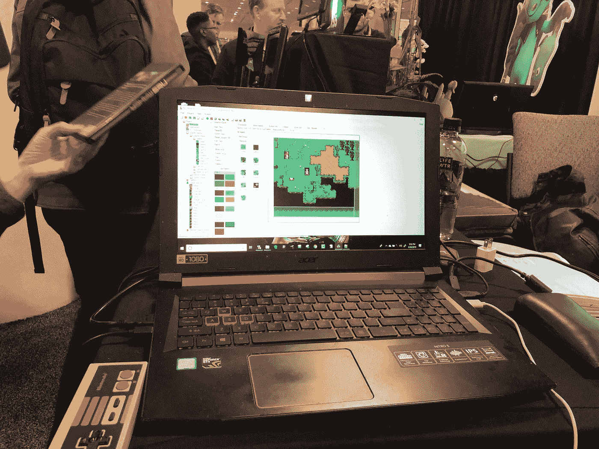
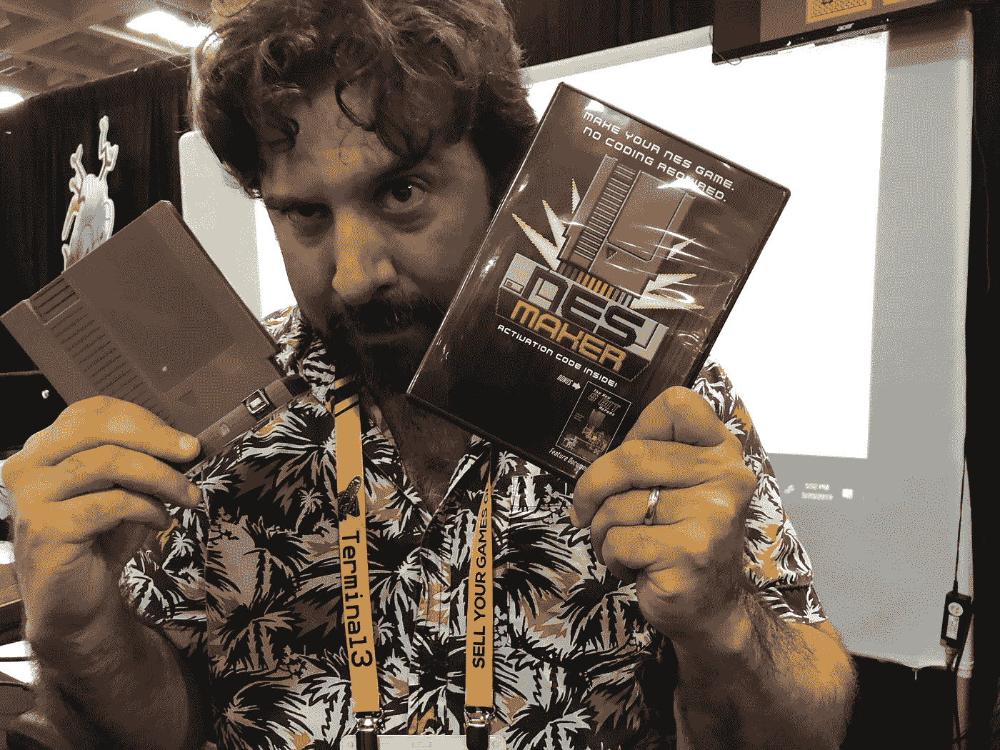
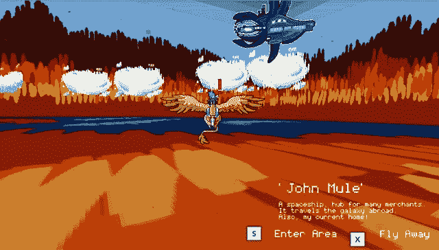

# 在 GDC 的第三天

> 原文：<https://medium.com/hackernoon/day-3-at-gdc-f2bc5a522ba6>

随着 GDC 活动的继续，我带来了对那些不能参加活动的人的独立游戏的持续报道。今天，我能够检查出一个可怕的平台拼图，尝试我的手在一个游戏中感觉像是融合了 Metroid 和 Mega Man，并看到一些令人惊叹的技术，使任何人都可以制作自己的游戏，然后将它们刻录到任何 NES 游戏系统和更多的游戏中！

让我们开门见山，好吗？

# 在最深处的阴影里

Inmost 是一款令人困惑的平台游戏，由艺术家 Alexey Testov 和程序员 Andriy Vinchkovskiset 创作，以一个黯淡的宇宙为背景，以记忆和闪回驱动的故事情节为特色。随着剧情变得复杂，你必须避开敌人(一击必杀)、坠落伤害(摔得太远你会死)，以及地形中的陷阱(尖刺和高度一样致命)。控制是坚实的，一旦你找到了滑动、蹲下和适时跳跃的感觉，以避免落入致命的陷阱或敌人，你会发现自己很容易穿越奇妙的黑暗景观。当你解开潜伏在这座废弃城堡每个角落的秘密时，令人惊讶的灯光使用和流畅的动画与蹒跚的不祥存在结合在一起，因为阴影本身试图将你从四肢撕裂。收集光的碎片，揭露真相，然后在不被发现的情况下逃走。预计将于 2019 年首次亮相，我期待着这一点。

# 品尝 Metroidvania

另一个引起我注意的平台是由史蒂夫·科普兰和杰夫·斯普恩豪尔开发的太空惊悚片《遥远的光》。正如我上面所说的，当我跳来跳去解决难题，并使用我在不同区域找到的装备和武器来击败敌人时，我感觉自己好像被传送回了超级大都会。从冷冻箱中醒来后，你摇摇晃晃地走向一个控制台，在那里你的角色穿上了宇航服，一旦你注意到你对面的工作站似乎已经被撕裂，沾满了鲜血，并且在破损的机器上潦草地写着“来找我”,你很快意识到事情出了差错。游戏的难度很好，引入了许多敌人，迫使你使用各种设备，如猎枪，盾牌，或喷气背包穿越地形走向你的目标。你也可以驾驶一些疯狂的交通工具，比如巨型机甲，或者带有锁定导弹的四轴飞行器。解锁独特的装备，撂倒敌人，并找到你失去的同志！

# 无需编码即可构建自己的游戏

如果我告诉你，可以制作自己的硬件 NES 卡盒，而不必实际编写一行代码，你会怎么说？这正是 Joe Ganato 向我展示的新 8 位英雄团队的 NES 制造商的可能性。这个项目背后的想法是采取一个复杂的游戏，并把它变成一个可定制的 8 位版本兼容任何 NES。该软件中的工具允许你创建自己的对象，定制它们的点击框，并为你自己的角色制作精灵动画。创造性的选择取决于你，所以虽然这个 NES 制作人做了为其中的物理产生引擎和逻辑的艰苦工作，你仍然需要对游戏性最终如何表现做出重大决定。到目前为止，这个项目最酷的一点是，当一切都结束了，你的游戏完成了，你可以把它烧成一个弹夹，放在 NES 里，然后像玩《马里奥兄弟》一样玩这个游戏。

# 额外的呼喊！

有一些了不起的独立开发者，他们的原创项目值得我们去爱和关注！我有机会见到了一些很棒的人，他们的一些项目值得大声喊出来。

小猫杯工作室正在开发一款名为白毫的有趣游戏，在这里你可以给各种各样的猫端茶，了解它们的个性、希望和梦想。想象一种休闲风格的食物服务游戏，与收割月角色的成长动态相吻合。我迫不及待地想看看这些优秀的人为我们展示了什么！

由 Summer 在 DragonGlitch games 开发的佣兵勒托可以在 [Steam early access](https://store.steampowered.com/app/893710/Mercenary_Leto/) 上获得。与你忠实的叉角羚龙同伴，你将飞越一个超现实的景观，并建立跨领域的友谊。我很高兴看到这位才华横溢的像素艺术家的更多作品。

我迫不及待地想在明天的活动中回来，找到更多惊人的独立游戏给你们看。我要留给你们的是脸书的科林·克雷茨和他惊人的溜溜球天赋，证明了手持游戏不一定要数字化才有趣。