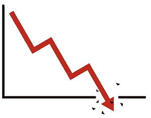

# 亲爱的加密货币投资者——所有的坏事都必须结束

> 原文：<https://medium.com/hackernoon/dear-cryptocurrency-investors-all-bad-things-must-come-to-an-end-aa836ce88d68>

我记得在 20 世纪 90 年代，任何一家公司的名字中带有一个. com 的时候，他们的股票都会创下历史新高。估值是荒谬的，但这没有什么区别，人们只是出于炒作和互联网的采用可能给社会带来的可能性而购买。

然而，这种炒作不可能永远持续下去。2000 年 3 月，我正在太平洋证券交易所的股票期权交易大厅工作，突然，科技热潮出人意料地结束了。

前所未有的网络公司烧完了他们所有的钱，股票开始暴跌。

突然之间，互联网公司无处可逃，任何名字后面带有. com 的人的股票都跌到了前所未有的低点。

# 这是一场大屠杀！

即使是做事正确的公司也会因为联合而被击垮。1999 年底，亚马逊的交易价格超过 100 美元，但到了 2001 年却跌到了 6 美元以下。

尽管这看起来很痛苦，但重要的是要记住，在这个动荡时期，亚马逊并不孤单。易贝、思科、高通以及数百家公司都遭到重创。

**但大多数人没有意识到的是，这是有史以来最重大的买入机会。**

有人可以在 2001 年的低点以 5510 美元的价格购买 1000 股亚马逊股票，这在今天的价值接近 170 万美元。哎哟！

尽管亚马逊无疑是当今最知名的，但随着时间的推移，有数百个购买机会会让投资者变得富有。

# 不幸的是，当谈到投资时，人们经常做相反的事情

为什么当价格很高，一切看起来都很好的时候，人们会争先恐后地购买，然而这似乎是出售的好时机。为什么当价格处于历史最低点时，很难在任何地方找到买家？这难道不是真正的财富所在吗？然而，这似乎一次又一次地发生。

我们都知道低买高卖的基本经济原则，但不知何故坚持总是反其道而行之。

2008 年至 2010 年的房地产崩盘呢？当时房地产价值跌至前所未有的低点。与仅仅一年前相比，房地产本可以以很低的价格获得，但大多数人都不敢购买，让难得的财富积累机会从他们身边溜走。

# 受过教育的机构投资者不会玩这个游戏

2009 年到 2010 年买房产的人搞得跟土匪似的。他们以绝对的市场低价买入，无需竞标就可以挑选任何他们想要的房产。

在 2001 年至 2003 年间购买科技股的人变得富有，即使是最小的投资也为投资者积累了难以置信的财富。

不幸的是，大多数阅读这篇文章的人可能不属于这两个群体。这是因为只有精通金融的投资者才会花时间建立这些联系，并在机会存在时抓住它。其余的人错过了机会，只是在后来挠头，想知道他们为什么不采取行动。

一直都是那样，也永远会是那样。人们自然希望在顶部买入，在底部卖出，而受过教育的投资者总是在那里帮助他们，并带走交易的另一方和他们的钱。

# 又要发生了

就像八年后的网络泡沫破裂和房地产危机一样，加密货币领域现在正在经历同样的事情。

加密货币在 2017 年爆炸式增长，主要是因为炒作和这种令人惊叹的技术可以做什么的可能性，但 2018 年又回来了，现实又回来了。

事实是，没有人再谈论购买加密货币，就像 2001 年没有人谈论互联网公司或 2009 年没有人谈论房地产一样。

作为一名成功的金融分析师、投资者，以及在 2001 年购买了科技股、在 2009 年购买了房地产的人，我认为加密货币正在接近底部，转机将在几周内出现，而不是几年。

这不是猜测，我看到该领域正在发生或即将发生的一些事情，这些因素的经济学将再次推动加密货币向前发展。

我想拍拍自己的背，说我看到了别人没有的东西，但事实并非如此。事实是，大银行和其他受过教育的投资者都看到了我所看到的一切，并准备好突然进入市场，攫取市场份额，就像他们以前一直做的那样。

# 谁会在下一次助跑中获胜？

像亚马逊、易贝、Match、WebMD 这样的公司摆脱了网络泡沫，获得了巨大的成功，引领了未来。像 Pets.com·韦伯万、Boo.com 和其他许多公司倒闭、破产，最终倒闭。

同样的事情也会发生在加密货币领域。做事正确的公司将会繁荣，长期收益几乎是不可想象的。那些资金管理不善的项目(不幸的是，这是最多的)将努力推动他们的项目向前发展，并可能耗尽资金并不复存在，导致投资者心碎。

幸运的是，我一直在研究哪些项目一直在做正确的事情，并有望在最近的低迷中幸存下来，最终远远超过之前的高点。

请记住，我们仍然处于加密货币技术的早期，世界上只有 3%的人拥有加密技术。想象一下，一旦大规模改编向前推进，将会发生什么。我们甚至还没有开始看到一个有密码的世界会是什么样子，就像我们还没有开始看到一个互联网驱动的经济在 20 世纪 90 年代会是什么样子一样，这意味着大部分的钱仍然存在。

事实是，我希望大多数人什么都不做，让这个难得的机会从他们身边溜走，这是一直以来的方式，也将永远如此。但是，对于极少数希望打破模式，参与下一次技术重估的人来说，你现在的时间不多了。

这一最新加密货币熊市的主要驱动力将在未来几周内结束，在此期间，我将发布我在区块链的顶级项目，这些项目最有可能利用快速接近的牛市经济因素。对于那些希望开始通过[交易加密货币获利的人](https://cryptoinvestinginsider.com/) [请点击此处](https://cryptoinvestinginsider.com/)获得深入研究和即时市场更新。