# 用 Dashbird 调试无服务器应用程序

> 原文：<https://medium.com/hackernoon/debugging-serverless-applications-with-dashbird-82a2ed86d757>

借助 AWS Lambda，我们获得了开箱即用的可伸缩性和弹性。更重要的是，AWS 还通过 CloudWatch 和 X-Ray 提供内置的监控、日志和跟踪支持。这些内置工具提供了一个很好的起点，但是随着他们的无服务器应用程序变得越来越复杂，许多开发人员最终会放弃它们。

在这篇文章中，我们来看一个无服务器的应用程序，看看 [Dashbird](https://dashbird.io/) 如何帮助你调试这个应用程序。

# 无服务器可观测性的挑战

谈到可观察性，无服务器引入了一些有趣的挑战。长期以来，我们一直依赖于使用代理和守护进程来收集指标和日志。它们在后台静默运行，远离我们的关键路径，我们关心的是最大限度地减少面向用户的延迟。他们批量收集、缓冲、发布这些可观测性数据，提高效率。作为一种实践，它们是如此根深蒂固地融入到我们如何监控我们的应用程序中，直到现在。

说到无服务器，特别是 AWS Lambda 这样的托管平台，我们根本没有地方安装这些代理！

收集度量和日志作为函数调用的一部分会增加调用时间的开销，这是可以理解的。因为 AWS 已经异步地从您的函数中收集日志，并将它们发布到 CloudWatch 日志中。一种常见的解决方法是订阅这些日志并对其执行后处理。

事实上，这就是 Dashbird 收集函数执行数据的方式。它将 CloudWatch 日志组订阅到一个 Kinesis 流，然后从那里处理事件。你可以在[这篇文章](https://theburningmonk.com/2018/07/centralised-logging-for-aws-lambda-revised-2018/)中了解这种方法的优势。

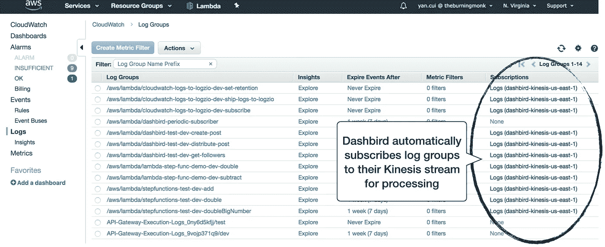

随着我们的无服务器应用程序变得越来越复杂，能够跨多个函数跟踪执行对我们来说很重要。正如演示应用程序所演示的，即使一个简单的用户事务也可以跨越多个事件源和 Lambda 函数。

# 演示应用程序

想象你正在构建一个 Twitter 的克隆体。该系统的核心特性之一是将用户的帖子分发给其追随者。为了实现这个特性，假设我们有两个独立的 API 端点:

*   发布帖子/创建:为当前用户创建新帖子
*   获取关注者/{userId}:获取用户的关注者

每个端点分别由一个单独的 Lambda 函数处理— ***create-post*** 和 ***get-followers*** 。

当用户发布新的帖子时， ***create-post*** 函数会将帖子保存在 ***posts*** DynamoDB 表中，并且还会将***post-create***事件发布到 Kinesis 流中。该事件然后触发一个 ***分发-发布*** 功能。该函数将查询 *GET followers/{userId}* 端点，然后将帖子添加到追随者的提要中。***get-followers***函数将查询***followers***DynamoDB 表以返回用户的关注者的 id。

为了简洁起见，我省略了实际发布帖子的逻辑。因此，我们的演示应用程序的整体架构如下所示。

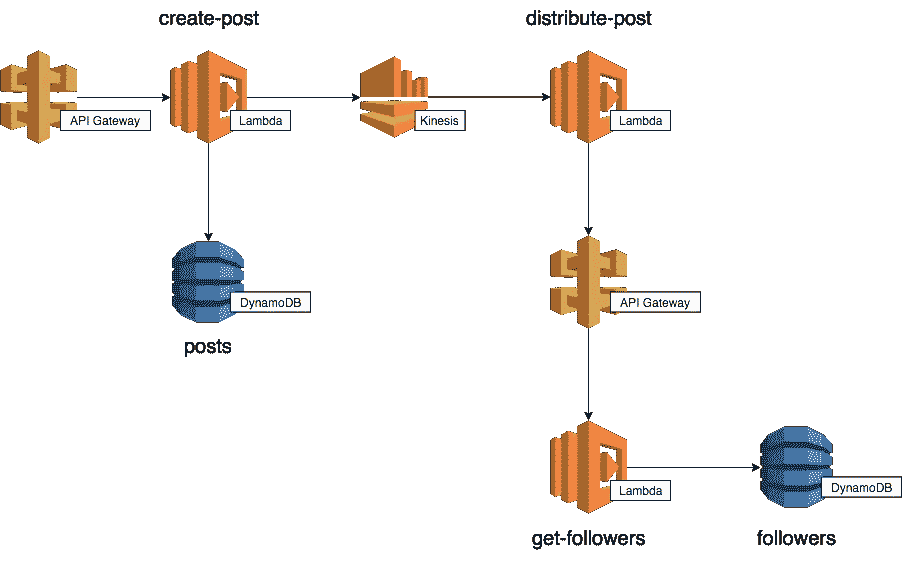

更有趣的是，每个 Lambda 函数都基于可配置的概率被硬连线到错误或超时。演示应用的源代码在 Github 上可以找到[，所以你可以自己尝试一下。](https://github.com/theburningmonk/dashbird-demo)

# 介绍 Dashbird

即使是一个简单的无服务器应用程序，就像上面概述的那样，我们也有相当多的函数要处理。让我们看看如何使用 Dashbird 来帮助我们监控这个应用程序和调试问题。

我一登录，我的帐户就有了一个高级仪表板。

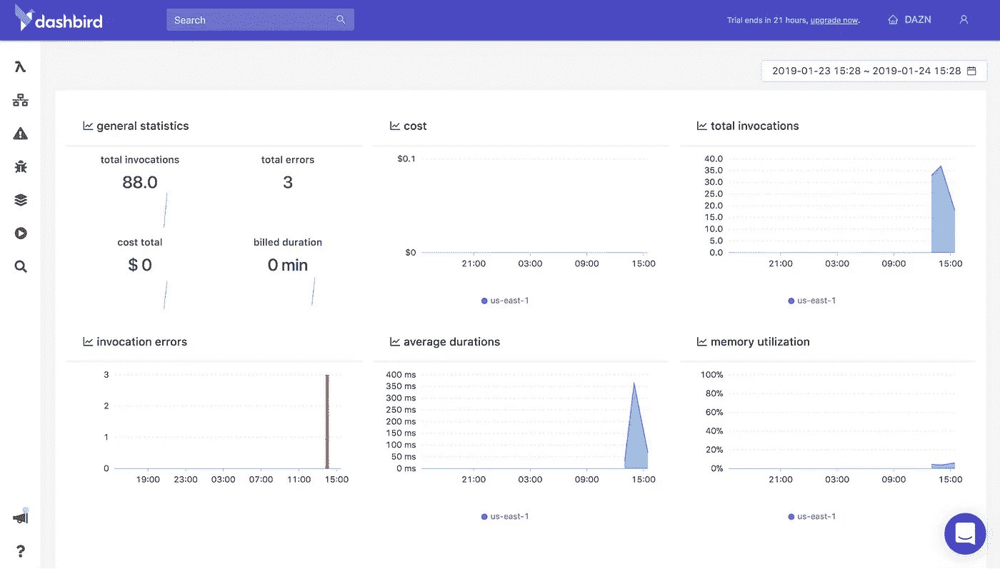

除了我在 AWS Lambda 控制台中获得的数据(见下文)，Dashbird 仪表盘还有两个有用的数据点:

*   函数的平均内存利用率
*   Lambda 调用的成本

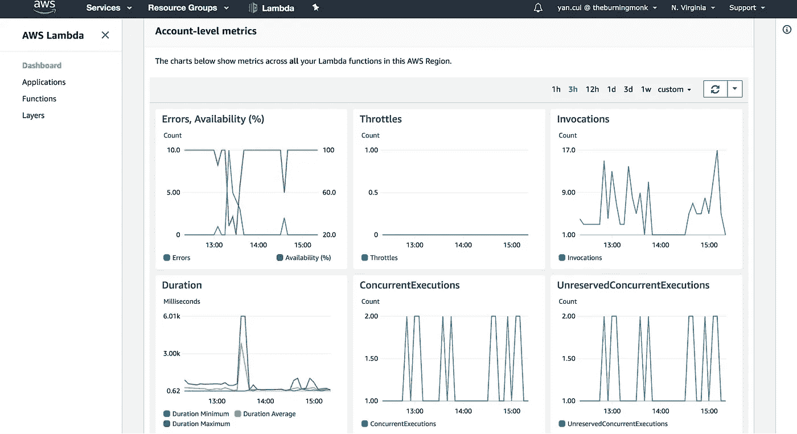

接下来，在 Dashbird 的 Lambda 控制台中，我可以看到我的功能及其在过去 24 小时内的活动的高级摘要。

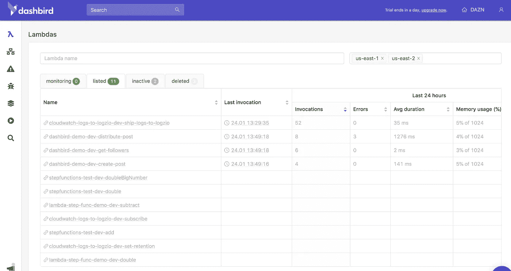

我发现这里非常有用的一个事实是，它将空闲 10 天的函数突出显示为非活动的。随着您的无服务器架构的扩展，您最终拥有由不同团队维护的数百个功能，很难跟踪哪些功能不再需要。拥有冗余功能是一种安全风险，因为它们仍然是可以被利用的攻击面。

虽然这个视图不能明确地告诉您哪些功能不再使用。许多功能不会定期运行。也许它们是一个月只运行一次的 cron 作业的一部分。或者，它们可能只在灾难恢复场景中使用。尽管如此，知道哪些功能是不活动的会鼓励团队问这样的问题“这个功能还需要吗？”。从这里开始，也许会出现更好的实践。例如，使用标记来标记预计很少使用的函数，这样它们就不会被这些检查标记出来。

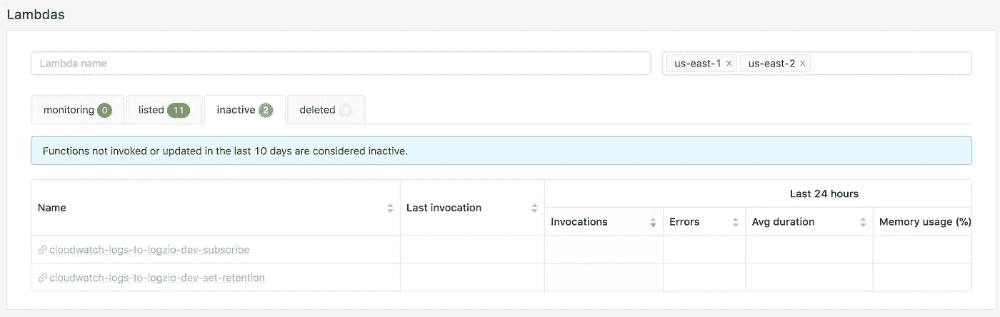

如果我导航到其中一个函数，那么我就有一个以函数为中心的视图，显示调用时间、错误、成本和内存利用率。此外，我还可以看到最近调用的列表。这里真正有用的是冷启动和重试都有明确的标签。在调试实时问题时，这让我可以快速缩小需要注意的调用范围。

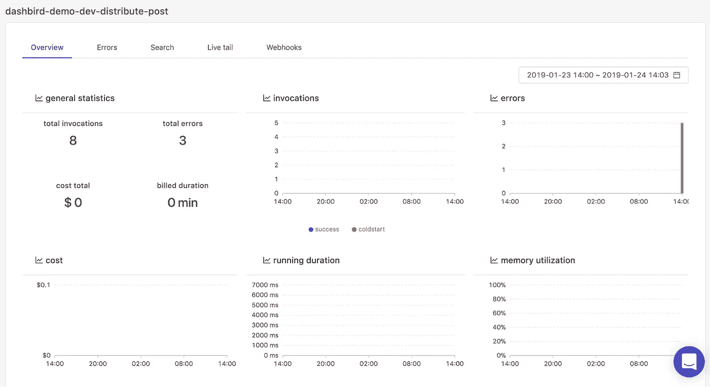

很快，我可以看到 6 秒后有 3 个调用超时了。更何况原来的 Kinesis 事件重试了 3 次，终于在第三次重试时成功了。

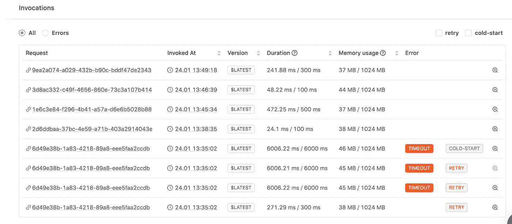

如果我单击某个调用旁边的“+”按钮，就可以深入到调用本身。在这里，我可以在一个屏幕上看到这个调用的日志和 X 射线跟踪。这很棒，因为它让我不必经常在不同的 AWS 控制台之间切换。

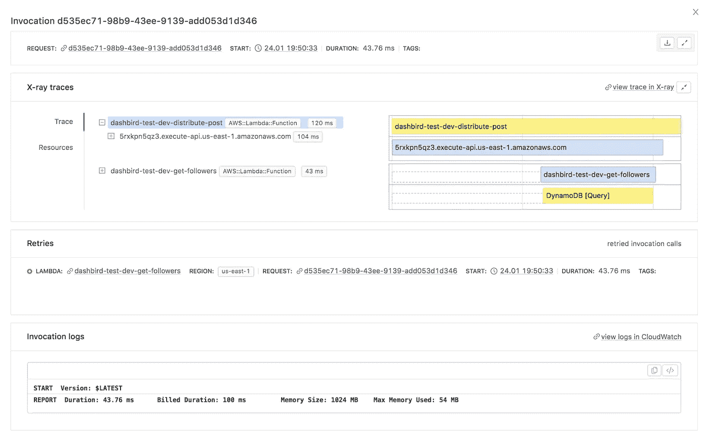

# 使用 Dashbird 调试

如前所述，演示应用程序是硬连线到错误和超时。果然，当这些故障案例发生时，Dashbird 的内置警报功能启动了，我立即收到了通知我出现问题的电子邮件。

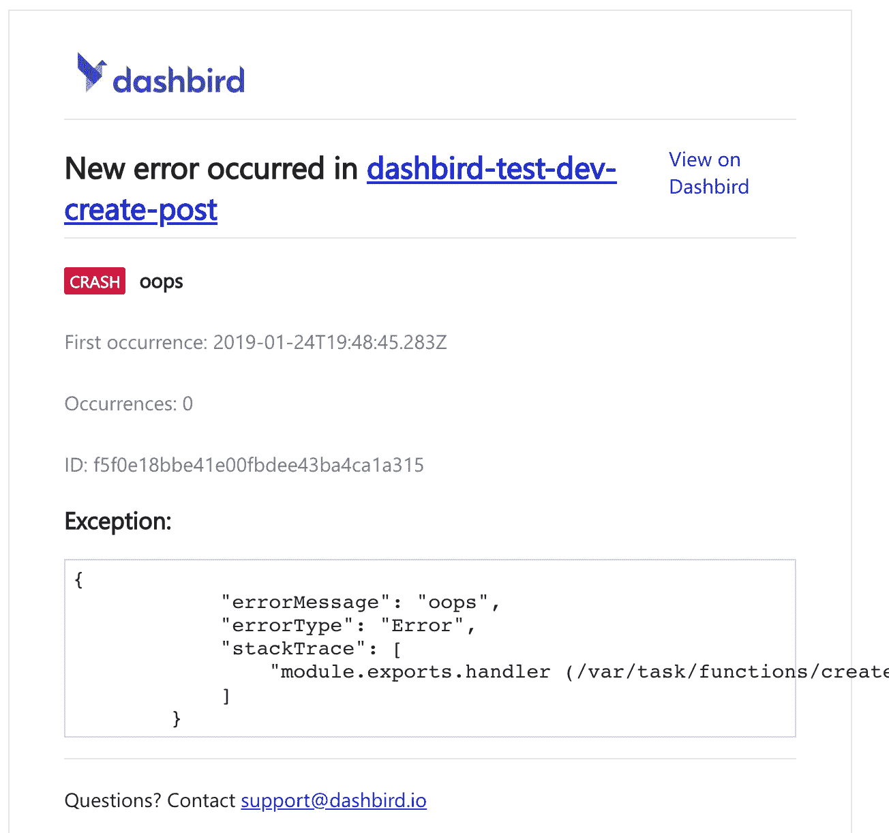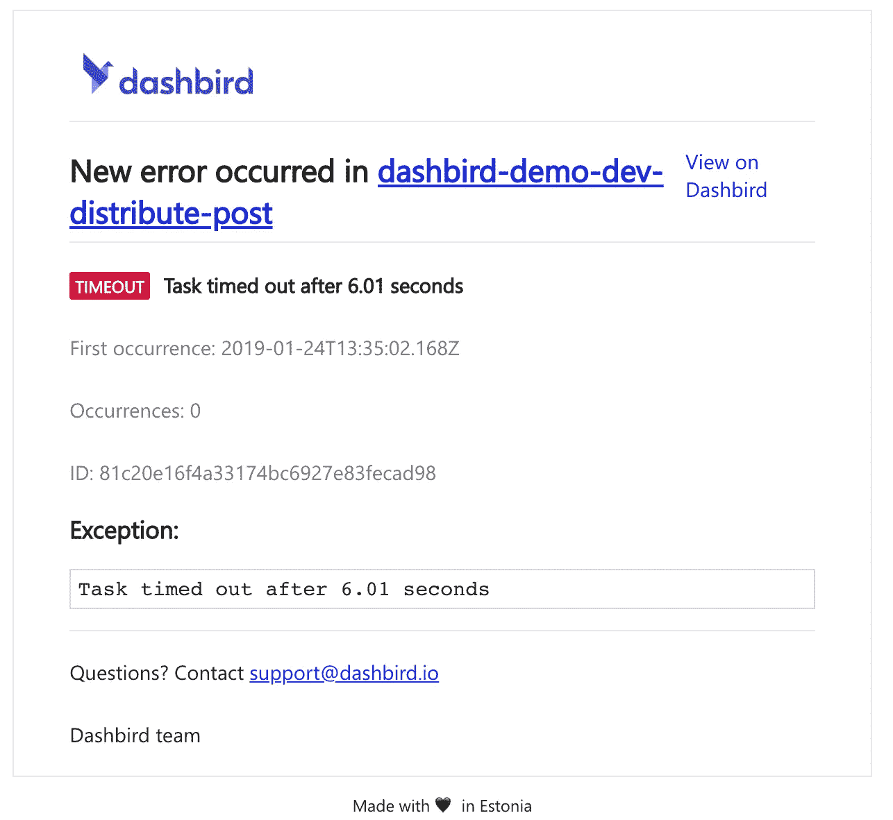

虽然这个内置的警报很棒，但我看不到任何调整警报灵敏度的设置。

我按照电子邮件中的链接，找到了函数，然后是失败的调用。Dashbird 将相关的调用(初始超时和后续重试)整齐地分组在一起。我可以很快看到失败的 Kinesis 事件在第 3 次重试时被成功处理。

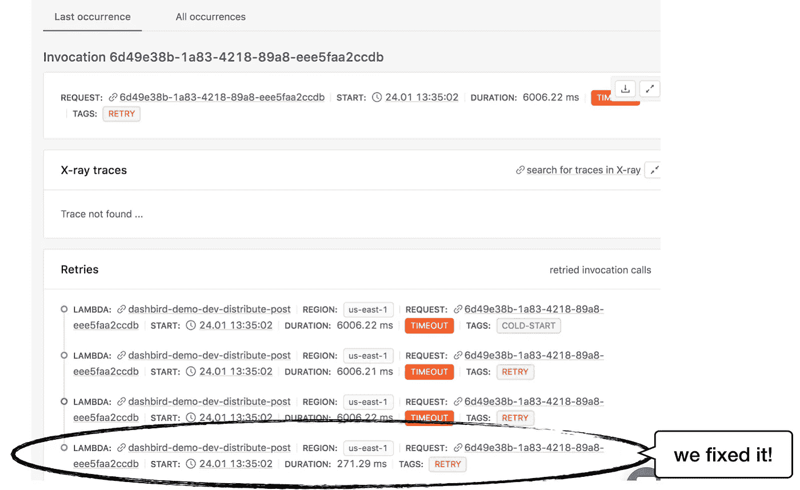

Dashbird 还在错误控制台中跟踪未解决的问题。现在我知道问题已经自行解决，我可以继续解决错误。

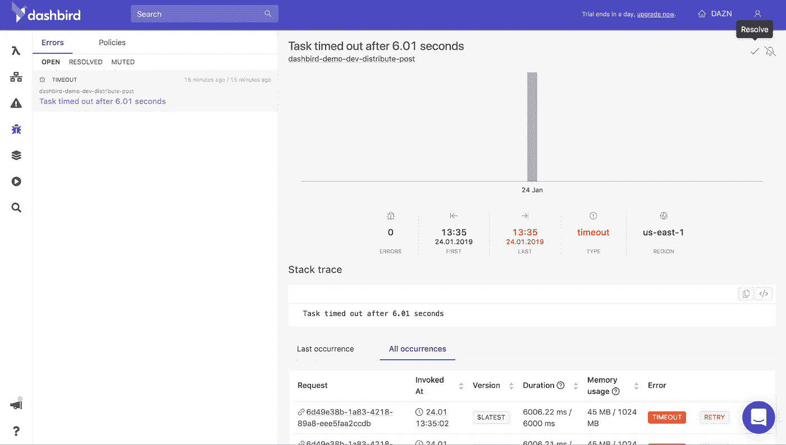

# 拖尾函数日志

Dashbird 的另一个很好的特性是它能够同时跟踪多个函数的日志。对于演示应用程序，当我卷曲*POST POST/create*端点时，我希望看到 *create-post* 和 *distribute-post* 函数的日志。

这样，我可以看到事件被成功发布到 Kinesis 流中，并随后被 *distribute-post* 函数接收。

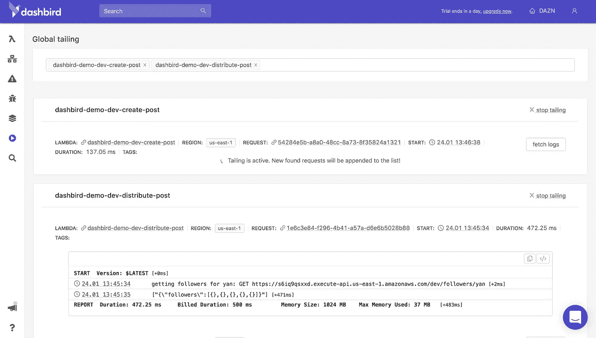

# 结论

总的来说，Dashbird 提供的东西给我留下了深刻的印象，很明显，在这个产品上花了很多心思。它有许多不错的地方，使调试变得更加容易。例如，将重试分组在一起，并将 X 射线跟踪和日志集成在一个屏幕中。这些可能看起来微不足道，但在处理一个现实问题的高压场景下，它们可以产生很大的影响。

就我所见，我认为 Dashbird 是一个非常棒的工具。我缺少的主要东西是端到端跟踪执行的能力。就我个人而言，我真的希望看到从创建 post 的 API 调用开始的整个执行过程，一直到对***followers***DynamoDB 表执行查询的 ***get-followers*** 函数。

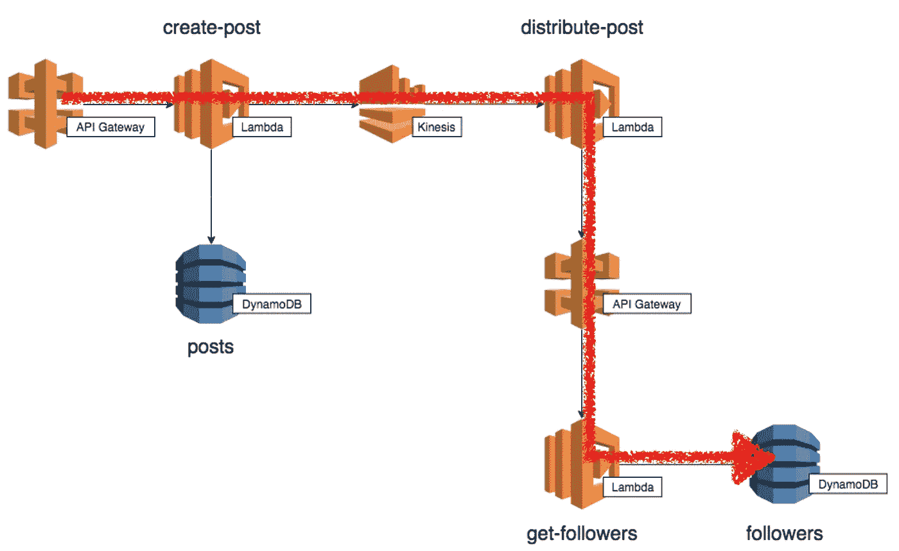

如果你仅仅依赖内置的 AWS 工具(CloudWatch、CloudWatch Logs 和 X-Ray ),那么你应该试试 Dashbird。为什么不注册免费试用，并将演示应用程序部署到您的环境中，以便您可以了解 Dashbird 如何帮助您调试无服务器应用程序？

*原载于 2019 年 1 月 25 日*[*dash bird . io*](https://dashbird.io/blog/debugging-serverless-apps-with-dashbird/)*。*