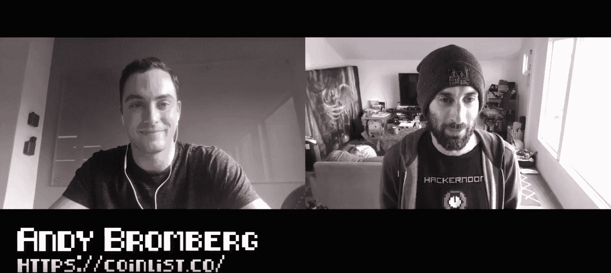

# 分散治理和令牌化资产的未来

> 原文：<https://medium.com/hackernoon/decentralized-governance-and-the-future-of-tokenized-assets-with-andy-bromberg-30095dcc44de>

# 黑客正午播客第 44 集:采访安迪·布罗姆伯格， [CoinList](https://coinlist.co/) 的创始人兼首席执行官。

没有[数字海洋的支持，黑客正午播客是不可能的。](https://do.co/hackernoon)

## 在 [iTunes](https://itunes.apple.com/us/podcast/product-iteration-with-hacker-noon-interim-cto-dane-lyons/id1436233955?i=1000421970409&mt=2) 上听采访，或者[谷歌播客](https://play.google.com/music/m/Dfuna5a4pzsmjr76bxabkxdrhim?t=Product_Iteration_with_Hacker_Noon_Interim_CTO_Dane_Lyons-Hacker_Noon_Podcast)，或者在 [YouTube](https://www.youtube.com/channel/UChu5YILgrOYOfkfRlTB-D-g) 上看。

在这一集里，特伦特·拉平斯基采访了安迪·布罗姆伯格，他是 [CoinList](https://coinlist.co/) 的首席执行官和创始人。你会发现区块链工业的最新发展，ICO 的未来和市场在哪里。

> “这有点像在 90 年代初，我们试图找出互联网的最佳消费产品。你知道，我们可能有一些想法，但让我们首先确定一些基础设施，这样我们就可以实际构建这些消费者项目，并看到它们在那里推出并取得成功…我听到许多人说，“为什么消费者还没有采用呢？简单的答案是管道不存在，基础设施不存在。你知道，事后来看，我们在 1992 年还没有一亿人在互联网上玩游戏，我们必须先花一些时间来构建东西。"
> 
> “我短期看空令牌化资产，即空间的子集“安全令牌”。长期来看，我非常乐观。我认为越来越多的资产将在区块链上以数字形式呈现，但短期内我看不到这一点。我认为在我们到达那里之前会有一会儿。许多基础设施需要扩建；投资者的需求需要增加。”
> 
> “目前加密的很多价值都在投机和金融工具上，所以分散的金融起初很有意义，但随后转向其他一些东西，如分散的治理，随着越来越多的人参与进来，这似乎是自然而然的下一步。”
> 
> ***——****安迪·布罗姆伯格*

 [## 分散治理是令牌化资产的未来吗？安迪·布朗伯格

### 分散治理是令牌化资产的未来吗？黑客正午播客第 44 集:一个…

www.podbean.com](https://www.podbean.com/media/share/pb-fbfut-b17645) 

德里克·伯纳德制作和音乐—[haberdasherband.com/production](http://haberdasherband.com/production?fbclid=IwAR2d8t0cNGHRm1ajmUNWKZ-TMUMawREhvIHSy54LKcOElf7v_TOvkAjZ78Y)

主持人:特伦特·拉平斯基—【https://trentlapinski.com 

【https://hackernoon.com/ 

[https://community.hackernoon.com/](https://community.hackernoon.com/)

[https://contribute.hackernoon.com/](https://contribute.hackernoon.com/)

[https://sponsor.hackernoon.com/](https://sponsor.hackernoon.com/)

[https://podcast.hackernoon.com/](https://podcast.hackernoon.com/)

[https://twitter.com/hackernoon/](https://twitter.com/hackernoon/)

[https://facebook.com/hackernoon/](https://facebook.com/hackernoon/)

## 还可以查看[五月头条](https://hackernoon.com/archive/2019/05)、[最新报道](https://hackernoon.com/latest-tech-stories/home)和[今日首页](http://hackernoon.com/)。