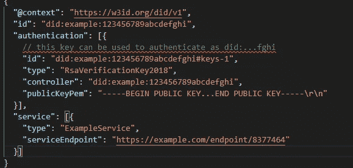
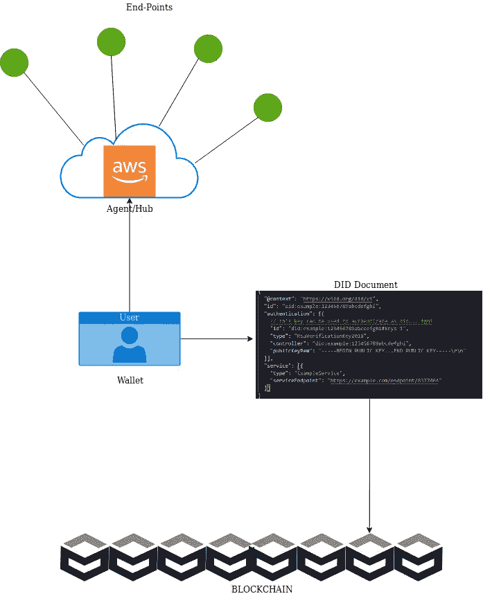
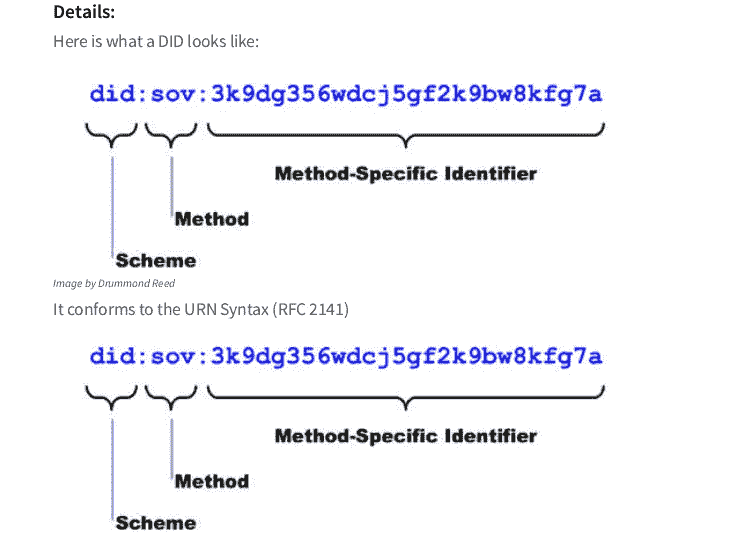

# 分散标识符—深入解释

> 原文：<https://medium.com/hackernoon/decentralized-identifiers-in-depth-explanation-af0f979b7bb6>

**什么是 DID？**

*DID 被称为分散标识符*

**它是如何使用的？**

用户可以通过在区块链上注册来创建自己的 DID。它就像你的社会安全号码(SSN)。用户可以使用这些 did 来识别自己。

**DID 组件**

> 唯一标识符+ DID 文档

**DID 文件**

它包含与用户相关的信息。它不包括任何个人信息，如用户名，SSN 号码等。

它包括:

**时间戳**:创建的时间。

**其有效性的密码证明**。

**加密公钥**，如果有人想为他的 did 添加代理或控制器，可以添加多个公钥。

**服务端点:**它可以包含多个元素

每个元素包含:

# URL:特定服务的 URL，例如:-驾驶执照颁发机构

#服务类型:比如 DL 发行机构

#DID:我们可以根据 URL 使用此 DID 来识别它是否确实是由驾驶执照颁发机构颁发的

**注意:**我们可以在服务部分添加多个服务端点

# 确实流动了

**发布者:**发布可验证的凭证(示例护照管理机构)

**持有者**:持有可验证的凭证(示例用户)

**检查员-验证员**:请求索赔(例如机场海关)

>海关部门将检查持证人实际年龄是否为 34 岁

>发行人发布声明称，是的，此人年龄为 34 岁

# 什么是可验证的声明？

**检验员**如何检验索赔**？**

这将在发行人的帮助下完成

**可核实的索赔分为 3 部分**

**主体**:持有者(用户)

**发行人** : DID 发行人(护照管理局)

任何证明一个人的公民身份或证明一个人的姓和名的声明。

所以一个可验证的声明是指某个发行者对某个主题做出声明。“可验证”的部分是它是可信的和防篡改的，因为它已经由发行者加密签名。

— — — — — — — END — — — —

联系人:sethi.shivam27@gmail.com