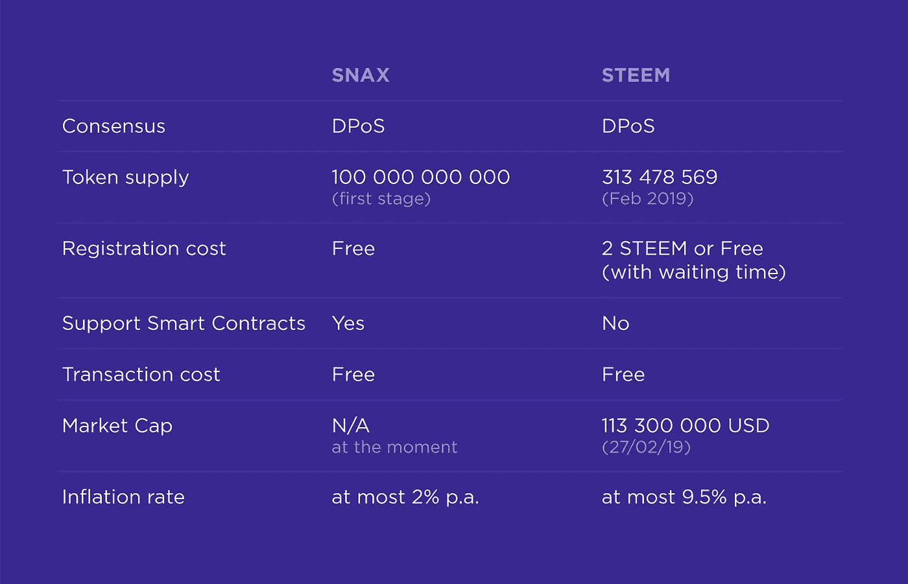

# 分散社交媒体奖励:Steem 和 Snax 的比较

> 原文：<https://medium.com/hackernoon/decentralizing-social-media-rewards-steem-and-snax-comparison-ac17201824cc>

# 奖励有社会影响力的人

如果很多人喜欢你的内容并听你的，你应该能够将这一成就货币化。然而，当跨平台的创作者试图将他们的成功货币化时，他们面临着多重问题。

这些问题是:

*   你必须依靠广告收入或捐赠。
*   提供广告分享的平台从广告收入中抽取很大一部分，Youtube 和 Twitch 从你的内容产生的任何收入中抽取一半。
*   平台对参与其合作项目的人员进行严格控制，导致审查和偏袒。
*   如果你发现一个新的平台有更好的盈利能力，你必须把你的追随者转移到那里，或者从这个平台社区中培养新的受众。

加密货币可以解决这些问题。在这篇文章中，我们将看看两个区块链网络 Steem 和 Snax 如何试图解决这些问题。

# 范例

Steem 是一个总部位于区块链的博客平台，为出版商提供内容盈利和社区发展。你可以通过在 Steem 区块链上发布、评论和管理内容来获得奖励。有一个 STEEM 币，是平台内部的加密货币。

Snax 是一个区块链平台，允许人们根据他们获得的社交关注(推文、Instagram 帖子等)获得奖励，并在不离开他们最喜欢的社交平台的情况下进行即时、免费的小额支付。SNAX 令牌是为了在现有的公共平台上获得社会关注而发布的。

尽管 Steem 和 Snax 有相似的区块链结构，但他们实现技术以创造分散的社会回报的方式却截然不同。简而言之，Steem 选择创建自己的社交基础设施来使用其区块链，而 Snax 则是现有流行社交媒体的过渡。

# 分散奖励

过去十年，社交网络上的营销一直在稳步增长，仅在 Instagram 上就达到了 60 多亿美元，但大部分收入都留在了该平台的手中。

Steemit 和 Snax 都直接向内容创作者提供出版商奖励，独立于任何广告商和审查机构。

获得 Snax 代币很简单——你继续在你曾经使用的同一个平台上制作内容，Snax 将无条件地奖励你获得的社交关注。你要做的就是加入 Snax。

Snax 根据你在 Twitter、Instagram 甚至 Steem 等社交网络中的关注率(AR from here)来奖励你。AR 是 Snax 开发的一个指标，用于衡量内容在社交网络中的相对重要性。每个社交网络都不一样，但总的来说，它的工作方式与谷歌索引页面的方式类似，以确保你能在搜索结果中看到它们。

Snax 会考虑一些因素，比如投票支持你的 Steemit 帖子或转发你的推文的人有多受欢迎，在一段固定时间内你获得了多少赞或转发(每个平台不同)，平台上有多少人，以及粉丝对你的推文的支持程度。要了解 Snax 如何评估关注率，您可以阅读 Snax 白皮书[这里](https://snax.one/whitepaper.pdf)。

Snax 反对审查制度，我们相信你有能力选择使用哪个平台来表达你的观点。这就是为什么我们将支持多个社交网络，包括 Twitter 和 Steemit。

Steemit 有自己的社交网络，名为 Steemit，有一个复杂的奖励系统，通常用这个图[来描述。](https://steemit.com/steemit/@jga/steem-author-and-curator-rewards-infographic)

弄清楚它是如何工作的并不是一件简单的任务，但是基本的过程是，如果你发表了一篇文章，人们投票支持它，你将会得到一份奖励，这份奖励由你，一个出版商，和那些投票支持你的文章的人，即策展人分享。投票支持你的用户拥有的 STEEM 权力越多(可以转换为 STEEM)，你将获得越多的 Steem 令牌。

您可以将 STEEM 转换为 Steem Power(后来的 SP ),以提高您的投票能力，并提高您的文章成为热门文章的几率，一段时间后，您将获得令牌红利。

# 我的观众怎么办？

无论你写的是关于区块链、初创企业还是你有一个美食博客，你都想确保在你选择的平台上拥有一批观众。当你转到一个盈利能力更强的平台时，你必须要么带着你的追随者，要么在这个网络上发展新的粉丝群。

有了 Snax，您不必担心这个问题。Snax 区块链无缝集成到现有的社交媒体网络中——您的关注者以及您所在的社交网络的整个社区不需要注册 Snax，您将因他们的支持而获得回报。如果他们决定加入，他们将获得一些免费代币，花在他们最喜欢的创作者身上，也将有机会为他们自己的社交活动赢得 SNAX。

无论 SNAX 未来将把什么样的社交媒体整合到区块链，这一原则将永远不变——你将一如既往地继续使用你最喜欢的平台，并根据你在那里受到的关注程度获得相应的 Snax 代币。

Steemit 选择创建自己的平台，直接用 STEEM 令牌奖励您在他们平台上的内容。在 2018 年初加密货币价格繁荣期间，它取得了相对成功，但使用其平台的内容创作者数量稳步下降，到 2019 年初，活跃出版商从 4 万下降到 1 万，活跃策展人从 6 万下降到 4 万。

# 公平透明的奖励

你希望你的优质帖子得到公平的评价，这就是为什么平衡的奖励结构很重要。

当 Steem 推出时，其令牌分配的处理方式导致了巨大的投票权不平等，十几个帐户拥有平台上的大部分投票权。这是不可避免的，因为创建一个新的、最初空无一物的、具有货币化行为的社交平台，比内容创作更容易刺激这种货币化的滥用。最初的通货膨胀率是每年 100 %, 90%的新代币回到最初的代币所有者手中，只有 10%作为奖励给出版商和策展人。

为了相对成功地解决这个问题，Steem 在那之后经历了许多艰难的分叉。其目前的代币分配将 75%的代币给予内容创作者和策展人，15%给予见证人，10%作为利息[支付给 SP 持有者](https://steemdb.com/)，权力分配正在慢慢变好，但大部分权力仍然掌握在[的 37 个账户](https://steemit.com/statistics/@arcange/steem-statistics-20190225-en)(也称为 whales)手中，其中大多数在 Steem 网络之外并不为人所知，只在其平台内部有影响力。

在 Steemit 活动的高峰期，获得最多奖励的主题是相当多样的，并且对于更传统的博客来说是相当典型的，然而，奖励通常只取决于是否有鲸鱼投票支持你。

Snax 网络只对社交关联度高的账号给予奖励。你可以拥有数百万不与你的内容互动的追随者，你几乎不会收到 SNAX，你可以拥有一个拥有几千个积极转发和喜欢你的推文的追随者的账户，你将收到一笔可观的奖励。

这个系统并没有阻止 Snax 的不平等，因为社交网络名人将获得比其他人更多的奖励，但它确保了所有这些人都是他们使用的社交网络所重视的人。例如，如果你是 Twitter 上的名人(如埃隆·马斯克)，你将获得大量奖励，因为大多数人知道你是谁，而且很多人关注你的推文。举例来说，如果你是 Youtube 上的一个新博主，你的观众增长很快，那么你也可以期待一大笔回报，尽管你不是一个著名的超级明星。只有对你的内容的关注才是最重要的，而不是你有多少钱或 SNAX 代币。

# 结论

Snax 正在从 Steem 的错误中吸取教训，并推出了一个平台，该平台利用了大型集中式平台和区块链技术的最佳方面。Snax 通过一种新型加密货币来增强使用您最喜爱的社交平台的体验，以奖励您在该社交网络上获得的关注。

最终，Snax 和像 Steem 这样从零开始创建的其他区块链社交媒体之间的区别在于，他们试图将人们带入 crypto，而 Snax 正在将 crypto 带给人们。

如果你有关于 Snax emission 如何工作，如何获得出版商奖励，或者如何成为 Snax network 的一名制作人的问题，请随时加入我们在[https://discord.gg/qygxJAZ.](https://discord.gg/qygxJAZ.)的讨论，不要忘记在 [Twitter](https://twitter.com/SnaxTeam) 上关注我们，并为这篇文章鼓掌！

此外，你可以在这里找到常见问题的答案【https://snax.one/faq. 