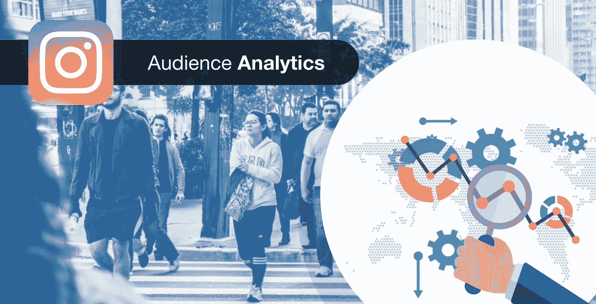

# 决定要为个人资料、帖子和故事跟踪的 Instagram 分析数据

> 原文：<https://medium.com/hackernoon/deciding-on-instagram-analytics-data-to-be-tracked-for-profiles-posts-and-stories-b9e0dadd26d9>

Instagram 拥有超过 10 亿的用户，是所有社交媒体平台中参与率最高的，是大大小小品牌的快乐狩猎场。根据 hootsuite.com 分享的研究，80%的用户在 Instagram 上关注至少一项业务。尽管这对于身为企业主的你来说非常令人兴奋，但如果你不知道谁访问了你的个人资料或看到了你的广告，也不知道你的帖子实际上表现如何，你很容易就浪费了你的时间和精力。讨论了一些顶级分析:

# 档案分析

您可以通过 Instagram 账户的“我的个人资料”页面访问许多指标，如浏览量、覆盖范围和网站流量。印象数本质上是你的 Instagram 帖子在特定时间段内可能被用户曝光的次数。到达是指已经看到你的帖子的唯一用户的数量，而交互是指在你的帐户上发生的操作的总数，以及个人资料的访问量。您还可以了解访客点击您的网站链接访问您的网站的次数，以及用户提到您的帐户句柄的次数。

# 受众分析

尽管从人口统计学的角度来看，你可能知道谁是你的理想客户，但你需要弄清楚在 Instagram 上看到你并与你互动的用户是否真的是你想要的目标人群。通过 Instagram audience analytics，你可以找到许多有用的细节，比如你的粉丝居住的前五个城市和国家，你的粉丝的年龄——为了方便起见，他们被分为七个年龄组以及他们的性别。你还可以确定一周中你的粉丝最活跃的日子，以及他们在 Instagram 上平均花费的时间。

# 个人帖子分析

在调整了你的内容和广告以吸引合适的追随者后，你还需要了解单个帖子的表现，这样你就可以确定你发布的内容是否能引起你的追随者的共鸣。

你应该跟踪的主要指标包括互动次数，即直接在 Instagram 帖子上采取的不同行动，如访问个人资料、Instagram 真实赞、点击 URL 或 CTA 按钮。

您还可以找出通过 discovery 联系到您的非您当前关注者的帐户数量。涉及的其他重要指标包括关注次数(指的是关注特定帖子的用户数量)、影响范围(指的是阅读过您帖子的独立用户数量)以及印象次数(指的是您的帖子被查看的总次数)。分析还揭示了你的帖子被你的追随者保存到他们的个人保存文件夹的次数，以及你的帖子产生的评论数。

# Instagram 故事分析

受 Snapchat 启发的 Instagram Stories 自推出以来取得了巨大成功，随着越来越多的品牌涌入，抓住一个以非正式和有趣的方式向粉丝发表演讲的绝佳机会，故事越来越多。利用故事，品牌可以接触到更多的受众，或者更大程度地增加他们在受众中的曝光率。

您可以通过分析跟踪的一些重要统计数据是印象数和到达数以及退出数，退出数是指没有完成查看就放弃故事的人数以及您的故事生成的回复总数。使用 People Insights，您甚至可以找出哪些用户查看了您故事的特定部分。

# 决定要跟踪的数据

通过分析获得的大量数据可能会让人不知所措，而且可能根本不可能跟踪所有数据。在你深入研究之前，你需要回顾一下你建立 Instagram 个人资料的原因，因为这样你就可以对你可以追踪的相关指标有一个更清晰的想法。

**建立品牌认知度:**最重要的指标是关注者数量、印象和影响范围。关注者数量的增加表明品牌认知度的增长，这表明你的个人资料在 Instagram 上引起了很好的共鸣。有机会看到你的帖子的人数(通过印象数反映)对于提升品牌知名度至关重要。就品牌认知度的增长而言，也许最重要的指标已经达到，那就是查看你的帖子的独立账户的实际数量。

**产生潜在客户/转化:**需要考虑的首要指标是网站点击量、电话/电子邮件点击量和最大参与时间。追踪有多少 Instagram 用户点击了网站链接，可以看出你的帖子有多吸引人。如果电话和电子邮件的数量增加，这是一个成功转换的迹象。通过计算出你的追随者什么时候更投入，你可以安排你的内容发布和广告。

**建立社区:**如果 Instagram 的主要目的是建立社区，那么你应该更加关注评论、故事回复和参与度。由帖子上的评论引发的对话是与粉丝互动的绝佳机会，对你发布的 Instagram 故事的回复也是如此。你在 Instagram 上的所有活动(包括广告)的参与度是你的粉丝兴趣水平的一个重要指标。

# 结论

当你能够弄清楚你是否能够以正确的方式对待你的目标受众，从而实现最佳的品牌认知建设、转化和社区建设时，Instagram 上的营销活动可以变得更有成效。使用 Instagram analytics 是了解你的账户表现的最有效方式，这样你就可以调整它以获得更好的结果。

*原载于 2019 年 5 月 1 日*[*【https://www.appypie.com】*](https://www.appypie.com/instagram-analytics)*。*