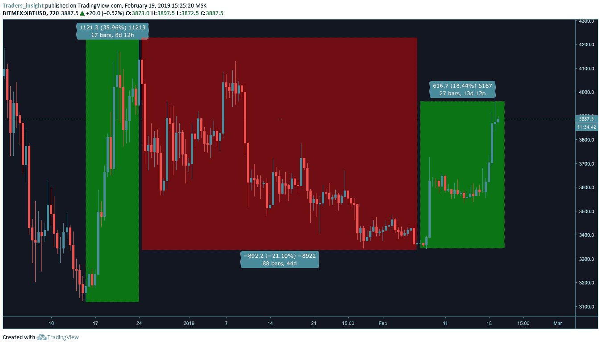
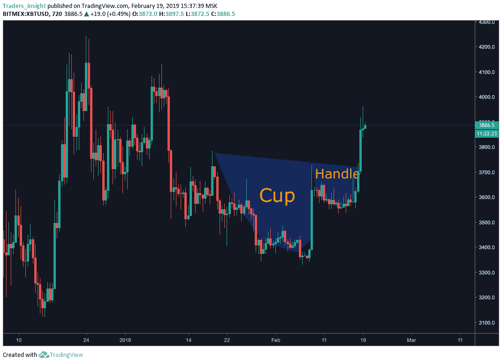
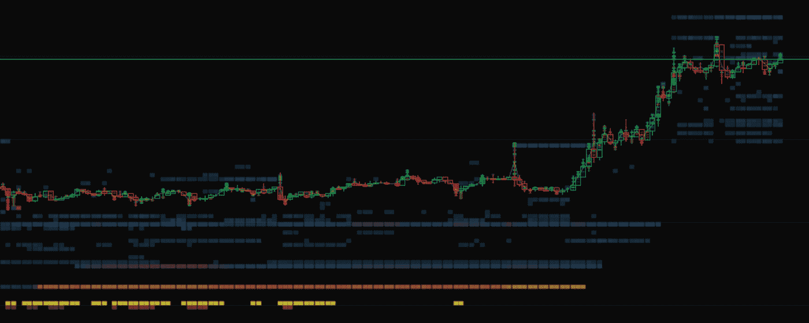
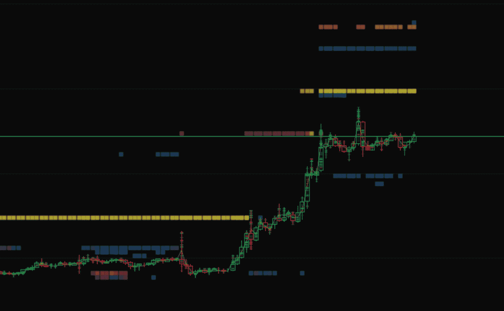
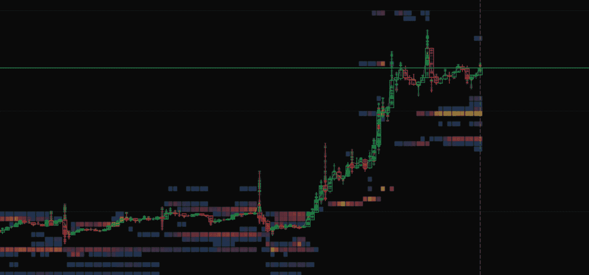
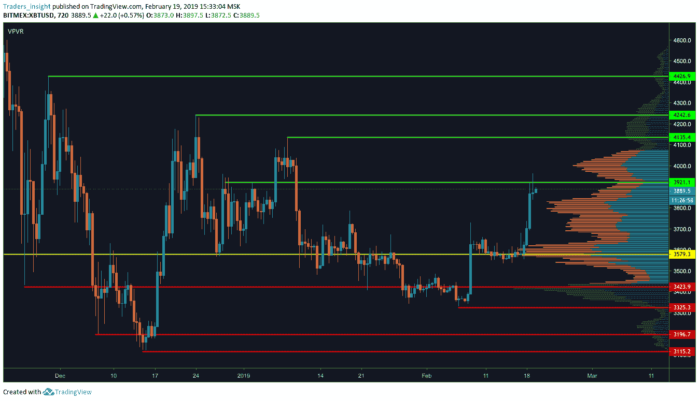

# 减压:比特币近期走势的崩溃

> 原文：<https://medium.com/hackernoon/decompression-a-break-down-of-the-recent-bitcoin-move-a2f027cf01c2>

底部在里面？

比特币和 altcoin 加密市场在触及 3330 点后上涨了 18.59%，促使一些人宣布底部已经到来。虽然这是否是真理还有待观察，但在助跑和随后的移动中发生了一些有趣的动态。

这是自 1 月 17 日至 25 日的上一次上涨以来的最后一次上涨。最近的举措是一个经典的杯子和把手，价格创造了一个“U”形，随后价格上涨。在这种情况下，比特币缓慢下降到 3330，然后迅速进入更高的流动性区域。卖方对价格施加下行压力，需求仍在增加，形成一个较小的 u 形盘整形态。

这种价格行为通常被认为是看涨的延续形态。理论上，需求已经转移到更高的水平。让我们看看现在的流动性在哪里。

Bitfinex

币安

比特梅克斯

清晰的流动性口袋位于 4000 点，这与预计的支撑位紧密吻合。但是还没有人承诺要涨到更高。4000 点的上涨带来了一些新的需求，但上面什么也没有。这限制了向上移动的力度。

如果价格确实突破更高，极限是什么？嗯，上面的图表显示了自今年年初以来比特币的前期支撑位和阻力位。一月底的中间高点现在是当前的阻力。下一个水平将在 4100 点，这是 1 SD 值区域的外部限制，也是 2 月 10 日以来的前高。

如果我们突破 4000 点，我们的问题将是“谁在卖？”我觉得没有好的答案。

— — — — —

您想了解更多关于加密交易的信息吗？с查看我们的教育平台[*Adara Academ*](https://academy.adara.io/)*y .我们*每天覆盖图表模式和交易设置。

*与我们的专家进行免费的一对一交易！立即申请成为首批 50 名被接受的申请者之一—* [*申请加入！*](http://adara.academy/)

*   *在电报上与我们交谈—* [*阿达拉电报*](https://t.me/adara_io)
*   *在推特上聊天—* [*阿达拉推特*](https://twitter.com/adara_io)

—
*重要提示:
内容仅供参考，您不应将任何此类信息或其他材料理解为法律、税务、投资、财务或其他建议。我们网站上的任何内容都不构成 Adara 或任何第三方服务提供商在该司法管辖区或任何其他司法管辖区购买或出售任何证券或其他金融工具的邀约、推荐、认可或要约，根据该司法管辖区的证券法，此类邀约或要约是非法的。*

*本网站上的所有内容都是一般性质的信息，不涉及任何特定个人或实体的情况。本网站中的任何内容都不构成专业和/或金融建议，本网站中的任何信息也不构成所讨论事项或相关法律的全面或完整陈述。Adara 不是任何人使用或访问网站或内容的受托人。在根据此类信息或其他内容做出任何决定之前，您独自承担评估与使用本网站上的任何信息或其他内容相关的优点和风险的责任。作为使用本网站的交换条件，您同意不要求 Adara、其附属公司或任何第三方服务提供商对您根据本网站提供的信息或其他内容做出的任何决定所导致的任何可能的损害索赔承担责任。*