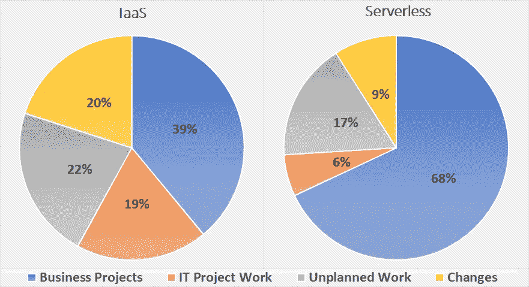

# 解构无服务器计算第 2 部分:好、坏和上市时间

> 原文：<https://medium.com/hackernoon/deconstructing-serverless-computing-part-2-the-good-the-bad-and-the-time-to-market-91a2b52ceaf4>

***“计算机科学中的所有问题都可以通过另一个层次的间接方式来解决。”—大卫·惠勒***

在[的上一篇文章](https://hackernoon.com/deconstructing-serverless-computing-part-1-a-new-layer-of-abstraction-98c15334e4f7)中，我们介绍了*无服务器计算、*云计算的自然发展，填补了 IaaS、PaaS 和 SaaS 等成熟概念留下的空白。我们看到，它带来了完全托管的基础架构、真正的按需付费计费、细粒度的自动扩展等等。在本文中，我想解决一些更实际的问题:

***公司和机构如何利用无服务器技术来创造更多价值？***

无服务器有很多好处，但正如我们在 IT 行业经常看到的，没有灵丹妙药。因此，我们必须考虑可以利用无服务器带来巨大好处的用例，以及无服务器弊大于利的用例。

# 无服务器的亮点

无服务器带来了一套独特的功能，让您在以前被迫用砍刀砍出一条路的情况下，拥有手术刀般的精确度。一方面，它的事件驱动方法将很好地为您服务，无论您何时有周期性的作业要运行，或者想要以异步方式与其他服务集成(例如，使用 webhooks 或消息队列)。另一方面，它的细粒度、接近即时的可伸缩性非常适合高度并行化和/或具有高流量可变性的应用程序。再加上完全托管的基础架构和精细的成本模型，您将获得一个非常有吸引力的包，适合各种情况。在本节中，我们将探索非常适合无服务器的用例。

# **取代网络服务器**

使用无服务器组件实现 web 后端和 API 提供了明显的好处。在 API 网关后面使用像 AWS Lambda 这样的 FaaS 平台，在前端代码中使用像 S3 这样的对象存储，这就是你所需要做的。您可以实现无缝的自动扩展，开箱即可适应您的流量模式，基础架构管理不再是一个问题。更好的是，您不必再为低活动期间过度调配的虚拟机付费，也不必再在预计流量激增时让团队随时待命。无服务器通过促进即插即用体系结构，使构建功能丰富的 web 应用程序变得容易。您最终必须重复实现的功能，如身份验证和信用卡支付，可以委托给高度可靠的第三方服务，如 Auth0 和 Stripe。这使得您的代码库保持紧凑，并且主要关注业务逻辑。

媒体公司 business T1 运营着一个月读者超过 5000 万的平台。他们的网站利用了 Lambda、API Gateway 和其他服务的组合。使用 AWS Lambda 和 Kinesis 流实时处理大量指标数据。通过使用无服务器技术，他们已经设法将[的成本削减了近一半。](https://read.acloud.guru/serverless-is-eating-the-stack-and-people-are-freaking-out-and-they-should-be-431a9e0db482)

可口可乐正在将其基础设施过渡到云，并成功采用无服务器实现了 [65%的成本节约](https://www.youtube.com/watch?time_continue=913&v=yErmil00DYs)。他们调整了连接所有自动售货机的通信系统，以使用 Lambda 和 API 网关。服务团队使用该通信系统在库存不足或出现缺陷时获得通知。营销团队也用它来部署活动，并在用户购买饮料时处理付款。可口可乐没有运行大部分处于闲置状态的虚拟机，也没有运行提供服务所需的所有基本基础设施，如负载平衡和安全性，而是采用了事件驱动的无服务器架构，仅在必要时运行。从他们的经验中得到的一个重要启示是，当系统接近报废时，无服务器可以帮助他们适度地缩减规模。最后，成本节约可高达 99%

这样的例子不胜枚举，像流行的代码共享平台 [Codepen](https://codepen.io/) 这样的公司，一个 DevOps 工程师每小时服务 20 万个请求，而 [MindMup](https://www.mindmup.com/) 每月服务 40 万个用户，每月支付 100 美元的 AWS 账单。关于这些案例研究和一般无服务器的更多细节可以在这本[的优秀书籍](https://www.manning.com/books/serverless-applications-with-node-js)中找到。

# ***流和批处理***

大数据和无服务器是天生的一对。无服务器提供了巨大的可伸缩性，它的事件驱动焦点非常适合批处理和实时处理。无论是否需要，全天候管理大型、昂贵的 Hadoop 或 Spark 集群的日子已经一去不复返了。使用 FaaS 作为计算，以及其他无服务器服务，如 [AWS Kinesis](https://aws.amazon.com/kinesis/?sc_channel=PS&sc_campaign=acquisition_NL&sc_publisher=google&sc_medium=kinesis_b&sc_content=kinesis_e&sc_detail=aws%20kinesis&sc_category=kinesis&sc_segment=161196399832&sc_matchtype=e&sc_country=NL&s_kwcid=AL!4422!3!161196399832!e!!g!!aws%20kinesis&ef_id=WxHZzgAAA08GgBKk:20180721085911:s) 或 [Google Cloud Pub/Sub](https://cloud.google.com/pubsub/docs/overview) ，可以建立一个成熟的数据处理管道。

FaaS 非常适合调度报告生成和自动备份等批处理作业。可以将功能配置为基于特定计划运行，并启动新作业。或者，可以将无服务器系统配置为在存储层添加新数据时做出响应，从而实现实时数据分析和转换。

复杂的数据处理工作流可以通过组合函数轻松实现。有多种解决方案可用，如[裂变工作流](https://github.com/fission/fission-workflows)、 [IBM Composer](https://github.com/ibm-functions/composer) 和 [AWS 步骤函数](https://aws.amazon.com/step-functions/)。可以利用像 [AWS Glue](https://aws.amazon.com/glue/) 这样的完全托管的服务来定义事件驱动的 ETL 管道、分析日志数据，并对数据湖执行查询。无服务器流和批处理的其他选项是服务，如[谷歌云数据流](https://cloud.google.com/dataflow/)和 [Azure 数据工厂](https://azure.microsoft.com/en-us/services/data-factory/)。

[Jammp](https://jampp.com/) 是一个营销平台，使用数据分析和机器学习来提供用户获取和重新定位服务。该公司与 Twitter 和 Yelp 等客户合作，每天处理 75tb 的数据，随着他们的服务越来越受欢迎，该公司不得不应对指数级增长。他们最初的解决方案使用 EC2 实例和 Kafka，[在处理来自新收购客户的数百万额外事件的压力下很快崩溃了](https://aws.amazon.com/solutions/case-studies/jampp/)。他们结合使用了 FaaS、无服务器流处理系统和无服务器数据库，这使他们能够将在旧平台上处理的事件数量扩展到原来的 250 倍。

[Thomson Reuters](https://www.thomsonreuters.com/en.html) 利用无服务器构建了一个[数据分析渠道，目的是改善用户对其产品的体验](https://aws.amazon.com/solutions/case-studies/thomson-reuters/)。数据从 Kinesis 加载，并使用 Lambda 进行处理，最终存储在 S3。与此同时，一个实时管道将相同的数据传递给 Elasticsearch 集群。Thomson Reuters 选择无服务器有几个主要原因:面对不可预测的流量(在特定时间内流量可能会增加一倍或三倍)时的弹性伸缩，需要最少管理的完全托管服务，以及快速上市(开发时间设定为 5 个月)。

# **媒体转型**

多媒体处理通常是 CPU 密集型的，意味着突发的工作负载，并且是高度并行的，这使得无服务器成为完美的匹配。这种工作负载通常不适合传统的应用服务器。由于它们的计算能力是固定的，因此在运行突发任务时，有必要过度配置或冒服务器过载的风险。也很难支持这些任务可能受益的并行级别。借助 FaaS，您可以即时执行诸如图像大小调整、缩略图生成、视频编码和许多其他转换等任务。作业可以分解成适合单个功能的任务，数千个这样的功能可以并行运行，从而大大提高速度。

网飞每天都要处理来自工作室的成千上万的视频上传，所有这些都必须在准备好进行流媒体播放之前进行处理。他们利用 Lambda 构建事件驱动的管道，而不是低效地轮询新上传的 S3(他们使用的 blob 存储)。每当有新文件上传时，就会生成事件，触发 Lambda 函数，将视频分成 5 分钟的块，然后将其传递给编码场。

更进一步，来自斯坦福和加州大学的研究人员开发了 [ExCamera](https://www.usenix.org/system/files/conference/nsdi17/nsdi17-fouladi.pdf) ，一个使用 FaaS 作为计算来执行视频编码的系统。ExCamera 可以产生数千个函数，每个函数处理整个视频的一小部分。与商业系统(如谷歌的 vpxenc 和 Youtube 的 encoder)相比，它能够实现更高水平的并行性，从而缩短编码时间。例如，对于一部 15 分钟的 4K 动画电影，ExCamera 的编码速度比使用 vpxenc 的 128 核机器快 60 倍。

SiteSpirit 是一家专门从事 CRM、后台办公室和图像管理的荷兰公司，在使用 [OpenWhisk](https://openwhisk.apache.org/) (最初由 IBM 开发的 FaaS 平台，后来捐赠给 Apache)为客户执行图像处理时，速度提高了 10 倍，成本降低了 90%。

# **物联网**

当谈到物联网应用时，传感器通常是驱动因素。这种应用表现出反应性行为，不同的执行流由超过或低于特定阈值的传感器读数触发。大多数时候，读数是稳定的，几乎不需要任何操作；然而，在交通堵塞或自然灾害等重大事件发生时，系统将会受到大量数据的冲击，这就需要近乎即时的可伸缩性。使用传统架构很难做到这一点，但这是使用无服务器架构的自然结果。此外，物联网系统通常由各种设备拼凑而成，每个设备都使用自己的协议；他们需要定制解决方案来执行数据聚合和数据转换等任务。正如本文前面所讨论的，无服务器非常适合数据处理管道。

# **边缘计算**

边缘计算是一个新兴领域，可以从利用无服务器计算中大大受益。这种新模式的核心是将计算尽可能推向终端用户，无论终端用户是真实的人还是物联网设备。这极大地减少了用户感知的延迟，对于低延迟应用程序来说是必不可少的。使用 FaaS，计算能力可以以函数的形式直接发送到数据，无需往返于托管应用程序的数据中心。商业系统的一个典型例子是 [Lamba@Edge](https://docs.aws.amazon.com/lambda/latest/dg/lambda-edge.html) 。可以在边缘直接服务请求，并且可以在本地执行处理(例如，可以在记录设备上直接执行诸如图像识别之类的机器学习任务)。有了像 [AWS Greengrass](https://aws.amazon.com/greengrass/) 这样的服务，这种本地执行能力允许一组连接的设备在与云的连接不良或网络故障的情况下保持正常运行。

# 无服务器可能不是最佳选择

使无服务器对特定用例如此有吸引力的手术刀般的精确性，在其他情况下却成了劣势。高度专业化工具的缺点是它有严格的限制；如果一个应用程序有与这些限制相冲突的需求，你最好寻求一个不同的解决方案，而不是试图把你的系统硬塞进无服务器。

# **成本模型**

无服务器有一个细粒度的成本模型，当您的工作负载随时间变化时，该模型非常有用。然而，Lambda 等 FaaS 平台每毫秒的计算成本比同等的虚拟机更高。如果您的工作负载总是让您的系统很忙，在任何时间点都有数百甚至数千个并发函数调用，那么 FaaS 很可能比运行您自己的虚拟机更昂贵。如果您的系统一直在处理高流量，您可能希望暂时坚持使用专用服务器。请记住，尽管 FaaS 持续运行的成本更高，但它也降低了维护和工资成本。

# **资源限制**

大多数 FaaS 平台将分配给单个函数的最大内存限制为几个 GB，执行时间限制为大约 5-15 分钟，临时磁盘空间的最大数量限制为几百 MB。如果你的任务不能被分割成可以由多个功能处理的部分，FaaS 就不适合你。您可能有需要处理磁盘上的大文件的任务、不适合单个函数的可用内存的任务，或者不能简单地并行化的任务。在这种情况下，虚拟机群会更合适。虽然在大多数情况下，您可以找到一个解决方法并仍然使用无服务器，但是使用错误的工具是没有意义的。如果您仍打算放弃虚拟机管理，请记住，无服务器不仅仅是 FaaS。查看适合您的使用案例的托管服务可能是个好主意。

# **低延迟应用**

函数是无状态的，因此它们依赖远程内存来加载每个任务所需的数据。每当调用一个函数时，它首先需要一个容器来运行。如果没有这样的容器可用，平台将构建一个新的容器，并用运行该函数所需的所有依赖项对其进行初始化。这个过程称为冷启动，根据功能代码、使用的编程语言和所需的依赖关系，它可能需要几百毫秒到几秒钟的时间。如果您的应用程序有极低的延迟需求，FaaS 可能不是一个很好的选择。随着网络吞吐量和可靠性的不断提高，并且找到了减轻冷启动的方法，这样的用例可能会成为规范。对于低延迟应用程序，开源平台是您的最佳选择，因为其中许多平台开始提供减轻冷启动的方法，例如容器预热。如果你仍然喜欢专注于性能和低延迟的托管 FaaS 平台，可以看看 [Nuclio](https://nuclio.io/) 。关于 FaaS 平台采用的减少冷启动的优化技术的详细讨论，我推荐阅读[这篇文章](https://www.infoq.com/articles/serverless-performance-cost)。

# **紧张的截止日期**

使用无服务器需要一种不同于大多数开发人员和软件架构师习惯的思维方式。这涉及到公司层面的范式转变，不可能一蹴而就。当涉及到时间紧迫的项目时，绝不建议使用团队不熟悉的技术。随着人们使用无服务器原型并积累更多的经验，他们自然会发现一个项目何时适合无服务器。不应该强迫向无服务器的过渡，也不应该仅仅因为现在围绕它的所有宣传就使用这种范式。

# 结论

我们已经看到，无服务器是一个强大的工具，可以添加到一个人的军火库。这种新的范例已经有了大量的用例，时间只会增加更多。像任何好的工具一样，它不能在任何情况下使用，但需要使用者仔细考虑。

许多人可能会认为无服务器的主要优势在于其潜在的成本节约，但我认为无服务器的主要优势在于其专注于提供商业价值。并非所有使用无服务的组织都实现了成本节约。然而，他们受益于更快的上市时间和专注于提供价值的自由。

通过抽象出基础设施并提供细粒度的成本模型，无服务器将时间从运营转移到开发，从计划外工作转移到业务项目。组织更愿意尝试无服务器的新项目，因为前期成本最低，而原型制作既简单又快速。在这个快节奏的世界里，公司再也承受不起以月和年来衡量的开发周期。

可口可乐测量了他们使用 IaaS 和无服务器时的时间，这是他们的发现:

无服务器允许组织提供更多的商业价值。不需要处理特定于服务器的杂务:供应、修补、许可、升级、过度利用和利用不足等。操作被最小化，大部分样板文件已经被处理，允许开发人员专注于业务逻辑。

无服务器将您的运营成本与您的成功联系在一起。因为你只在服务被使用的时候付费，一个看起来没什么用的新产品可以用最少的费用维持运作。当面临指数级增长时，运营成本的增加被利润的增加所缓解。

在下一篇文章中，我们将深入探讨无服务器生态系统，并比较主要的云提供商及其无服务器产品，以及许多可用的开源平台。