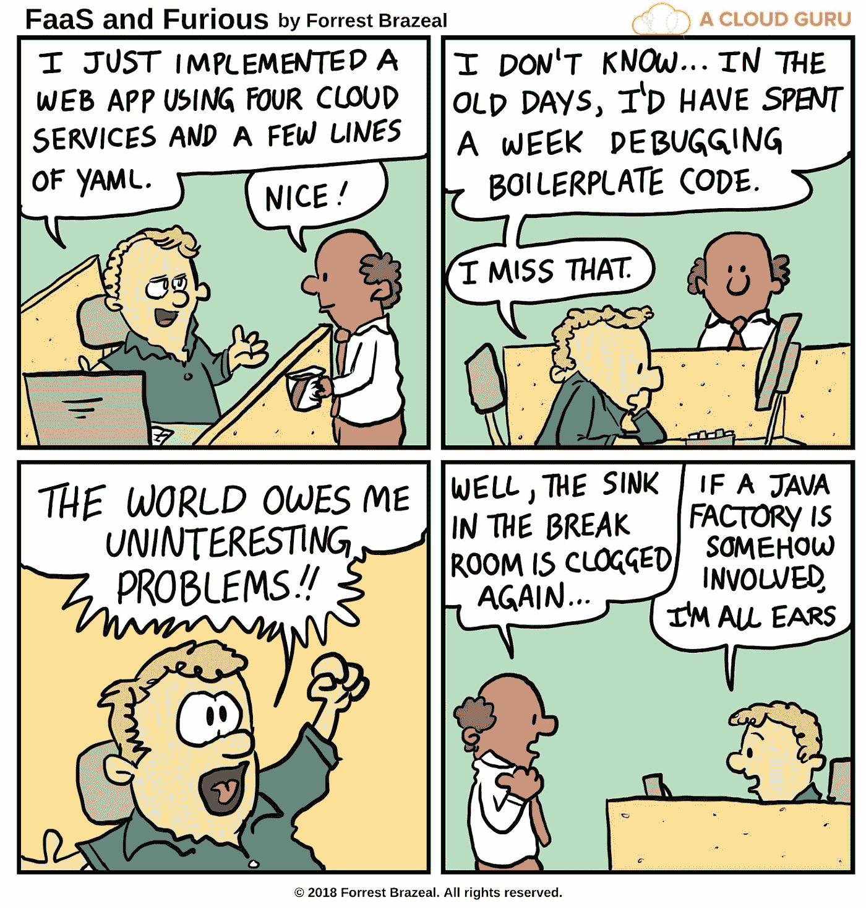

# 解构无服务器计算第 4 部分:无限发展和超越！

> 原文：<https://medium.com/hackernoon/deconstructing-serverless-computing-part-4-developing-to-infinity-and-beyond-9358efc1118e>

## ***“计算机科学中的所有问题都可以通过另一个层次的间接方式来解决。”—大卫·惠勒***

在之前的文章中，我们已经[定义了无服务器和 FaaS 的真正含义](https://hackernoon.com/deconstructing-serverless-computing-part-1-a-new-layer-of-abstraction-98c15334e4f7)，已经[研究了可能的用例](https://hackernoon.com/deconstructing-serverless-computing-part-2-the-good-the-bad-and-the-time-to-market-91a2b52ceaf4)，并且[研究了广泛选择的 FaaS 平台](https://hackernoon.com/deconstructing-serverless-computing-part-3-ninety-nine-platforms-but-how-to-choose-one-b0ee5372dba7)。现在您已经完全了解了，有了一个适合无服务器的用例，选择了您首选的 FaaS 平台和一些可选的无服务器服务。在你开始使用无服务器构建下一个伟大的产品之前，有一些关于无服务器开发的事情你应该记住。

# 隐形服务器

作为开发人员，无论您的公司是在内部部署无服务器堆栈，还是利用云提供商的托管服务和 FaaS 平台，您都无法访问底层服务器。这需要您处理基本流程(如调试、测试和监控)的方式发生范式转变。可观察性是通过外部监控、日志记录和跟踪服务实现的。单元测试仍然占测试的大多数，大多数供应商提供一些本地测试的可能性: [AWS SAM CLI](https://github.com/awslabs/aws-sam-cli) 、[无服务器-离线](https://github.com/dherault/serverless-offline)、[架构师](https://www.npmjs.com/package/@architect/architect)等。然而，应该比以前更加关注集成测试。没有好的方法来本地测试您的功能和您集成的外部服务所公开的接口之间的所有交互。使用服务模拟是有用的，但是在快速变化的云环境中，随着接口的变化和新特性的不断增加，要跟上变得很困难(关于无服务器测试的更多信息，请参见[本文](https://hackernoon.com/development-flow-in-serverless-environment-from-the-trenches-d42021b7aef0)和[本文](https://thenewstack.io/serverless-testing-in-production/))。这种范式的转变确实使事情变得复杂了，但是人们正在努力使这种新的工具和工作方式尽快达到成熟。无服务器生态系统正在快速增长，服务包括用于观察的[桑德拉](https://www.thundra.io/)、 [DashBird](https://dashbird.io/) 和 [IOpipe](https://www.iopipe.com/) 、用于多云管理的 [TriggerMesh](https://triggermesh.com/) 、用于 CI/CD 的[无服务器框架](https://serverless.com/)、 [Seed](https://seed.run/) 和 [Stackery](https://www.stackery.io/) (见[此图](https://landscape.cncf.io/images/serverless.png)了解无服务器生态系统的概况

# 不再有巨石柱

除非你计划将你的整个应用程序捆绑在一个 Lambda 函数中，否则单一架构是不可能的。默认情况下，您的架构现在是面向微服务/无服务器的，事件驱动的架构非常适合。这并不是说单片集成电路是一个糟糕的设计选择，而是说当使用无服务器时，有必要考虑通过不可靠的网络连接的多个组件。

# 较少的样板代码

当引入 EC2、GCE 和 Azure 虚拟机等服务时，一个明显的好处是将部分运营责任卸载给云提供商。托管容器编排服务，如 [GKE](https://cloud.google.com/kubernetes-engine/) 、 [EKS](https://aws.amazon.com/eks/) 和 [AKS](https://azure.microsoft.com/en-us/services/kubernetes-service/) 更进一步。无服务器将这一点提升到了一个新的高度，因为整个运营都由提供商负责。您提供代码，提供商确保它在任何需要的时候运行，同时考虑诸如供应、扩展和修补等问题。无服务器大大减少了您必须编写的样板代码的数量，允许您在更高的抽象级别上操作，对您隐藏操作系统、运行时，甚至容器管理和编排。

# 细粒度的安全性

FaaS 模式非常适合单一责任原则，每个职能部门执行一项特定的任务。这对安全性有好处，因为每个功能只获得完成其目的所需的最小权限，从而大大减少了黑客的攻击面。此外，由于补丁由云提供商处理，当发现新的漏洞时，您就少了一件担心的事情。

# 冷启动

无服务器开发有其独特之处，需要习惯的一个重要特点是冷启动。由于 FaaS 平台按需运行您的代码，当一个请求第一次命中一个函数时，平台会经历提供一个函数实例(您的函数的执行环境——通常是一个容器)、注入运行时和依赖项，然后最终执行函数的过程。这叫做冷启动。云提供商通常在有限的时间内保留以前创建的功能实例，并将任何新请求发送给它们。这种执行通常被称为热启动。冷启动和热启动之间有很大的时间差，受依赖项的数量和大小、所用的运行时间以及构建容器所需的时间等因素的影响。

根据应用程序的使用模式，冷启动的次数会更多或更少，这反过来会直接影响响应时间。减轻冷启动的最简单的策略叫做函数 ping，这意味着定期调用你的函数以确保它们保持温暖。托管和开源 FaaS 平台都采用了各种技术来减轻冷启动，例如容器预热(在新的功能请求到来时保留预先构建的容器以供使用)。有关冷启动和缓解技术的详细解释，请参见这篇[精彩文章](https://www.infoq.com/articles/serverless-performance-cost)。

重要的是要记住，如果您使用开源 FaaS 平台，您对缓解技术有更多的控制，因为托管 FaaS 平台不会暴露任何冷启动缓解的控制。

# 进入场景:分布式系统理论

每个从单片服务器过渡到微服务的人都必须迅速意识到人们在处理分布式系统时会犯的常见错误(详细解释见[这篇文章](https://dzone.com/articles/understanding-the-8-fallacies-of-distributed-syste)):

1.  网络是可靠的。
2.  延迟为零。
3.  带宽是无限的。
4.  网络很安全。
5.  拓扑不会改变。
6.  有一个管理员。
7.  运输成本为零。
8.  网络是同构的。

未能理解在整体架构中做出的假设不再适用于分布式系统可能会导致麻烦。对分布式系统问题的认识是至关重要的，例如网络带宽和延迟限制、故障模式、一致性模型、共识和幂等性。尽管它允许您在比微服务更高的抽象层次上操作，并屏蔽了一些问题，但无服务器仍然意味着分布式系统具有所有的优点和缺点。

函数是无状态的，这意味着函数的一次执行完全独立于另一次执行；您应该假设在两次执行之间没有数据会存留下来。实际上，大多数提供者在函数执行结束后重用容器，因此数据可能仍然可以从以前的执行中获得。这意味着您仍然可以缓存一般的东西，比如服务客户端和数据库连接。但是，您无法控制下一个函数将在哪个容器中运行，也无法控制提供者何时决定废弃容器。为了在使用功能即服务平台时维护特定状态，您必须依赖外部存储系统，如 S3 或 DynamoDB。选择存储系统时，您应该了解服务的延迟和吞吐量要求。

要记住的另一个重要问题是函数应该是幂等的，这意味着用相同的输入参数重复执行一个函数应该产生相同的结果。由于函数执行可能会失败或随时超时，大多数提供程序都包含自动重试机制，但有时您必须自己编写。如果您的函数有副作用，重试失败的执行可能会产生意想不到的后果。假设函数执行在失败之前有副作用(例如将记录写入数据库)，那么当重试时，副作用将再次发生，导致意外行为(例如，如果函数将记录写入数据库，然后失败，当重试时，它将写入重复的记录)。处理这个问题的方法有很多，在这里可以找到很好的教程[。](https://cloud.google.com/blog/products/serverless/cloud-functions-pro-tips-building-idempotent-functions)

如果您计划组合多个功能和服务来形成一个工作流(这是经常发生的情况)，处理无状态、失败、重试等的复杂性。可能有点难以承受。在这种情况下，你应该考虑使用函数工作流编排器，比如[裂变工作流](https://github.com/fission/fission-workflows)、 [AWS 步骤函数](https://aws.amazon.com/step-functions/)或者 [Azure 持久函数](https://docs.microsoft.com/en-us/azure/azure-functions/durable/durable-functions-overview)。这些系统简化了功能组合，并提供了一些特性，例如现成的容错功能。

# 笨重的传统框架可能不太适合

无服务器计算的一些特征与以前的整体范式(以及更小程度上的微服务)直接对立。笨重的框架，比如面向 Java 开发人员的 Spring，并不适合无状态的、短时间运行的函数，这些函数的内存有限，并且它们的成本与分配的内存直接相关。

大多数提供商都有几十到几百兆字节的部署包限制。部署包的大小极大地影响了功能部署时间，因为它必须通过网络传输到指定的容器中。框架初始化所花费的时间以及通过网络传输部署包所花费的时间直接影响功能的冷启动时间。这导致了两个问题:

1.  应用程序的响应时间可能很长，这取决于流量，因此会直接影响用户体验
2.  因为 FaaS 的成本模型是按使用付费的，所以你要为函数执行的额外时间付费

重型框架也有更高的内存占用。大多数 FaaS 提供商增加了成本，为每个功能分配更高的内存，因此您的成本会增加。

# 粒度、按使用付费计费及其影响

无服务器推出的定价模式改变了游戏规则。不必为空闲时间付费，这允许您以不同的方式进行软件开发和部署。

首先，在开发生命周期的不同阶段拥有许多可用的环境在经济上是明智的。因为您只为实际使用付费，所以您可以创建任意多的开发、试运行和验收环境。传统上，非生产环境会从生产环境中剥离出来以降低成本。使用无服务器，它们可以与生产环境完全相同，而不会产生额外的基础架构成本。*免责声明:这不适用于自主托管的 FaaS 平台。*

第二，这种定价模式允许您在不影响成本的情况下运行任意多的 A/B 测试。因为您只为实际使用的东西付费，所以您最终会将相同的成本分摊到应用程序的多个版本上。这使得小企业也能负担得起频繁的实验，而不仅仅是行业巨头，如亚马逊、谷歌和脸书。

最后，一个精细的按使用付费的计费模式让您更深入地了解各个功能的盈利能力。云提供商对你的使用进行收费，并使用指标进行量化，如请求数量或函数使用的内存。因为你也可以获得这些信息，所以可以准确地确定一个功能的运营成本，或者你从不同的客户那里获利还是亏损。

对于这一节，我借用了 Gojko Adzic 的观点，他在无服务器方面写了很多文章。如果你想了解更多关于 serverless 的知识，我强烈推荐他的新书:[运行 Serverless:AWS Lambda 和 server less 应用模型简介](https://leanpub.com/running-serverless/c/gotoams)。

# **(某些)锁定是不可避免的**

想要负面描述无服务器的人经常提到供应商锁定是一个主要问题，有些人甚至称之为“[人类历史上见过的最糟糕的专有锁定形式之一](https://www.theregister.co.uk/2017/11/06/coreos_kubernetes_v_world/)”。然而，在无服务器的世界里，事情正在快速发展，由大型云提供商提供的 FaaS 平台，如 AWS Lambda 和 Azure Functions 不再是唯一的平台。有许多现成的开源替代产品，如 [Apache OpenWhisk](https://openwhisk.apache.org/) 和[裂变](https://fission.io/)(关于 FaaS 平台的详细对比，请参见我的[上一篇文章](https://docs.google.com/document/d/1oeljTyLmDNh7NAoDNljJhjrLxpm0_11pM9xvYUQT7dw/edit))。他们中的大多数可以运行在一个容器 orchestrator 之上，比如 Kubernetes，你可以获得一个托管服务(EKS，GKE，AKS 等)。)或者自己在云基础架构甚至内部部署。

因此，如果您想要最少的锁定，您可以在自己的基础设施上部署一个开源 FaaS 平台。社区正在努力促进多云部署。有各种各样的框架旨在简化这一过程，如[无服务器框架](https://serverless.com/)、 [TriggerMesh](https://triggermesh.com/) 和 [Zappa](https://www.zappa.io/) 。[云本地计算基金会(CNCF)](https://www.cncf.io/) 也在致力于无服务器标准，比如 [CloudEvents](https://github.com/cloudevents/spec) ，它提供了描述事件的开放标准。

总的来说，无服务器本身并不意味着比任何以前的技术或框架更加局限。如果你愿意，你可以在 FaaS 平台和托管服务上编写抽象，最终得到一个真正的云计算解决方案。然而，这将涉及大量的开发工作，并且会将您限制在您想要支持的所有云提供商的最小公分母上。如果你决定接受某种锁定，无服务器提供给你的是一个更好的交易。您可以利用特定于提供商的功能，从开箱即用的安全性和合规性中获益，并利用与各种托管服务和事件源的轻松集成。

# 结论

其核心是，无服务器开发需要思维方式的改变。微服务要求我们的开发实践发生根本性的转变；随着无服务器计算的出现，应该进一步修改和完善这些实践。新技术的目的一直是支持和授权伟大的商业理念。无服务器提供了一条清晰的路径来实现商业价值，消除运营顾虑，并大大缩短上市时间。对于开发人员来说，这意味着减少对底层基础设施和运营问题的关注，而更多地关注分布式系统和生态系统。

开发人员应该接受更快的原型能力，并致力于更短、更细粒度的迭代。在开发新功能时，无服务器带来的风险大大降低；细粒度的按使用付费和运营问题的委托允许开发人员安全地测试甚至最牵强的想法；万一失败，代价是最小的。开发人员也应该意识到，但不要害怕，不成熟的工具是不可避免的，因为技术是新近出现的。有很多机会来定义最佳实践，构建新的工具，并帮助塑造无服务器计算的发展。