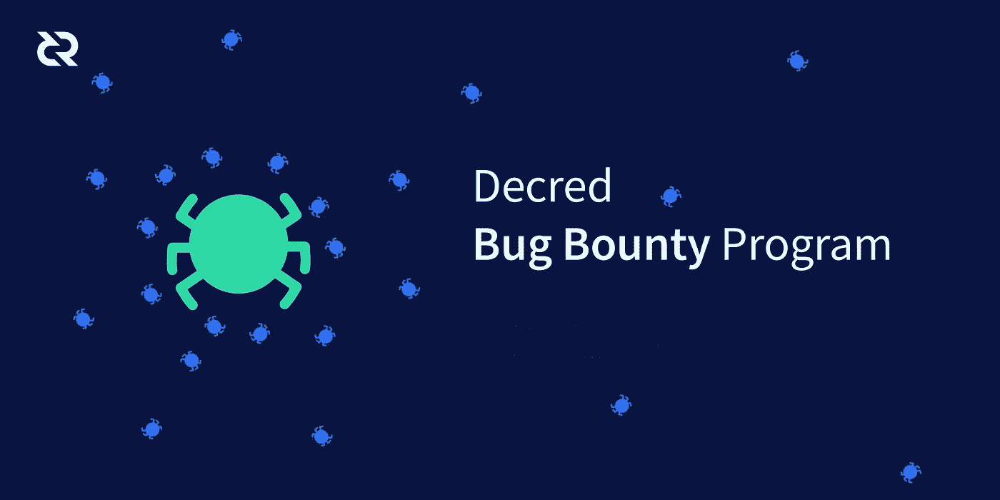

# 法令推出“调试法令”错误赏金计划

> 原文：<https://medium.com/hackernoon/decred-launches-debug-decred-bug-bounty-program-7e4d2af27ec9>

The bug bounty program offers developers up to $25,000 in rewards for critical fixes that enhance Decred’s security

如果 2018 年是加密崩溃的一年，那么 2019 年将是建设的一年，因为投机活动消退，严肃的项目走到了前台。本着建设的精神，顶级加密货币 Decred 背后的开发者一直在幕后创造一种社区驱动的数字货币，旨在为未来几代人提供优质的价值存储。在短短三年内，他们建立了一个透明的提案和投票系统，一个持续资助的财政部，以及一个混合的 PoW+PoS 共识机制，使加密货币具有适应性，自我维持和安全性。

但是，在 Decred 建立一个由集体智慧统治的自治、去中心化的未来的愿景成为现实之前，还有很多事情要做。随着加密领域的成熟， [51%的攻击和其他漏洞的发生频率越来越高](https://thenextweb.com/hardfork/2018/10/23/cryptocurrency-51-percent-attacks/) —这凸显出我们需要改善整体安全状况，并以全新的眼光审视我们的代码和网站。这就是为什么，今天，Decred 宣布了一个官方的[臭虫奖励计划](https://bounty.decred.org/)。各种背景的开发者，包括 Decred 的新手，都被邀请去寻找安全漏洞——并因此获得报酬。

通过这个项目，Decred 的目标是坚持以分散的方式利用集体智慧的核心价值。这就是为什么我们从世界上任何地方的社区内外的许多 bug 赏金猎人那里众包，以找到并修复安全漏洞，并推进我们成为高级价值存储库的目标。有影响力的贡献者将获得丰厚的奖励——关键修复最高可获得 25，000 美元。

# **规则**

参与 Decred 的 bug bounty 计划的规则很简单:

*   所有的 bug 报告都需要有清晰的重现步骤和/或概念证明。
*   所有的 bug 必须在最新的产品版本或代码的主分支中重现。
*   旧版本或功能分支中的错误不在范围内。
*   我们禁止拒绝服务攻击或网络带宽负载测试。
*   我们无法支付重复报告或已知错误报告的费用。
*   未经 bug bounty 计划的事先批准，任何形式的漏洞公开披露都将使其没有资格获得支付。
*   没有社会工程。
*   没有垃圾邮件。
*   所有当前/过去(最多六个月)的法令承包商都被禁止参与这个 bug 赏金计划。
*   在项目开始前做出的漏洞报告将没有资格获得奖金。
*   不要试图攻击或测试 mainnet——主禁用网络。有一个完全独立的法令 [testnet](https://docs.decred.org/advanced/using-testnet/) 是专门为软件测试而创建的。公共测试网上的测试将防止对 mainnet 的影响，并消除造成实际财务损失的风险。也可以创建你自己的个人 [simnet](https://docs.decred.org/advanced/simnet/) 。Simnet 运行在您自己的本地系统上，使用 CPU 挖掘块的难度足够低。

# **如何获得报酬**

Decred 将使用 [OWASP 风险评级方法](https://www.owasp.org/index.php/OWASP_Risk_Rating_Methodology)评估漏洞并确定赔付金额。它还将考虑到对生态系统的影响。例如，dcrweb(低影响)中的 RCE 与 dcrd 或 Decrediton(高影响)中的 RCE 不同。

Decred 还将考虑初始报告和漏洞重现步骤和/或概念证明的质量。如果参与者提供了漏洞的代码修复，他们也将有资格获得“代码修复”奖金，条件是 Decred 的现有开发人员接受它是有效的。

所有的支出将只在法令中。参与者将被要求创建和操作一个法令钱包。DCR 对美元的比率基于上个月的平均美元汇率。支付金额是由一个核心的“虫赏金”团体决定的。

指示性支付金额如下:

**注**:最高 300 美元

**低**:最高 1000 美元

**中等**:最高 3000 美元

**高**:最高 1 万美元

**关键**:最高 25，000 美元

# **如何参与**

每个人都被邀请参加这个节目。要了解更多，去法令 [bug 赏金网站](https://bounty.decred.org/)。

要定期更新并成为 Decred 社区的一员，请加入其 [Matrix 社区](https://www.decred.org/matrix/)。也请在 Twitter 上关注我们，地址是 [@decredproject](https://twitter.com/decredproject) 。

要了解更多关于 Decred 的信息，请访问[主页](https://www.decred.org/)。