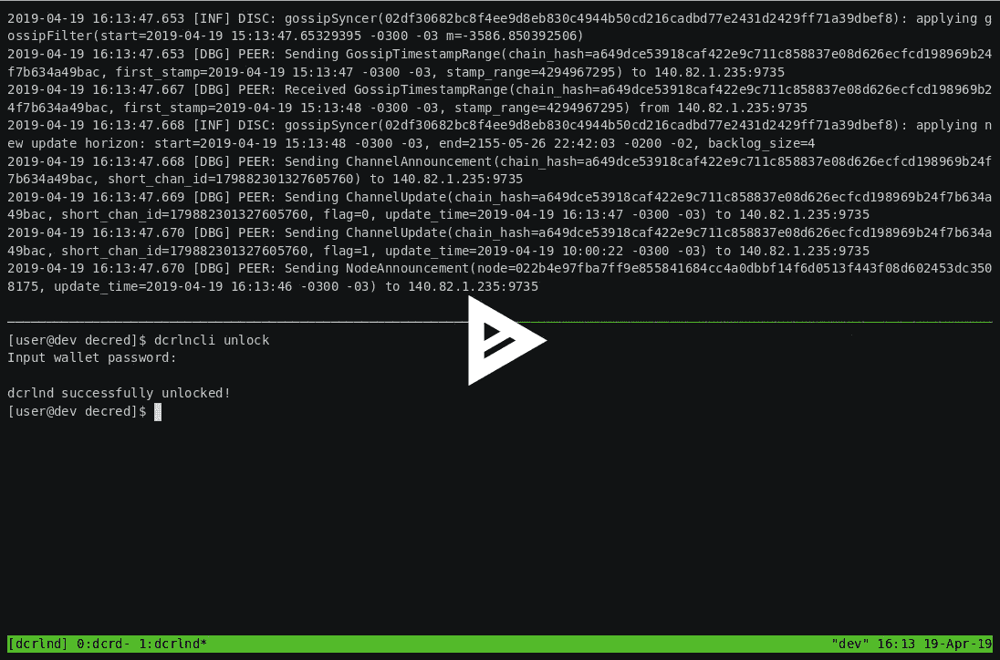
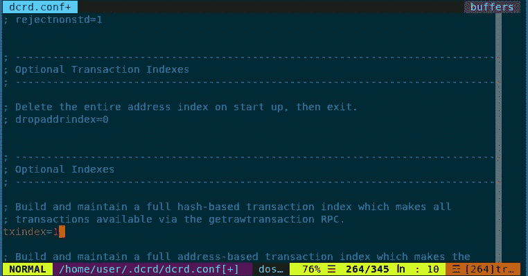

# 成为首批测试 DCR 闪电网络的公司之一

> 原文：<https://medium.com/hackernoon/decred-wants-you-be-one-of-the-first-to-test-the-dcr-lightning-network-dd9ecf14d95e>

闪电网络对等支付协议承诺提供刺激 crypto 大规模采用所需的可扩展性、隐私和速度。2017 年底，Decred 激活了开发 DCR 闪电网络所需的链上共识规则。这一改变几乎获得了 99.50%的一致通过，开发人员开始着手构建 LN 特性的基础。

今天，Decred 开发团队自豪地推出这项关键工作:我们的闪电网络钱包和节点软件 [dcrlnd](https://github.com/decred/dcrlnd) 的官方测试网发布！

经过几个月的努力工作和整个软件栈的几个变化(包括最近的[链上投票](https://matheusd.com/post/dcp0004-and-hardforks/))我们终于准备好为更广泛的 Decred 社区提供软件，这样我们就可以开始认真发展我们的 LN 基础设施。我们需要你的帮助来实现这个目标。积极改进测试网的参与者越多，我们进入主网的速度就越快。

要测试我们的 LN 网络，请遵循以下三个简单的步骤:

1.  访问 GitHub 上的主项目[存储库](https://github.com/decred/dcrlnd)
2.  下载代码
3.  编译它，并开始测试！

这篇文章将强调我们所取得的成就，总结达到这个阶段所需要的东西，并指出我们将致力于软件的短期和长期方向。

在我们开始之前，我们要感谢 [lnd](https://github.com/lightningnetwork/lnd/graphs/contributors) 的贡献者，他们太多了，无法一一列举(说真的，去看看他们的贡献者页面)，但是没有他们的工作，我们肯定不会在这里。我们期待着合作改善整个闪电网络生态系统！

# TL；速度三角形定位法(dead reckoning)

*   [decreed lnd 守护进程](https://github.com/decred/dcrlnd)(简称`dcrlnd`)已经准备好供 testnet 使用。它包括自己版本的链上钱包，因此**不要使用与普通钱包相同的种子。**
*   Decrediton 可以连接到它，并呈现一个与 LN 网络交互的基本 UI。
*   来自上游 lnd 的分支点是 2019 年 1 月 10 日(v0.5.1 左右)。
*   所有代码、测试和辅助包都被移植到 decred-specific repos 中。
*   上游项目的所有单元和集成测试以及我们的内部手工测试都通过了。
*   随着更广泛的社区开始使用该软件，我们开始得到关于它的反馈，预计变化会很快。
*   我们计划使 LN 软件更加法令友好，并实现许多令人兴奋的改进(如 schnorr 签名，在法令中已经可用)。
*   跨链渠道还不可能。

# 当前事态

我将讨论 LN 节点(dcrlnd)的当前状态以及针对最终用户支持的 Decrediton 集成。

Unlocking the dcrlnd wallet via CLI: [https://asciinema.org/a/j4nvyl9rgN5sheHzk1cPPQoY4](https://asciinema.org/a/j4nvyl9rgN5sheHzk1cPPQoY4)

# 淋巴结

这个版本的主要成就是最初的 lnd 守护进程使用 Decred 生态系统的端口，现在称为`dcrlnd`。

该守护程序负责

*   连接到 P2P 闪电网络；
*   发现对等体和信道的现有拓扑；
*   管理自己的渠道；
*   创建发票(付款申请)；
*   通过网络向任何可到达的对等点发送付款。

虽然 LN 如何工作涉及许多细节，解释所有这些需要相当长的时间，但比特币 LN 的所有现有材料目前也适用于 Decred 的版本，因此所有现有的教程和解释都可以使用(本文中提到的微小变化)。

dcrlnd 守护程序当前实例化一个内部 dcrwallet 来执行其功能。目前，我们建议你**不要**使用任何来自现有法令钱包的种子。无论如何，常规 dcrwallet 和 dcrlnd 的种子格式是不同的，但是您*可以*使用相应的十六进制种子，这肯定会导致钱包之间的不一致。

为了履行它的职责，LN 守护进程需要一个正常工作的 dcrd 节点，并且启用了事务索引**(也就是说，dcrd 必须用`--txindex`参数启动)。还要注意 SPV 模式(原 lnd 中也称为*中微子*)目前**不支持**。**

****

**Enabling the transaction index via the config file**

**启动后，守护进程将尝试引导自己，但很可能在最初几周内*无法*这样做。用户将不得不手动连接到网络中的其他对等点来打开通道，我们将为此提供水龙头和公共 testnet 节点。一旦我们有了一个足够大的网络，我们将按照 [BOLT #10](https://github.com/lightningnetwork/lightning-rfc/blob/master/10-dns-bootstrap.md) 的定义设置适当的引导设施。**

**dcrlnd 节点上线解锁后，可以使用与原始 lnd 软件几乎完全相同的 api 进行交互。api 的主要区别是从重量/千重量/饱和/毫饱和变为相应的递减单位(字节/千字节/原子/毫原子)。**

**对于命令行用户来说，接口工具被命名为`dcrlncli`(在最初的`lncli`之后)。我们已经在内部测试了一些通过 lnrpc 接口(即 LN 守护进程提供的 grpc api)集成的现有 LN 工具(ui、图形资源管理器等),其中大部分可以在稍作适当修改的情况下原样使用。**

**lnd 的现有单元和集成测试也已移植并全部通过。我们想指出 lnd 开发者在这方面所做的出色工作；如果没有这些广泛的测试来确保兼容性，检测所有的回归点和断言守护进程工作正常将会更加困难。**

# **法令整合**

**我们已经完成了 Decrediton 和 dcrlnd 之间的初步整合。这种集成暴露了操作面向终端用户的 LN 钱包所需的基本功能；主要是:**

*   **向 LN 钱包的链上侧添加/提取资金；**
*   **打开/关闭通道；**
*   **创建/发送付款。**

**由于它是一个*独立*钱包的性质，为了打开资助渠道，用户需要首先从他们原来的钱包中用硬币资助 LN 钱包。从原始钱包的角度来看，这表现为已发送的交易(或资金提取)。这是 dcrlnd 节点当前架构的一个局限性，我们希望在不久的将来解决这个问题。**

**请注意，法令端暂时无法*初始化* LN 钱包；它只能连接到现有的已创建且解锁的钱包。它也没有通过命令行客户端公开所有可用的信息，所以用它来操作 hub 将会很棘手。GUI 应该快速迭代，设计团队肯定会在接下来的几周内进行改进。**

**目前，您可以通过观看下面的剪辑来了解集成是如何工作的:**

**LN Wallet Integration in Decrediton**

**从一月份开始，我们加倍了移植工作，以使 dcrlnd 为 testnet 发布做好准备。这是需要更改和修复的主要内容的示例:**

*   **修复*每一个单独的导入*来指向已判决的回购。**
*   **完全重写了与 dcrwallet 的集成(btcwallet 和 dcrwallet 已经明显不同)。**
*   **对 dcrd 的集成进行了重大改写(dcrd 和 btcd 已经在许多方面发生了分歧)。**
*   ***由于 btcd/dcrd 和 btcwallet/dcrwallet 分化的发展，许多* api 调整。**
*   **更新到最新的 bbolt 包。**
*   **完全重写如何处理事务见证数据。支持 Segwit 的比特币使用见证堆栈、见证程序和签名脚本，而不是仅使用签名脚本。**
*   **完全重写地址处理。支持 segwit 的比特币中的 lnd 大多使用 np2wkh 和 p2wkh vs Decred 的标准 p2pkh/p2sh 脚本类型。**
*   **调整大小计算(由于脚本在不同网络中的行为方式的微小变化)。**
*   **从重量移动到字节进行大小计算。**
*   **使 zpay32/bech32 库适应 Decred 的需求。**
*   **将 lnrpc 包中的一些结构重命名为它们的 Decred 对应物。**
*   **引入并使用模拟投票钱包进行集成测试。**
*   **通过每一个单元和集成测试。**

**经过这一切，我们终于在私下工作时达到了收益递减的点，并且有理由相信 Decred 的闪电网络可以与常规 Decred 链一起工作。**

# **未来的工作**

**现在我们已经发布了一个支持 testnet 的 dcrlnd 守护进程，下一个重要的里程碑是让它 *mainnetworthy* 。**

**现在(写这篇文章时)还不可能在 mainnet 中运行守护程序，因为需要激活`fixlnseqlock`议程(这将在[块 342784 中发生，大约在 5 月 9 日](https://explorer.dcrdata.org/agendas))。**

**即使在这之后，在向与 dcrlnd 实例相关联的钱包投入大量资金之前，也值得放松一下。虽然最初的 lnd 软件在过去几年中受到了极大的关注，但我们所做的任何移植努力都注定会出现问题。虽然 lnd 提供的一套测试内容广泛，并采用了积极和消极的解决方案，但我们仍然受到一些测试不稳定性的影响，必须努力确保编写更多与法令相关的测试案例。**

**就最紧迫的工作而言，我们可以包括:**

*   **修改 dcrwallet 集成，允许使用*远程*钱包，而不是嵌入 lnd 的钱包。这将允许更无缝地集成到现有的法令工具中。**
*   **引入自分支点以来对 lnd 所做的(一些)更改。上游有一些真正令人兴奋的工作，我们渴望合并。**
*   **提高集成测试的稳定性，以便它在 CI 服务器中一致通过，而不必求助于重新运行测试。**
*   **与设计团队一起迭代 GUI 的 UX。**
*   **允许使用 SPV 模式钱包。**

**从长远来看，我们希望为我们的 LN 基础设施带来一些激动人心的新事物，包括:**

*   **在承诺和赎回交易中对多 SIG 使用 schnorr sigs。**
*   **实现 [eltoo](https://blockstream.com/eltoo.pdf) (可能引入新的所需签名散列类型以及 [this](https://github.com/decred/dcrd/issues/950) )。**
*   **设计并实现了对比特币 LN 的跨链整合。**
*   **与上游 lnd 团队合作，抽象和概括代码，使之更加链不可知。**

# **背景故事:我们是如何来到这里的**

**这绝不是对达到当前阶段所做的每一件事情的详尽回顾，但应该足以作为所有必须到位的必要部分的快速概述。**

**虽然完成该端口的主要编码工作是在过去几个月完成的(大部分从 2019 年 1 月开始)，但 dcrd 和 dcrwallet 中的早期更改需要达到这一阶段。**

**关于 LN(来自[voting.decred.org](https://voting.decred.org/)的投票信息)，一个快速的要点列表，列出了整个生态系统中最重要的事件:**

*   **[2017 年 3 月 6 日](https://explorer.dcrdata.org/block/113120):LN 支持链上信令投票开始。**
*   **[2017 年 6 月 11 日](https://explorer.dcrdata.org/block/141184):LN 支持锁定的链上信令投票。由于此次投票实际上不包含任何共识规则变更，我们认为这是利益相关方(98.61%的支持率)表明其支持 LN 功能开发的意图的时候了。**
*   **[2017 年 11 月 26 日](https://explorer.dcrdata.org/block/141184):LN 运作所必需的链上共识规则在利益相关方批准后被激活(支持率为 99.50%)。**
*   **[2018 年 5 月 18 日](https://github.com/davecgh/dcrlnd/commit/d659fcaea5793dd702e8409af7b36a372da3d346):DCR lnd 端口初始检查点。虽然这只是*提交*的日期，但在此之前工作已经开始。**
*   **[2018 年 12 月 6 日](https://github.com/davecgh/dcrlnd/commit/d659fcaea5793dd702e8409af7b36a372da3d346):第一版费用估算包合并。**
*   **[2019 年 1 月 14 日](https://github.com/davecgh/dcrlnd/commit/1f010deb8e621ab3fe2d8218fc9731deca425781):主要编码工作的第一次提交。**
*   **[2019 年 1 月 26 日](https://github.com/decred/dcrd/commit/7f75331d6d27fe56dd8a99cf0ce11bda67e133d3):引入 DCP0004 (fixlnseqlocks)议程以解决共识规则[实施问题](https://matheusd.com/post/announcing-dcrlnd/dcp-0004-and-hardforks)。**
*   **2019 年 2 月 23 日:fixlnseqlocks 议程的 Testnet 规则已激活。**
*   **[2019 年 3 月 14 日](https://explorer.dcrdata.org/block/326656):mainnet fixlnsecks 投票开始(议程通过；在撰写本文时激活仍在等待中)。**

# **测试和贡献**

**对于那些想要开始测试我们的 LN 网络的人，你可以访问 GitHub 上的主项目[库，下载代码，编译它并开始测试。存储库的自述文件包含一些快速入门指南。](https://github.com/decred/dcrlnd)**

**为了测试 Decrediton，你也可以下载最新的 [LN 测试分支](https://github.com/matheusd/decrediton/tree/ln)，像往常一样构建它，或者使用其中一个[测试二进制文件](https://github.com/matheusd/decred-weekly-builds/releases/tag/v20190425123703)。请记住，这是一项正在进行的工作，因此不要在生产中使用或与您的 mainnet 钱包种子。**

**如果你想以任何身份做出贡献，也请阅读我们关于[为项目](https://docs.decred.org/contributing/overview/)做出贡献和[成为付费承包商](https://docs.decred.org/contributing/overview/#becoming-a-paid-contractor)的初始文档。**

***原载于 2019 年 4 月 25 日*[*https://matheusd.com*](https://matheusd.com/post/announcing-dcrlnd/)*。***