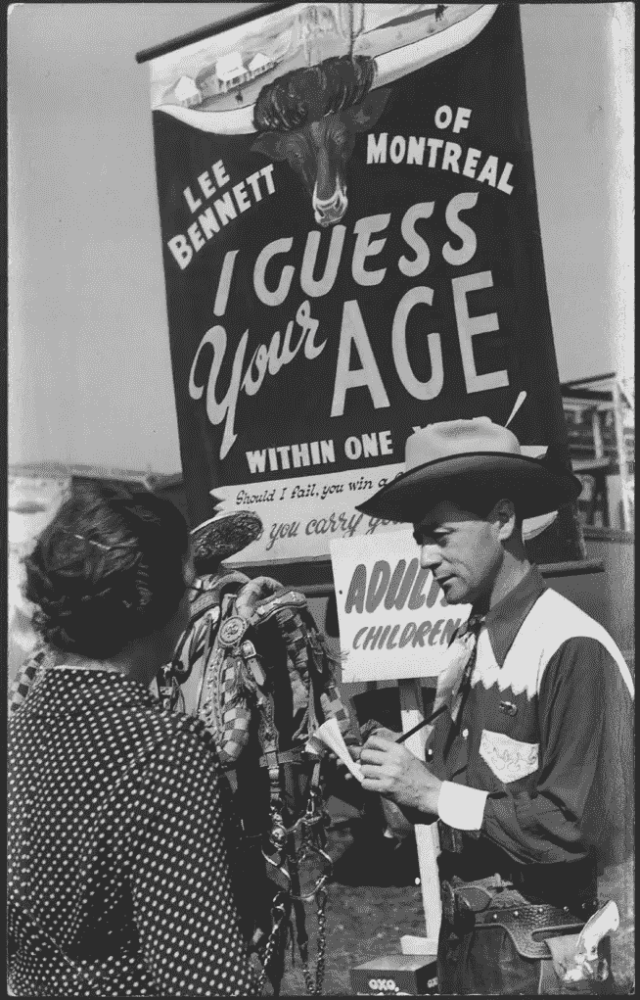

# 深度衰老:科学家称人工智能越来越能预测你的真实年龄

> 原文：<https://medium.com/hackernoon/deep-aging-scientists-say-ai-is-getting-better-at-predicting-your-true-age-1dc001c3689d>

Researchers say AI is getting better at guessing a person’s most important age — their biological age.

你听说过这样一句话，“年龄只是一个数字。”

事实证明这是有很多道理的。正如俗话所说，我们很多人在生日时试图避免提及的时间顺序数字实际上只是一个数字——远没有我们想象的那么重要。我们应该关注的真正年龄是我们的生物年龄，它受到基因、生活方式、行为和环境等多种因素的影响。科学家表示，这个年龄——不是让你在 21 岁进入酒吧或让你在 62 岁申请社会保障的数字——更接近预测我们的寿命和健康寿命，因此，更准确地反映了我们的真实年龄。

但是，到目前为止，科学家发现确定一个人的生物年龄即使不是不可能，也是极其困难的。

现在，一个科学家小组报告说，由于人工智能和新的、大量公开可用的数据集，准确预测生物年龄变得更加可行。研究人员在最近一期的[药理学趋势](https://www.cell.com/trends/pharmacological-sciences/fulltext/S0165-6147(19)30114-2)中总结了深度衰老时钟的当前工作。

根据 T2 in silico Medicine T3 的创始人兼首席执行官 Alex Zhavoronkov 博士的说法，人们善于利用图像、视频、声音甚至气味来猜测另一个人的年龄。但是，人工智能可以更准确地猜测年龄，他在的一次新闻发布会上说。

> “深度神经网络可以做得更好，我们现在可以解释什么因素是最重要的，”Zhavoronokov 说。“通常，当一个人看起来比实际年龄要老时，他就生病了。一个训练有素的医生可以通过观察病人来猜测他或她的健康状况。在 Insilico，我们开发了广泛的深度衰老生物标志物，可用于制药和保险公司，以及长寿生物技术社区。在本文中，我们描述了这个新兴领域的最新进展，并概述了一系列非显而易见的应用。”

研究人员认为，不仅有一个指标或生物标记可以提示一个人的生物学年龄，而是这些不同预测因素的组合。人工智能适合这项任务，因为它擅长整理所有可用的数据，并确定因素的正确组合。

准确估计生物年龄也不仅仅是人工智能系统在生日派对上表演的一个酷把戏。研究人员表示，确定衰老的预测因素可以帮助科学家更好地理解衰老过程，并揭示健康衰老的关键。制药和保险公司，以及医疗和长寿行业，都会对这一趋势产生浓厚的兴趣。

> “利用各种老化数据类型开发的深层老化生物标记正在快速推进长寿生物技术产业。快速增长的数据采集能力和人工智能的最新进展，推动了使用衰老生物标志物改善人类健康，预防年龄相关疾病和延长健康寿命。他们不仅在改变衰老研究方面，而且在改变整个医疗保健方面都有巨大的潜力，”Insilico Medicine 的高级科学家 Polina Mamoshina 在新闻稿中说。

研究人员预测，人工智能和衰老研究将在未来加速发展，并指出，进入这一领域的人数越来越多——从大学到企业——以及为这些组织增加资金的资金来源的数量正在推动加速发展。