# 深度学习:解释前馈神经网络

> 原文：<https://medium.com/hackernoon/deep-learning-feedforward-neural-networks-explained-c34ae3f084f1>

Photo by [John Barkiple](https://unsplash.com/@barkiple?utm_source=medium&utm_medium=referral) on [Unsplash](https://unsplash.com?utm_source=medium&utm_medium=referral)

前馈神经网络也被称为**多层神经元网络** (MLN)。这些模型网络被称为前馈，因为信息仅在神经网络中向前传播，通过输入节点，然后通过隐藏层(单层或多层)，最后通过输出节点。在 MLN，没有反馈连接，因此网络的输出被反馈回自身。这些网络由许多更简单的模型(sigmoid 神经元)的组合来表示。

> *引用注:本文内容和结构基于四分之一实验室的深度学习讲座——*[*帕德海*](https://padhai.onefourthlabs.in) *。*

# 动机:非线性数据

在我们谈论前馈神经网络之前，让我们了解一下对这种神经网络的需求是什么。像感知器这样的传统模型——它接受真实输入并给出布尔输出，只有在数据是线性可分的情况下才有效。这意味着正点(绿色)应该位于边界的一侧，负点(红色)位于边界的另一侧。正如你从下图中看到的，感知器在寻找最佳决策边界来区分正负点方面做得很差。

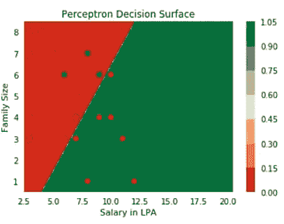

Perceptron Decision Surface for Non-Linear Data

接下来，我们有 sigmoid 神经元模型，它类似于[感知器](https://hackernoon.com/perceptron-deep-learning-basics-3a938c5f84b6)，但是 sigmoid 模型稍有修改，使得 sigmoid 神经元的输出比感知器的阶跃函数输出平滑得多。尽管我们已经引入了非线性 sigmoid 神经元函数，但是它仍然不能够有效地将红点(阴性)与绿点(阳性)分开。

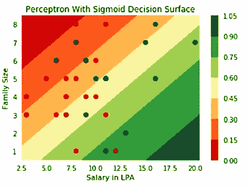

Sigmoid Neuron Decision Boundary for Non-Linear Data

重要的一点是，从感知器中的刚性决策边界开始，我们已经朝着创建适用于非线性可分离数据的决策边界的方向迈出了第一步。因此，乙状结肠神经元是我们前馈神经网络的构建模块。

从我之前关于[通用逼近定理](https://hackernoon.com/illustrative-proof-of-universal-approximation-theorem-5845c02822f6)的帖子来看，我们已经证明了即使单个 sigmoid 神经元无法处理非线性数据。如果我们以有效的方式连接多个 sigmoid 神经元，我们可以将神经元的组合近似为处理非线性数据所需的输入和输出之间的任何复杂关系。

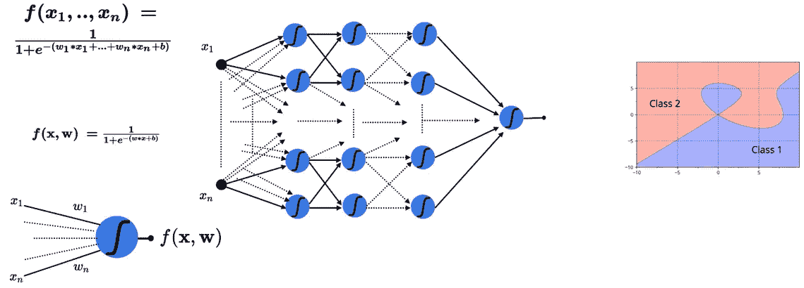

Combination of Sigmoid Neurons for Non-Linear Data

# 前馈神经网络

多层神经元网络由许多 sigmoid 神经元组成。mln 能够处理非线性可分离数据。输入层和输出层之间的层称为隐藏层。隐藏层用于处理输入和输出之间复杂的非线性可分关系。

# 简单深度神经网络

在本节中，让我们看看如何使用一个非常简单的神经网络来解决复杂的非线性决策边界。

让我们以一个有两个变量的手机喜欢/不喜欢预测器为例:屏幕尺寸和成本。它有一个复杂的决策边界，如下所示:

Decision Boundary

我们知道，通过使用单个 sigmoid 神经元，不可能获得这种非线性的决策边界。不管我们如何改变乙状结肠神经元参数 **w** 和 **b** 。现在改变一下情况，用一个简单的神经元网络来解决同样的问题，看看它是如何处理的。

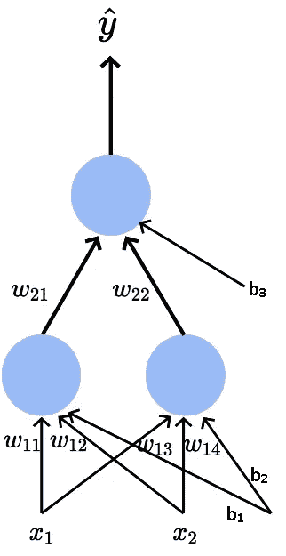

Simple Neural Network

我们有我们的输入 x₁-屏幕尺寸和 x₂—价格进入网络随着偏见 b₁和 b₂.

现在让我们逐个神经元地分解模型神经元来理解。我们在第一层中有第一个神经元(最左边),它连接到输入 x₁和 x₂，权重为 w₁₁和 w₁₂，偏置为 b₁.神经元输出表示为 h₁，它是具有参数 w₁₁和 w₁₂.的 x₁和 x₂的函数

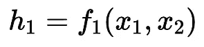

Output of the first Neuron

如果我们将 sigmoid 函数应用于具有适当权重的输入 x₁和 x₂w₁₁、w₁₂和偏置 b₁，我们将得到输出 h₁，它将是 0 和 1 之间的某个实数值。第一神经元 h₁的 sigmoid 输出将由下面的等式给出，

Output Sigmoid for First Neuron

接下来，我们在第一层有另一个神经元，它连接到输入 x₁和 x₂，权重为 w₁₃和 w₁₄，偏置为 b₂.第二个神经元的输出表示为 h₂.

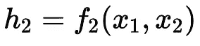

Output of the second Neuron

类似地，第二神经元 h₂的 sigmoid 输出将由下面的等式给出，

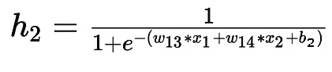

到目前为止，我们已经看到了第一层中存在的神经元，但我们还有另一个输出神经元，它将 h₁和 h₂作为输入，这与前面的神经元相反。这个神经元的输出将是最终的预测输出，它是 h₁和 h₂.的函数预测输出由下面的等式给出，

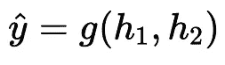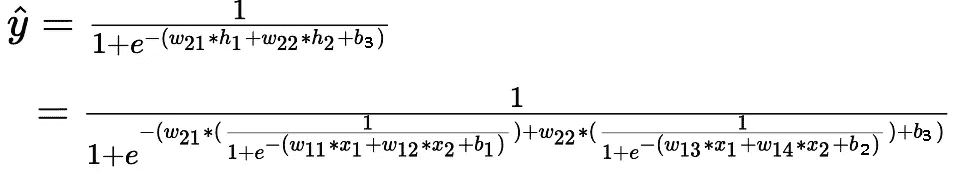

Complex looking Equation!! Really?. Comment if you understood it or not.

以前，我们只能调整单个乙状结肠神经元的 w₁、w₂和 b 参数。现在，我们可以调整 9 个参数(w₁₁、w₁₂、w₁₃、w₁₄、w₂₁、w₂₂、b₁、b₂、b ),这允许处理更复杂的决策边界。通过尝试这些参数的不同配置，我们将能够找到最佳表面，其中整个中间区域(红点)的输出为 1，而其他地方的输出为 0，这正是我们所期望的。

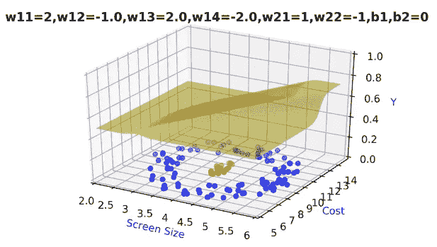

Decision Boundary from Network

需要注意的重要一点是，即使使用简单的神经网络，我们也能够模拟输入和输出之间的复杂关系。现在的问题是，我们如何预先知道这种特殊的配置是好的，为什么不在第一层之间增加几层或增加几个神经元。所有这些问题都是有效的，但现在，我们将保持事情简单，采取网络，因为它是。当我们讨论*超参数调整*时，我们将讨论这些问题以及更多细节。

# 通用深度神经网络

在前面，我们已经看到了用于特定任务的神经网络，现在我们将讨论一般形式的神经网络。

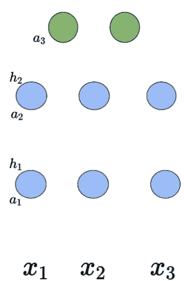

Generic Network without Connections

让我们假设我们的神经元网络有两个隐藏层(蓝色，但如果需要可以有两层以上)，每个隐藏层有 3 个乙状结肠神经元，可以有更多的神经元，但现在我保持事情简单。我们有三个输入进入网络(为了简单起见，我只用了三个输入，但它可以接受 n 个输入)，在输出层有两个神经元。正如我之前所说的，我们将按原样接受这个网络，并理解深层神经网络的复杂性。

首先，我将解释术语，然后我们将进入这些神经元如何相互作用。对于这些神经元中的每一个，将会发生两件事

1.  预激活用“a”表示:它是输入加上偏差的加权和。
2.  激活用“h”表示:激活函数是 Sigmoid 函数。

Generic Network with Connections

让我们一个神经元一个神经元地去理解网络神经元。考虑第一个隐藏层中的第一个神经元。第一个神经元通过权重₁.连接到每个输入端

> 接下来，我将使用这种形式的指数来表示与特定神经元相关的权重和偏差，
> 
> w(层数)(层中的神经元数)(输入数)
> 
> b(层数)(与该输入相关的偏置数)

与连接到第一输入的第一隐藏层中存在的第一神经元相关联的 W₁₁₁—权重。

与连接到第二输入的第一隐藏层中存在的第一神经元相关联的 W₁₁₂—权重。

b₁₁ —与第一个隐藏层中的第一个神经元相关联的偏差。

b₁₂ —与第一个隐藏层中的第二个神经元相关联的偏差。

….

这里，W₁是一个权重矩阵，包含与各个输入相关联的各个权重。每层的预激活是来自前一层的输入加上偏置的加权和。在每一层“I”上预激活的数学方程由下式给出:

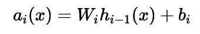

Pre-activation Function

每层的激活等于将 sigmoid 函数应用于该层的预激活输出。在每一层“I”上激活的数学方程由下式给出，

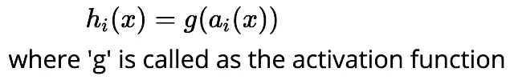

Activation Function

最后，我们可以通过对前一层的预激活输出应用某种激活函数(根据任务可以是 softmax)来获得神经网络的预测输出。预测输出的等式如下所示，

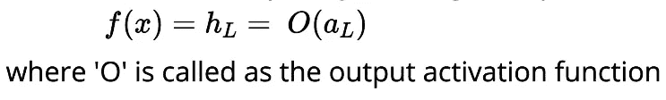

Output Activation Function

# 深度神经网络中的计算

我们已经看到了神经网络的术语和功能方面。现在我们将看到 DNN 内部的计算是如何发生的。

假设你有 100 个输入，在第一和第二隐藏层有 10 个神经元。100 个输入中的每一个将被连接到神经元，这将是第一个神经元的权重矩阵，W₁将具有总共 10×100 个权重。

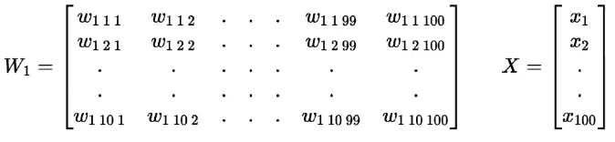

Weight Matrix

请记住，对于权重和偏差变量的指数，我们遵循非常具体的格式，如下所示。

> w(层数)(层中的神经元数)(输入数)
> 
> b(层数)(与该输入相关的偏置数)

现在让我们看看如何计算第一层 a₁₁.的第一个神经元的预激活我们知道预激活只不过是输入加上偏差的加权和。换句话说，它是权重矩阵 W₁的第一行和输入矩阵 x 加上偏差 b₁₁.之间的点积

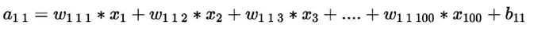

类似地，第一层中其他 9 个神经元的预激活由下式给出:

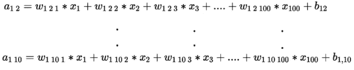

简而言之，第一层的整体预激活由下式给出，

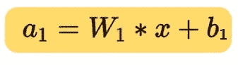

在哪里，

W₁是包含与相应输入相关联的个体权重的矩阵，而 b₁是 containing(b₁₁、b₁₂、b₁₃,….的向量,b₁₀)与乙状结肠神经元相关的个体偏见。

第一层的激活由下式给出，

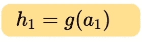

其中“g”代表 sigmoid 函数。

请记住，a₁是 10 个预激活值的向量，这里我们对所有这 10 个值应用元素式 sigmoid 函数，并将它们存储在另一个表示为 h₁.的向量中类似地，我们可以计算网络中存在的“n”个隐藏层的预激活和激活值。

# DNN 的输出层

到目前为止，我们已经讨论了隐藏层中的计算。现在我们将讨论输出层中的计算。

Generic Network with Connections

我们可以通过取与前一层 h₂加上偏置向量 b₃.的激活相关联的 W₃和权重的点积来计算输出层的预激活 a₃

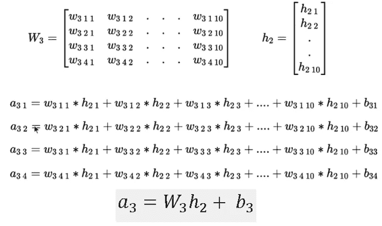

Pre-activation for the output layer

为了找出网络的预测输出，我们将一些函数(我们还不知道)应用于预激活值。

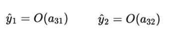

Predicted Values

这两个输出将形成一个概率分布，这意味着它们的总和等于 1。

> 根据手头的任务选择输出激活函数，可以是 softmax 或线性。

# Softmax 函数

我们将使用 Softmax 函数作为输出激活函数。分类问题深度学习中最常用的激活函数。

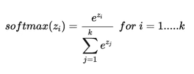

Softmax Function

在 Softmax 功能中，无论输入如何，输出始终为正。

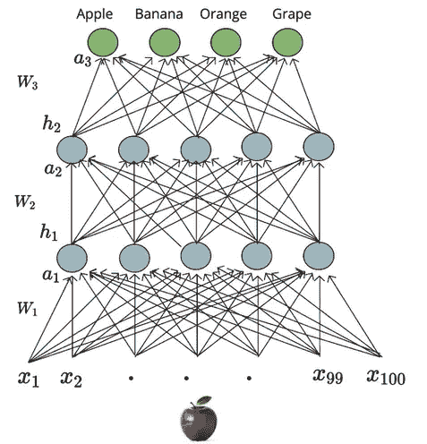

现在，让我们在上面显示的具有 4 个输出神经元的网络上说明 Softmax 函数。所有这 4 个神经元的输出用向量“a”表示。对于这个向量，我们将应用我们的 softmax 激活函数来获得如下所示的预测概率分布，

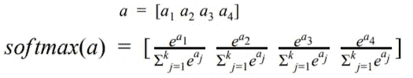

Applying the Softmax Function

通过应用 softmax 函数，我们将得到一个预测的概率分布，我们的真实输出也是一个概率分布，我们可以比较这两个分布来计算网络的损耗。

# 损失函数

在这一节中，我们将讨论二值和多值分类的损失函数。损失函数的目的是告诉模型在学习过程中需要进行一些校正。

一般来说，输出层中神经元的数量等于类的数量。但是在二元分类的情况下，我们可以仅使用一个输出概率 P(Y=1)的 sigmoid 神经元，因此我们可以获得 P(Y=0) = 1-P(Y=1)。在分类的情况下，我们将使用交叉熵损失来比较预测的概率分布和真实的概率分布。

二元分类的交叉熵损失由下式给出:

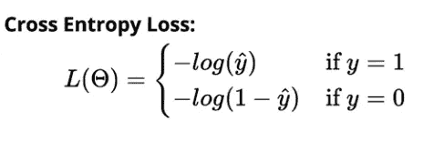

多类分类的交叉熵损失由下式给出:

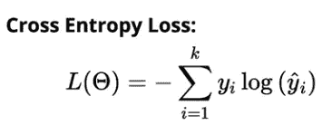

# 学习算法:非数学版本

我们将会看到使用梯度下降的学习算法的非数学版本。学习算法的目标是确定参数的最佳可能值，使得深度神经网络的总损失尽可能最小。

学习算法是这样的，

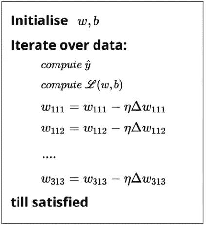

我们初始化所有的权重**w**(w₁₁₂,…w₁₁₁)和**b**(b₂,….b₁))随机。然后，我们迭代数据中的所有观察值，对于每个观察值，从神经网络中找到相应的预测分布，并使用交叉熵函数计算损失。基于损失值，我们将更新权重，使得在新参数下模型的总损失将**小于模型的当前损失**。

Photo by [Vasily Koloda](https://unsplash.com/@napr0tiv?utm_source=medium&utm_medium=referral) on [Unsplash](https://unsplash.com?utm_source=medium&utm_medium=referral)

# 结论

在这篇文章中，我们简要介绍了感知器和 sigmoid neuron 等传统模型在处理非线性数据方面的局限性，然后我们继续探讨如何使用简单的神经网络来解决复杂的决策边界问题。然后，我们从一般意义上看神经网络，并详细研究神经网络背后的计算。最后，我们看了深度神经网络的学习算法。

如果你有兴趣了解更多关于人工神经网络的知识，请查看来自 [Starttechacademy](https://courses.starttechacademy.com/full-site-access/?coupon=NKSTACAD) 的 Abhishek 和 Pukhraj 的[人工神经网络](https://courses.starttechacademy.com/full-site-access/?coupon=NKSTACAD)。还有，这门课会用最新版本的 Tensorflow 2.0 (Keras 后端)来教。他们还有一个非常好的包，关于 Python 和 R 语言的[机器学习(基础+高级)](https://courses.starttechacademy.com/full-site-access/?coupon=NKSTACAD)。

*推荐阅读:*

 [## 用 Python 从头开始构建前馈神经网络

### 在没有任何框架的情况下，构建您的第一个通用前馈神经网络

hackernoon.com](https://hackernoon.com/building-a-feedforward-neural-network-from-scratch-in-python-d3526457156b)  [## 用数学解释的 Sigmoid 神经元学习算法

### 在本帖中，我们将详细讨论 sigmoid 神经元学习算法背后的数学直觉。

towardsdatascience.com](https://towardsdatascience.com/sigmoid-neuron-learning-algorithm-explained-with-math-eb9280e53f07) 

在我的下一篇文章中，我们将讨论如何使用 numpy 在 python 中从头实现前馈神经网络。所以确保你在媒体上跟踪我，以便在它下降时得到通知。

直到那时和平:)

NK。

Niranjan Kumar 在汇丰银行数据分析部门实习。他对深度学习和人工智能充满热情。他是 [Medium](https://medium.com/u/504c7870fdb6?source=post_page-----c34ae3f084f1--------------------------------) 在[人工智能](/tag/artificial-intelligence/top-writers)的顶尖作家之一。在 [LinkedIn](https://www.linkedin.com/in/niranjankumar-c/) 上与我联系，或者在 [twitter](https://twitter.com/Nkumar_283) 上关注我，了解关于深度学习和人工智能的最新文章。

**免责声明** —这篇文章中可能有一些相关资源的附属链接。你可以以尽可能低的价格购买捆绑包。如果你购买这门课程，我会收到一小笔佣金。