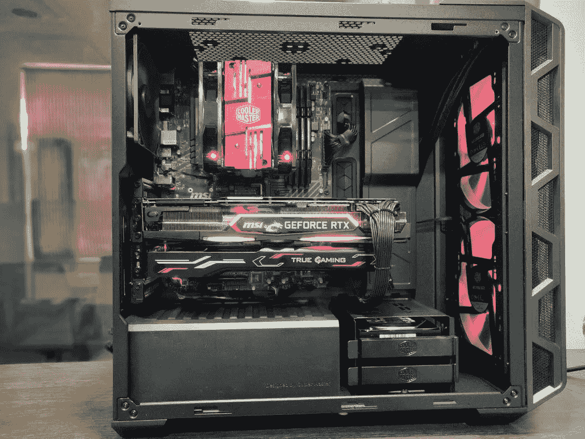
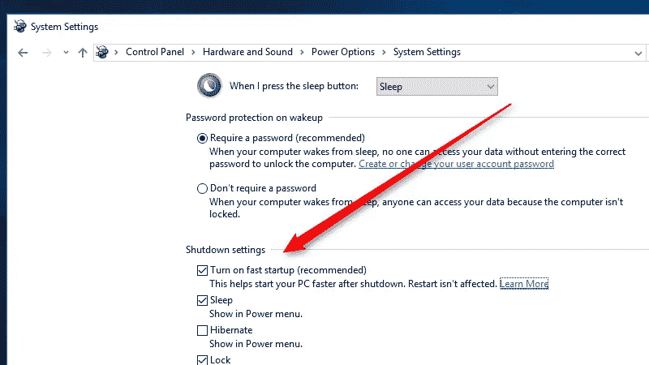
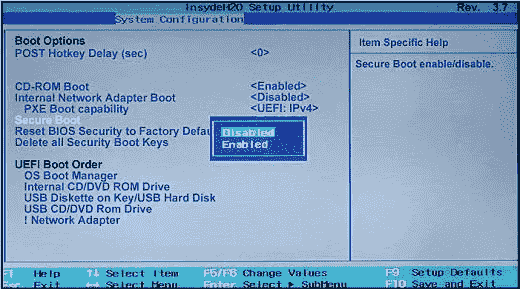
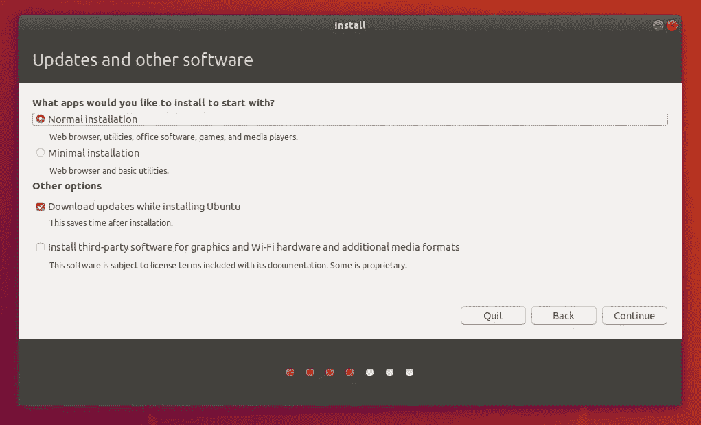
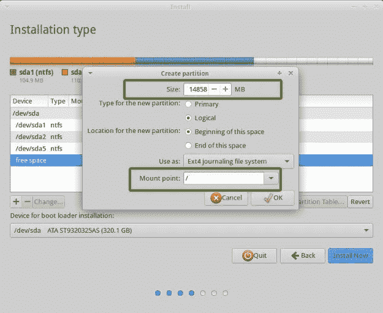
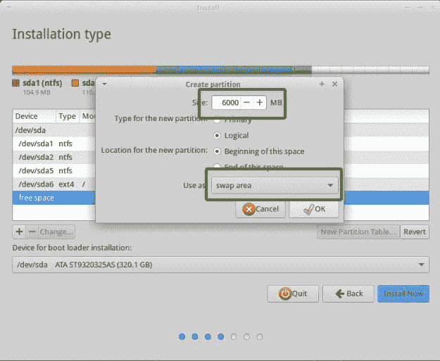
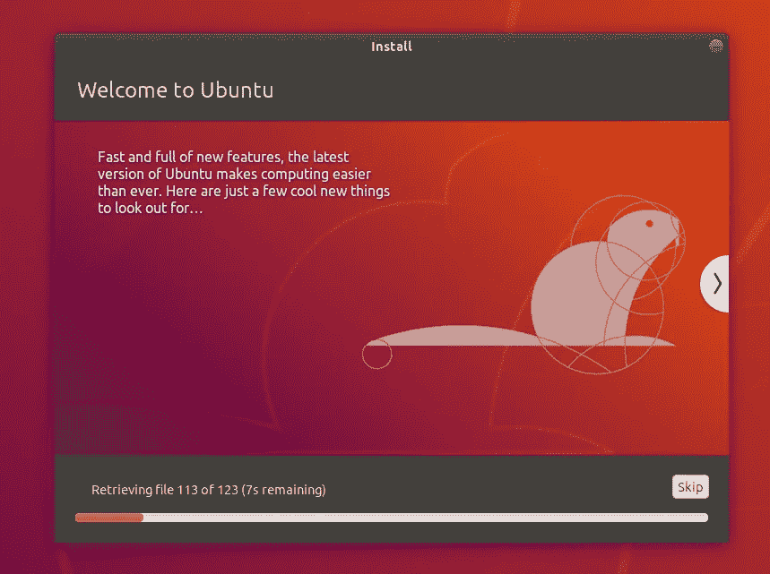
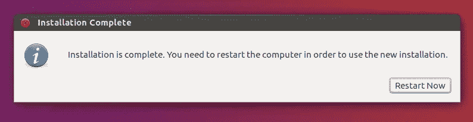
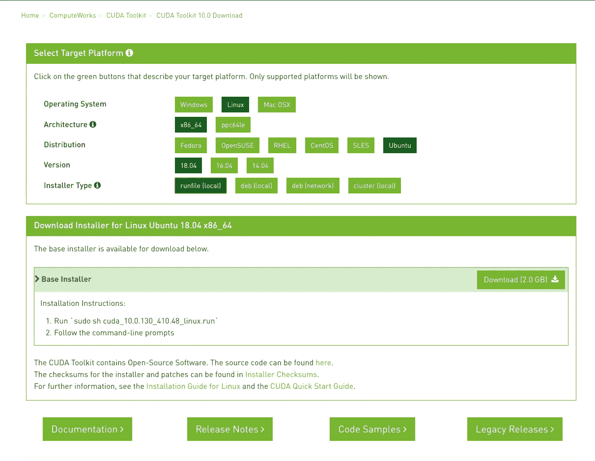

# 深度学习软件设置:CUDA 10 + Ubuntu 18.04(价值 4000 美元的 RTX 2080Ti (MSI) DL box 系列的第二部分)

> 原文：<https://medium.com/hackernoon/deep-learning-software-setup-cuda-10-ubuntu-18-04-15548cefa30>

## 获得我们第一个深度学习构建的第 2 部分

在[之前的文章](/p/82db257f0247)中，我已经简要介绍了我为[“中子”](/p/82db257f0247)挑选的零件，以及从第三方零售商那里组装它的原因:“Ant-PC”。



在这篇博客中，我将分享在基于 Nvidia 的“深度学习盒”上设置 T4 软件的一步一步的指导。

# 概述:

对于存储，[我有两个驱动器](https://medium.com/p/82db257f0247/edit):

*   三星 970 Pro NVMe M.2 512GB
*   2TB 硬盘

我的零售商很友好，按照我的要求在硬盘上安装了 500GB 的 windows 分区。

# Ubuntu 18.04 安装

对于 [Neutron](https://hackernoon.com/tagged/neutron) ，我打算将 Ubuntu 18.04 安装在 M.2 驱动器上，并在其上分配交换空间，加上在为归档和存储数据集分配的 2 TB HDD 中分配窗口后剩余的额外空间

# 预设置

*   禁用快速启动
    **(使用搜索，打开电源选项)电源选项** > **系统设置** > **选择电源按钮做什么**并取消选中**打开快速启动框**。



[Source](https://lifehacker.com/enable-this-setting-to-make-windows-10-boot-up-faster-1743697169)

*   禁用安全启动
    -搜索高级启动选项
    -点击立即重启
    -选择故障排除>高级选项> UEFI 固件选项设置>重启
    -将打开下一个 BIOS 设置，这将根据您的设置而有所不同
    -导航至启动选项卡
    -禁用安全启动
    -您可能需要打开/关闭传统支持



[Source](https://www.avira.com/en/support-for-home-knowledgebase-detail/kbid/1811)

# 创建安装程序

*   从[这里](https://www.ubuntu.com/download/desktop)下载 Ubuntu 18.04 的最新镜像。
*   你需要一个 4GB 以上的记忆棒。
*   如果你使用的是 Windows，使用[这个工具](https://rufus.akeo.ie)进行快速设置。
*   如果你有 Ubuntu 系统，使用内置的启动盘创建器。
*   重启并进入 BIOS，并启用从 USB 启动。

# 安装 Ubuntu

*   你应该能够启动到 Ubuntu
*   对于健全性检查-选择“尝试不安装 Ubuntu”
    -检查你的网卡是否工作正常。
    -检查声卡以获得快速缓解。
*   注意:如果 Ubuntu 没有检测到任何一个卡，这可能与内核版本有关——检查你的设备名称，看看是否支持。如果没有，你可能需要一个外部网络/wifi 卡和一个外部声卡。
*   选择语言



[Source](https://tutorials.ubuntu.com/tutorial/tutorial-install-ubuntu-desktop?_ga=2.120547080.164498141.1528985834-1164819070.1501830984#10)

*   安装时忽略更新(如果您的互联网速度较慢，安装会变慢)
*   选择语言。


[Source](https://tutorials.ubuntu.com/tutorial/tutorial-install-ubuntu-desktop?_ga=2.120547080.164498141.1528985834-1164819070.1501830984#10)

*   选择其他东西
*   从这里，选择您的驱动器。我选的是 512 GB 的 M.2
*   单击“+”
    接下来，您需要为您的操作系统分配空间并进行交换。
*   把大部分空间给/
    (我更喜欢给/和/家分配一个单独的空间。原因:某些安装，尤其是 CUDA 可能会超出分配给/)的大小



[Source](https://itsfoss.com/install-ubuntu-dual-boot-mode-windows/)

*   给两倍的内存空间进行交换。
    就我个人而言，我有 64GB 内存，并分配了 32GB，只是为了给我额外的空间来处理大型数据集。



[Source](https://itsfoss.com/install-ubuntu-dual-boot-mode-windows/)

*   设置您的登录凭据



[Source](https://tutorials.ubuntu.com/tutorial/tutorial-install-ubuntu-desktop?_ga=2.120547080.164498141.1528985834-1164819070.1501830984#10)

*   最后点击安装



[Source](https://tutorials.ubuntu.com/tutorial/tutorial-install-ubuntu-desktop?_ga=2.120547080.164498141.1528985834-1164819070.1501830984#10)

*   最后，重启。

就这样，你完了。

在下一小节中，我们将看看 CUDA 10 的安装

# CUDA 10 安装

快速提示:根据 [fastai 安装说明](https://github.com/fastai/fastai/blob/master/README.md#installation)，推荐:

> 如果您使用 NVIDIA 驱动程序 410+，您很可能希望通过以下方式安装`cuda100` pytorch 变种:
> 
> 康达安装-c pytorch pytorch cuda100

下面是使用安装 CUDA 的说明。运行 Nvidia 提供的文件。原因:由于 cuda100 版本只适用于 PyTorch，Tensorflow 可能会有一些问题，我会在测试之后更新这篇文章。

现在，开始安装:

# 更新和升级

```
$ sudo apt-get update
$ sudo apt-get upgrade
```

# 安装 Nvidia 驱动程序

*   从[这里](https://www.nvidia.in/Download/index.aspx?lang=en-in)下载驱动程序。
*   接下来，将运行权限授予。运行文件

```
chmod +x NVIDIA-Linux-x86_64-410.93.run
```

*   通过运行以下命令，重新启动并检查驱动程序是否安装正确:

```
nvidia-smi
```

*   如果您得到一个包含您的 GPU 细节的输出，那么一切都设置好了。

陷阱:

*   万一你的 Ubuntu 卡在“引导循环”里:
    -按 Ctrl+Alt+F3(注意:在 16 上，它的 ctrl+alt+f1 得到 tty1)
    -清除驱动

```
sudo apt-get purge nvidia-*
```

*   重新启动

# 安装康达

*   为了安装最新版本的 Conda，我们将使用一个由 [Kaggle Master Mikel](https://twitter.com/mikb0b) 编写的便捷脚本

```
curl [https://conda.ml](https://conda.ml) | bash
```

或者，如果您想从 Anaconda 的网站下载安装程序，也可以。上面的方法省去了你启动浏览器、点击、搜索和保存的时间——好了，你明白了。

# 安装 CUDA

*   点击从[下载 CUDA。](https://developer.nvidia.com/cuda-downloads?target_os=Linux&target_arch=x86_64&target_distro=Ubuntu&target_version=1710&target_type=runfilelocal)
*   我正在安装 CUDA 10.0
*   下载运行文件(本地)



*   打开终端并将目录更改为下载。
*   更改安装程序的可执行权限。
*   运行它。

```
$ cd Downloads
$ chmod +x ./cuda_10.0.130_410.48_linux.run
$ sudo ./cuda_10.0.130_410.48_linux.run
```

*   按空格键向下滚动并接受条款和条件
*   键入`yes` 至提示“不支持配置安装”
*   出现提示时，键入`no`按钮“为 Linux-x86_64 xyz.xyz 安装 NVIDIA 加速图形驱动程序”。
*   保留默认值。
*   重新启动
*   重新启动后，检查 CUDA 版本

```
nvcc -V
```

这将提示已安装的 CUDA 版本

*   如果出现引导循环问题，请清除驱动程序，然后重试。

## 设置路径

```
export PATH="/home/User/anaconda3/bin:/usr/local/cuda/bin:$PATH"
export LD_LIBRARY_PATH="/usr/local/cuda/lib64:$LD_LIBRARY_PATH"
source ~/.bashrc
```

# 安装 Cudnn

*   从[这里](https://developer.nvidia.com/cudnn)下载你安装的 CUDA 版本支持的 Cudnn 版本(你需要一个 Nvidia 账号)
*   下载后，我们将打开归档文件的包装，并将内容移动到安装 CUDA 10.0 的目录中:

```
tar -zxvf cudnn-_.0-linux-x64-v_.tgz
sudo cp -P cuda/lib64/* /usr/local/cuda-10.0/lib64/
sudo cp  cuda/include/* /usr/local/cuda-10.0/include
sudo chmod a+r /usr/local/cuda-10.0/include/cudnn.h
```

最后，因为我是 fastai 的粉丝——为了结束，我们将为 FastAI 设置一个 conda 环境

# 设置快速 AI

*   创建 conda 环境

```
$ conda **create** -n fastai 
$ conda **activate** fastai
```

*   分享[官方回购](https://github.com/fastai/fastai/blob/master/README.md#installation)的指示。

```
$ conda install -c pytorch -c fastai fastai
```

*   遵循一些关于性能提升的进一步说明

```
$ conda uninstall --force jpeg libtiff -y
$ conda install -c conda-forge libjpeg-turbo
$ CC="cc -mavx2" pip install --no-cache-dir -U --force-reinstall --no-binary :all: --compile pillow-simd
```

## 设置(其他/任何)环境

*   使用 requirements.txt 或 req.yml 文件进行 Pip 安装或 conda 安装。

```
pip install -r <Link>
```

# 快速试验

*   检查库内是否可以访问 CUDA 设备。
*   PyTorch 具有检查 CUDA 设备的功能

```
**torch.cuda.is_available****()**
```

这应返回真。

# 快速试验

为了预热 GPU，我们可以尝试文档中的示例脚本:

```
path **=** untar_data(URLs**.**MNIST_SAMPLE)
data **=** ImageDataBunch**.**from_folder(path)
learn **=** create_cnn(data, models**.**resnet18, metrics**=**accuracy)
learn**.**fit(1)
```

只需在 nb 中运行这几行代码。

[在我的 GPU 上](/p/82db257f0247)-这大约需要 2 秒钟来运行。

就这样。你完蛋了。

*如果你觉得这篇文章有用并且想保持联系，你可以在推特上找到我* [*在这里*](http://twitter.com/bhutanisanyam1) *。*。