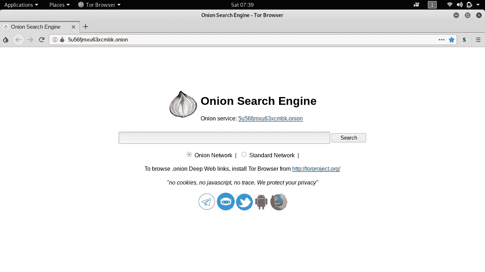
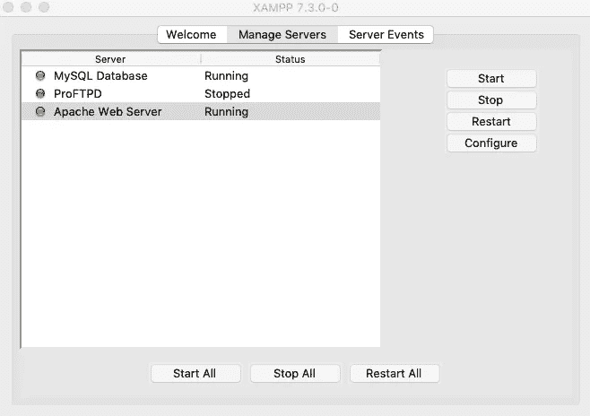
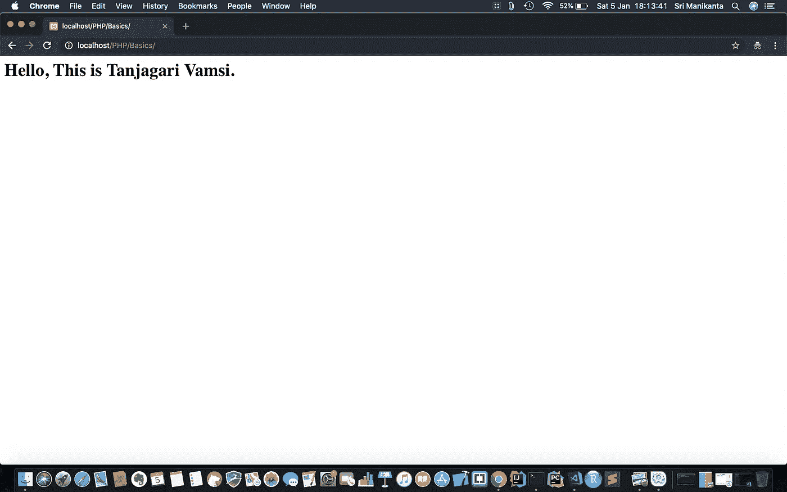
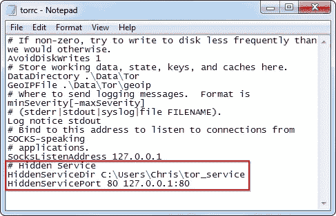
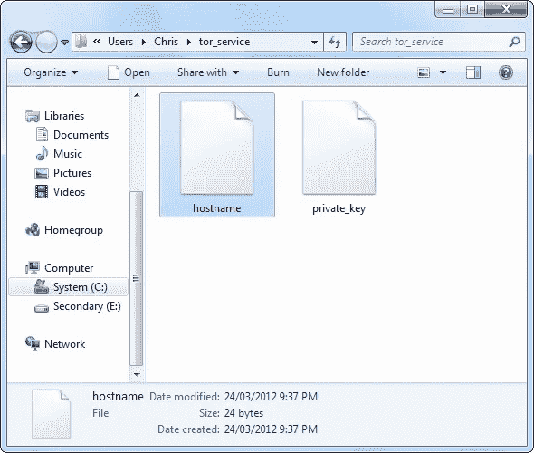
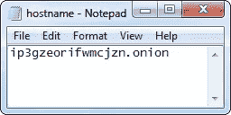

# 深网和暗网解释

> 原文：<https://medium.com/hackernoon/deep-web-dark-web-explained-dd3b1e6855e>

## 如何在 Tor network 上创建您的免费洋葱网站来设置匿名服务器或网站。


Photo by [Kaur Kristjan](https://unsplash.com/@badgerblack?utm_source=medium&utm_medium=referral) on [Unsplash](https://unsplash.com?utm_source=medium&utm_medium=referral)

# 万维网有哪些类型？

**WWW:** 有三种类型

1.  表面网。
2.  深网。
3.  黑暗之网。

## 表面网:-

> 在搜索引擎中找到的网站。我们可以直接访问网站。被搜索引擎索引。

## 深层网络:-

对用户和搜索引擎隐藏的网站。直接提供给有资格访问的用户的链接，例如，向他们提供将在给定登录链接中使用的认证细节，如访问银行记录和医疗记录。它不被搜索引擎索引。

## 黑暗之网:-

暗网是一个术语，指的是高度加密的网站和网络，对普通互联网用户来说是“隐藏”的。人们这样做有很多原因，但黑暗网络已经被定义为一种巨大的黑市，与毒品、枪支、黑客和阴谋联系在一起。

也就是说，对于那些真的真的喜欢自己的隐私并且不喜欢任何干涉的人来说，它也是一个避风港。它通常用于那些严格控制言论自由和实施严格监管的政府。

## 那么，它和正常的互联网是分开的吗？

差不多吧，是的。数据本身仍然使用相同的渠道，但加密墙在“正常”互联网内容和黑暗网络之间划出了清晰的界限。例如，你不能随时跳上你最喜欢的浏览器，访问一个黑暗的网站。出于各种原因，谷歌等传统搜索引擎也倾向于不索引或显示任何黑暗的网络内容。

## 暗网和深网有什么不同？

虽然这两个术语有时可以互换使用，但有一个重要的区别:深度网是指普通用户看不到的、普通搜索引擎无法索引的所有网络部分。这包括大量的数据，各种网页的内部副本，以及任何你需要密码才能访问的东西。

因此，出于需要，几乎每个在线网站都有一些内容在深层网络中。暗网只是深网的一小部分，目的更集中。


Source from google.

## 如何在 Tor 网络上创建你的免费洋葱网站？

## 步骤 1:-安装 Tor

从 https://www.torproject.org/[安装 **Tor**](https://www.torproject.org/)

它适用于 Linux、Mac OS 和 Windows。



## 步骤 2:-托管服务器

安装 https://www.apachefriends.org/download.html 的 XAMPP 服务器

现在启动 Apache 服务器和 MySQL 服务器。



一旦你的 web 服务器设置好了，确保它工作正常:打开你的浏览器，进入 [http://localhost:8080/](http://localhost:8080/) ，其中 8080 是你在设置时选择的 web 服务器端口(你可以选择任何端口，8080 只是一个例子)。然后试着把一个文件放在主 HTML 目录中，并确保当你访问这个站点时它会出现。



## 步骤 3:-配置您的 Tor 服务

接下来，您需要配置您的洋葱服务以指向您的本地 web 服务器。



首先，打开您的 torrc 文件，转到中间部分并查找该行

```
### This section is just for location-hidden services ###
```

文件的这一部分由多行组成，每一行代表一个洋葱服务。现在它们都被注释掉了(这些行以#开头)，所以洋葱服务被禁用了。每组线路由一条 HiddenServiceDir 线路和一条或多条 HiddenServicePort 线路组成:

将下列行添加到您的 torrc 中:

```
HiddenServiceDir /Library/Tor/var/lib/tor/hidden_service/
    HiddenServicePort 80 127.0.0.1:8080
```

您将需要更改 HiddenServiceDir 行，使它指向一个实际的目录，该目录对于运行 Tor 的用户是可读/可写的。如果你使用的是 OS X Tor 软件包，上面那行应该可以。在 Unix 上，尝试“/home/username/hidden_service/”，填写自己的用户名代替“username”。在 Windows 上，您可以选择:

```
HiddenServiceDir C:\Users\username\Documents\tor\hidden_service
	HiddenServicePort 80 127.0.0.1:8080
```

注意，从 0.2.6 开始，SocksPort 和 HiddenServicePort 都支持 Unix 套接字。这意味着您可以将 HiddenServicePort 指向一个 Unix 套接字:

```
HiddenServiceDir /Library/Tor/var/lib/tor/hidden_service/
    HiddenServicePort 80 unix:/path/to/socket
```

现在保存 torrc 并重启 tor。

当 Tor 启动时，它会自动创建您指定的 HiddenServiceDir(如果需要的话)，并在那里创建两个文件。



Tor 将为您的洋葱服务生成一个新的公钥/私钥对。它被写入一个名为“private_key”的文件中。不要与他人共享此密钥—如果您这样做，他们将能够假冒您的洋葱服务。Tor 将创建的另一个文件的主机名称为“主机名”。这包含您的公钥的简短摘要-它看起来类似于 duskgytldkxiuqc6.onion。这是您的服务的公共名称，您可以告诉人们，在网站上发布它。



如果 Tor 以不同于您的用户身份运行，例如在 OS X、Debian 或 Red Hat 上，那么您可能需要成为 root 用户才能查看这些文件。

立即尝试:将主机名文件的内容粘贴到您的 web 浏览器中。如果成功，您将获得您在第二步中设置的 HTML 页面。