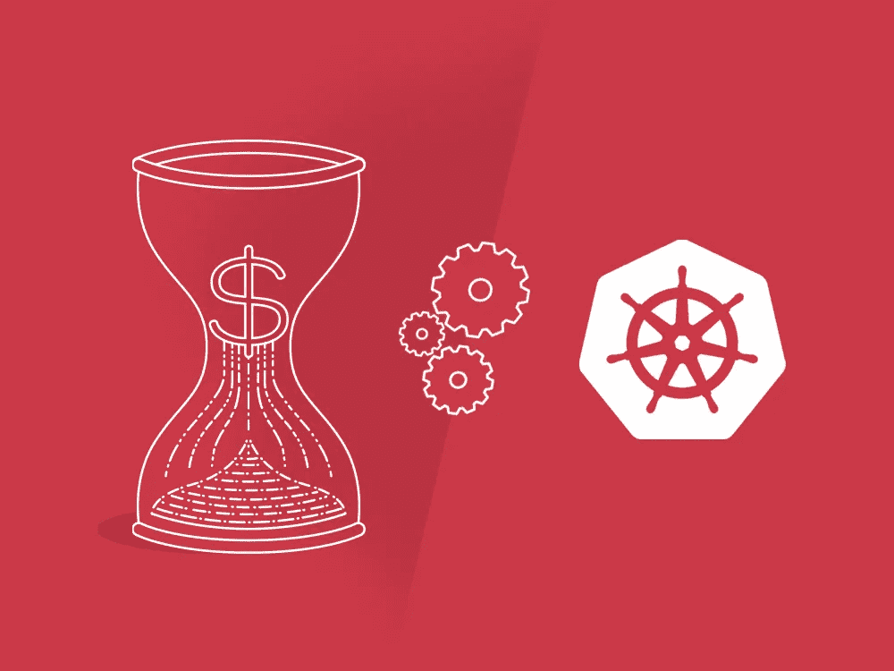
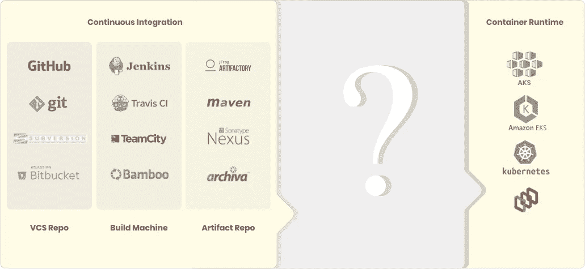

# 向 Kubernetes 交付应用的延迟

> 原文：<https://medium.com/hackernoon/delays-in-app-delivery-to-kubernetes-5d0511094f38>

Delivering enterprise applications to Kubernetes

世界各地的企业开始意识到集装箱和 Kubernetes 的趋势。将应用程序作为容器包交付给 Kubernetes 有很多好处，但同时，应用程序容器化的过程以及随后应用程序部署到 Kubernetes 会遇到许多障碍。由于使用 Kubernetes 和 containers 进行应用交付的想法是最近才出现的，从传统交付系统到这些现代交付系统的过渡是一个颠簸的过程。

Major roadblocks while achieving continuous delivery

要实现现代化，将大型应用程序分解成较小的微服务只是一个开始。主要的挑战是将这些微服务作为容器持续地交付给 Kubernetes。大多数企业团队在这方面投入了大量的时间和精力，并以延迟的交付过程而告终。

那么，到底是什么故障导致了**的延迟呢？**

# **app 交付延迟原因**

## → **集装箱化**

随着容器技术成为企业软件栈中的新手，没有多少团队能够找到一种方法来简化它带来的复杂性。容器化过程从创建 Docker 文件开始。这个 Docker 文件应该由 Docker 读取，并获得一系列关于如何构建 Docker 映像的指令。接下来创建一个构建命令，该命令使用 docker 文件来生成 Docker 映像。当这个 docker 映像运行时，您会得到一个 Docker 容器。如果必须对大量容器重复同样的操作，这一过程有点复杂且耗时。对于只有几个服务的小规模应用程序，容器化很容易。但是，对于可能有数百个微服务的大型企业应用程序来说，创建和维护容器会变得非常困难。

将容器编排添加到流程中，您会看到更高层次的复杂性，包括设置编排器和部署到 Kubernetes。

## →交付给 Kubernetes

*   **手动大规模部署容器** Kubernetes 中几乎所有面向用户的组件都是在 YAML 文件中设计的。因此，对于任何具有大量互连服务的企业应用程序，都可能有多个 YAML 文件，这要求用户非常习惯空白语法，否则，结果可能会令人沮丧地容易出错，并且没有关于何时何地出错的反馈。
    如果你把这部分都想好了，那么在 Kubernetes 应用程序中有几个[不同的资源类型](https://kubernetes.io/docs/concepts/cluster-administration/manage-deployment/)需要处理。其中一些可能需要升级，根据您正在使用的应用程序的类型，知道更新什么可能会使 Kubernetes 的部署更加复杂。对于一次性交付来说这样做仍然是可行的，但是管理大量容器到 Kubernetes 的交付并不时地更新它们是完全不同的场景。随着迭代次数的增加，应用交付往往会变得容易出错。还有一些任务，比如跟踪差异历史记录和管理新旧部署的回滚，这又增加了一层复杂性。
*   **备选方案太多，无法部署** 当然，有一些自动化工具可以减少将应用程序部署到 Kubernetes 所需的工作。有许多选项可以将 Kubernetes 作为托管或托管平台来运行。这又有几个复杂性。首先，将您的更新或新特性部署到您正在运行的集群并不像看起来那么简单。由于没有普遍认可的方法来做到这一点，因此很难从几种方法中选择一种方法来确保它适合手头的团队。如果您考虑在过程中引入部署自动化工具来加速它，团队将面临几个选择。由于有大量的工具来自动化部署，广泛的选项使企业陷入分析瘫痪，最终导致延迟实现向 Kubernetes 交付应用的标准化方法。这首先否定了使用部署自动化工具的目的。即使在自动化工具设置到位之后，仍然存在一个主要问题，即弄清楚 CD 管道的一些参数，以使工具启动并运行，如版本控制系统、CI 系统、Docker registry 和 Kubernetes 集群。
    一旦这些组件到位，企业就准备好了 Kubernetes 的持续交付渠道。
*   **开发人员在实现平稳交付的同时需要进行上下文切换** 容器为 IT 运营团队和开发人员带来了很多复杂性。由于这项技术相对较新，人们对 Kubernetes 和 Docker 容器缺乏足够的了解。为了确保顺利的应用交付过程， [DevOps 团队](https://www.informationweek.com/devops/measure-devops-for-efficiency-not-just-speed-/a/d-id/1330916)必须高效。否则，简化流程的斗争将会持续下去。当开发人员需要参与容器管理和交付过程时，他们需要时间来习惯容器交付。如果将这些时间用于应用程序服务的编码，效率会更高。网飞的工程总监 Sangeetha Narayanan 说，“任何花在对抗系统或工具上的时间都不是花在为企业提供价值上的时间。”同时谈论[改善开发者体验](https://www.infoq.com/podcasts/improving-developer-experience-netflix?useSponsorshipSuggestions=true&itm_source=podcasts_about_cloud-computing&itm_medium=link&itm_campaign=cloud-computing)以实现流畅的应用部署流程。这适用于大多数企业应用程序开发团队，他们在拥抱现代化的过程中尝试向 Kubernetes 交付应用程序。
*   **微服务架构被认为是使用 Kubernetes** 的一个硬性先决条件，因为微服务可以很好地处理容器，所以假设 Kubernetes 也是如此。许多企业不断推迟向 Kubernetes 部署应用程序，因为他们的应用程序仍然是一个遗留应用程序，并且错过了获得 Kubernetes 必须提供的好处，如可移植性、IT 成本节约和可扩展性。虽然在大多数情况下，基于微服务的应用是 Kubernetes 的理想选择，但并不是所有应用都是如此。将一块巨石包裹在一个容器中，并通过 Kubernetes 展开，也能创造奇迹。对于那些由于成本超过收益而无法重构为微服务的整体，这种方法可以快速启动应用程序现代化工作，同时加快应用程序部署。

# 解决方法是什么？

将企业应用部署到 Kubernetes 的[优势取代了你的团队面临的缺点，让你别无选择，只能想办法克服这些缺点。关键是自动化您的完整 CI/CD 渠道。但是，仅仅说你需要一个自动化的 CI/CD 管道，并不能让你所有的应用交付延迟消失。为了更顺利、更快速地交付给 Kubernetes，您需要一种能够简化流程的方法，记住这些具体的考虑事项。](https://www.infoworld.com/article/3173266/4-reasons-you-should-use-kubernetes.html)

## **解决方案注意事项:**

1.  **自动化:**容器化过程的自动化是顺利交付应用的第一步。应该不再需要为每个应用服务手动创建 Docker 映像。
2.  **流程的标准化:**为了减少在尝试适应每个定制流程和工具时所造成的延迟，需要有一个跨团队的标准化流程，用于向 Kubernetes 交付应用程序。
3.  **开发人员的自助服务交付体验:**如果通过让开发人员自己处理 DevOps 配置来实现以服务为中心的交付，则可以消除由于 DevOps 摩擦而导致的所有延迟。

满足所有这些考虑将提供大多数企业希望实现的应用交付自动化水平。

企业可以拥有一个非常高效的 DevOps 团队来实现这种程度的自动化，或者寻求一个专门构建的应用交付平台的帮助，以提供这些[功能](https://www.hyscale.io/platform-overview/)来实现向 Kubernetes 的平稳交付流程。有几个应用交付平台就是为此而设计的。像 HyScale、Codefresh 和 OpenShift 这样的平台是一些值得探索的选择。

根据企业应用程序的前景和团队的能力，您需要快速行动，决定如何顺利地将容器化的应用程序交付给 Kubernetes。