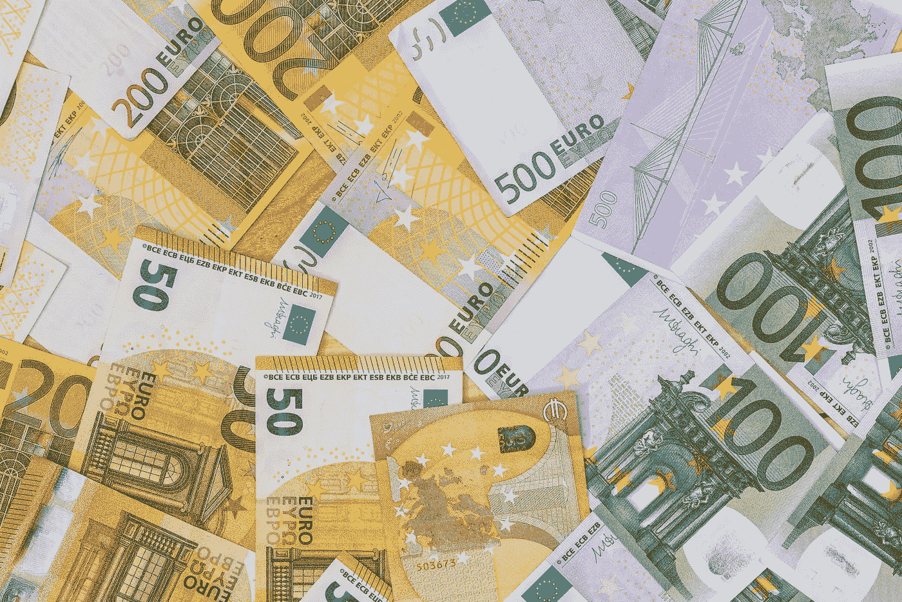

# Deliverect 必须为其€1200 万估值每月开具 67，797 份订阅的发票

> 原文：<https://medium.com/hackernoon/deliverect-must-invoice-67-797-subscriptions-per-month-for-its-12m-valuation-3c80467897cd>

比利时[创业](https://hackernoon.com/tagged/startup)T2【交付刚养的 [€3M](https://twitter.com/Deliverect_com/status/1112977236544643072) 来自[纽昂](http://www.newion.com/)等人。

他们制作软件，将 Takeaway.com、Deliveroo 和 Uber Eats 等送餐服务的终端连接到餐馆的收银机。

在其基本包中，Deliverect 向餐馆出售其软件的订阅费，每月 39€。这将 1 个送货服务连接到餐厅的收银机(每个附加服务每月 10€)。

# 估价

假设 Deliverect 向 Newion 出售了市场标准的 25%股权。

那么它们在€的估值为 300 万英镑/ 25% = €的 1200 万英镑。

€1200 万[估值](https://hackernoon.com/tagged/valuation)每月必须交付多少份订阅发票？

# 出口

假设这是一个(大)种子回合。

假设 Newion 想从它的赢家身上赚 10 倍。

他们需要 2 倍来补偿稀释。

那么 Newion 想让它的投资达到市场标准的 10 * 2 = 20x。

Deliverect 需要一个€1200 万* 20 =€2400 万的退出价值才能得到€1200 万的估值。

# 收入

假设 Deliverect 在退出时以市场标准的 12 个月收益的 5 倍进行交易。

并且在出口处没有现金和债务。

那么，他们需要€2.4 亿英镑/ 5 月 12 日=€400 万英镑的平均月收入，才能实现€1200 万英镑的估值。

# 捐款

假设每个餐馆想要连接 3 个递送服务。

然后 Deliverect 向€餐厅收取每月 59 英镑的订阅费。

然后，他们必须在退出时为其€1200 万的估值开具平均每月 400 万€/€59 = 67，797 份订阅的发票。

很多吗？

# NL 倍数

Takeaway.com([thuisbezorgd . nl](https://www.thuisbezorgd.nl/))表示，他们拥有 8000 多家餐厅，是荷兰食品配送的市场领导者。

假设没有增长。

假设其中 80%的餐馆，Deliverect 比餐馆当前处理多种交付服务的解决方案好 10 倍，后者是将每个在线订单重新输入收银机。

那么 Deliverect 在荷兰有 8000 * 80% = 6400 个潜在客户。

假设，考虑到他们解决的大问题，他们有 50%的市场份额。

然后他们在荷兰有 6400 * 50% = 3200 个客户。

假设每个客户每月购买 1 个订阅(3 个交付服务)。

那么 Deliverect 将在荷兰每月为 3，200 * 1 = 3，200 次订购开具发票。

他们必须在退出时为他们的€1200 万估值开出平均每月 67797 份订阅的发票。

因此，他们必须为€1200 万英镑的估价开具 67，797 / 3，200 = 21x 荷兰的发票。

再问一次，那很多吗？

让我们疯狂吧。

假设 Deliverect 的最终市场是北欧和西欧。欧洲其他国家因为饮食习惯和购买力而出局。美国出局是因为预计会有来自当地玩家的激烈竞争。

那么他们的市场，按居民计算，是荷兰的 17 倍。

然后，每月 67，797 份订阅——相当于荷兰的 21 倍——delivery 必须为其€1200 万的估值开具发票，这是一笔不小的数目。

# 自己动手

唷。假设太多了。你有不同的吗？

复制一份用于本文的[电子表格](https://docs.google.com/spreadsheets/d/1JFGs5-0-96vipq9Kj3IY8hZUc4iuQwc77PpPDHeNsI0/edit?usp=sharing)(文件>复制一份…)，加入你的假设并得出你自己的结论。

*感谢汉斯·韦斯特霍夫和奇雷蒂恩·赫本。*

*原载于 2019 年 4 月 12 日*[*venturevalue.com*](https://venturevalue.com/deliverect-must-invoice-67797-subscriptions-per-month-for-its-e12m-valuation/)*。*