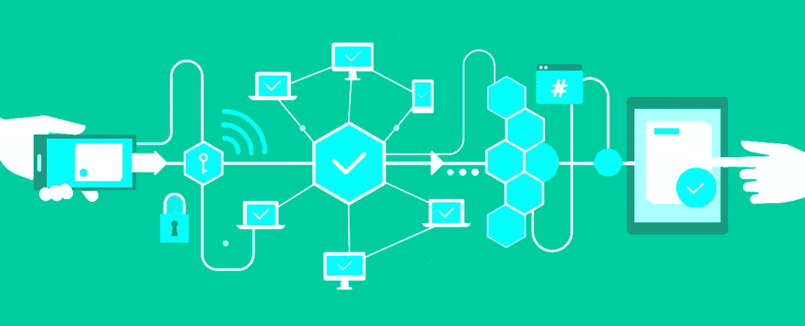
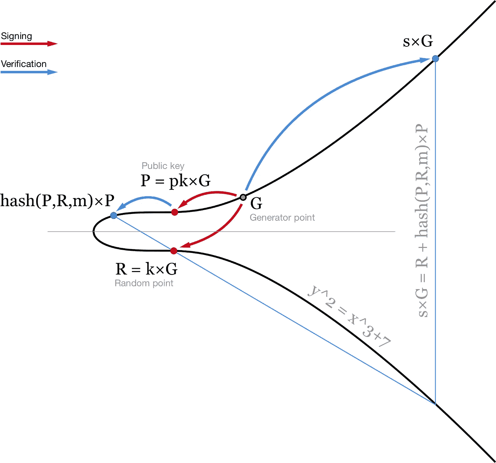
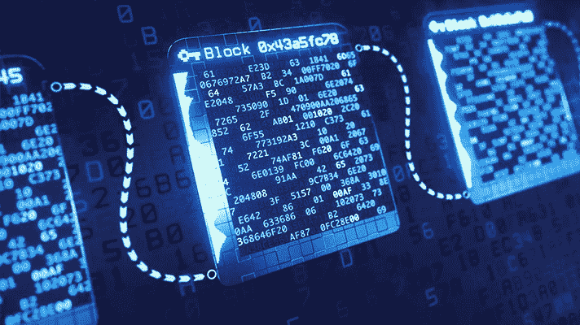
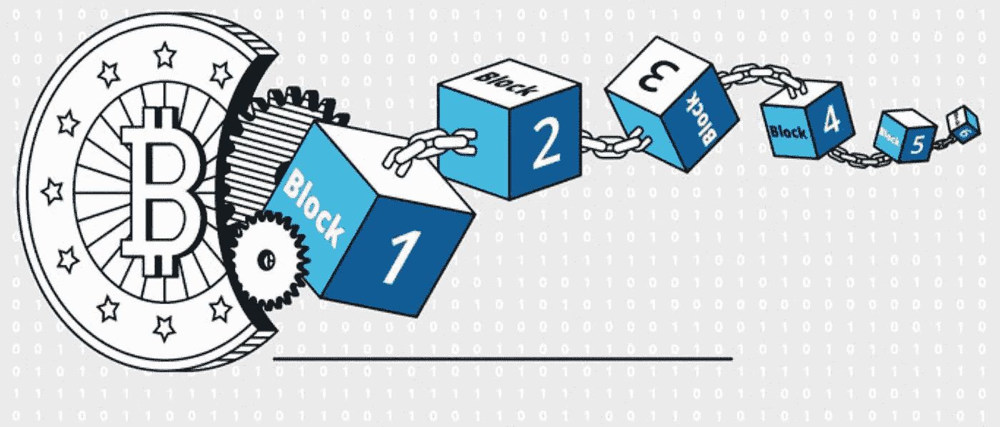

# 在区块链和 DLT 应用中实现实用隐私

> 原文：<https://medium.com/hackernoon/delivering-practical-privacy-in-blockchain-and-dlt-applications-e4fbca82327b>

[https://www.getreferd.com/blog/how-blockchain-can-change-healthcare/](https://www.getreferd.com/blog/how-blockchain-can-change-healthcare/)

在早期的加密技术中，隐私是区块链开发中的一个关键焦点，但是对于普通用户来说很难实现。从 2011 年到 2014 年，创建[多重签名交易](https://en.bitcoin.it/wiki/Multisignature)被认为是一项前沿技术，与单独执行标准的点对点交易相比，它为高级用户提供了更多的隐私和安全性。现在，multisig 已成为标准配置，比以往任何时候都更加用户友好。那么，过去 5 年发生了什么变化？我们什么时候能期待区块链为非技术用户和企业提供实用的隐私保护？

# 新的隐私保护协议

B itcoin 执行[伪匿名](https://en.wikipedia.org/wiki/Pseudonymity)交易，这意味着交易记录略有模糊，但可以通过分析区块链的公共分类账来找出。虽然比特币的早期旁观者预测它可以进行匿名交易，但事实从来都不是这样。当所有的交易都是公开的，不可改变的，时间会告诉一切。

这对企业来说意味着，从隐私角度来看，比特币目前不切实际，但隧道尽头有希望。幸运的是，像 [BIP 56](https://github.com/bitcoin/bips/blob/master/bip-0156.mediawiki) 和[施诺尔 BIP](https://github.com/sipa/bips/blob/bip-schnorr/bip-schnorr.mediawiki) 这样的比特币改进提案正在开发中，以增加隐私和可扩展性。

[https://medium.com/cryptoadvance/how-schnorr-signatures-may-improve-bitcoin-91655bcb4744](/cryptoadvance/how-schnorr-signatures-may-improve-bitcoin-91655bcb4744)

BIP 56 使用新的[蒲公英协议](https://bitcoinmagazine.com/articles/anatomy-anonymity-how-dandelion-could-make-bitcoin-more-private/)实现个人匿名保证。就像蒲公英在随机传播其种子之前漫无目的地在空中漂浮一样，蒲公英协议遵循类似的功能，在公开广播事务之前隐藏事务起源于何时何地。推出 BIP 56 作为软分叉将改善比特币隐私保障，并允许其他隐私和可扩展性 BIP，如 [Schnorr signatures](/@SDWouters/why-schnorr-signatures-will-help-solve-2-of-bitcoins-biggest-problems-today-9b7718e7861c) 在未来补充这一改进。

Schnorr 签名比比特币和以太坊中的 [ECDSA 签名](https://en.bitcoin.it/wiki/Elliptic_Curve_Digital_Signature_Algorithm)短，节省了添加到区块链中的每个块的空间，并解决了可扩展性等实际业务需求。此外，Schnorr 签名可以比 ECDSA 更高效地执行多签名事务。在 Schnorr multisig 中， *m-of-n* *签名可以合并成一轮签名*，而不是要求每个私钥持有者对公钥进行多轮签名。这意味着执行每个多签名交易所需的时间更少，因为需要签名的公钥更少，并且由于密钥合并的性质，交易记录更加不透明。

对许多行业和垂直行业的企业来说，保持财务交易的私密性至关重要，因为财务记录可以揭示公司的状态、进展和意图。如果你的竞争对手能看到你在购买和投资什么，他们就比你有竞争优势。随着蒲公英协议和 Schnorr 签名等比特币改进的上线，企业将受益于私人交易，这种交易比今天的公共交易更有效。其他加密货币也纷纷效仿。

# 区块链隐私是双向的

竞争对双方都有吸引力。例如，为了网络独立和自我主权，密码朋克对隐私感兴趣。并且企业对匿名协议感兴趣，以保持商业交易的私密性。对于交易频繁的私营部门来说尤其如此，在这些部门，糟糕的安全性可能会导致用户隐私和敏感的个人身份信息(PII)暴露，例如 [Equifax](http://fortune.com/2018/12/10/equifax-hack-lasted-for-76-days-compromised-148-million-people-government-report-says/) 、[雅虎](https://money.cnn.com/2017/10/03/technology/business/yahoo-breach-3-billion-accounts/index.html)或最近的[万豪/喜达屋酒店](https://www.forbes.com/sites/garystoller/2018/12/03/freeze-your-credit-now-after-marriottstarwood-hacking-expert-says/#e1f966c32b3f)事件。

[https://www.healthcareitnews.com/news/blockchain-proves-its-worth-healthcare-regulatory-questions-remain](https://www.healthcareitnews.com/news/blockchain-proves-its-worth-healthcare-regulatory-questions-remain)

这种广泛的用户和用例使得以隐私为中心的加密货币和分散应用成为持续发展的中心。像 [Schnorr signatures](/digitalassetresearch/schnorr-signatures-the-inevitability-of-privacy-in-bitcoin-b2f45a1f7287?ref=tokendaily) 、 [zkSNARKS](https://z.cash/technology/zksnarks/) 和 [MimbleWimble](/beam-mw/mimblewimble-explained-like-youre-12-d779a5bb483d) 这样的隐私保护协议，通过设计使交易模糊和匿名，正在以各种方式进行探索。我相信，在短期到长期的未来，我们将继续看到隐私增强区块链解决方案的进步。

对于开发隐私币的企业来说，一个新出现的考虑因素是他们开发开源与许可协议的方法。例如，MimbleWimble 协议使用 ECC 原语来完全匿名化交易，该协议正在由开源社区(参见 [Grin](https://grin-tech.org/) 实现)和私营公司(如以色列初创公司 [Beam](https://www.beam.mw/) )开发，后者试图以更可控的方式融合监管考虑和商业最佳实践。Beam 正在实施许可的机密交易，可以由第三方有选择地进行审计，并打算在未来某个日期开放其代码。吸引赛弗朋克和受监管企业可能是一个有风险的商业提议。但是在密码的世界里，实验引领潮流。而且，到目前为止，Grin 和 Beam 都在他们的隐私币上取得了初步成功。

# 取得监管平衡

在匿名和监管合规之间取得平衡将是区块链项目未来几年的重点。随着像 [GDPR](https://eugdpr.org/) 、[第 13 条](https://www.theverge.com/2019/3/27/18283541/european-union-copyright-directive-internet-article-13)和[加州消费者隐私法](https://www.law.com/njlawjournal/2018/12/01/the-california-consumer-privacy-act-what-you-need-to-know/?slreturn=20190215105417)这样的法规和版权指令继续在全球范围内推出，专注于合规性的加密货币将在实践中发展良好，而那些试图提供完全匿名的开源解决方案的加密货币将在受监管的商业实践范围之外找到自己的位置。

最近，我们看到摩根大通发布了自己的 B2B stable Coin T1，名为 T2 JPM Coin T3，专注于汇款。JPM 硬币使用基于其自己的企业以太坊许可实施的私有账本，[法定人数](https://www.jpmorgan.com/global/Quorum)，其通过设计限制对合规业务的访问。

[https://www.investinblockchain.com/blockchain-digital-privacy-future/](https://www.investinblockchain.com/blockchain-digital-privacy-future/)

这种使用私有分布式账本技术(DLT)开发加密资产的策略避开了许多需要公共和开源加密货币来克服的技术障碍。然而，JPM 硬币与其他银行、金融机构或开发自己的加密资产的初创公司并不友好。至少目前是这样。

这个沙盒限制了客户的 JPM 硬币的范围和效用。当客户需求发生变化，业务朝着新的方向发展时，使用 JPM 币和基于联盟的加密货币的客户将会受到亏待。专用 DLT 的启动成本很低，可以在短期内解决利基使用案例，但未来转向更具互操作性的公共区块链基础设施的成本可能会高得惊人。有远见的公司应该花时间明智地权衡他们的选择。

# 隐私即服务时间表

在中，基于银行和财团的短期加密货币将满足非常特殊的需求，如银行间的 SWIFT 交易，这可以降低昂贵的国际支付和汇款的密集利润。第一波将使用专有的利基技术来执行，这些技术旨在以最小的互操作性为代价来满足监管和消费者保护合规性等大业务现实。

从中期来看，像 Beam 这样的私有加密货币将会迎头赶上，以满足反洗钱和 KYC 等合规性要求，并为机密交易提供选择性审计跟踪。这种策略将吸引那些负担不起管理费用或像摩根大通这样的大企业的排他性要求的小企业。

[https://www.investopedia.com/articles/investing/082914/basics-buying-and-investing-bitcoin.asp](https://www.investopedia.com/articles/investing/082914/basics-buying-and-investing-bitcoin.asp)

在短期和长期时间表中，像 Grin 和 [Zcash](https://z.cash/) 这样由 cypherpunk 支持的隐私币将对委内瑞拉等国家的个人产生吸引力，在这些国家，自我主权和匿名是使用加密货币而不是当地法定货币的关键考虑因素。

随着越来越多的行业和垂直行业(如旅游和酒店、供应链管理和物联网)被区块链和分布式账本技术的优势所吸引，我相信我们会看到隐私在未来 3-5 年内被发展成为未来应用的核心组成部分。一旦隐私、可扩展性和互操作性在私营部门得到解决，公共区块链技术将开始作为新的分散业务架构的新*工作方式*，并在未来 5-10 年内产生全球性影响。一个私人的、安全的去中心化未来的基石正在缓慢而稳定地堆积起来。