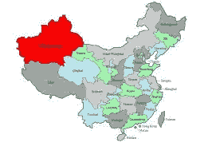

# 人工智能威胁使民主濒临崩溃

> 原文：<https://medium.com/hackernoon/democracy-on-the-precipice-through-ai-threat-ea9a4d92a887>

Photo by [Uriel Soberanes](https://unsplash.com/photos/iSy3_frM3PI?utm_source=unsplash&utm_medium=referral&utm_content=creditCopyText) on [Unsplash](https://unsplash.com/search/photos/tentacles?utm_source=unsplash&utm_medium=referral&utm_content=creditCopyText)

## 随着中国的技术触角伸向全球更远的地方，其人工智能发展的威胁可能会造成技术漏洞，西方的国土安全机构可能不会清楚这一点

# 合作关系

最近有消息称[中国国防科技大学与微软](https://www.ft.com/content/9378e7ee-5ae6-11e9-9dde-7aedca0a081a)合作启动人工智能(AI)的进一步发展，这吓坏了美国的一些政客。两名美国主要参议员对科技巨头此举的抗议被视为对美国国家安全的威胁。

*随着人工智能系统的不断改进和增强，该领域的专家认为它危及人们的网络自由。随着各国越来越多地与人工智能技术的发展保持一致，一个非常现实的威胁是，世界各国政府——将人工智能视为控制其公民一举一动的便捷方式——将为了自己的便利而实施此类系统。*

# 打击言论自由

对于那些习惯了法治和言论自由的传统西方民主国家来说，跟踪和监控人们生活的能力显然是令人反感的。对于那些在公民自由和侵犯人权方面有不良记录的国家来说，任何通过使用人工智能技术来加强这些机构对权力的控制的潜在威胁只会让那里的人民变得更糟。进一步的镇压和严厉的监视是它保证的一件事。

**在中国西部穆斯林人口占多数的动荡不安的新疆维吾尔自治区，北京已经对人们的智能手机和日常活动实施了最先进的监控和跟踪技术。然而，如果不加以控制，镇压可能会加深该省人民的怨恨，并导致种族以及宗教暴力的升级。**

Xinjiang Uygur Autonomous Region in the far west has a Muslim minority that Beijing keeps under constant surveillance Source: Chinafolio.com

> 在西藏，北京的策略也是如此。

总而言之，全球有几十个国家正在使用中国的人工智能系统有效地监控和压制其境内的少数民族群体和政治对手。在肯尼亚。在孟加拉国。即使是在埃尔多安的土耳其。巧妙的是，中国政府正在出口这项技术，作为其“一带一路”倡议的一部分，北京资助建设项目，如道路建设、能源管道和电信项目，向世界上一些最贫穷的国家出口。

毫不奇怪，这些国家都有糟糕的人权记录。

# 智能城市

随着中国科技界的巨头中兴和华为目前正在巴基斯坦和菲律宾等国建设智能城市，人们对铁矿石的担忧日益加剧。在这些自称为[“智能城市](https://jamestown.org/program/huaweis-smart-cities-and-ccp-influence-at-home-and-abroad/)”的城市中，他们打算安装带有数据分析功能的高端监控设备，以监控交通流量，并通过使用最先进的摄像头来发现街道上的犯罪活动。

Photo by [JC Gellidon](https://unsplash.com/photos/Khqmo4T-rs0?utm_source=unsplash&utm_medium=referral&utm_content=creditCopyText) on [Unsplash](https://unsplash.com/search/photos/smart-city?utm_source=unsplash&utm_medium=referral&utm_content=creditCopyText)

几十年来，津巴布韦饱受艰难困苦和政府压制的折磨，在与中国公司青山[签署数十亿美元的采矿协议后，津巴布韦正在与另一家专注于面部识别软件的中国科技公司 CloudWalk 合作，创建一个可用于面部识别的“国家形象”数据库。](http://www.chinadaily.com.cn/a/201904/24/WS5cbf4398a3104842260b7df5.html)

对于那些习惯于前总统罗伯特·穆加贝镇压的反对者来说，这是个坏消息，现任津巴布韦领导人埃默森·姆南加古瓦似乎正在竭尽全力效仿穆加贝。

对那些珍视自由的西方人来说，这是严厉的措施，但对那些有压制倾向、希望监控其公民习惯的政府来说，这是一个万灵药。

# 扩张计划

西方的看护者将微软与中国大学的合作视为 XXX 向世界其他地区推广其国家当前人工智能技术的机会。这种担心被民主国家视为中国进一步破坏其打击政治导向的网络犯罪的机会。

Source: Philly.com

无论北京的意图是仅仅为了利润而出售技术，还是通过缓慢而系统地传播其人工智能技术来在地缘政治领域获得立足点，都是任何人的猜测。无论如何，对西方来说不幸的是，这似乎意味着那些采用人工智能技术的国家正在开放自己，完全依赖中国的人工智能系统，这些系统一旦完全融入人民的生活和国家的基础设施，就可能传播错误信息、假新闻、名为“ [deepfake](https://whatis.techtarget.com/definition/deepfake) ”的模拟视频和音频，这些信息和音频与真实事件一样可信。

> 一个真正的勇敢新世界比例的赫胥黎式的噩梦。

对于华盛顿那些偏执于国土安全和外交政策问题的人来说，这不是一个好的解决方案。

然而，美国政府正在使用同样的人工智能技术来应对这一威胁。

> 然而，这是一场通往巅峰的竞赛。谁将是赢家仍有争议。

# 你的手也很脏

但是每个故事都有两个方面:中国政策的支持者认为美国公司过去向出价最高的外国投标人出售技术是有罪的，北京指责思科和微软这两家全球最大的科技公司在向邪恶的专制国家提供服务时使用了不光彩的策略。

Photo by [Ian Espinosa](https://unsplash.com/photos/oXo6IvDnkqc?utm_source=unsplash&utm_medium=referral&utm_content=creditCopyText) on [Unsplash](https://unsplash.com/search/photos/dirty-hands?utm_source=unsplash&utm_medium=referral&utm_content=creditCopyText)

# 5G 扩容到老 Blighty

W [最近有消息称，英国政府已经同意在其 5G 网络基础设施中采用华为的技术](https://www.silicon.co.uk/mobility/4g/uk-huawei-limited-5g-network-245601)，对于具有民主思想传统的国家的政策制定者来说，在使用中国的创新之前，进行长时间的认真思考是很重要的——无论是在人工智能、计算机视觉、5G 高级无线系统或任何其他技术进步方面——因为它们很可能会创造一种主从的场景。

Source: Awanheart.com

***谁想要那个？***

肯定没有人重视他们的自由。