# 揭秘梯度下降优化算法的不同变体

> 原文：<https://medium.com/hackernoon/demystifying-different-variants-of-gradient-descent-optimization-algorithm-19ae9ba2e9bc>

## 了解对梯度下降的不同改进，并使用 2D 等高线图比较它们的更新规则。

Photo by [Willian Justen de Vasconcellos](https://unsplash.com/@willianjusten?utm_source=medium&utm_medium=referral) on [Unsplash](https://unsplash.com?utm_source=medium&utm_medium=referral)

代表监督学习方法的神经网络需要包括目标变量在内的完整记录的大型训练集。训练深度神经网络以找到该网络的最佳参数是一个迭代过程，但是在大型数据集上迭代地训练深度神经网络是非常慢的。所以我们需要的是通过一个好的优化算法来更新网络的参数(权重和偏差)可以加快网络的学习过程。深度学习中优化算法的选择会影响网络的训练速度和性能。

在本文中，我们将讨论改进梯度下降优化技术的必要性，我们还将讨论梯度下降优化算法的不同变体。

> 引用说明:本文的内容和结构基于四分之一实验室的深度学习讲座— [Padhai](https://padhai.onefourthlabs.in) 。

文章的其余部分结构如下，

*   **梯度下降**
*   **动量梯度下降**
*   **内斯特罗夫加速梯度下降**
*   **小批量&随机梯度下降**
*   **自适应梯度下降— AdaGrad**
*   **均方根传播梯度下降— RMSProp**
*   **自适应矩估计— Adam**

# 梯度下降

梯度下降是优化神经网络最常用的优化技术之一。梯度下降算法通过相对于网络参数在与目标函数的梯度相反的方向上移动来更新参数。用于单个 sigmoid 神经元梯度下降算法是这样工作的，

Learning Algorithm

参数更新规则将由下式给出:

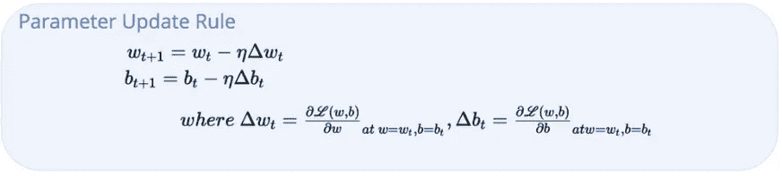

*   随机初始化参数 **w** 和 **b** 并迭代数据中的所有观察值
*   计算每个参数的梯度值(即，我们需要向哪个方向移动以减少损失)
*   根据每个参数的梯度值更新其值
*   继续执行步骤 2 和 3，直到损失函数最小化

学习率定义了我们达到最小值所走的步数。换句话说，它控制着我们应该以多快或多慢的速度收敛到最小值。

> 能不能想出一个更好的更新规则？

为了更好地理解梯度下降更新规则，我采用了一些玩具数据，并在所有数据点上迭代了 1000 个时期，并计算了不同值的 **w** 和**b**的损失。一旦我获得了 **w** 和 **b** 的所有可能组合的损失值，我就能够生成一个动画来显示梯度下降规则的作用。

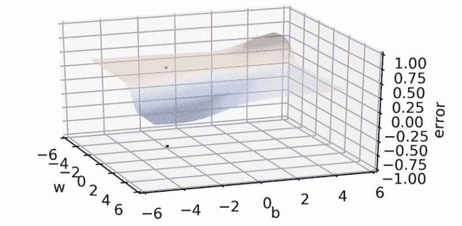

Gradient Descent Rule in Action (Animation)

图表中较深的红色阴影表示损失值较高的区域，而山谷中较深的蓝色阴影表示损失的最低点。底部的点表示 **w** & **b** (参数)的不同组合，轮廓上的点表示相应参数值的损失值。

从渐变下降损失动画中，您会观察到，对于初始迭代，当曲线仍然在平坦的浅红色表面上时，轮廓图底部的 **w** 和 **b** 值在每个时期变化很小。这意味着我们朝着我们的目标迈出了非常小的步伐，但是一旦我们的损失曲线进入每个时期的谷底(浅蓝色区域)，w 和 b**的值就会发生巨大的变化(黑色机器人彼此相距很远)**

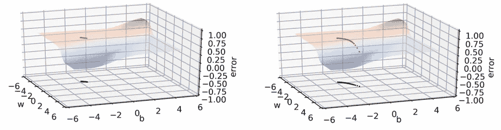

Small Steps towards Loss (Left) & Large Steps towards Loss (Right)

简而言之，在损失表面的平缓区域，运动非常缓慢，在陡峭区域，运动很快，在底部的平缓区域，运动也非常缓慢。

# 但是为什么呢？

我们已经对梯度下降更新规则进行了非常有趣的观察，但是我们不知道为什么在轮廓表面的某些部分移动很慢，而在某些部分移动很快。

让我们看一个如下所示的简单函数，

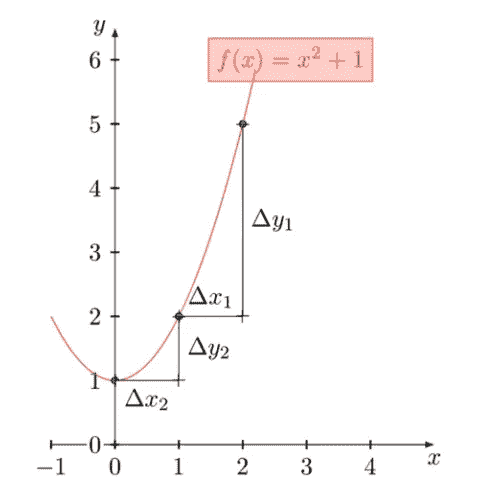

从图中可以看出，曲线是非常陡峭区域和平缓区域的组合。陡峭区域中曲线的斜率(导数)评估为值 3(y 的变化= 3，x 的变化= 1)。类似地，平缓区域中曲线的斜率评估为值 1。因此，我们推断，当斜率非常陡时，导数(梯度)高，当斜率平缓时，导数低。

陡坡处的导数数值较大，而缓坡处的导数数值较小。现在将这些信息与梯度下降动画联系起来，当我们处于缓坡的平台时，该区域的导数将会很小。如果导数很小，那么参数的更新也会很小。

> 因此，在曲线平缓的区域，更新较小，而在曲线陡峭的区域，更新较大

# 那又怎样？

我们已经找出了梯度下降更新在轮廓的某些区域移动缓慢而在某些区域移动较快的原因。更新规则中的这种移动有什么问题？

问题是，在梯度下降中，我们随机初始化参数，如果发生这种情况，我们在表面非常平缓的地方初始化 **w** 和 **b** ，那么我们需要运行许多许多个时期，以便从平坦的表面出来，并从那里进入稍微陡峭的区域，您将开始看到损失函数的一些改进。为了避免这种情况，我们需要改进我们的更新规则。

# 等高线地图

在我们继续查看梯度下降更新规则的一些改进之前，我们将首先绕一小段路，并了解如何解释等值线图。等高线图有助于我们使用等高线或颜色编码区域在二维空间中可视化 3D 数据。等值线图根据 2D 等值线图中相应等值线之间的距离来显示坡度沿特定方向的移动。

*   等高线之间的小距离表示沿该方向的陡坡。
*   等高线之间的大距离表示沿该方向的缓坡。

# 使用等高线图可视化梯度下降

梯度下降误差表面的 3D 表示看起来像这样，

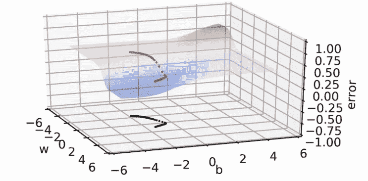

Gradient Descent Convergence in 3D

我们可以从上图中注意到，随着曲线到达更陡峭的表面，它朝着用稀疏点表示的收敛迈出了越来越大的步伐。一旦曲线到达深蓝色平坦区域，该方向上的斜率变缓，这意味着深蓝色区域中的连续轮廓之间的距离将变小。

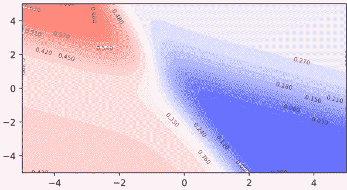

Gradient Descent Animation (Contour Map)

正如您从动画中看到的，一旦曲线到达浅蓝色等高线簇，连续等高线之间的距离越来越小，曲线就越来越接近收敛。

# 基于动量的梯度下降

从我们对梯度下降的讨论中可以清楚地看出，由于这些区域中的梯度非常小，所以需要花费大量的时间来通过具有缓坡的区域。我们如何克服这一点？

More confidence

我们来考虑一个情况，你要去一个未知区域的一个最近开业的商场。当你试图找到购物中心时，你问了很多人关于购物中心的位置，每个人都指引你去同一个位置。因为每个人都把你指向同一个方向，所以你会越来越自信地朝着那个方向前进。现在我们将在基于动量的梯度下降中使用相同的直觉，

Momentum GD

在基于动量的梯度下降更新规则中，我们还包括历史组件 vₜ，它存储直到这个时间 t 的所有先前的梯度运动

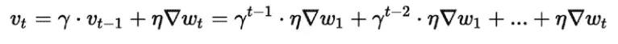

Exponential Weighted Average

在每一个时间步或每一次更新，而不是像普通的 GD 一样，只移动当前梯度的值。在动量 GD 中，我们以先前梯度和当前梯度的指数衰减累积平均值移动。现在让我们看看动量 GD 在相同的误差曲面上的表现，

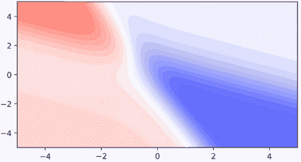

Momentum-based GD Animation

从动画中可以明显看出，基于动量的梯度下降在平面上比普通的梯度下降移动得更快，因为它不仅使用当前的梯度值来更新参数，还使用到该点为止的梯度值的历史记录。当它在平面上走了大约 5 到 6 步时，它的历史会发展到一定程度，允许动量梯度下降在平面上走越来越大的步。

> 动作快总是好的吗？

为了分析基于动量的梯度下降在不同误差表面上的局限性，我采用了一些其他的玩具数据集，并使用单个 sigmoid 神经元来寻找在 **w** 和 **b** 的不同组合下的损失值，以生成具有更窄的最小表面的 3D 损失表面。

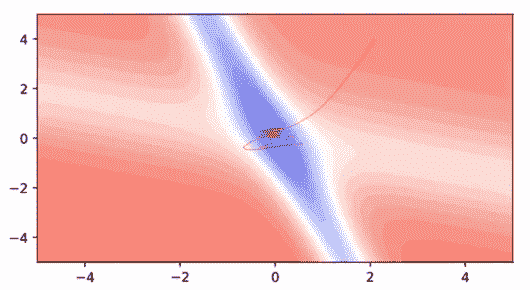

Momentum-based GD convergence

基于动量的梯度下降在极小值内外振荡，因为当它达到极小值时，它已经积累了更多的历史，导致采取越来越大的步骤，显然导致超过目标。尽管有 u 形转弯，它仍然比普通梯度下降收敛得更快。

# 内斯特罗夫加速梯度下降

如何才能避免极小值的超调？。

在基于动量的梯度下降中，我们在梯度历史的方向上做一个运动，在当前梯度的方向上做另一个运动，因为这个两步运动，我们超过了最小值。与其一次移动两步，为什么不先在梯度历史的方向上移动一点，计算该点的梯度并更新参数。

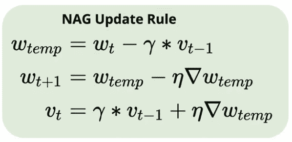

本质上，我们在内斯特罗夫加速梯度下降中所做的是，在我们基于当前梯度值采取另一步骤之前，我们期待看到我们是否接近最小值，以便我们可以避免超调的问题。

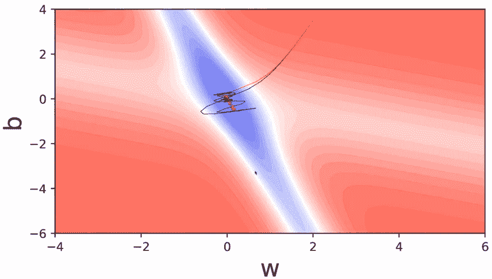

Comparison between NAG(Red curve) & Momentum(Black curve)

我们可以看到，由内斯特罗夫加速梯度引起的所有振荡，都比基于动量梯度下降的振荡小得多。与基于动量的梯度下降相比，向前看有助于 NAG 更快地纠正其路线。因此，振荡更小，逃离极小值谷的机会也更小。

# 小批量和随机梯度下降

> 我们应该使用全部数据来计算梯度吗？

假设您有一个包含百万个数据点的庞大数据集，如果我们使用批量梯度，该算法将进行一百万次计算(计算百万个数据点中每个点的导数并累加所有这些导数)，然后对我们的参数进行一次微小的更新。

> 我们能做得更好吗？

我们不是一次性查看所有数据点，而是将整个数据分成若干子集。对于每个数据子集，计算子集中每个点的导数，并更新参数。我们没有根据损失函数计算整个数据的导数，而是将其近似为更少的点或更小的批量。这种批量计算梯度的方法称为**小批量梯度下降**。如果我们有 100 万个批量大小为 10 的数据点，我们将有 100，000 个批量，我们将对参数进行 100，000 次更新。

如果我们将小批量梯度下降的想法发挥到极致，一次查看一个点，计算导数并更新每个点的参数。这种方法叫做**随机梯度下降**。

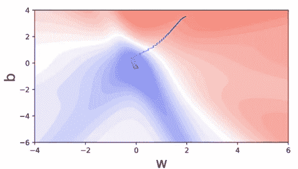

Stochastic Gradient Descent Convergence

在随机模型中，我们更新每个点的参数，这些点并不一致。每个点都做出贪婪的决定，并更新最适合该点的参数，这可能是其余点的情况。我们可以通过考虑数据子集或数据批次来减少振荡问题，并在计算该批次内每个点的导数后更新参数。

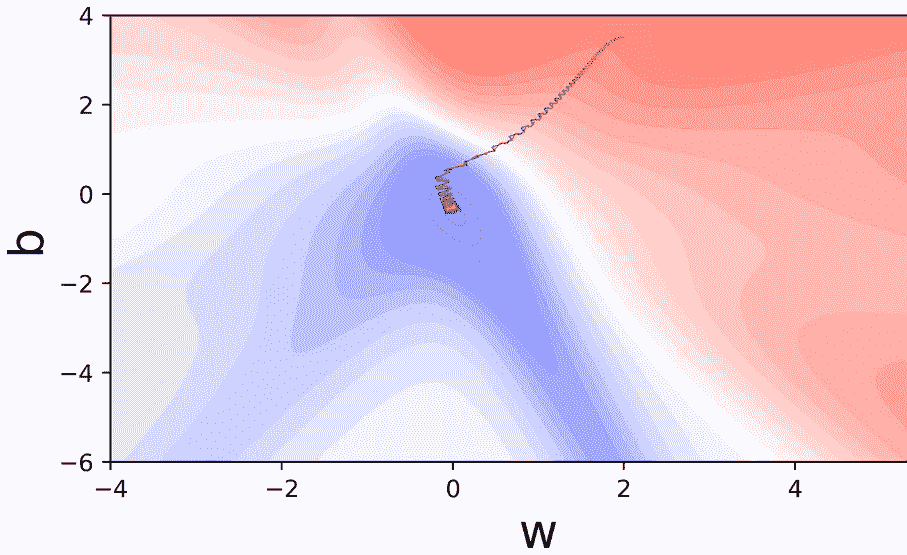

Comparison of Stochastic (Blue Curve) & Mini-Batch GD (Red Curve)

我们可以看到，在小批量梯度下降中，振荡已经减少，振荡完全包含在蓝色曲线内。实际上，我们选择的批量大小等于 16、32 和 64。无论我们使用小批量还是随机梯度下降，要注意的关键点是，我们是在逼近损失函数的导数，而不是计算损失函数的真实导数。

在一个时期内对参数进行更新(步骤)的次数，

*   批量梯度下降— 1
*   随机梯度下降— N(数据点的数量)
*   小批量梯度下降— N/B(B =批量)

# 阿达格拉德

AdaGrad —具有自适应学习速率的梯度下降

AdaGrad 背后的主要动机是针对数据集中不同要素的自适应学习率的想法，即，我们可能需要针对不同要素的不同学习率，而不是针对数据集中的所有要素使用相同的学习率。

> 为什么我们需要自适应学习率？

考虑具有非常重要但稀疏的变量的数据集，如果该变量在大多数训练数据点中为零，则与该变量成比例的导数也将等于零。如果导数等于零，那么权重更新将为零。

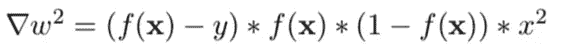

if x = 0 then gradient of w is zero

如果我们的参数(权重)没有向最小值移动，那么模型将不会做出最佳预测。为了帮助这种稀疏特征，我们希望确保无论何时该特征值不为零，无论该点的导数是什么，它都应该通过更大的学习率来提高。

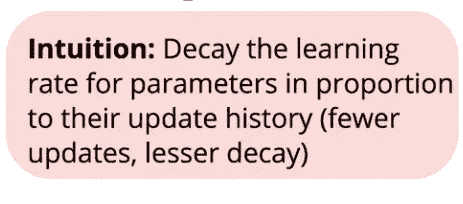

AdaGrad Intuition

如果一个特定的参数经常更新，这意味着导数大部分时间不为零，对于这样的参数，我们希望有一个较小的学习率，相反，如果我们有一个稀疏的参数，它将在大部分时间关闭(零)，这意味着导数在大部分时间为零。对于这样的特征，每当该特征开启(非零)时，我们希望以更高的学习率来促进梯度更新。

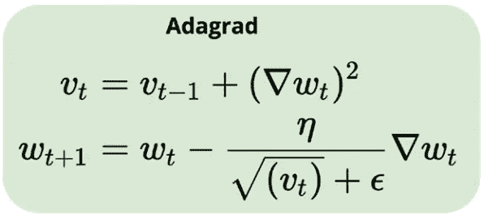

在 AdaGrad 中，我们用梯度值的历史来划分学习，直到该点。非稀疏特征将具有大的历史值，因为它们将得到频繁的更新，通过将学习率除以大的历史，有效的学习率将非常小。在稀疏特征的情况下，梯度历史值将非常小，导致大的有效学习率。

考虑我们有两个特征的数据 **w** (稀疏特征)和 **b** ，这意味着 **w** 经历较少的更新。现在我们将 AdaGrad 更新规则与 Vanilla GD(黑色曲线)、Momentum GD(红色)、NAG(蓝色)和 AdaGrad(绿色)进行比较

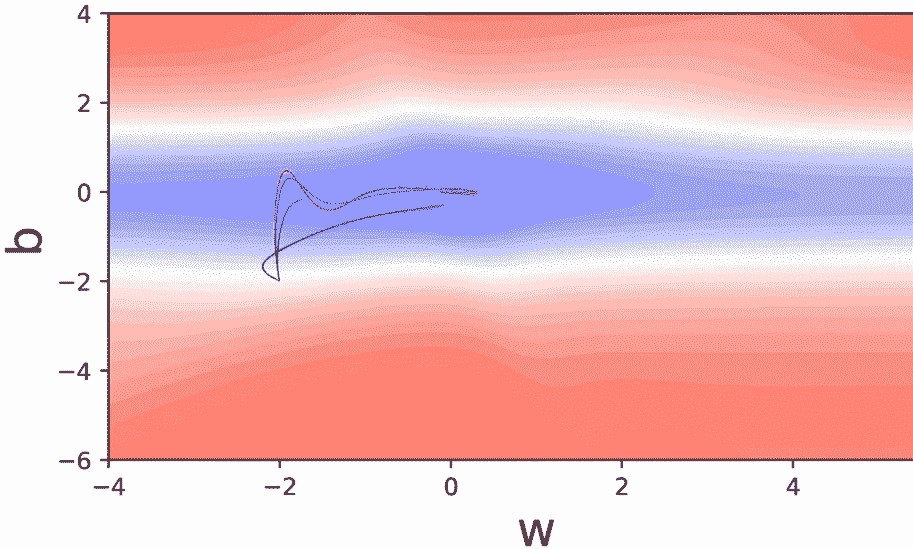

Comparison of different GD variants

从上面的图中，我们可以看到 AdaGrad 在 **w** 的方向上迈出了更大的步伐，尽管它与其他变体相比是一个稀疏的特征，因为它的梯度值是由学习速率提高的。AdaGrad 的缺点是学习速率随着分母的增长而急剧衰减，这对于对应于密集特征的参数是不利的。随着 **b** 一次又一次地更新，分母增加了很多，有效学习率变得接近于零，因此，AdaGrad 不再能够向 **b** 的方向移动，并且卡在收敛点附近。

# RMSProp

RMSProp —均方根传播

为了防止分母快速增长，为什么不衰减分母并防止它快速增长呢？

RMSProp 利用这种直觉来防止密集变量分母的快速增长，从而使有效学习率不会接近于零。

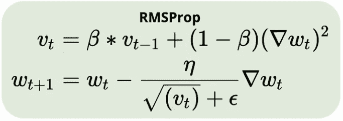

RMSProp Equation

与 AdaGrad 中的梯度总和不同，RMSProp 中的梯度历史是使用指数衰减平均值计算的，这有助于防止密集要素分母的快速增长。

RMSProp Brown Curve Next to AdaGrad Green Curve

由于密集特征' **b** '的分母不像 AdaGrad 那样急剧衰减，RMSProp 能够向 **b** 方向移动，最终导致收敛。

# 圣经》和《古兰经》传统中）亚当（人类第一人的名字

Adam 这个名字来源于自适应矩估计

在基于动量的梯度下降中，我们使用梯度的累积历史在平缓的表面上移动得更快，我们已经看到 RMSProp 也使用历史来衰减分母并防止其快速增长。这些算法使用历史的方式是不同的，在 Momentum GD 中，我们使用历史来计算当前更新，而在 RMSProp 中，使用历史来调整学习率(收缩或增强)。

亚当将这两个独立的历史结合成一个算法。

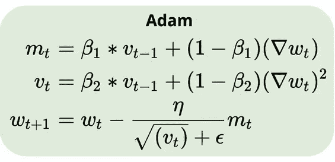

Adam 维护了两个历史，'mₜ'类似于 Momentum GD 中使用的历史，'vₜ'类似于 RMSProp 中使用的历史。实际上，亚当做了一些被称为偏差修正的事情。它对'mₜ'和'vₜ'使用以下等式，

Bias Correction

偏差校正确保在训练更新开始时不会以奇怪的方式运行。Adam 中的关键点在于它结合了 Momentum GD(在平缓区域移动更快)和 RMSProp GD(调整学习速率)的优点。

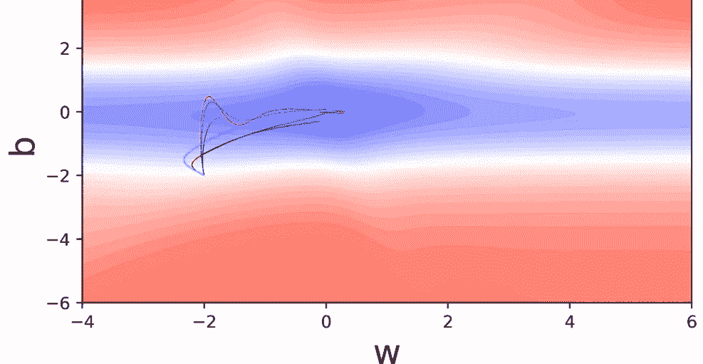

Adam Optimizer (cyan color curve)

因为 Adam 具有动量 GD 的性质，我们可以看到它超过了最小值，然后回来，在收敛之前做了几个 u 形转弯。

# 摘要

在这篇文章中，我们讨论了批量梯度下降，开发新的优化技术的必要性，然后我们简要讨论了如何解释等高线图。之后，我们看了六种不同的优化技术和三种不同的数据策略(批量、小批量和随机)，直观的理解有助于了解在哪里使用这些算法。在实践中，具有 32、64 和 128 大小的小批量的 Adam optimizer 是默认选择，至少对于处理 CNN 和大序列到序列模型的所有图像分类任务是如此。

# 下一步是什么？

反向传播是神经网络如何学习它们所学内容的支柱。如果你有兴趣了解更多关于神经网络的知识，请查看来自 [Starttechacademy](https://courses.starttechacademy.com/full-site-access/?coupon=NKSTACAD) 的 Abhishek 和 Pukhraj 的[人工神经网络](https://courses.starttechacademy.com/full-site-access/?coupon=NKSTACAD)。本课程将使用最新版本的 Tensorflow 2.0 (Keras 后端)进行教学。

*推荐阅读*

如果你想理解梯度下降更新规则背后的数学原理，

 [## 用数学解释的 Sigmoid 神经元学习算法

### 在本帖中，我们将详细讨论 sigmoid 神经元学习算法背后的数学直觉。

towardsdatascience.com](https://towardsdatascience.com/sigmoid-neuron-learning-algorithm-explained-with-math-eb9280e53f07) 

一篇关于如何解读等高线图的深度文章

 [## 如何解释等高线图

### 在 2D 等高线图中可视化三维表面

hackernoon.com](https://hackernoon.com/how-to-interpret-a-contour-plot-a617d45f91ba) 

在我的下一篇文章中，我们将讨论如何在 python 中实现优化算法并可视化它们的更新规则。因此，请确保您跟随媒体上的 [me](/@niranjankumarc) ，以便在它下跌时得到通知。

直到那时和平:)

NK。

[Niranjan Kumar](https://medium.com/u/3e4fb2985698?source=post_page-----19ae9ba2e9bc--------------------------------) 是汇丰银行分析部门的实习生。他对深度学习和人工智能充满热情。他是[媒体](https://medium.com/u/504c7870fdb6?source=post_page-----19ae9ba2e9bc--------------------------------)人工智能[的顶级作家之一。在 LinkedIn](/tag/artificial-intelligence/top-writers)[上与我联系，或者在 Twitter](https://www.linkedin.com/in/niranjankumar-c/)[上关注我，了解关于深度学习和人工智能的最新文章。](https://twitter.com/Nkumar_283)

**免责声明** —这篇文章中可能有一些相关资源的附属链接。你可以以尽可能低的价格购买捆绑包。如果你购买这门课程，我会收到一小笔佣金。