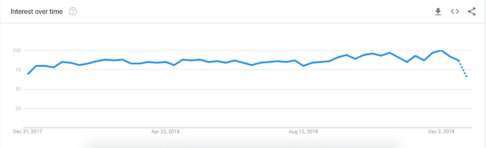
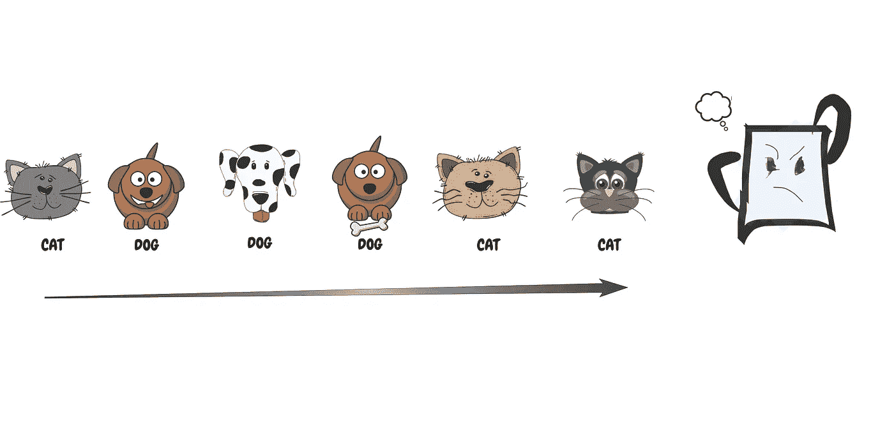
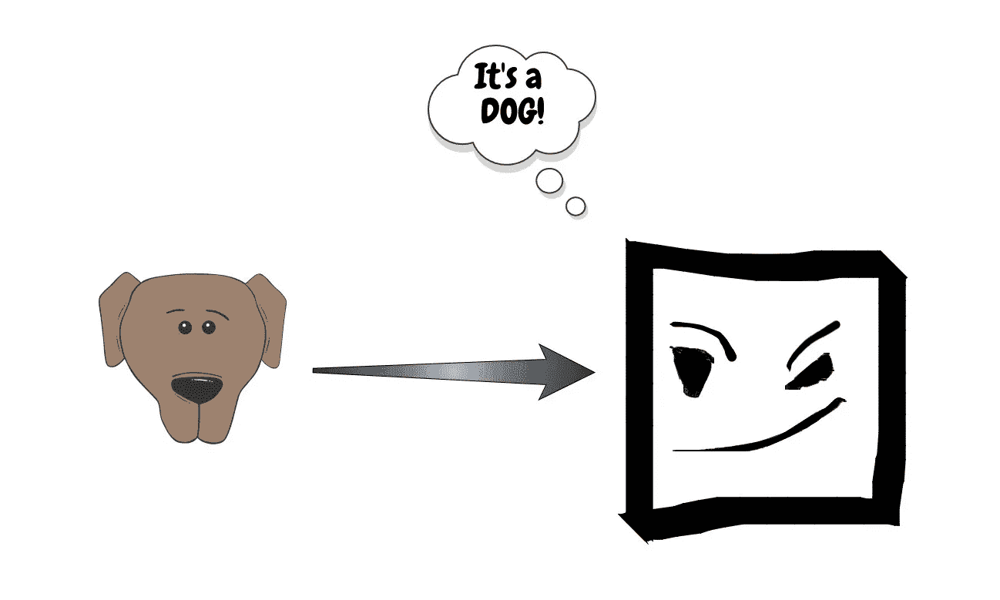
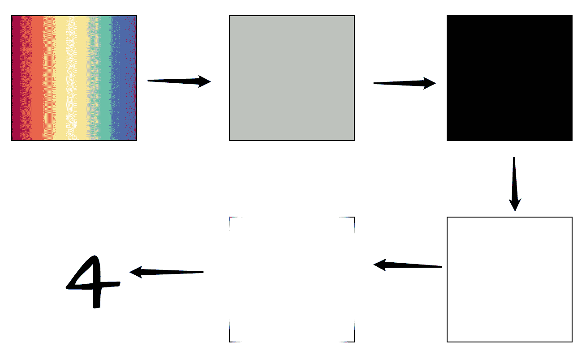
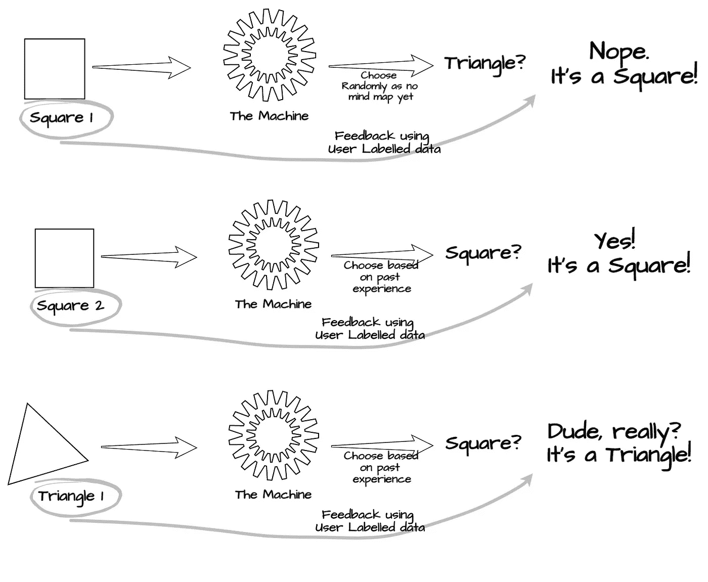
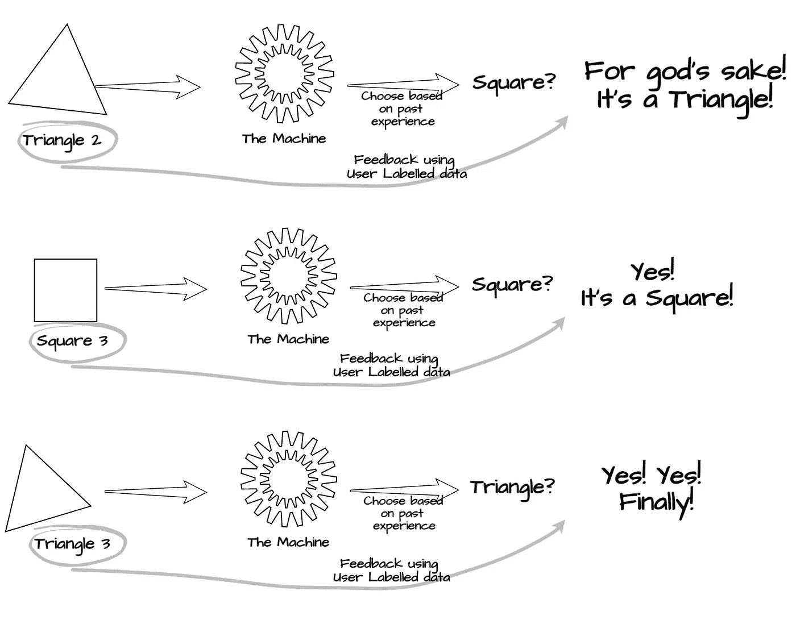
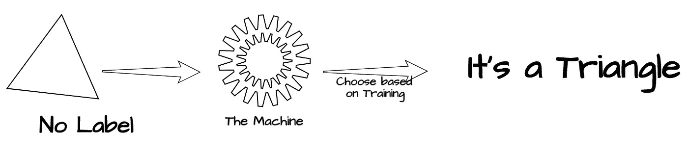

# 揭开机器学习的神秘面纱

> 原文：<https://medium.com/hackernoon/demystifying-machine-learning-db882d4be308>

## 通俗点说？让机器形成一个方程式的能力，以正确地解决任何问题，只需要很少或不需要人工干预。

Photo by [Kevin Ku](https://unsplash.com/@ikukevk?utm_source=medium&utm_medium=referral) on [Unsplash](https://unsplash.com?utm_source=medium&utm_medium=referral)

尽管快速的谷歌搜索可以给你很多这个问题的“答案”,但看起来它们实际上还不够令人满意。你正在阅读这篇文章的事实应该足以支持我的说法，但如果你仍然不相信，看看谷歌趋势报告中的术语“机器学习”。

[https://trends.google.com/trends/explore?cat=5&q=Machine%20Learning](https://trends.google.com/trends/explore?cat=5&q=Machine%20Learning)

**那么什么是机器学习呢？让我们来了解一下！**

在你继续说下去之前，我应该警告你，这篇文章是为那些对这个话题知之甚少或一无所知的人写的，因此对什么是机器学习有一个超级简化的看法。

通俗地说——机器学习就是让机器形成一个方程来**正确**解决**任何问题**而几乎不需要或不需要人工干预的能力。

> 有了机器学习，我们让机器学习自己寻找问题的解决方案，而不是给机器编程去做某件事。

Machine Learning Training Phase

Machine Learning in action

> “这听起来很酷，但这怎么可能呢？”—你的大脑

别急，我们一会儿就会谈到那个问题。在此之前，让我们了解一下它与“通常的”解决问题的方式有什么不同。
为了更好地理解这个类比，让我们举一个简单的真实世界的例子——“对形状进行分类”。

## **问题:**

***给定一幅特定形状的图像，让我们找出这幅图像是正方形还是三角形。***

## 非机器学习方法

伪代码(程序员用来定义“步骤”的奇特术语)应该是这样的:
1。拍摄输入图像
2。找出图像中的角的数量。这个操作将基本上包括:(*不要担心，如果你不明白下面的所有条款，我也不明白)*

*   将图像从 RGB(即彩色图像)转换为灰度(即黑白)
*   平滑图像
*   使用阈值法将图像转换为二值二值图像
*   使用边缘检测算法，通过像素梯度获得边缘列表
*   使用轮廓获取图像中的拐角列表 *e*

3.编写一个 if-else 块，根据返回的角的数量返回对象的形状

这里有一个小的可视化工具，可以帮助您更好地想象上述步骤可能是什么样子:

哼！你一定在想— **对于这样一个琐碎的任务来说，似乎有很多工作要做。你并没有完全错，但直到几年前，这一直是解决这类问题的通用方法。即使这种方法“有效”，它也有很多问题。首先，它只适用于完美捕捉的图像，即在适当的光线和清晰的背景下拍摄的照片，这意味着它在现实世界中的失败率很高。**

## **机器学习拯救方法**

**让我们看看用机器学习同样会是什么样子:** 1。收集一些不同形状的图像——正方形和三角形。
2。将其输入到 ML 算法(更专业术语是卷积神经网络)3。在上述经过训练的模型
4 上运行要测试的图像。坐好，放松！

现在你一定在想“ ***好吧。那似乎非常容易。但是这怎么可能呢？*** “让我用自己的一个问题来回答这个问题——***你会怎么教一个孩子区别正方形和三角形？***

你不会一开始就告诉他角的数量或者它们之间的角度应该是 90 度；相反，你会给他看一些图像，并帮助他联想到其中一个叫做正方形，另一个叫做三角形。

***一点不错！这也是机器学习的工作方式——基于数据提供的标签的反馈。***

下图可能有助于更好地理解它:

**让我们卸下训练轮，看看我们新训练的孩子能走多远:**

> 这些都很酷，但是我不需要一台机器来对形状进行分类—几乎所有人

为了更好地了解它的潜力，机器学习是谷歌如何让你找到你最喜欢的猫的照片(谁不喜欢猫呢！)在网上。如果你仔细观察，你日常交互的几乎所有东西都融入了机器学习——亚马逊产品推荐、网飞电影推荐、预测股票价格、Alexa 语音、销售预测、自动字幕生成、语言翻译等等。与这些相关的细节超出了本文的范围。

## 机器学习方法的主要优势在于:

*   您不需要任何领域知识就可以开始
*   可以识别形状的分类器也可以识别数字、猫和狗等等。因为机器基于输入数据训练自己
*   可以根据自身性能不断改进

## 机器学习的几个缺点是:

*   需要大量的训练数据来进行更好的预测
*   需要大量的处理能力来训练模型和推导推论

然而，信息时代的到来，为我们提供了海量的数据，以及多年来 CPU 和 GPU 成本的大幅下降，有助于解决上述两个问题。因此，现在比以往任何时候都更有意义的是，为这种情况提供一个通用的解决方案，而不是一个特定问题的解决方案。

这就是机器学习发挥作用的地方。听起来很酷，不是吗？如果它如此迷人，为什么不是每个人都试图用机器学习来弄脏自己的手？

我将在下一篇文章中讨论这个问题。敬请期待！

在那之前，那都是乡亲们！