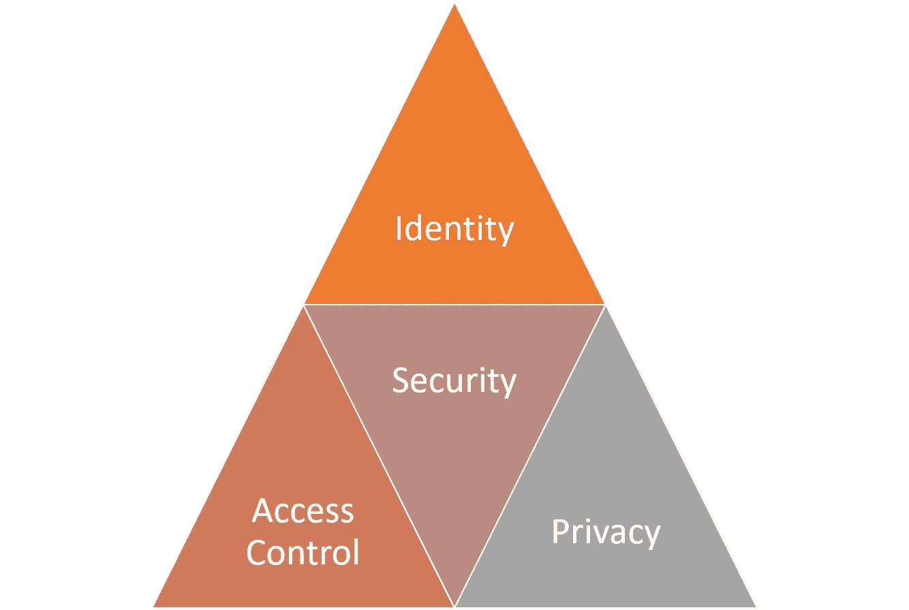
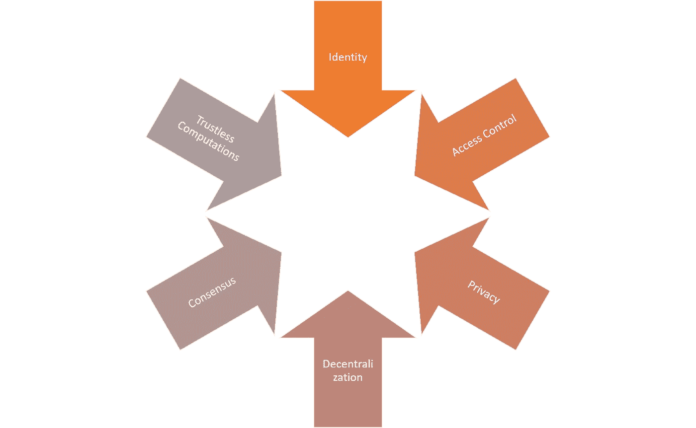

# 解密安全令牌的安全性

> 原文：<https://medium.com/hackernoon/demystifying-security-for-security-tokens-3b9ee5e86a18>

安全性是经常被提及的功能之一，是数字证券的标志之一，尽管它在当前一代的安全令牌平台中仍然相当缺乏。安全是一个不容忽视的重要术语，而且过于笼统，本身没有意义，因此经常脱离上下文使用。今天，我想探讨一些与数字证券相关的主要安全功能和构建模块。

安全令牌需要更健壮的安全功能的想法看起来非常直观，但当我们试图在实践中实现它时却不那么明显。首先，如今的安全令牌仅限于以太坊公共区块链，除了无信任计算模型提供的安全层之外，它不包含任何安全层。更重要的是，安全架构的一些核心构建块引入了一些与公共区块链原则的实际冲突。更重要的是，我们需要回答在安全令牌的上下文中安全到底意味着什么的问题。

# 数字证券中的安全三角

安全这个术语经常被不加区分地使用，对不同的人可能有不同的含义。从安全令牌的角度来看，有三个相关部分构成了安全架构的关键支柱:

**身份:**这种能力集中于唯一地识别安全令牌交易中的参与者。

**隐私:**该功能主要保护与特定安全令牌相关的信息。

**访问控制:**这种能力集中于为安全令牌网络中的不同参与者提供不同级别的授权。

有趣的是，这些安全的基石中的每一个都与一些核心的区块链原则有部分矛盾。安全令牌处于这些困境的中心，这使得它更加引人入胜。

身份与分权:当代区块链运行时被设计成匿名的一等公民。事实上，共识协议是一种通过分散计算来断言身份的方式。在分散的网络中，身份可以作为重新集中的媒介。毕竟，如果网络中参与者的身份是众所周知的，那么我们对基于计算的昂贵共识有多少需求。如果身份是数字安全的关键组成部分，那么安全令牌网络可能是部分集中的。

**隐私与不可信计算:**隐私和不可信计算之间的关系不一定是矛盾的，但肯定会引入一些有趣的摩擦点。在网络中的信息被加密的网络中，节点需要接受信任计算而不是数据本身。如果隐私协议成为数字安全的重要组成部分，那么网络的计算模型将需要适应这些动态。

**访问控制与共识:**今天的区块链是民主的生态系统，其中大多数节点都是平等的。网络中受约束的访问控制区域的概念通过在网络中的不同参与者之间引入不平等而直接挑战了该假设。从这个意义上说，共识协议需要适应一个生态系统，在这个生态系统中，不是网络中的所有验证者都能看到所有的交易。访问控制是安全令牌的一个非常重要的组成部分，因此，它对现有的安全令牌网络共识协议的可行性提出了挑战。

随着安全性成为数字证券越来越重要的元素，上述摩擦点将变得越来越明显。让我们讨论安全性的三个关键支柱:身份、隐私和访问控制如何在下一代安全令牌平台中得到解决。

# 身份

分散身份正成为区块链生态系统中最令人着迷的研究领域之一。在当前一代的安全令牌平台中，身份被限制为使用“白名单”，白名单代表被批准执行特定交易的投资者的目录。虽然白名单支持基于身份的功能，但它们本身并不代表某种形式的身份。随着安全令牌空间的发展，身份应该作为独立的协议发展，在不同的安全令牌平台上使用。要做到这一点，需要在证券法、分布式分类账运行时的特征以及数十年来对身份管理协议的研究之间保持谨慎的平衡。

从区块链解决方案中解决身份的方法来看，分散身份基金会(DIF)开创的解决方案似乎是市场上最先进的。像微软这样的公司采用 DIF 模型来维护身份，而不牺牲网络的核心去中心化机制。受 DIF 的启发，微软最近提出了一个前瞻性的架构，在区块链运行时支持分散身份。Microsoft 体系结构包括以下组件:

**W3C 分散标识符(DIDs):** IDs 用户独立于任何组织或政府创建、拥有和控制。did 是链接到分散公钥基础设施(DPKI)元数据的全局唯一标识符，这些元数据由包含公钥材料、身份验证描述符和服务端点的 JSON 文档组成。

**分散系统:** DIDs 根植于提供 DPKI 所需的机制和特性的分散系统。

**DID 用户代理:**让真实的人使用分散身份的应用。用户代理应用程序有助于创建 DID、管理数据和权限，以及签署/验证与 DID 相关的声明。

**DIF 通用解析器:**一种服务器，它利用 DID 驱动程序的集合为跨实现和分散系统的 DID 提供标准的查找和解析方法，并返回 DID 文档对象(DDO ),该对象封装了与 DID 相关联的 DPKI 元数据。

**DIF 身份枢纽:**加密个人数据存储的复制网格，由云和边缘实例(如手机、PC 或智能音箱)组成，有助于身份数据存储和身份交互。

**DID 证明:** DID 签名证明基于标准格式和协议。它们使身份所有者能够生成、提交和验证声明。这形成了系统用户之间信任的基础。

这种类型的基于 DID 的架构可以容易地适用于安全令牌，作为在数字证券中表示和断言身份的主要机制之一。

# 隐私

隐私是安全令牌平台中迫切需要的功能之一。从投资者合规检查点(如了解客户(KYC ))到交易的保护方面，隐私是数字证券生命周期的一项相关功能。虽然在安全令牌平台中实现隐私功能确实具有挑战性，但该生态系统可以从区块链生态系统中隐私协议的最新进展中受益。

**CryptoNote &环签名:**区块链隐私的祖师爷之一，[crypto note](https://downloads.getmonero.org/whitepaper_annotated.pdf)(crypto night)是 Monero 背后的协议。从概念上讲，CryptoNote 利用一种称为可追踪环签名的加密技术来混淆分散网络中一组节点之间的消息。CryptoNote 协议的改进已经证明能够产生高度的匿名性，同时在可扩展的水平上操作。在安全令牌的上下文中，CryptoNote 可用于加强安全令牌交换的特定部分的隐私。

**ZK-SNARKS:**ZCash 背后的协议， [zk-Snarks](https://eprint.iacr.org/2013/879.pdf) 是一种新形式的零知识加密技术，允许一方(证明者)向另一方(验证者)证明一个陈述是真实的，而不透露任何超出该陈述本身有效性的信息。自 ZCash 推出以来，zk-Snarks 已被改编为不同的区块链技术，如摩根大通法定人数。安全令牌可以结合 zk-SNARKS 作为第一类块来保护安全令牌传输中的数据。

**zk-STARKS:** 根据我们的三角理论，zk-Snarks 的挑战之一是难以大规模应用，因为证明的复杂性与数据库的大小成线性比例。今年早些时候，以色列理工学院的 Eli-Ben Sasson 教授[发表了一篇备受期待的论文](https://eprint.iacr.org/2018/046)，描述了 zk-Snarks 的一种更快的替代方案，他决定将其命名为 zk-Starks(以保持混乱)。Ben Sasson 教授在论文中解释说,“zk-SNARKs 使用公钥(非对称)加密来建立安全性。相反，zk-STARKs 需要一种更精简的对称加密技术，即抗冲突散列函数，从而消除了对可信设置的需求。这些相同的技术也消除了 zk-SNARKs(和 BulletProofs)的数论假设，这些假设计算量很大，容易受到量子计算机的攻击。这使得 zk-STARKs 的生成速度更快，并且是后量子安全的。”

**TEE:** [可信执行环境(TEE)](https://ieeexplore.ieee.org/document/7345265/) 已经成为区块链技术公司卸载机密计算的一种流行方式。诸如[英特尔软件保护扩展(SGX)](https://software.intel.com/en-us/sgx/details) 隔离代码执行、远程证明、安全供应、数据安全存储和代码执行的可信路径等技术。在 tee 中运行的应用程序受到安全保护，几乎不可能被第三方访问。安全令牌可以使用 tee 来卸载核心区块链的隐私计算。

**安全多方计算:**恩尼格玛区块链背后的协议，[安全多方计算](https://en.wikipedia.org/wiki/Secure_multi-party_computation) (SMC)是一种加密技术，允许针对一组输入执行计算，同时保持输入的私密性。SMC 可用于安全令牌交换中的各方，以交换有关信息的断言，同时保持实际信息的私密性。

**Bulletproofs:最近被 Monero 采用，bullet proof 为机密事务提供了一个高性能的协议。Bulletproofs 解决了 zk-Snarks 之类的协议的一些限制，以实现事务的验证。一个更简单的 Bulletproofs 版本可以在安全令牌平台上实现，以在加密证券中实现不同级别的隐私。**

# 访问控制

授权和访问控制可能是区块链协议中可以应用于安全令牌的欠发达领域。在安全令牌网络中隔离对不同方或交易的访问的原则似乎是安全令牌网络的一个明显要求。不幸的是，在区块链网络中实现访问控制的协议和技术仍然相对较新。JP Morgan Quorum 用于节点访问控制的一些技术可能适用于安全令牌。

随着数字证券领域的发展，建立安全功能基础的需求变得越来越重要。在安全令牌的上下文中，安全性可以用三个基本维度来表示:身份、访问控制和隐私。身份和隐私协议的最新进展可以在下一波数字证券中产生立竿见影的效果。虽然准入控制仍然相对有限，但我们应该在不久的将来看到这方面的一些改进。