# 使用 Nexus、Terraform 和 Packer 在 GCP 部署私有 Docker 注册表

> 原文：<https://medium.com/hackernoon/deploy-private-docker-registry-on-gcp-with-nexus-terraform-and-packer-1af2b6a2a9c9>

在这篇文章中，我将带您了解如何在 Google 云平台上部署 Sonatype Nexus OSS 3，以及如何创建一个私有的 Docker 托管存储库来存储您的 Docker 映像和其他构建工件(maven、npm 和 pypi 等)。为了实现这一点，我们需要使用 Packer 来烘焙我们的机器映像，以创建预安装和配置了 Nexus 的黄金映像。Terraform 将用于部署基于烘焙映像的 Google compute 实例。以下架构描述了构建工作流:

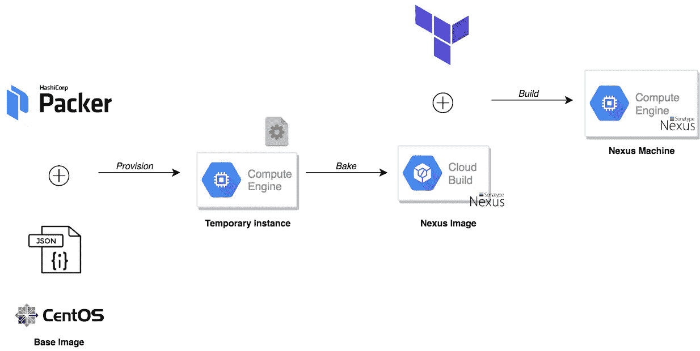

*PS:本教程用到的所有模板，都可以在我的* [*GitHub*](https://github.com/mlabouardy/terraform-gcp-labs) *上找到。*

首先，我们需要创建与 Google Compute Engine (GCE)一起使用的机器映像。Packer 将基于 CentOS 映像创建一个临时实例，并使用 shell 脚本来配置该实例:

shell 脚本将根据他们的[官方文档](https://help.sonatype.com/repomanager2/installing-and-running/installing)安装 Nexus OSS 的最新稳定版本，并等待服务启动和运行，然后它将使用脚本 API 发布一个 groovy 脚本:

该脚本将创建一个 Docker 私有注册表，监听端口 5000:

一旦定义了模板文件，发出 *packer build* 命令来烘焙我们的机器映像:

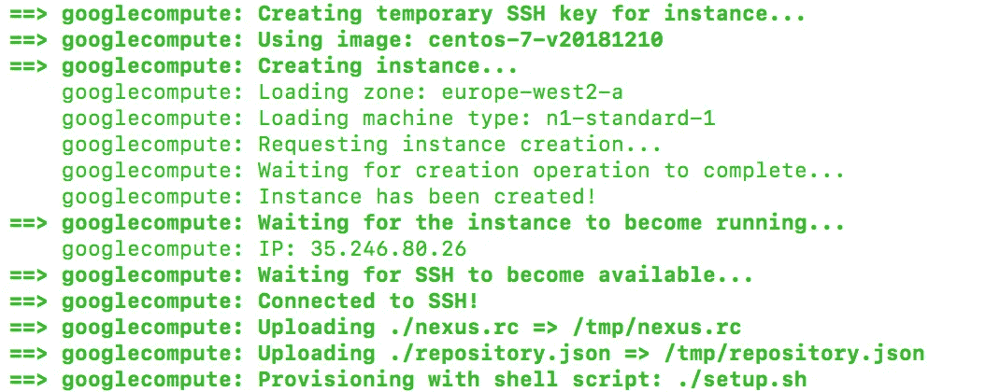

如果您从**计算引擎**仪表板返回到**图像**部分，应该会创建一个名为 nexus 的新图像:

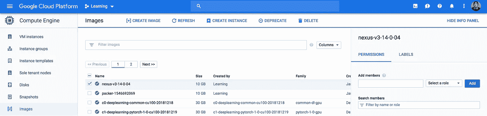

现在我们已经准备好部署 Nexus，我们将基于用 Packer 烘焙的机器映像创建一个 Nexus 服务器。模板文件是不言自明的，它创建了一组防火墙规则，允许来自任何地方的端口 8081 (Nexus GUI)和 22 (SSH)上的入站流量，并基于 Nexus 映像创建了一个 google compute 实例:

在终端上，运行 *terraform init* 命令下载并安装 Google provider，如下图所示:

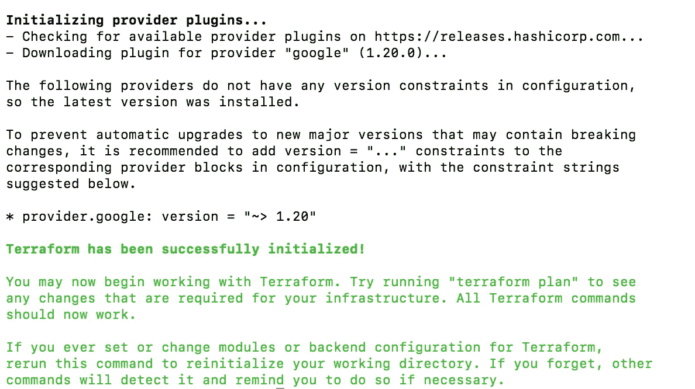

使用*地形计划*命令创建一个执行计划(试运行)。它向您显示将提前创建的内容，这有利于调试并确保您没有做错任何事情，如下一个截图所示:

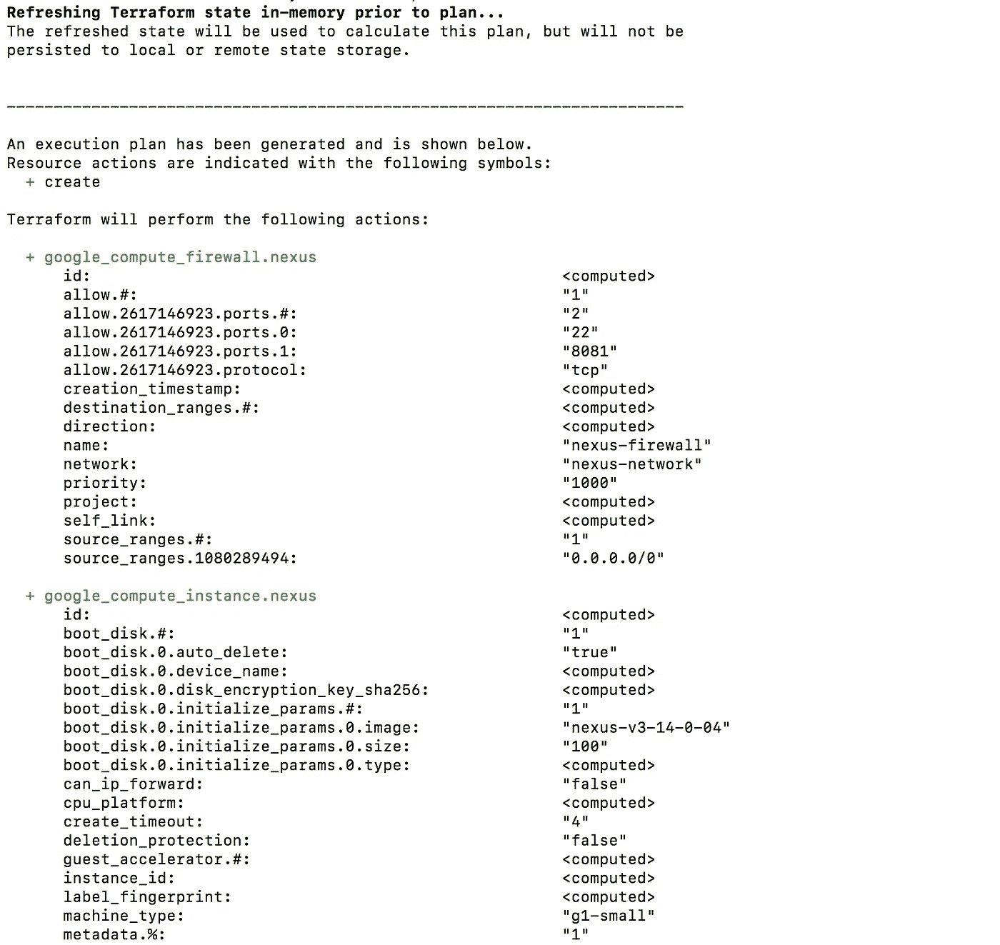

当你准备好了，就可以通过发出 *terraform apply* 来应用更改了:

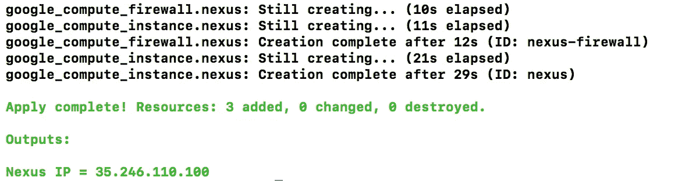

Terraform 将创建所需的资源，并在输出部分显示 nexus 实例的公共 ip 地址。跳回 GCP 控制台，您的 nexus 实例应该已经创建好了:

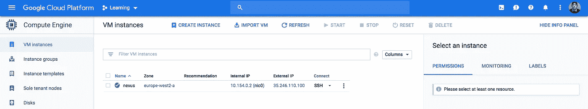

如果您将您最喜欢的浏览器指向 [http://instance_ip:8081，](http://instance_ip:8081,)您应该会看到 Sonatype Nexus Repository Manager 界面:

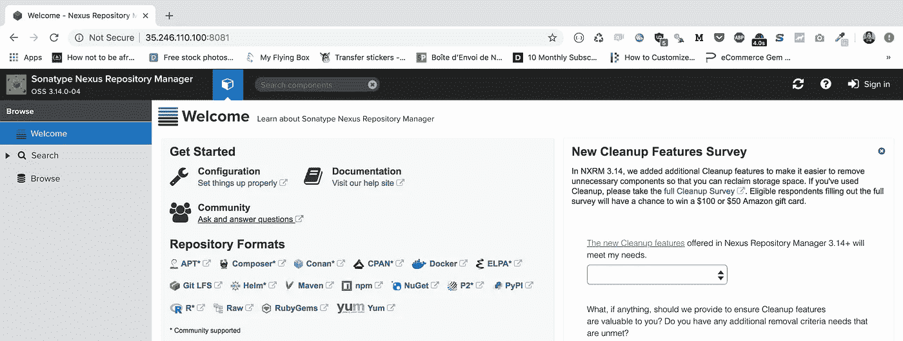

点击右上角的**签到**按钮，使用用户名“ **admin** 和密码“ **admin123** ”。然后，单击齿轮转到服务器管理和配置部分。导航到“**存储库**，我们的私有 Docker 存储库应该创建如下:

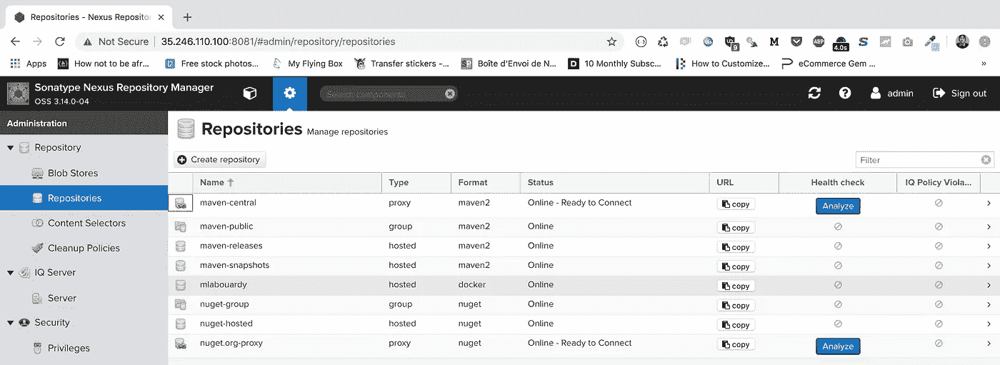

docker 存储库按预期发布在端口 5000 上:

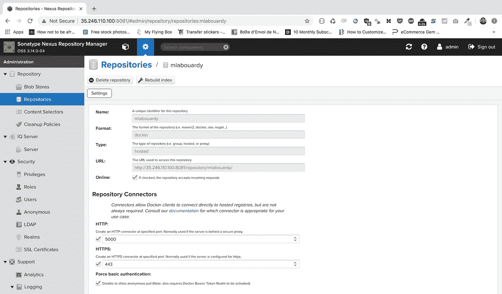

因此，我们需要允许该端口上的入站流量，因此相应地更新防火墙规则:

发出 *terrafrom apply* 命令以应用更改:

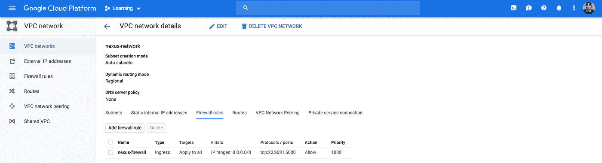

您的私有 docker 注册表已经准备好在 *instance_ip:5000* 上工作，让我们通过推送 docker 映像来测试它。

因为我们已经在普通 HTTP 端点上公开了私有 Docker 注册中心，所以我们需要配置 Docker 守护进程作为私有 Docker 注册中心的客户端，以允许不安全的连接。

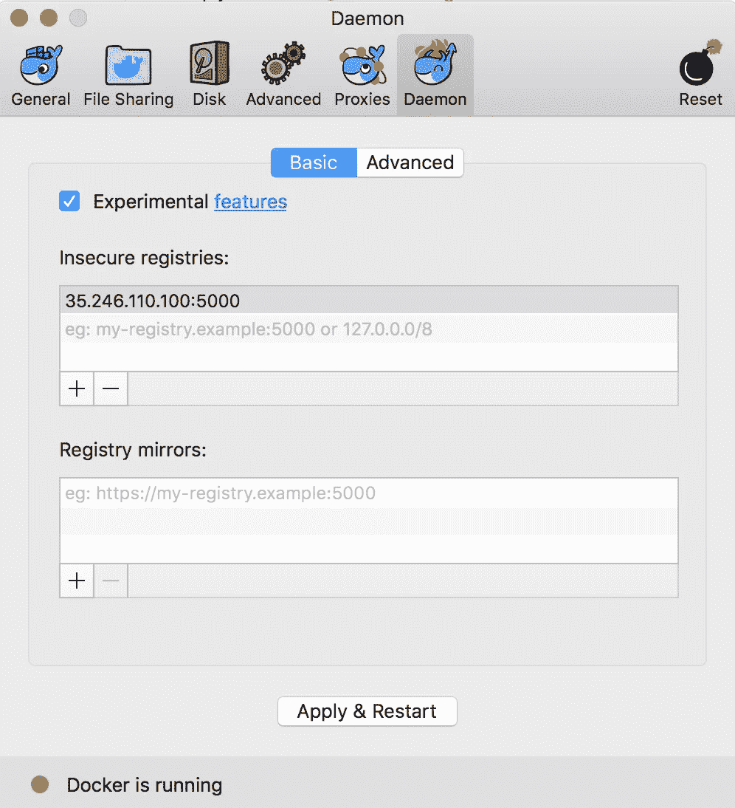

*   *在 Windows 或 Mac OS X* :点击托盘中的 **Docker 图标**打开 **Preferences** 。点击**守护进程**选项卡，在**不安全注册表**部分添加暴露 Nexus GUI 的 IP 地址和端口号 5000。不要忘记**应用&重启** 以使更改生效，您已经准备就绪。
*   *其他 OS* :遵循[官方指南](https://docs.docker.com/registry/insecure/)。

现在，您应该能够使用以下命令登录到您的私有 Docker 注册表了:

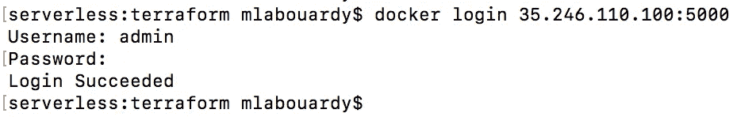

使用 *docker push* 命令将您的 docker 映像推送到注册表:

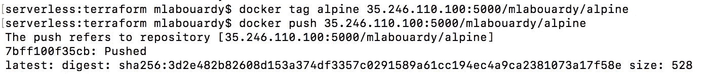

如果您返回 Nexus Dashboard，您的 docker 图像应存储有最新的标签:

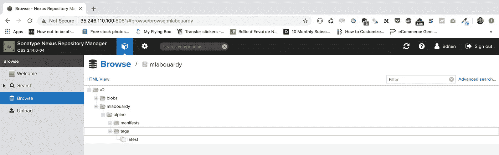

请在下面留下您的评论、反馈或建议，或者直接在 Twitter[**@**mlabouardy](https://twitter.com/mlabouardy)上与我联系。