# 用 Docker 和 Google 云平台部署 React 应用

> 原文：<https://medium.com/hackernoon/deploy-react-application-using-docker-and-google-cloud-platform-4bc03f9ee1f>

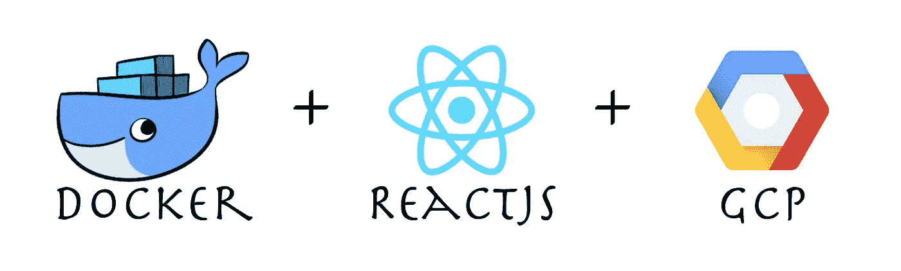

Docker | ReactJS | GCP

在本文中，您将学习如何在 GCP 上部署应用程序。我们将部署一个创建-反应-应用程序。

回购的链接—[https://github.com/Harshmakadia/react-docker](https://github.com/Harshmakadia/react-docker)

在我们开始使用 GCP 和 [Docker](https://hackernoon.com/tagged/docker) 部署 React 应用程序的实际步骤之前。首先，*让我们了解一下 docker actual 是什么？*

Docker 是一个工具，旨在借助容器使应用程序的创建、部署和运行更加容易。容器允许开发者将应用程序与所有必要的组件捆绑在一起，比如不同的库、依赖项和 ship is，就像一个单独的包一样。

我们将一步一步来

# 1.创建 React 应用程序

使用创建反应应用程序(CRA ),创建反应应用程序要容易得多

我们将使用 ***create-react-app*** 包来安装和配置来自 NPM 的简单 react 应用程序，打开您的终端并安装 react 应用程序。

有关创建 react 应用程序的更多信息

[](https://github.com/facebook/create-react-app) [## Facebook/创建-反应-应用程序

### 通过运行一个命令设置一个现代化的 web 应用程序。通过创建……为 facebook/create-react-app 开发做出贡献

github.com](https://github.com/facebook/create-react-app) 

> 使用命令
> $ npm start 运行应用程序后
> 
> 之后，是时候创建一个构建应用程序了，运行
> $ npm 运行构建

# 2.创建最小 Dockerfile 文件

创建 docker 文件是你的拿手好戏。创建 docker 文件并不困难。

只需创建一个名为***docker file*** 的新文件。现在，创建文件后，我们将添加一些命令来帮助我们创建、运行和部署应用程序。

这里是 react 应用程序 Dockerfile 的内容。注意我使用 ***Nginx*** 作为服务器。

Dockerfile

一旦创建了 docker 文件。我正在 app 目录下创建一个名为**部署**的新文件夹，其中有一个 ***nginx.conf*** 文件

nginx 文件的内容，请注意，这是默认配置，您可能不需要修改这个文件，除非您有一些特殊的要求。

nginx.conf

# 3.**在机器上安装 Docker**

请点击下面的链接，为您各自的操作系统下载该软件

[](https://www.docker.com/products/docker-desktop) [## Docker 桌面

### Docker 桌面企业版是一款新的商用桌面产品，为您提供企业就绪所需的一切…

www.docker.com](https://www.docker.com/products/docker-desktop) 

安装完成后，打开你的终端，运行下面的命令来检查它是否安装成功

> docker 版本

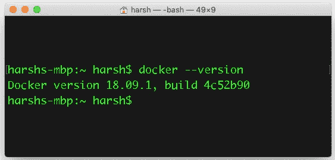

Docker version

现在我们已经在机器上安装了 docker，是时候使用下面的命令创建第一个映像了

> 先入坞。

关于不同命令的更多信息可以在[这里](https://docs.docker.com/engine/reference/commandline/build/)找到。

一旦您运行这个命令，它将执行 docker 文件中列出的所有命令。

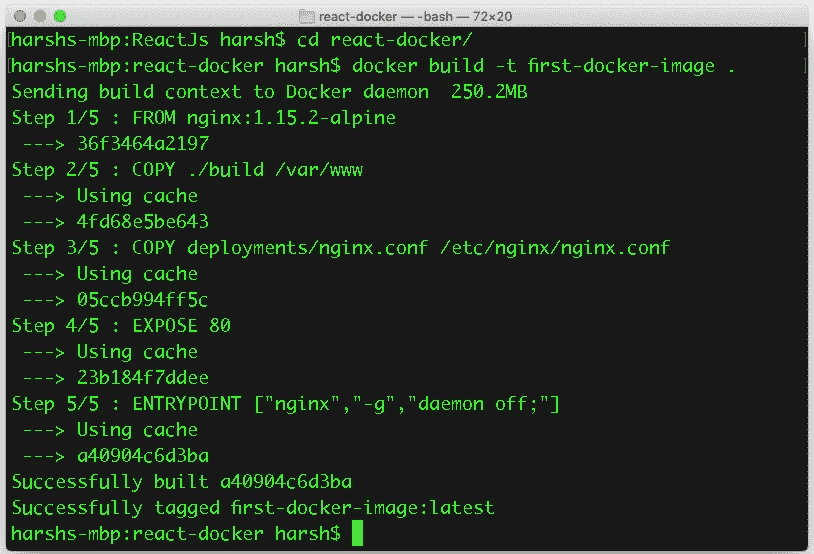

Creating Image

我们已经成功地创建了图像。让我们进行下一步

# 4.利用 gcloud SDK

从下面的链接下载 SDK 并在您的机器上安装

[](https://cloud.google.com/sdk/) [## 云 SDK |云 SDK |谷歌云

### Google 云平台的命令行工具集合。包括 gcloud，bq，gsutil 等重要…

cloud.google.com](https://cloud.google.com/sdk/) 

现在我们已经在机器上安装了 gcloud SDK

## - —在 GCP 创建一个新项目

下一步是在 GCP 创建一个新项目，我们将把 docker 图像推送到容器中。

将 Docker 配置为使用`gcloud`作为凭证助手，或者使用另一种[认证方法](https://cloud.google.com/container-registry/docs/advanced-authentication)。要使用`gcloud`作为凭证助手，运行命令:

*   `gcloud auth configure-docker`

是时候将图像推送到注册表了

1.  使用以下命令用注册表名称标记本地映像:

*   `docker tag [SOURCE_IMAGE] [HOSTNAME]/[PROJECT-ID]/[IMAGE]`

1.  其中`[SOURCE_IMAGE]`是本地图像名称。
2.  该命令用注册表名命名图像，并应用标签`latest`。如果要应用不同的标记，请使用命令:

*   `docker tag [SOURCE_IMAGE] [HOSTNAME]/[PROJECT-ID]/[IMAGE]:[TAG]`

# 将标记的图像推送到容器注册表

使用以下命令将标记的图像推送到容器注册表:

```
docker push [HOSTNAME]/[PROJECT-ID]/[IMAGE]
```

该命令推送标签为`latest`的图像。如果要推送具有不同标签的图像，请使用命令:

```
docker push [HOSTNAME]/[PROJECT-ID]/[IMAGE]:[TAG]
```

当您使用新的主机名将映像推送到注册表时，Container Registry 会在指定的[多区域位置](https://cloud.google.com/storage/docs/bucket-locations#location-mr)创建一个存储桶。推送您的映像后，您可以:

*   到 [GCP 控制台](https://console.cloud.google.com/gcr)查看注册表和图像。
*   运行`gcloud container images list-tags`查看图像的标签和自动生成的摘要:
*   `gcloud container images list-tags [HOSTNAME]/[PROJECT-ID]/[IMAGE]`
*   该命令的输出类似于以下内容:
*   `DIGEST TAGS TIMESTAMP
    44bde... test 2017-..-..`

## 在哪里

*   `[HOSTNAME]`列在控制台**位置**下。它是四个选项之一:`gcr.io`、`us.gcr.io`、`eu.gcr.io`或`asia.gcr.io`。
*   `[PROJECT-ID]`是你的 [Google](https://hackernoon.com/tagged/google) 云平台控制台[项目 ID](https://cloud.google.com/resource-manager/docs/creating-managing-projects#identifying_projects) 。关于如何使用包含域的项目 id，请参见[域范围的项目](https://cloud.google.com/container-registry/docs/overview#domain-scoped_projects)。
*   `[IMAGE]`是容器注册表中图像的名称。
*   `[TAG]`是应用于图像的标签。在注册表中，标签对于图像是唯一的。

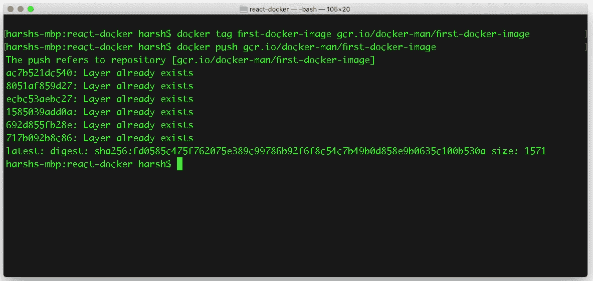

Pushing Image

导航 GCP 控制台，搜索 ***容器注册表，*** 就能看到我们推送的图片。

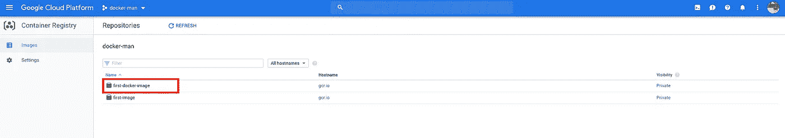

现在是时候创建集群内部的 [***Kubernetes 引擎***](https://cloud.google.com/kubernetes-engine/)GCP 了

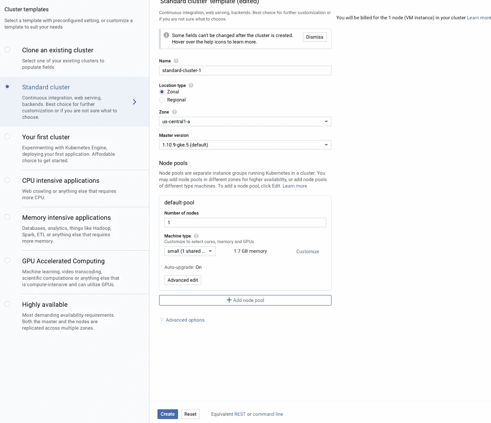

Creating cluster

在工作负载下创建部署

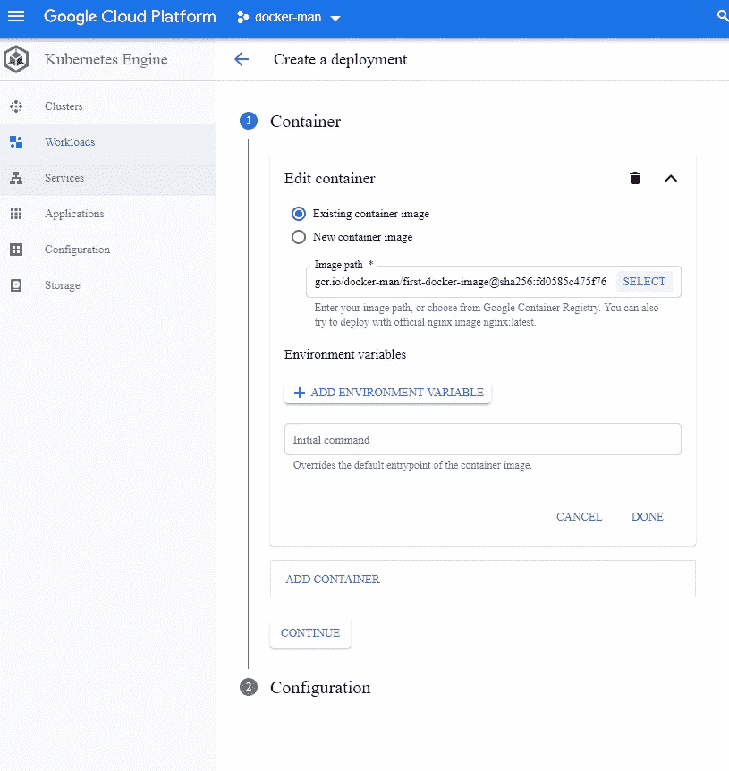

选择您想要部署的图像，最后点击 ***显示*** 显示部署。

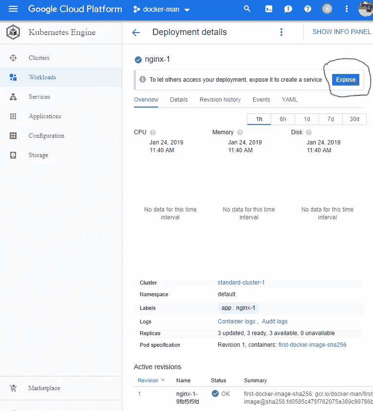

将目标端口 中的 ***端口设置为 80，因为我们已经在 docker 文件中将我们的应用暴露为 80***

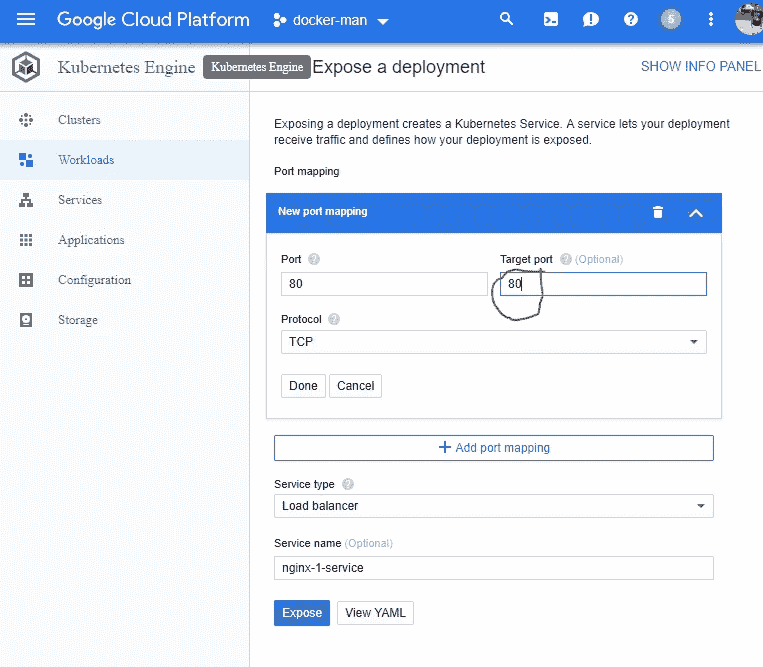

一旦您暴露了端口，您将获得一个 IP 地址，react 应用程序将在该地址上实时运行。

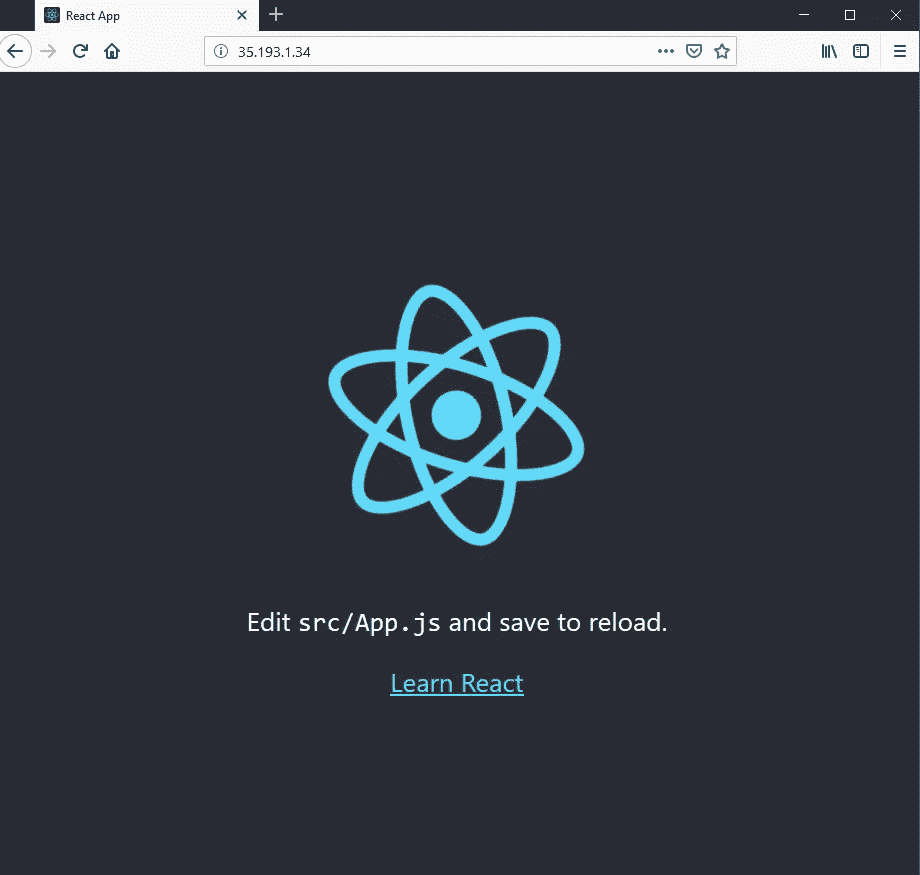

Deployed Application

你和 docker 都准备好了。每当你想推新的图像到容器，首先用上面指定的命令建立图像，然后推图像到容器注册表，最后通过滚动更新选项激活图像。

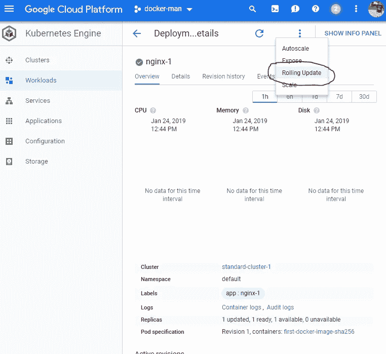

如果你有任何疑问，请在下面的评论区写下你的问题&我很乐意解答。

结束了🔚我希望你学到了新的东西。
快乐学习！💻 😃