# 在亚马逊 Lightsail VPS 上部署 Wordpress 博客

> 原文：<https://medium.com/hackernoon/deploy-wordpress-blog-on-amazon-lightsail-vps-f45ec62f5059>

WordPress 现在是市场上最具优势的内容管理系统——遥遥领先于竞争对手，拥有很大一部分市场份额(根据 W3Tech 的数据，59.7%)。虽然它们是构建你的 WordPress/WooCommerce 网站的多主机解决方案。要找到最符合您的预算、流量和业务需求的经济高效的解决方案并让您在没有任何运营开销的情况下进行扩展并不容易。这就是为什么在这篇简短的帖子中，我将带你从头开始使用 Amazon Lightsail VPS 解决方案构建自己的博客，该解决方案基本上是可预测、可管理和可扩展的。

首先，登录 [AWS 管理控制台](https://console.aws.amazon.com/console/home)，导航至亚马逊 Lightsail dashboard:

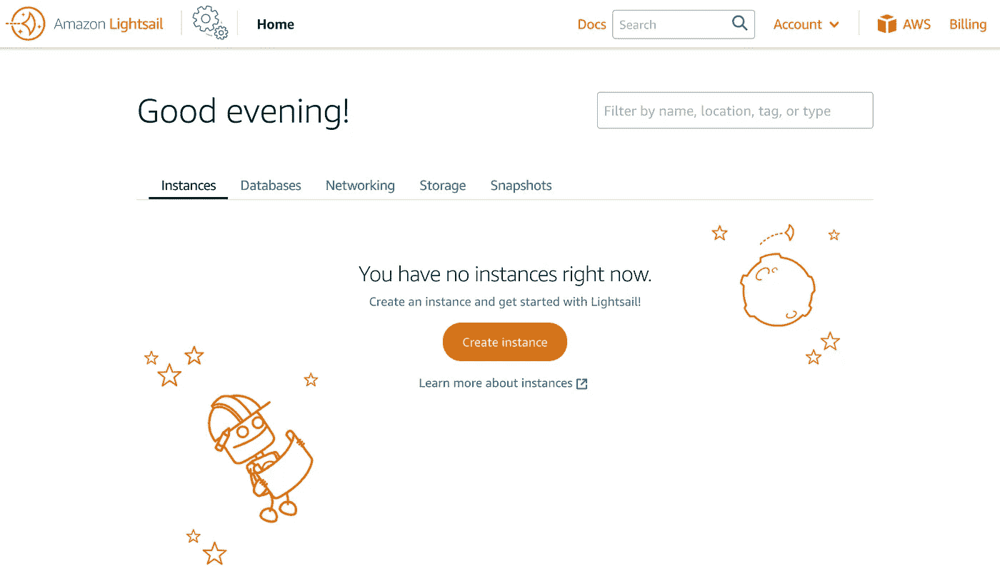

点击“**创建实例**按钮提供一个新实例，并选择 Wordpress 作为镜像蓝图:

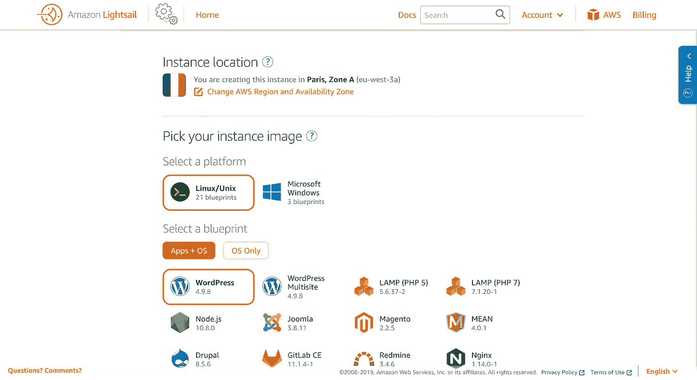

上传您的公共 ssh 密钥(稍后将使用它对服务器进行 SSH)并根据您的博客需求设置您的实例类型:

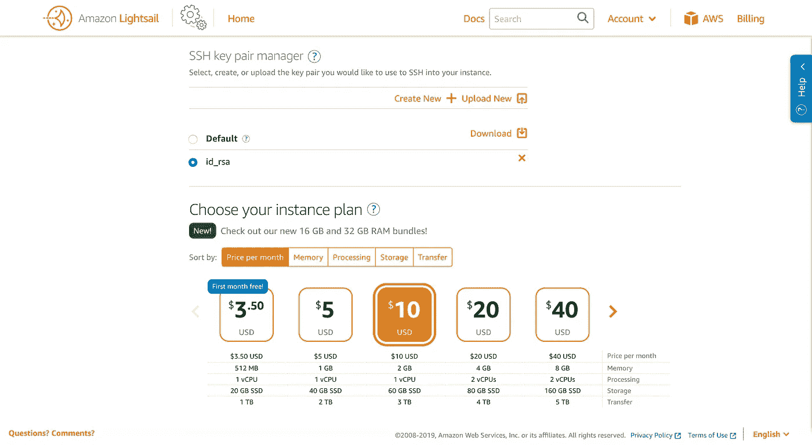

为您的实例设置一个唯一的名称，然后单击“**创建实例**按钮:

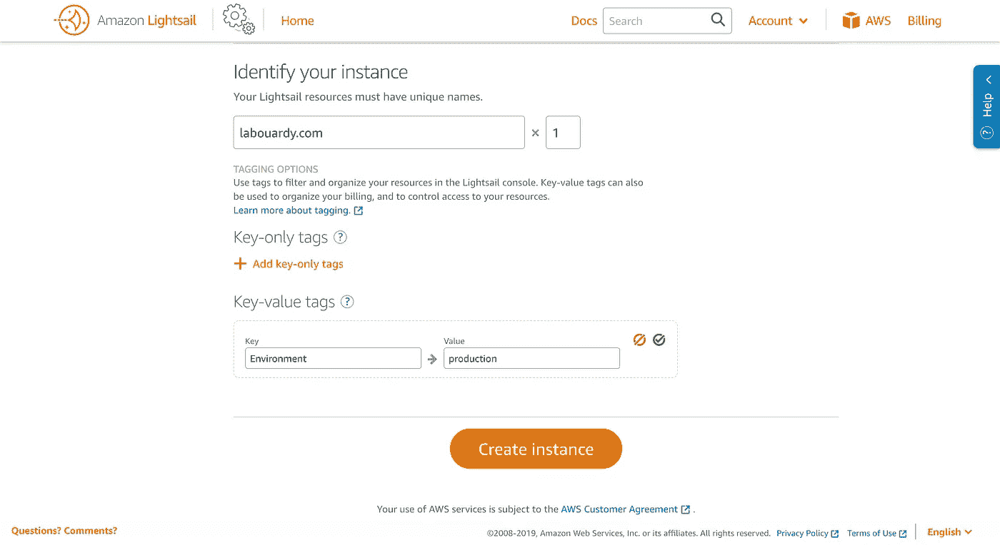

将创建一个新实例，并在其上提供 Wordpress:

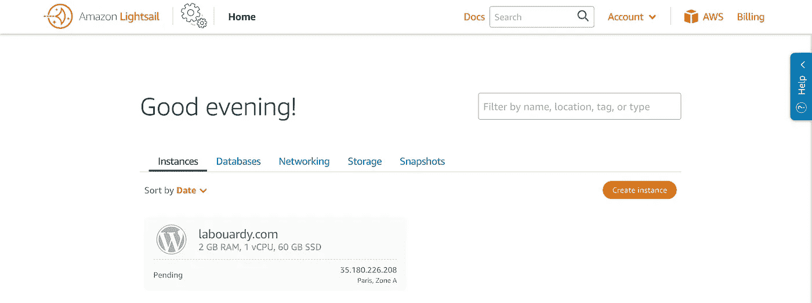

一旦实例启动并且其状态从*挂起*变为*运行*，点击“**管理**按钮:

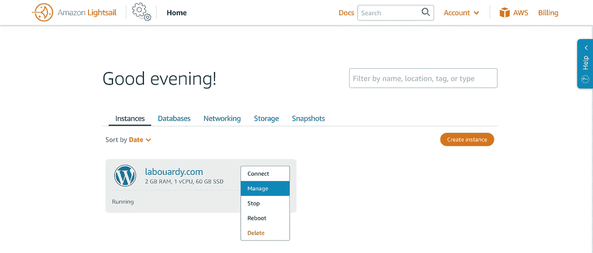

将显示动态公共 ip 地址实例，将你最喜欢的浏览器指向该 IP 地址，Wordpress 主页将显示如下:

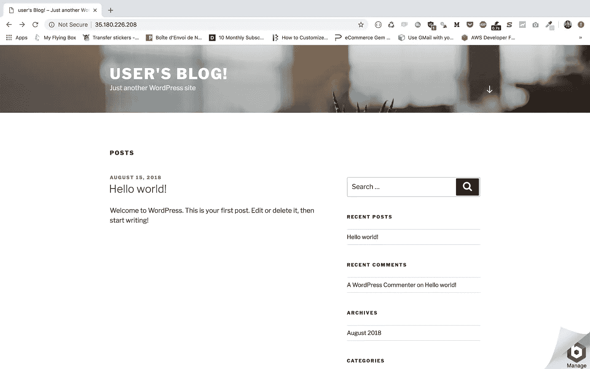

要登录到 WordPress 管理仪表板，添加下面的端点 */wp-admin* 到你的 url。使用默认用户名(user)和从存储在服务器主目录中的*bitnami _ application _ password*文件中获取的默认密码登录。

你现在应该到达 WordPress 仪表盘，它允许你管理文章、页面等等。然而，我们需要使用一个友好的 URL 来访问我们的博客，这就是为什么我们将我们的域名映射到我们的 Wordpress 网站。

如果您期望高流量，建议在您的实例前设置一个负载平衡器。您可以从“**网络**部分创建一个:

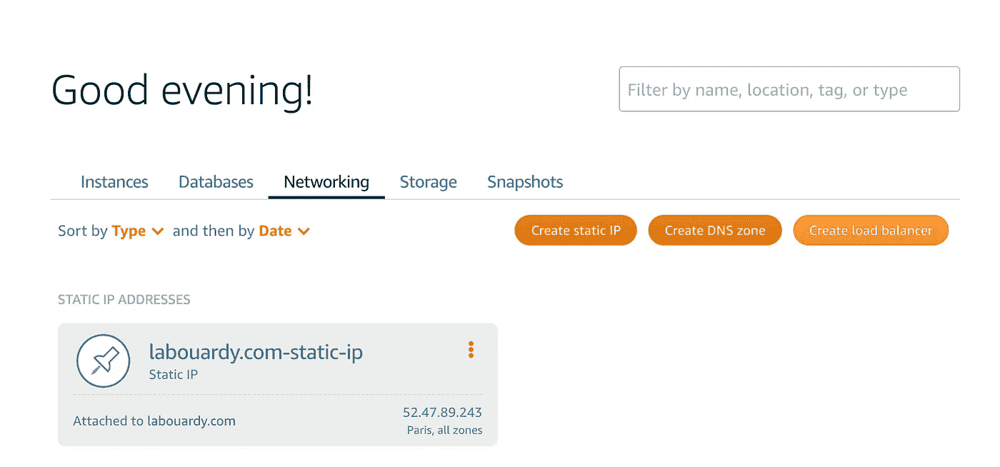

默认情况下，负载平衡器将只接受 HTTP 连接，要启用 HTTPS，我们需要附加一个有效的 SSL 证书。

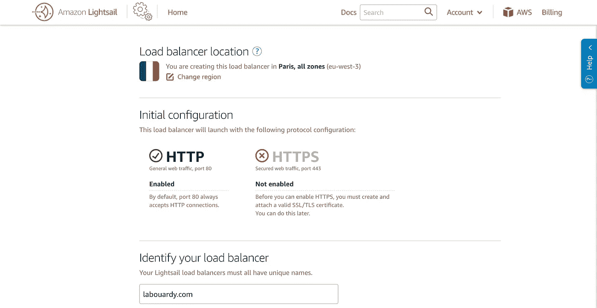

将之前创建的 Wordpress 服务器分配给负载均衡器。如果您的 Apache 服务正在监听不同的端口，您可以相应地定制健康检查部分。

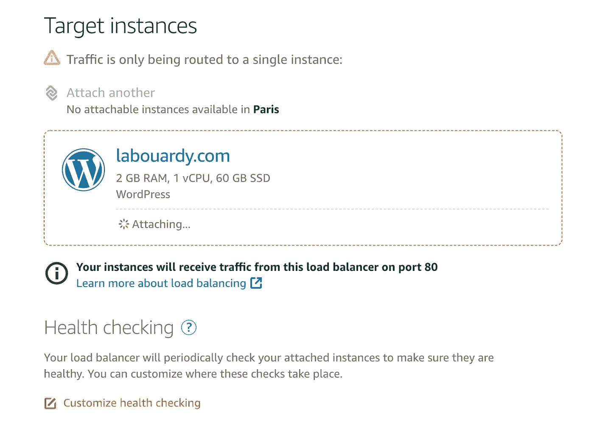

一旦实例被附加到 ELB，点击“**入站流量**”部分以显示 HTTPS 端点:

接下来，为您的域名创建一个新的 SSL 证书，如下所示:

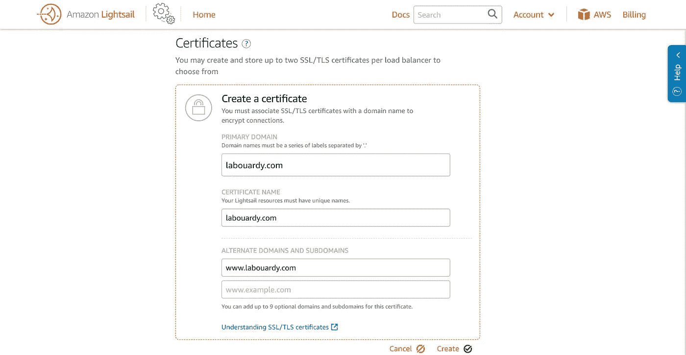

一旦 AWS 验证了所有内容，验证状态将更新为绿色，表示成功。这可能需要一些时间，所以不要担心它不会立即发生。验证后，将 SSL 证书连接到负载平衡器。

最后，我们需要将我们的域名导入到 Amazon Lightsail:

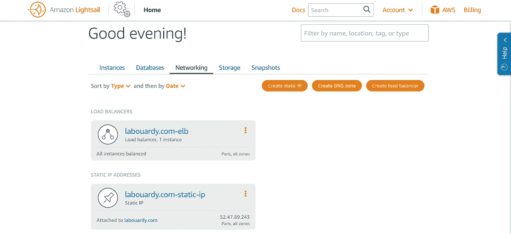

输入域名，可以从 [Godaddy](https://godaddy.com) 买一个便宜的。

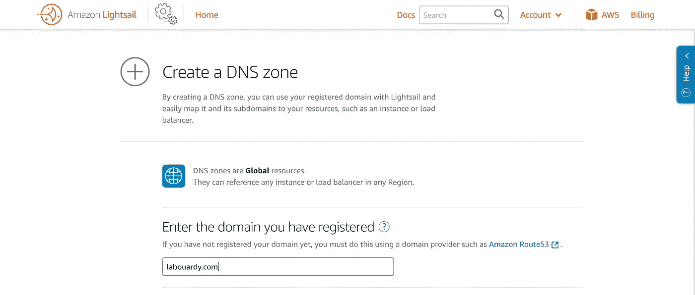

当您创建 DNZ 区时，Amazon Lightsail 会自动创建一个名称服务器(NS)记录。回到您的域注册商(GoDaddy ),将域的名称服务器更改为使用您在上一步中获得的四个 NS 名称服务器。

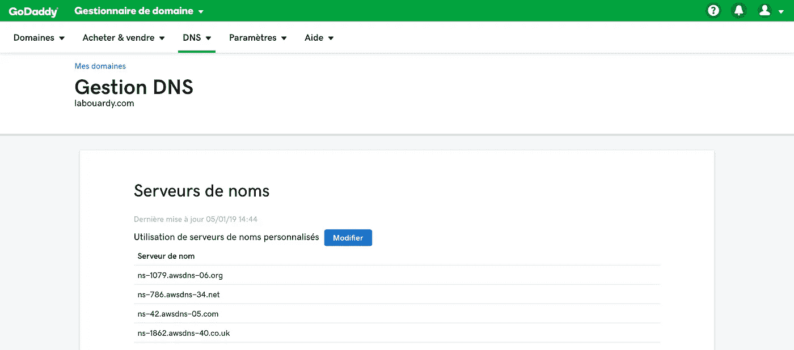

并创建一个指向 ELB 域名的新 A 记录:

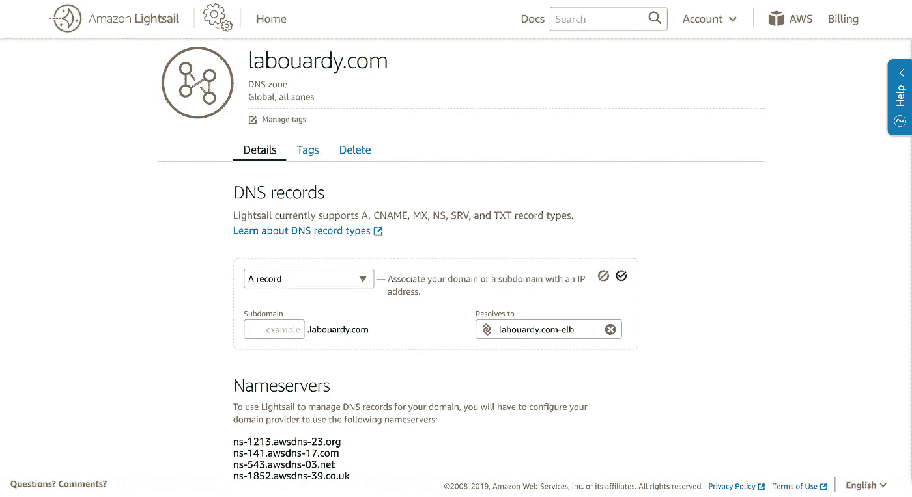

传播配置后，您应该能够通过域名而不是服务器的 IP 地址作为安全 HTTPS 端点访问您的站点。

请在下面留下您的评论、反馈或建议，或者直接在 Twitter[**@**mlabouardy](https://twitter.com/mlabouardy)上与我联系。