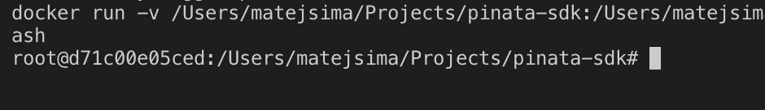
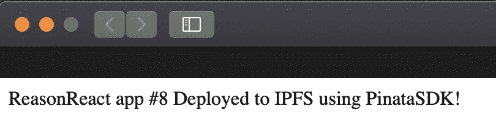
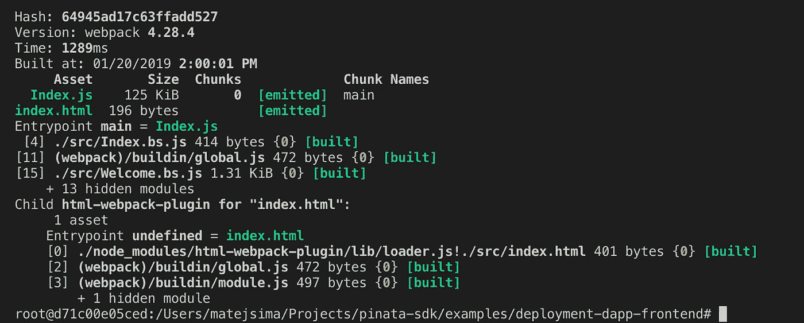
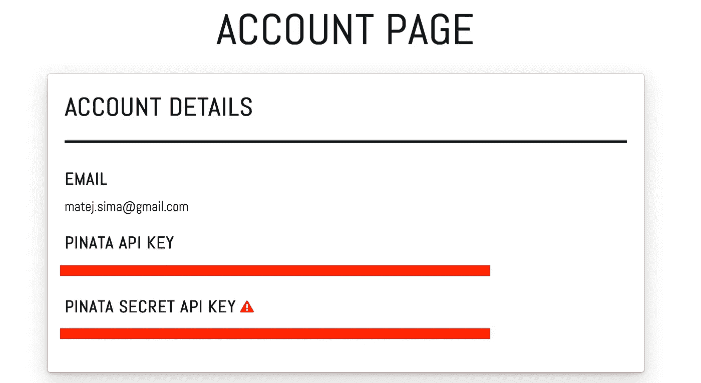
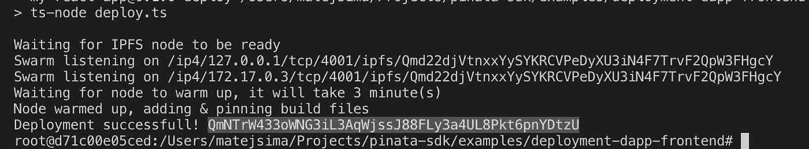
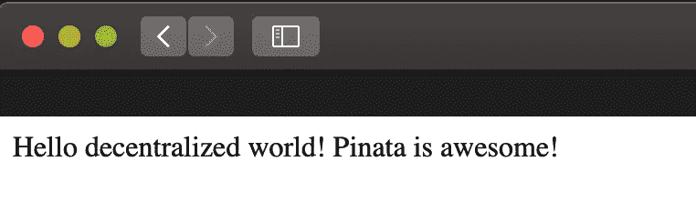

# 使用 IPFS 和 Pinata SDK 部署 DAPP 前端

> 原文：<https://medium.com/hackernoon/deploying-a-dapps-frontend-using-ipfs-and-pinata-sdk-b0f975381b32>

## 这篇文章将带你通过 IPFS 部署你的第一个 DAPP，或者更确切地说是它的前端部分，借助 Pinata——IPFS 锁定服务。

# 我们在建造什么？

到本文结束时，你将能够拥有你的单页前端应用程序，并在 IPFS 网络 T1 中托管它。

# 皮纳塔是用来做什么的？

在我们的场景中，我们将使用 Pinata 来保存我们在 IPFS 的文件 *(pinned)* 。我们的设置有一个短命的 [IPFS](https://hackernoon.com/tagged/ipfs) 节点，通过成功地用 Pinata 锁定我们的文件，它只在线很短的一段时间——直到我们的部署完成。

> Pinata 提供高达 1GB 的固定数据的免费层

# 我们可以使用哪些前端框架？

理论上，任何。只要它们像 Angular、React 或 Vue 一样提供静态文件输出，很可能是通过 webpack 或任何其他现代捆绑器。

# 设置环境🐳

我们的部署脚本将使用 [pinata-sdk](https://github.com/maht0rz/pinata-sdk) 进行锁定，而最终的示例可以在这里[看到](https://github.com/maht0rz/pinata-sdk/tree/master/examples/deployment-dapp-frontend)。

我们将使用 docker 来减少环境设置的麻烦，让我们从克隆 SDK 的存储库开始。

Clone the pinata-sdk repository

我们的存储库有一个非常简单的[*docker file*](https://github.com/maht0rz/pinata-sdk/blob/master/Dockerfile)*，大致如下图*

Make sure to use the latest version from your locally cloned repository

让我们旋转一个 ***开发容器*** ，在这里我们可以运行我们的部署脚本。

这将使用我们之前看到的 docker 文件构建一个图像，并启动一个交互式 bash shell，在这里我们将继续我们的示例。

Interactive shell started successfully

既然我们有了一个好的统一的开发环境，让我们继续前进。

# 构建前端应用程序🛠

我们的应用程序是用 [reason-react](https://reasonml.github.io/reason-react/) 生成的，当构建成功时会显示一条问候消息。你可以在***pinata-SDK/examples/deployment-dapp-frontend 找到实际的 app 和部署脚本。***

How the app should look like if build successfully

您可以构建如下所示的应用程序。

Webpack output in case of a successful build

以上构建步骤的结果，可以在 ***build/*** 文件夹中找到。

现在我们知道了如何构建我们的前端应用程序，我们准备使用我们的部署脚本来部署它。

# 部署到 IPFS 网络

我们的应用程序将通过 IPFS 网络托管，让我们看看这在实践中意味着什么。

1.  要想在 IPFS 上访问文件，首先必须有人提供服务。这将是我们的部署脚本/本地 IPFS 节点。如果我们的应用程序受欢迎，它将通过其他 IPFS 节点分发，这实质上使我们的应用程序分散。
2.  这里的技巧是，我们不想自己创建任何额外的基础设施，这意味着我们不想托管我们的 IPFS 节点，以使我们的文件永久可用。
3.  解决我们基础设施问题的方法是[Pinata](https://pinata.cloud/)——IPFS 钉住服务。这使我们能够**将** *(读作:persist)*我们的文件放在 p2p 文件共享网络中。

我们已经在上一步中构建了我们的应用程序，因此我们得到了 ***build/*** 文件夹，它应该被部署到 IPFS 网络，以使我们的应用程序可供其他人使用。

PinataSDK 通过 Pinata 的***pinHashToIPFS***API 提供了一个关于如何轻松做到这一点的例子。

我们将使用一个简单的部署脚本，[原始源代码可以在这里找到](https://github.com/maht0rz/pinata-sdk/blob/master/examples/deployment-dapp-frontend/deploy.ts)。但是我们将在教程中详细讲解。

## Pinata API 密钥

我们首先向 Pinata 注册一个帐户(或者如果您已经有了一个帐户，就登录)，这样我们就可以将该服务用于我们的部署。

你可以在这里注册你的账户[。登录后，进入](https://pinata.cloud/signup)[账户部分](https://pinata.cloud/account)。您将在那里看到您的 API 键。

Those are your API keys.

将您的密钥保存在编辑器中的`[examples/deployment-dapp-frontend/credentials.js](https://github.com/maht0rz/pinata-sdk/blob/master/examples/deployment-dapp-frontend/credentials.js)`下。

## 部署脚本

在我们运行现有的部署脚本(您可以在`[examples/deployment-dapp-frontend/deploy.ts](https://github.com/maht0rz/pinata-sdk/blob/master/examples/deployment-dapp-frontend/deploy.ts)`找到)之前，让我们来看看它是做什么的。

1.  导入所有需要的依赖项
2.  定义我们的目标构建文件夹所在的位置，以便我们可以部署它
3.  用我们的两个 api 键配置`pinata-sdk`
4.  使用`js-ipfs`启动本地 IPFS 节点，并等待其**预热**一段预定义的时间*(例如 3 分钟)*
5.  一旦节点预热完毕，将我们的构建文件夹添加到其中。这将基本上允许 IPFS 网络中的任何人，在他们的哈希下查看我们的构建文件，哈希是由 IPFS 生成的，作为我们内容的戳。
6.  最后，请 Pinata 固定我们的内容，因为它是散列的，并关闭我们的本地 IPFS 节点。我们的内容现在仍然可用，即使我们的本地 IPFS 节点不再在线/运行

# 让我们部署我们的 DAPP

首先让我们编辑掉`[src/Welcome.re](https://github.com/maht0rz/pinata-sdk/blob/master/examples/deployment-dapp-frontend/src/Welcome.re)`组件，这样我们就可以确定我们部署的应用程序确实是我们在本地构建的。

一旦我们完成了这些，我们就可以使用`npm run deploy`运行我们的部署脚本了。脚本完成后，它将输出 Pinata 上的 IPFS 散列，我们可以用它来查看我们的网站。

Deployment successful!

# 结果呢

可以在[看到我的部署 http://gateway . pinata . cloud/ipfs/qmntrw 433 owng G3 il 3 aqwjssj 88 fly 3 a4 ul 8 PKT 6 pnydtzu/](http://gateway.pinata.cloud/ipfs/QmNTrW433oWNG3iL3AqWjssJ88FLy3a4UL8Pkt6pnYDtzU/)

Your very own DAPP’s frontend, deployed on the IPFS network

*有什么问题吗？运行示例有问题吗？你可以在***打电报给我。**