# 在 10 分钟内，在 Kubernetes 上部署一个多渠道、多组织和多云的 Hyperledger Fabric 项目

> 原文：<https://medium.com/hackernoon/deploying-a-hyperledger-fabric-project-multi-channel-multi-organization-and-multi-cloud-on-e80c6832607b>

您以前是否尝试过将 [Hyperledger Fabric](https://www.hyperledger.org/projects/fabric) 项目部署到云中？我做到了，这不是一件容易的事。这篇博文假设您已经熟悉 Hyperledger Fabric 的术语。

如果你想走**的 DIY 之路**并自己设置一切，你将会结束**花费数周，如果不是数月，试图弄清楚如何正确地做**，照顾部署结构网络意味着什么的所有小方面。即使你最终有了一个好的网络，你也必须开始考虑如何加入和管理这个联盟的新成员。多云、可扩展性、监控、恢复等。

还有一种选择，你可能已经听说过了。区块链即服务(或 BaaS)。如果您想避免成为 Fabric 基础设施专家的所有忙乱，而只是为了安装网络和部署系统，这可能看起来很方便。但是它有一个权衡，一个非常重要的权衡。

如果你正在创建一个区块链项目，这意味着你关心去中心化，并且不让你的数据落入第三方之手，这样你就可以确保它的完整性。嗯，有了 BaaS，你就**放弃了对便利性的所有控制**，而且现在大多数服务都要求网络的其余部分也存在于相同的 BaaS 产品中，基本上 T10 集中了一项本来应该分散的服务 T11。

> 那么，您如何部署 Hyperledger Fabric 解决方案，而不使区块链的优势无效，并且仍然能够快速完成呢？

## 快乐的中产阶级

您基本上需要一个像 BaaS 一样简单的平台，即使不是专家也能在几分钟内启动，但您不想牺牲控制和安全性。 [**Forma**](https://worldsibu.tech/forma?ref=medium_hackernoon) ，一个由[**WorldSibu**](https://worldsibu.tech/?ref=medium_hackernoon)([**Convector**](https://worldsibu.tech/convector?ref=medium_hackernoon)后面的同一家公司)提供的服务，就是这么做的。

它创建并协调整个区块链网络，而计算组件驻留在网络的每个 Kubernetes 集群上，无论它是在**亚马逊网络服务(AWS)、谷歌云平台(GCP)、IBM 云、微软 Azure** 还是甚至是您自己的裸机集群中，平台都不拥有基础架构。

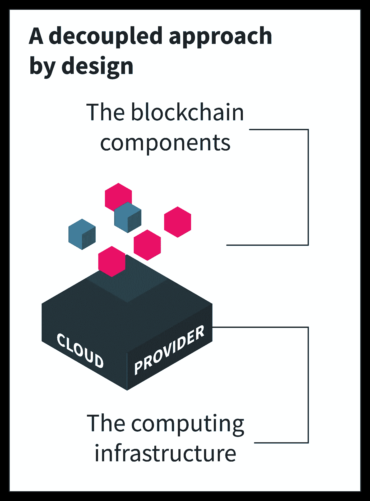

Forma **将计算和区块链层**解耦。因此，作为 BaaS 很容易，但您永远不会被单一云提供商所束缚。

因此，您可以随时选择您希望您的基础架构在哪里运行**，是在公共云提供商还是在您自己的私有基础架构中。**

此外，您总是可以决定是否要**离开一家云提供商而选择另一家**。因为你永远不会被束缚。

更重要的是，您可以**以您希望的最低级别访问每个组件**，允许您在需要时实现互操作性协议。

# 该项目

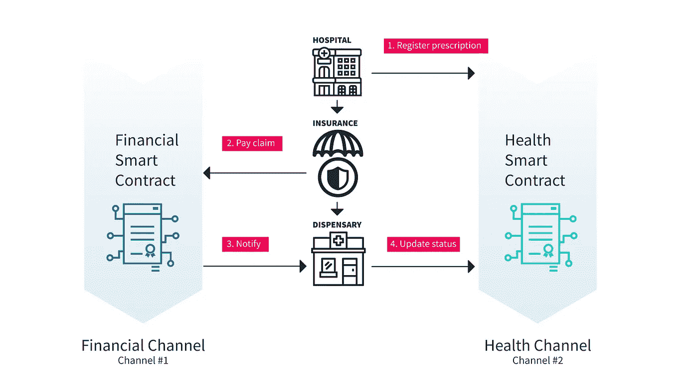

Transaction flow diagram: 1) The hospital registers a prescription 2) The insurance company pay the claim 3) Blockchain notifies the dispensary 4) and it updates the prescription status

> 因为这篇文章是关于如何部署应用程序的，你可以在这里克隆 repo。如果你对 Convector 在例子后面的实现逻辑感到好奇，你可以看看 [CDOH #5 (Convector 开发者办公时间)](https://www.youtube.com/watch?v=lJ_NMZno25M)。

这段代码展示了 Hyperledger Fabric 的一些优秀特性:

*   智能合约事件(向外界通知在区块链发生的一些交易，以便应用程序、物联网能够对其做出反应)。
*   多渠道查询。
*   对流器模型和控制器。
*   本机 Fabric SDK 的使用。

这个场景非常简单。假设我们需要为健康行业设计一个保险追溯网络。

## 要求

*   多家医院需要为其患者注册医疗处方。
*   保险公司必须为这些处方买单。
*   这将不得不在保险公司完成支付时向医院发送通知，以便他们可以更新处方状态。

> 请注意，该示例侧重于演示区块链功能。该示例的业务逻辑决不是准确的，应该仅用作示例。

在示例场景中，我们将有**两个不同的通道**。在 Fabric 中，一个通道**基本上就是分类帐本身**，因此拥有两个通道实际上是在财团中拥有**两个区块链，它们可能由彼此不同的参与者(组织)组成。**

我们有两个不同通道的原因是每个通道的成员可能不同(数据机密性和安全性)。虽然很多组织可能有兴趣加入**财经** **频道**，但并不是所有的组织都应该属于**健康** **频道**。

## 部署

我们需要做的第一件事是在 [**格式**](https://worldsibu.tech/forma?ref=medium_hackernoon) 中[创建一个账户](https://worldsibu.tech/forma/trial?ref=medium_hackernoon)。

> 有一个 7 天的免费试用期供您试用！在这里请求它[。](https://worldsibu.tech/forma/trial?ref=medium_hackernoon)

接下来，我们至少需要**一个 Kubernetse 集群**来运行区块链的基础设施。你可以在一个主要的云提供商那里创建一个免费试用版(我更喜欢谷歌云平台，它提供**300 美元的积分**而且非常简单)，然后按照[这个指南来建立你的 GCP 集群](https://docs.worldsibu.com/article/105-planning-your-infrastructure)(或者任何其他集群)。

为了这个简短示例的简单性，我将让 WorldSibu 为我托管集群，因为这是运行快速测试的最简单方法。当您需要在尽可能接近生产的环境中运行测试时，这非常方便。

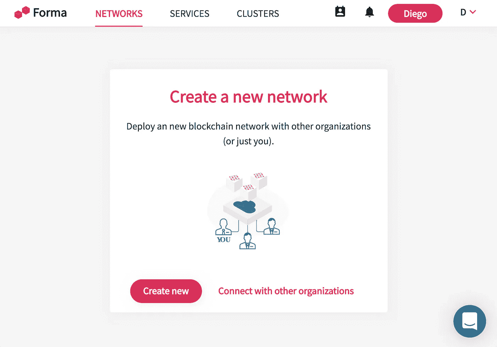

Forma home page

点击**创建新的**，系统将提示您输入网络名称、集群位置以及您希望谁加入网络。您添加的每个成员**也可以提供自己的集群**。或者，如果你很急，想快速测试一些东西，建立一个幽灵组织(一个在你控制下的假组织)

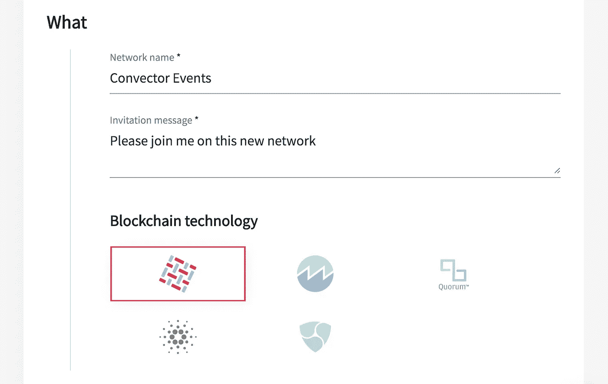

What do you need to create? Pick up the name and blockchain technology. Forma supports Hyperledger Fabric at the moment. More technologies in the roadmap.

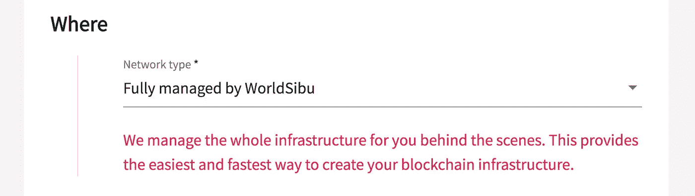

Where you will host the blockchain. You have 3 options 1) Managed, 2) Everything hosted by you, 3) Each member host on different machines.

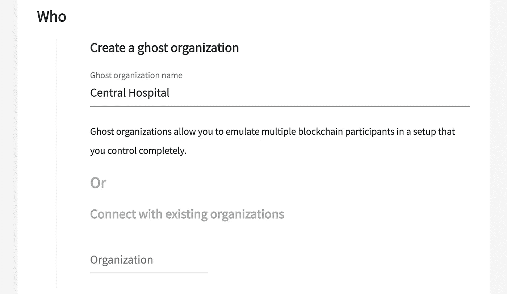

Who do you want in the network? Or a ghost name for a fake organization under your control.

> 当您创建一个有多个参与者的网络时，每个参与者都需要**在继续之前接受对网络的修改。**

点击**部署**，去喝一杯☕️.咖啡 **Forma** 将开始创建您和网络中其他集群之间的连接，启动区块链所需的所有容器，并自动为您进行配置。

一旦你回来，你的区块链应该准备好安装一些**通道**或**智能合约**，这实际上是我们的下一步。

让我们创建两个新频道，一个名为**金融**，另一个名为**健康。**

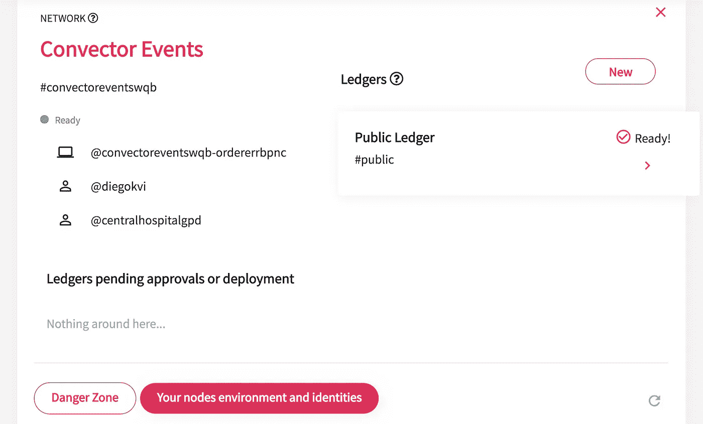

Only one ledger (channel) is created by default, Public, including all the members of the network.

Create the Financial ledger and include the organizations you need.

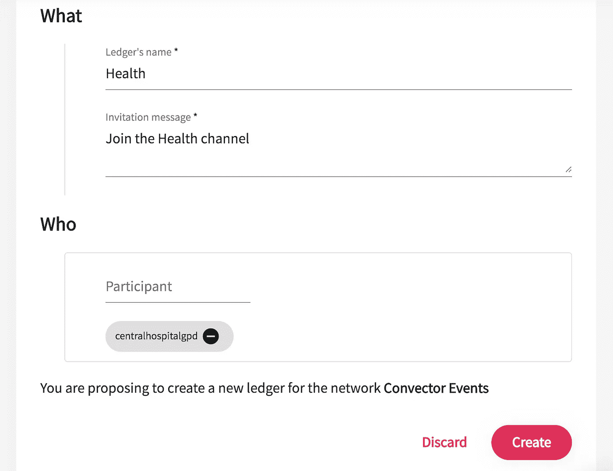

Create the Health ledger and include the organizations you need.

回到代码，确保您使用了 **Node 8.x** (如果您在更高版本中，您可以始终使用 NVM)并运行`npm install`。

任务完成后，运行`npm run cc:package -- financial org1`和`npm run cc:package -- health org1`。这是为了构建 Javascript 的类型脚本代码，这就是我们将要安装的。

你会注意到在项目的根目录下有两个新文件夹: *chaincode-financial* 和 *chaincode-health* ，让我们将内容压缩并上传到 [**Forma**](https://worldsibu.tech/forma?ref=medium_hackernoon) 。压缩文件夹内容**而不是文件夹本身**，或者使用类似`cd chaincode-financial && zip -r ../financial.zip . && cd ..`的命令

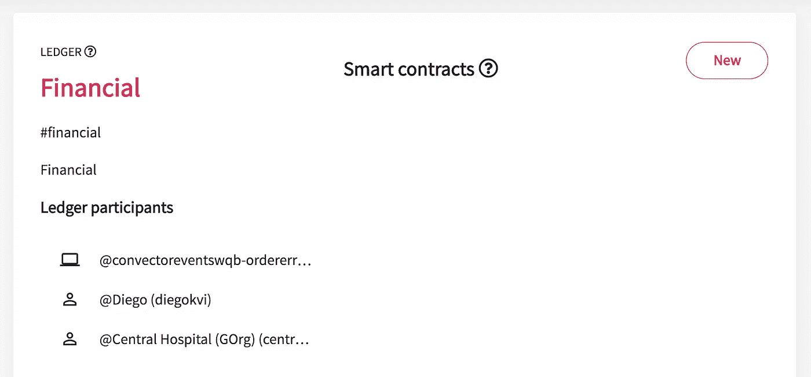

进入**财经频道**，安装预览步骤生成的***Financial . zip***。

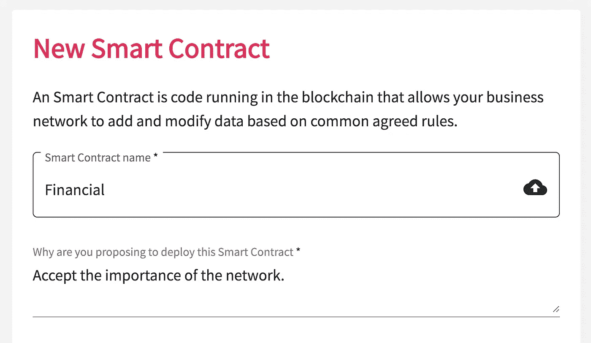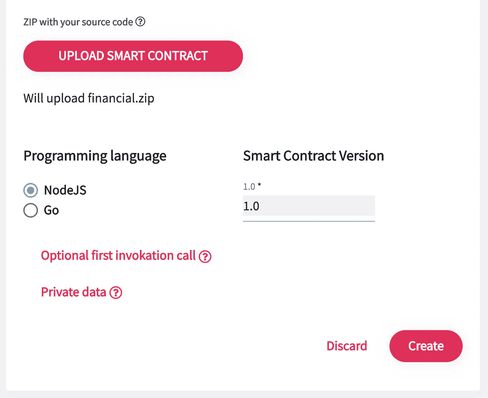

Forma supports both NodeJs and Golang chaincodes. It also supports private data collections very simple.

点击部署，你就完成了。现在让我们用 *health.zip* chaincode 重复安装步骤，但这次是在**健康频道**中。

现在，我们需要区块链网络的连接信息，这将允许您从外部连接到它。为此，我们需要一个**服务账户**，用 **Forma** 创建一个真的很容易。转到网络详细信息(**您的节点环境和身份)**，您将在那里找到您的环境详细信息。

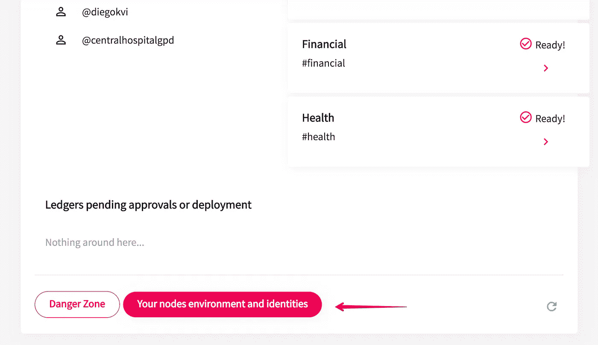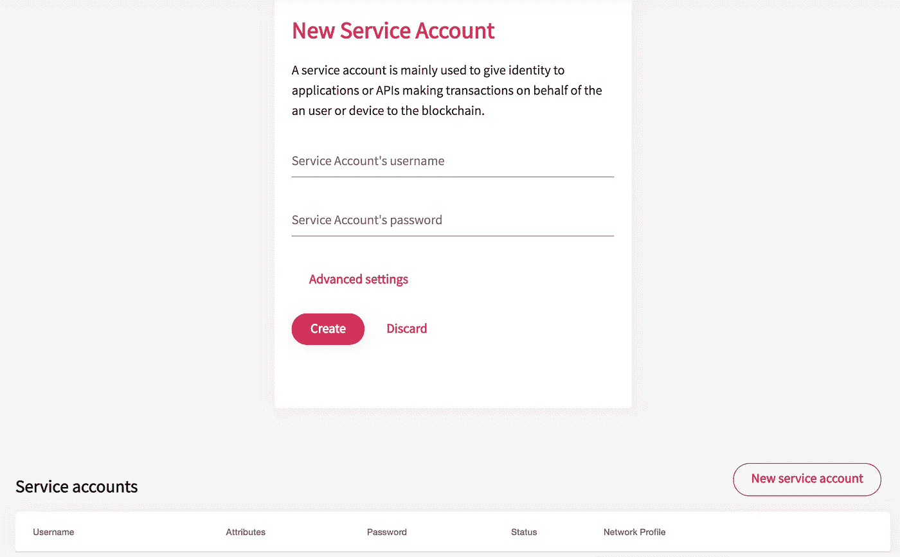

Provide the username and password, as well as any attributes for RBAC authentication.

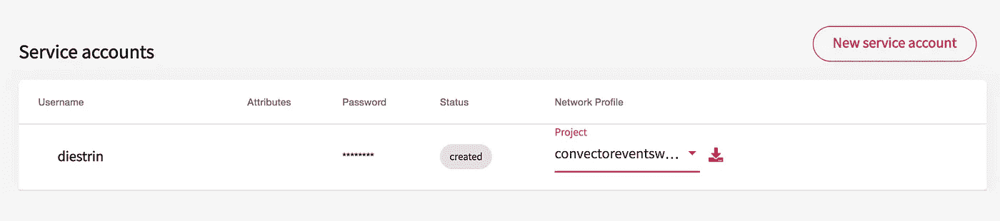

Download the configuration for a certain project.

创建帐户并**下载连接配置文件**，该文件描述了整个网络拓扑。它用于通过任何织物 SDK 或 Convector 与区块链连接。

我们只剩下一个额外的步骤，我们刚刚注册了帐户，但在我们能够使用它之前，**我们需要向 CA 注册它以获得证书**。

克隆这个 repo，它将帮助您完成[https://github.com/worldsibu/fabric-helpers](https://github.com/worldsibu/fabric-helpers)，并按照自述文件中的说明进行操作，它基本上是复制网络配置文件，并提供您的用户/密码来注册帐户。

将连接概要文件和上一步生成的密钥复制到`./config`文件夹，并运行`npm run lerna:test:e2e`来运行新基础设施的测试。

现在，我们需要确保**事件按预期进行**。打开两个终端窗口并运行`npm run listener`来启动一个服务器监听区块链中的事件，然后运行`npm run transaction`来发送一个事务并从 chaincode 发出一个事件。

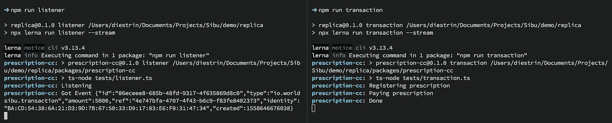

制作区块链应用程序现在变得非常简单，因为您可以将时间集中在设计和加入网络成员上，并更好地描述业务逻辑。此外，使用像 [**Convector**](https://worldsibu.tech/convector?ref=medium_hackernoon) 这样的**开源**框架，可以轻松地创建逻辑并在本地测试它，使用像 [**Forma**](https://worldsibu.tech/forma?ref=medium_hackernoon) 这样的平台，您可以将这些项目部署到现实生活的基础设施中，以运行压力测试并衡量您的性能。

> 如果你想了解 Convector 的更多信息，[查看它的文档](https://docs.worldsibu.com/article/71-getting-started)或者在 medium 上的帖子[。
> 如果你有兴趣了解更多关于 Forma 的知识，请查看](https://medium.com/worldsibu/for-devs/home)[入门页面](https://docs.worldsibu.com/article/50-getting-started)，或者[今天就注册](https://worldsibu.tech/forma/trial?ref=medium_hackernoon)免费试用。