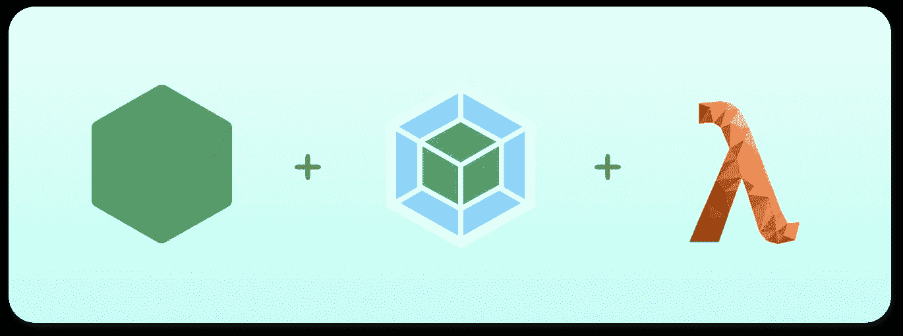
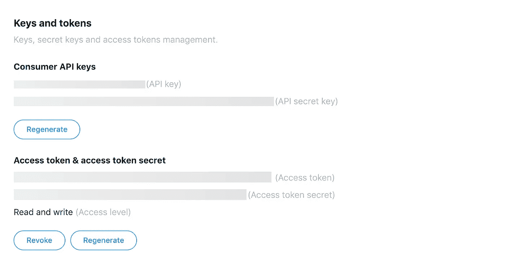
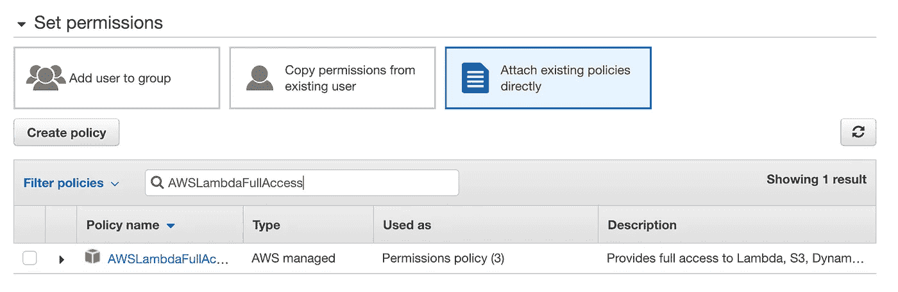
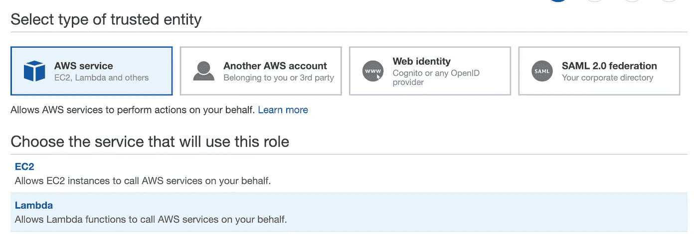
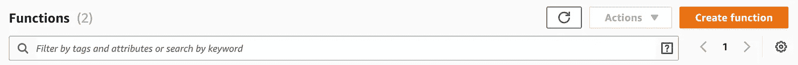
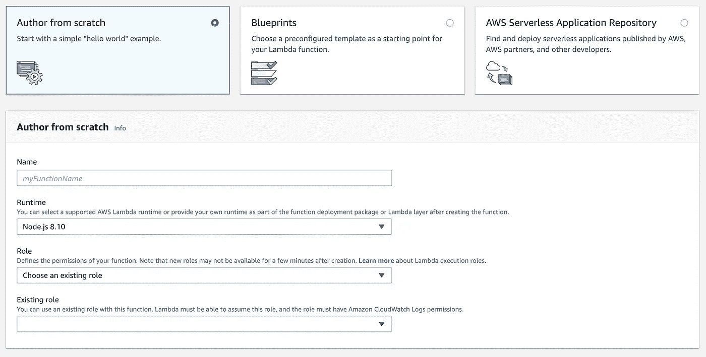
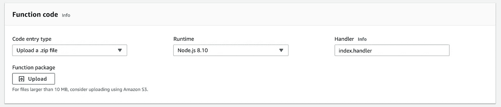
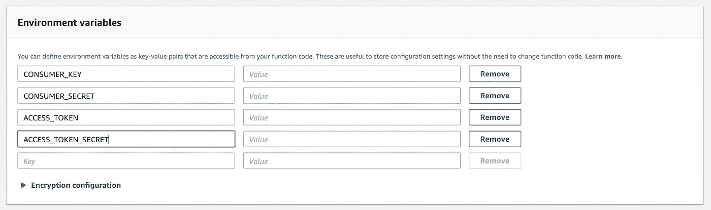
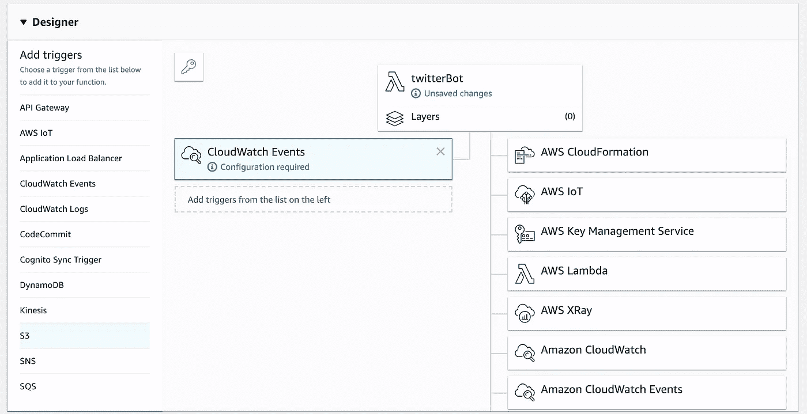
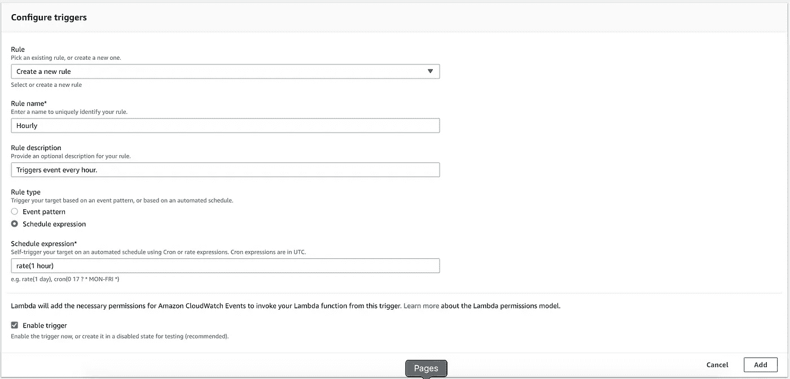

# 使用 Webpack 在 AWS Lambda 上部署 Node.js Twitter Bot

> 原文：<https://medium.com/hackernoon/deploying-a-node-js-twitter-bot-on-aws-lambda-using-webpack-df6e2e187a78>



最近，我有了一个为 [#LearnInPublic](https://twitter.com/hashtag/LearnInPublic) 社区开发一个 [Twitter 机器人](https://twitter.com/_LearnInPublic_)的想法，我认为这将是一个有趣的项目，只需要半天的工作。而且，为了学习，我想用 AWS Lambda 函数。为什么选择 AWS Lambda？因为维护一个 twitter 机器人实际上是免费的，而且我也亲身体验了一个在业界广泛使用的看似复杂的工具。AWS Lambda 每月有 100 万个免费请求和 40 万秒的计算时间。我的 bot 使用上述数字的 0.02%。

在这个过程中，我发现了一个很酷的用例 Webpack。我很高兴阅读 webpack 文档并了解了这些问题。尽管这是一个非常原始的用例，但有一天我感觉像一个真正的肖恩·拉金。这里有一篇关于如何做同样事情的详细文章。

> **关于机器人本身的一点信息。**
> 
> 大约半年前，当 Shaun Weng 写下关于在公共场合学习的文章时，我产生了前所未有的共鸣。这感觉像是朝着正确的方向推了一把，我最终保存了这篇文章，并不时地阅读它作为激励。我认为写一个机器人会很酷，它会定期发布相同的 [swyx](https://twitter.com/swyxa) 帖子(这样它会不断出现在我的 feed 上)并转发所有带有#LearnInPublic 标签的帖子，将社区的工作集中在一个屋檐下(个人资料)。

# 先决条件

不用说，您需要在计算机上安装 Node.js、一个用于 bot 的 Twitter 帐户和一个 AWS 帐户。本教程还假设您熟悉 node，不会深入研究 bot 的工作方式。

**本教程分为三个主要部分**

1.  设置好一切(Twitter、AWS 控制台、Bot 配置)。
2.  编写 bot 并用 Webpack 构建它。
3.  使用 AWS Lambda 部署！

# **设置**

这一部分处理所有你需要为你将要使用的每个平台注意的帐户设置。

*   **推特**

你必须为机器人创建一个新帐户，它将负责在其个人资料上发布/转发。一旦你完成了，去 https://developer.twitter.com/建立一个开发者账户。

通过填写适当的信息，在 https://developer.twitter.com/en/apps/create 创建一个新的应用程序。成功创建应用程序后，记下 API 密钥和访问令牌。



*   **AWS**

您应该有一个 AWS 帐户才能继续，如果没有，您可以在[https://aws.amazon.com/account/](https://aws.amazon.com/account/)创建一个。完成后，我们可以继续设置 lambda 函数。

我是第一次使用 AWS，所以我不确定我是否正确理解了身份工具(I am 用户和角色),或者我是否正确使用了它们，但是这些是我根据对文档的最佳理解采取的步骤，它确实有效，所以这里不再赘述\_(ツ)_/。

当您在 AWS 上创建帐户并使用电子邮件/密码登录时，您是以 root 用户身份登录的。root 用户拥有对所有 AWS 服务和资源的完全访问权限，因此建议不要使用 root 用户执行日常任务。为了提高安全性和组织性，您可以将 AWS 帐户的访问权限授予特定用户，即您使用自定义权限创建的身份。这就是 AWS IAM 发挥作用的地方。

> WS 身份和访问管理(IAM)使您能够安全地管理对服务和资源的访问。使用 IAM，您可以创建和管理 AWS 用户和组，并使用权限来允许和拒绝他们对 AWS 资源的访问。

转到 [AWS IAM 控制台](https://console.aws.amazon.com/iam/home)创建一个新用户。给它起个名字，这样你就能知道它的用途(比如 twitter-bot)。请确保用户附加了 AWSLambdaFullAcces 策略。



此外，还要创建 IAM 角色，IAM 角色是向您信任的实体授予权限的安全方式。您可以从同一个 AWS IAM 控制台创建角色。选择 Lambda 作为将使用此角色的服务。



您还必须为该角色附加相同的 AWSLambdaFullAcces 权限策略。给它一个合适的名字(如 lambda-twitter-bot)，描述并创建角色。

*   **推特机器人**

我使用了 npm 包 [twit](https://www.npmjs.com/package/twit) ，它是一个 Twitter API 客户端，用于 node 与 Twitter API 进行交互。一旦你写好了机器人，你需要上传一个压缩的 zip 文件到 AWS Lambda 控制台。

我们将使用 Webpack 捆绑应用程序，并为上传压缩一个文件，而不是上传整个`node_modules`,这可能会有开发依赖关系和其他配置文件夹。

为您的项目创建一个文件夹，并在切换到该目录后初始化您的节点项目。然后，安装 twit 作为项目的依赖项。

```
mkdir twitter-botcd twitter-bot && npm init -ynpm install --save twit
```

接下来，我们需要为开发和生产环境设置从 twitter 获得的 API 键。我们将使用 API 键的本地副本维护一个`dev.js`，并使用`prod.js`来访问绑定到相同 API 键的生产环境变量，我们最终将在 AWS Lambda 控制台上设置这些变量。如果你上传你的代码到 GitHub，确保你没有提交`dev.js`，把它添加到. gitignore。根据环境我们会导出适当的文件。

```
mkdir config && cd configtouch index.js
touch dev.js
touch prod.jS
```

**index.js**

```
if (process.env.NODE_ENV === 'production') {
module.exports = require('./prod');
} else {
module.exports = require('./dev');
}
```

**dev.js**

```
module.exports = {
consumer_key: 'YOUR CONSUMER KEY HERE',
consumer_secret: 'YOUR CONSUMER SECRET HERE',
access_token: 'YOUR ACCESS TOKEN HERE',
access_token_secret: 'YOUR ACCESS TOKEN  HERE'
};
```

**prod.js**

```
module.exports = {
consumer_key: process.env.CONSUMER_KEY,
consumer_secret: process.env.CONSUMER_SECRET,
access_token: process.env.ACCESS_TOKEN,
access_token_secret: process.env.ACCESS_TOKEN_SECRET
}
```

# 编写 bot 并用 Webpack 构建它

对于我的机器人，我需要 AWS Lambda 在不同的时间间隔触发两种不同的功能(tweet 和 retweet)。让我们仅以其中一个为例进行讨论。(如果你有和我相似的用例，就像我一样部署两个 lambda 函数)。这个例子是一个机器人转发某个标签，但不转发自己的帖子。

AWS lambda 函数的格式如下，因此您需要导出您的函数:

```
exports.handler = (event, context, callback) => {
   //function logic
}
```

**有趣的事实:不要使用 forEach 循环，因为它们不支持异步代码。** [**这里有一篇关于同一**](https://codeburst.io/javascript-async-await-with-foreach-b6ba62bbf404) **的大文章。**

我不会太深入地探究机器人代码的工作原理，如果你阅读 twit 的[文档的话，这很简单。你查询所有带有给定标签的最近的推文。在收到响应时，您分解所有的状态，遍历它们并转发它们。`for .. of`循环与异步 async/await 配合得很好。](https://www.npmjs.com/package/twit)

您可以通过进入 Node.js 控制台来测试代码。

```
> node
> let retweeter = require('index.js');
> retweeter.retweet();
```

**网络背包！！！！！！**

接下来，我们捆绑代码，以便更容易地部署到 AWS Lambda，因为我们不需要在我们的 zip 中没有`node_modules`。

> [**Webpack**](https://webpack.js.org/) 是一个针对现代 JavaScript 应用的*静态模块捆绑器*。当 webpack 处理您的应用程序时，它会在内部构建一个[依赖图](https://webpack.js.org/concepts/dependency-graph/)，它会映射您的项目需要的每个模块，并生成一个或多个*包*。

Webpack v4 比以前更容易使用，默认情况下甚至不需要配置文件。对于初学者来说，这可能看起来令人生畏(就像很长一段时间以来它对我一样)，但是它被很好地记录下来，并且很容易找到绕过它的方法。

**步骤 1:将 Webpack 安装为开发依赖项。**

```
npm install --save-dev webpack wepback-cli
```

**第二步:修改** `**package.json**` **添加构建脚本。**

```
//package.json{
  "name": "twitter-bot", 
  "version": "1.0.0",
  ...
  "scripts":{
   ** "build": "webpack",**
    ....
  },
  ......
  "devDependencies": {
    "webpack": "^4.29.0",
    "webpack-cli": "^3.2.1"
  },  
  "dependencies": {
    "twit": "^2.2.11"
  }
}
```

**第三步:添加 Webpack 配置。**

将`webpack.config.js`添加到项目目录的根级别。

```
//webpack.config.jsconst path = require('path');module.exports = {
    entry: './index.js',
    output: {
      path: path.resolve(__dirname, './dist'),
      filename: 'index.js',
      libraryTarget: 'commonjs'
    },
    target: 'node',
    mode: 'production'
}
```

以下是所有参数的用途列表

注意:如果你有多个不同配置的函数(就像我需要两个不同的输出给不同的 lambda 函数)，你可以通过导出一个 config 对象数组来导出多个配置。

```
module.exports = [{
  //config 1
},{
  //config 2
}]
```

**条目**

> 入口点指示 webpack 应该使用哪个模块来开始构建它的内部[依赖图](https://webpack.js.org/concepts/dependency-graph/)。Webpack 将计算出入口点依赖于哪些其他模块和库(直接和间接)。

这个机器人的切入点是`index.js`。

**输出**

> output 属性告诉 webpack 在哪里发出它创建的*包*以及如何命名这些文件。

`output.path`告诉 webpack 在哪里发出包，`output.filename`用于指定包名。

因为按照 AWS 规范，`index.js`用`retweet`函数导出一个对象，所以我们的 bundle 也应该这样做。您可以在节点控制台中测试这种行为。

```
> var library = require('./index.js');> library{  retweet: [AsyncFunction: hashtagRetweet]  }
```

`output.libraryTarget: "commonjs"`确保在包本身中，由 webpack 从入口点生成的函数将被分配给`exports`对象。

**目标**

> 指示 webpack 以特定环境为目标。使用`node`编译以便在类似 Node.js 的环境中使用

**模式**

> 通过将`mode`参数设置为`development`、`production`或`none`，您可以启用 webpack 对应于每个环境的内置优化。默认值为`production`。

这就是 webpack 的全部内容！快速启动您的终端和`npm run build`，在`./dist`中生成您的生产级捆绑包。压缩 dist 文件夹，因为 Lambda 控制台只接受。压缩文件。

```
> npm run build
> cd dist
> zip bot.zip index.js
```

# 使用 AWS Lambda 部署！

在我们旅程的最后阶段，我们会让这个坏小子活下来！我们想上传我们的 lambda 函数，并确保它在设定的时间间隔内被触发。AWS 自带的 CloudWatch Event 是完美的解决方案。CloudWatch 事件触发器允许您安排函数调用。这基本上是你的 lambda 函数的 cronjob。

*   转到您的 Lambda 管理控制台，您可以从导航栏中的服务访问它。在那里创建一个新的 lambda 函数。



*   给它一个合适的名称，选择 Node.js 8.10 运行时，并选择您之前在设置阶段创建的角色。async/await 语法等新特性可以工作，因为 AWS Lambda 支持最新的节点运行时。在 lambda 控制台中，你有各种选项来触发你的功能。



*   从 dist 文件夹上传 zip 文件。在这个例子中，将文件名改为`[filename].[function name]`，它将是`index.retweet`



*   接下来，我们添加生产环境变量。向下滚动找到输入环境变量的部分。打开你的`prod.js`文件，一个一个复制环境变量。要特别注意，确保复制了准确的变量名。



*   最后，在函数设计器中添加一个 CloudWatch 事件触发器。选择 CloudWatch 事件并向下滚动以配置它。创建一个新规则，您可以在其中声明调用函数的速率。



```
//Syntax:rate(V*alue* *U**nit*)// *Value* is a positive number
// *Unit* can be minute | minutes | hour | hours | day | days
```

例如，函数调用之间的持续时间为 5 分钟，表达式应该是`rate(5 minutes)`



保存这个函数，你的机器人应该准备好了！使用顶部的测试按钮测试您的功能。Out bot 的函数不带任何参数。你的机器人会准备好，发挥它的魔力，为你节省时间和金钱。

如果您不需要 lambda 函数的一些指标，monitoring 选项卡下的 CloudWatch 指标提供了一些关于调用、持续时间、错误、可用性等的很酷的图表，可以为您提供函数性能的估计。你也可以阅读捕获`console.log`的 CloudWatch 日志，这可能有助于你调试东西。

但是你的机器人现在已经可以在没有任何人工帮助的情况下运行推特了！为自己感到骄傲！感谢阅读

我是一个在印度的网络和移动开发人员。我喜欢 React/React Native/JavaScript。我写我在技术、项目和黑客马拉松方面的冒险经历。如果这篇文章对你有帮助，那就砸了那个 like 按钮(jk 但是你可以拍拍他们)。

我是 Twitter 上的 sumdook，如果你想和我谈论 React，tech，JS，足球，动漫，电子竞技和任何事情。我也在重做我的网站，我一完成就链接，干杯。