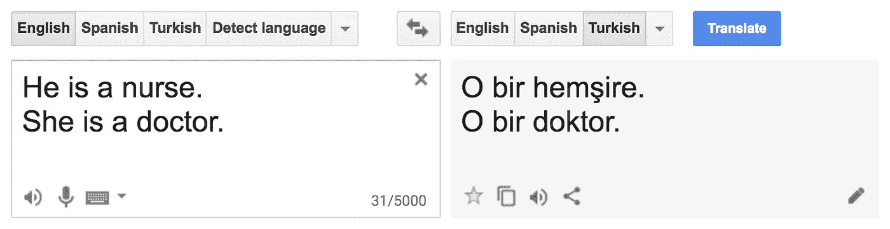
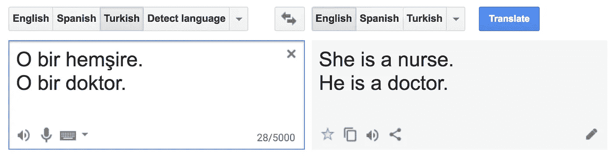
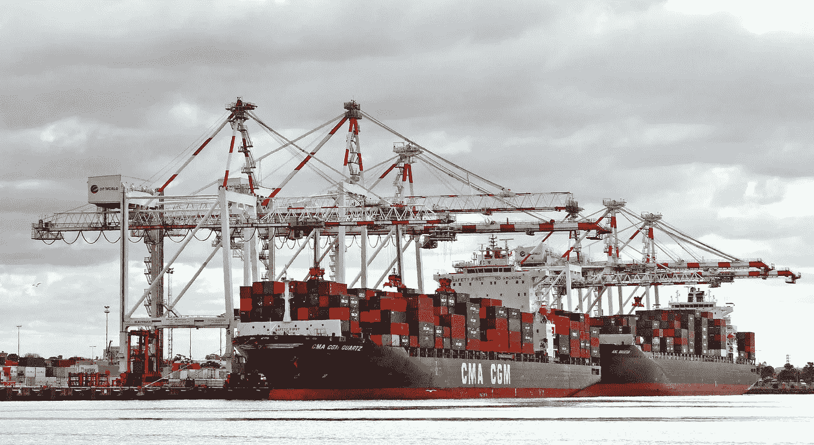

# 使用算法设计公平市场

> 原文：<https://medium.com/hackernoon/design-fair-markets-by-using-algorithms-6660e49241a9>

## 机器学习应该推动一个包容性的社会

Foto credit: [City of Greeley](https://www.flickr.com/photos/greeleygov/)

机器学习中的公平和偏见是一个蓬勃发展的研究领域。这项工作的大部分重点是歧视和包容。虽然这是一个重要的研究领域，我[全心全意地支持](https://hackernoon.com/my-dearest-eliisabet-de724a86d105)，但我建议科技公司和平台也应该开始研究有利于公平市场的“有偏见的”算法。

在这篇文章中，我将论证:

*   偏见和*不公平*在包括机器学习在内的技术领域*无处不在*
*   *市场*的公平 *也可以通过机器学习*促进**

# 技术领域普遍存在不公平现象

试试看:输入“他是一名护士。她是医生。”成[谷歌翻译](http://translate.google.com)翻译成土耳其语。然后翻译结果(" O bir bebek hemş ire。哦 bir doktor。”)翻译成英语，你会得到“她是一名护士。他是医生。”

From: Aylin Caliskan, Joanna J. Bryson, and Arvind Narayanan. Semantics derived
automatically from language corpora contain human-like biases. Science,
356(6334):183–186, 2017.

这不仅是谷歌翻译的一个特点，也是几乎所有技术的一个特点，包括许多算法。Rachel Thomas 在她最近的 TEDx 演讲中做了很好的工作，总结了算法中的偏见在我们周围无处不在的证据。它出现在面部识别软件(对于女性和非裔美国人的面部识别仍然表现不佳)、语音识别(YouTube 会自动生成隐藏字幕，但对于女性声音来说准确性较低)等等。

Rachel Thomas P.h.D. cofounder Fast.ai | TEDxSanFrancisco

机器学习社区意识到了这些偏见，并通过[公平、问责和透明(ACM FAT*)会议、](https://fatconference.org/) [机器学习包容](https://twitter.com/InclusionInML)和[算法正义联盟](https://www.ajlunited.org/)等举措，我们正在解决偏见的负面影响。

# 技术可以刺激公平的市场交易

在去年四月的一次聚会上，我主持了关于双边市场和机器学习的会议，我和同事张讨论了她在市场环境下的公平性和机器学习方面的工作。没过多久，我就计划与钱莹(和[玛蒂安·阿雷斯](https://medium.com/u/b96035366292?source=post_page-----6660e49241a9--------------------------------))就[平台经济中自动化决策的公平性](https://www.meetup.com/nl-NL/Data-driven-Society/events/254470370/)展开另一场讨论。

我强烈推荐阅读钱莹(和她的同事第一作者[青川叶](https://www.erim.eur.nl/people/charlie-ye/)和[罗默德克尔](https://www.erim.eur.nl/people/rommert-dekker/))的一篇论文，该论文论述了[在算法](https://arxiv.org/pdf/1505.07434.pdf)中考虑公平的成本(剧透:在他们研究的案例中，公平似乎只带来了很小的代价)。它是根据鹿特丹港的真实案例改编的，在那里，搬运集装箱的工作被拍卖。

Foto credit: [Bernard Spragg. NZ](https://www.flickr.com/photos/volvob12b/)

港口带来的挑战如下:来自内陆装卸集装箱的卡车通常在任务间隙有空闲时间。码头可以利用这些闲置的卡车，为它们提供工作。不同的卡车运输公司可以竞标这些工作，这取决于他们在特定时间的闲置卡车。考虑到不同公司的出价，码头决定将工作分配给不同的公司。

为了满足任务分配的公平性标准，钱莹和她的同事开发了一种多项式时间优化方法，该方法由两种新算法组成:IMaxFlow 和 FairMinCost。这两种算法的输出是总成本最小的最大-最小公平任务分配。

当然，这个海港案例并不是独一无二的，它引出了在我的前雇主 Booking.com 也常见的问题。例如，我们实际上是在为谁优化公平性呢？

*   我们是否为客户优化了公平性？
*   我们是否为供应商优化了公平性？
*   还是我们在为平台优化公平性？

在 Booking.com，我们在实施影响双方市场的算法之前，进行了无数次讨论。这项研究在当时会受到欢迎，成为形成我们论点的输入。就目前而言，这是一个开始。我想在后续的帖子中讨论一下，究竟该如何创建一个公平的市场和一个由机器学习驱动的包容性社会。

我想和这篇文章交流的是:

*   偏见和*不公平*在包括机器学习在内的技术领域*无处不在*
*   市场的*公平性* *也可以通过机器学习*促成**

让我们明确一点，这都是相当新的工作。没有明确的答案。像往常一样，还有更多的工作要做。不仅是研究界，我想明确敦促行业数据科学家以包容和公平的方式接受这一挑战以及应用机器学习的其他挑战。

[https://upscri.be/hackernoon/](https://upscri.be/hackernoon/)