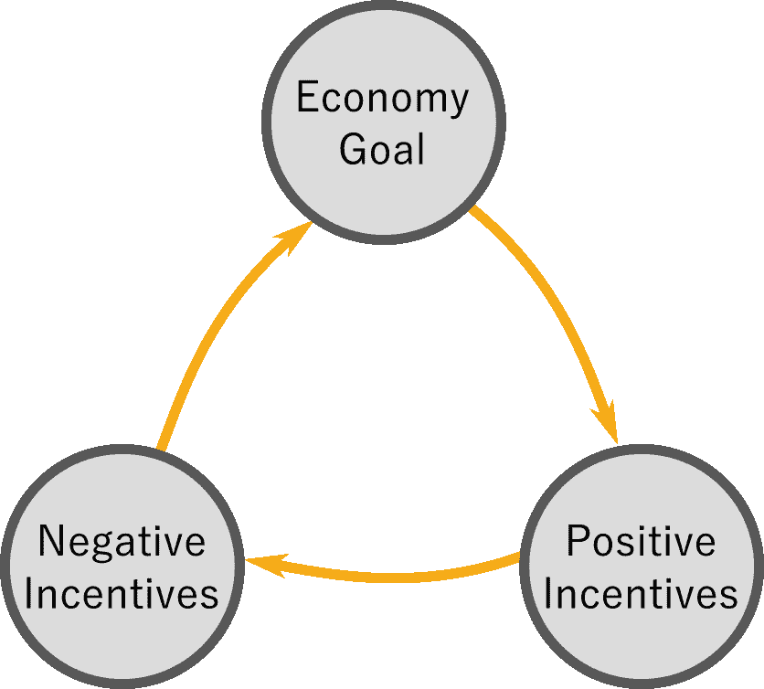
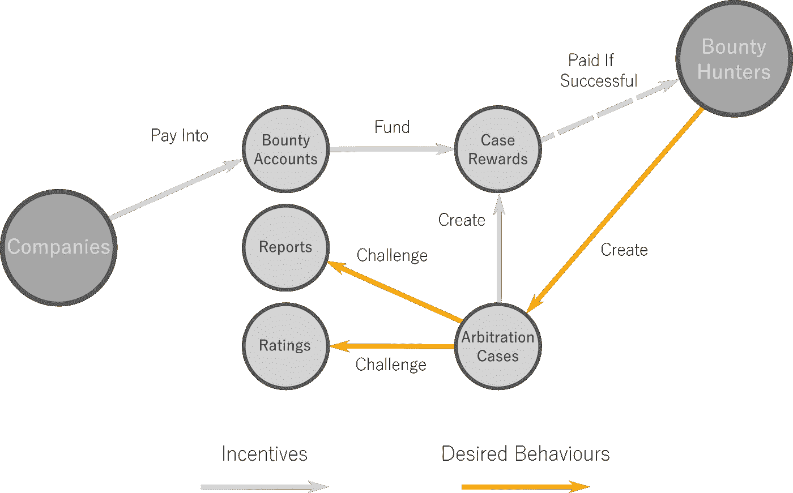
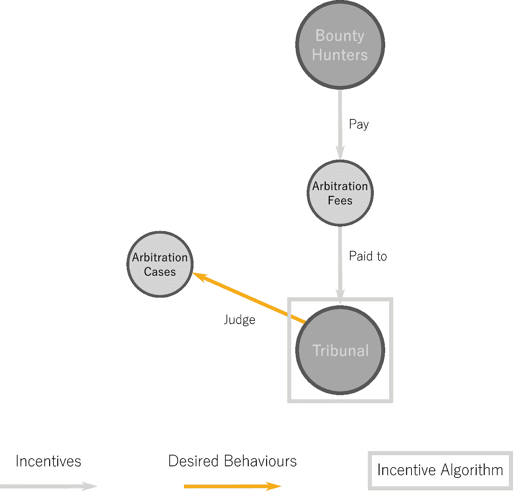
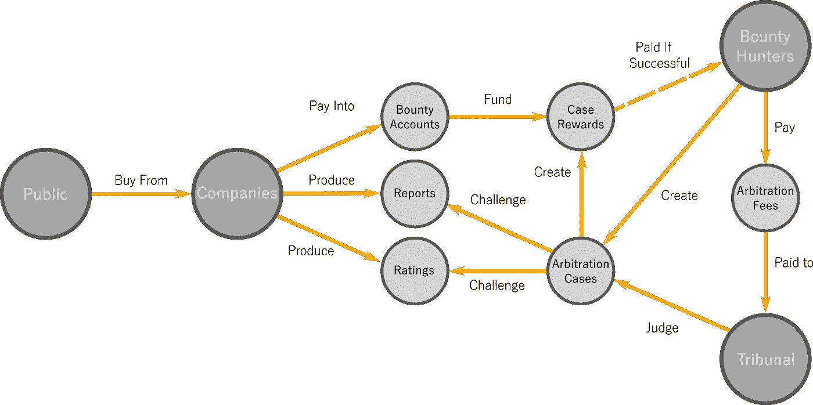

# 设计代币经济——激励

> 原文：<https://medium.com/hackernoon/designing-a-token-economy-incentives-8e23232a55ff>

激励设计之所以是软件解决方案设计的强大工具，是因为当激励被正确地结合时，它们将推动解决方案无限地增长。本文将介绍一种设计经济激励的方法，经济使用这种方法随着时间的推移向所有参与者传递价值。

> 不管你怎么称呼它，激励是让人们更加努力工作的东西。—尼基塔·赫鲁晓夫

# 本文简介

本文是关于如何设计代币经济的系列文章的第三部分，结合了我作为 [TechHQ](http://www.techhq.io/) 首席区块链架构师的工作经验。我的目标是产生一个框架，它可以在一个结构化的和全面的方法中重复用于代币经济的分析和设计。

本系列的前几篇文章介绍了如何将经济的[目标](https://www.techhq.io/7051/how-to-design-a-cryptocurrency-in-six-steps-part-1/)定义为单一驱动愿景，如何定义[经济参与者](https://www.techhq.io/7095/how-to-design-a-cryptocurrency-in-six-steps-part-1-2/)及其交易，以及允许参与者交易的环境设计，这与走向市场策略密切相关。

本文将介绍一种设计经济激励的方法，这种方法用于随着时间的推移使经济保持在目标路径上。我的博弈论知识还没有达到博士水平，所以我确信我的方法可以很容易地用学术界的一些工具和技术来改进。像往常一样，我们非常欢迎所有的反馈。

对于这一部分，正如我对第二部分利益相关者映射和市场设计所做的那样，我将把 [TechHQ](https://www.techhq.io/) 产品用于 11 月在伯尔尼[斯托蕾雅](http://techhq.io/strea)举行的[先锋. io 能源黑客马拉松](https://pioneers.io/energy-blockchain-hack)。这个解决方案有一个非常简单的技术层，作为具有一些审计功能的文档注册表，还有一个精心设计的经济层，从理论上讲，它允许斯托蕾雅轻松达到全球规模。

Figure 1: Screenshot from the [Strea homepage](http://techhq.io/strea)

# 关于激励设计

通常被列为区块链解决方案设计要求的一项技能是博弈论，它涉及到[机制设计](https://en.wikipedia.org/wiki/Mechanism_design)的研究领域。这些领域的知识让我们理解为什么群体在寻求实现个人目标的过程中会以这样的方式行动。举一个比特币的例子，矿工开采新区块的原因是因为他们每次这样做都会收到比特币的[货币奖励](https://en.bitcoin.it/wiki/Mining#Reward)，从而受到激励。

博弈论中的学术知识肯定会对激励设计有所帮助，但从我自己的经验来看，一些常识和批判性思维可以产生一个对原型和球场足够好的近似值。如果你的想法得到了资助，那么你一定要找到一种方法使它正式化，给你更多的信心。

激励设计之所以是软件解决方案设计的强大工具，是因为当激励被正确地结合时，它们将推动解决方案无限地增长。在比特币的例子中，只要激励机制保持在某个区域内，这种奖励就吸引了越来越多的矿工，比特币的资本总额正在大幅增长。

# 设计激励措施

经济激励和价值转移是一个强大的工具，因为它们可以用来激励利益相关者为解决方案的更大利益而行动。通过利用用户的意愿，所需的管理量大大减少，这使得解决方案更具可扩展性。在[本系列的第 1 部分](https://www.techhq.io/7051/how-to-design-a-cryptocurrency-in-six-steps-part-1/)中，这是作为分权目标介绍的，应该始终是区块链解决方案的一部分。

设计有效激励的基本前提是从[价值转移网络](https://www.techhq.io/7095/how-to-design-a-cryptocurrency-in-six-steps-part-1-2/)开始工作，该网络显示了我们经济参与者之间的期望交易。这个价值转移网络将作为激励设计的目标，但同时激励设计将产生目标价值转移的细化，并且可能是整个产品的支点。

Figure 2: Incentive Design Process

**经济目标:**斯托蕾雅[的目标是透明地报告碳排放。连续的激励设计迭代让我们提炼出公司应该被迫公开多少数据，以及他们可以保密哪些数据。经过几次反复，解决方案变得尽可能简单:所有数据报告都是完全自愿的，但没有私人数据。](http://techhq.io/strea)

**积极激励:**这些机制旨在激励一些经济参与者做某事。在比特币中，这是激励矿商签署区块的区块奖励。在斯托蕾雅，他们是赏金猎人，寻找不透明的报告，费用由报告公司支付。

Figure 3: How Bounty Hunters are **incentivized** to audit emissions in [Strea](http://techhq.io/strea)

在大多数解决方案中，角色的数量可以减少到五个或更少，具体的激励措施通常只包括两个或三个。如上所示，在解决方案的第一阶段，将确定大多数角色和积极的激励机制，这可能有助于更清楚地定义利益相关者之间的价值转移。

**消极激励:**这些机制旨在抑制虐待行为。在比特币中，所有的[抑制因素都内置于它运行的区块链平台](https://en.wikipedia.org/wiki/Bitcoin_network#Security)中，但这并不是运行在[以太网主机](https://www.ethereum.org/)上的解决方案的选项，也不一定是所有抑制因素的最佳策略。

在[斯托蕾雅](http://techhq.io/strea)中，我们想要实施的第一个抑制因素是，赏金猎人需要对自己负责，并提供足够的信息，以使违反透明度的行为清晰、公平。出于这一目的，我们决定赏金猎人只有在提供可核实的透明度违规行为并且缺乏低级共识方案时才会得到报酬。我们成立了一个独立的法庭。

Figure 4: How Bounty Hunters are **disincentivized** to raise weak arbitration cases in [Strea](http://techhq.io/strea)

我们立即意识到，法庭成员本身可能并不公正，因此我们实施了随机法庭选择、法庭隔离、对法庭判决中少数方的处罚以及对未作出判决的处罚。本文并未详细介绍所有这些功能。

激励设计流程的第二次迭代产生了对经济目标、利益相关者之间的价值转移、对滥用行为的洞察以及更完整的激励设计的调整。每次连续的迭代应该产生较少的变化，并收敛到最终的解决方案。如果不是这样，也许应该考虑对经济目标进行更深入的研究。

Figure 5: Complete design of incentives for [Strea](http://techhq.io/strea)

# 结论

经济激励是设计分散解决方案的有力工具，允许经济参与者被信任为实现经济目标而共同工作，而不需要人工监督。这就产生了更具可扩展性的解决方案，这反过来又使得更容易获得解决方案自我维持所需的足够数量的参与者。

经济激励的设计并不是一个新的研究领域，但是它们在软件产品开发中的大规模应用却是，短的实现窗口和频繁的支点的趋势需要一个可以广泛用于此目的的松散框架。深厚的学术知识和支持总是受欢迎的，但并不总是容易获得或容易整合。

在本文中，我们介绍了如何通过依赖利益相关者价值转移网络和迭代过程来促进激励设计，该迭代过程关注经济目标和引导经济参与者一起工作的积极和消极激励网络。

使用这些工具设计的经济可以很容易地用简单的图表描绘出来，根据我们的经验，这些图表可以很好地帮助潜在投资者在推销过程中理解解决方案。使用这些工具设计的经济可以很容易地用简单的图表描绘出来，根据我们的经验，这些图表可以很好地帮助潜在投资者在推销过程中理解解决方案。为了证明这一点，请关注斯托蕾雅的未来发展。

*文章原载于* [*TechHQ 博客*](https://www.techhq.io/7166/how-to-design-a-cryptocurrency-in-six-steps-part-3) *。*