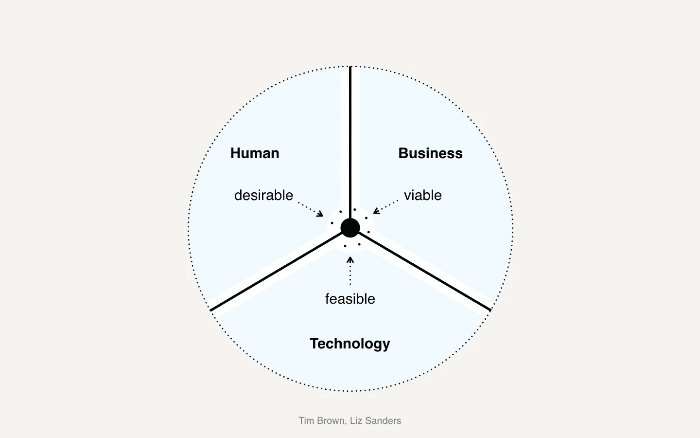
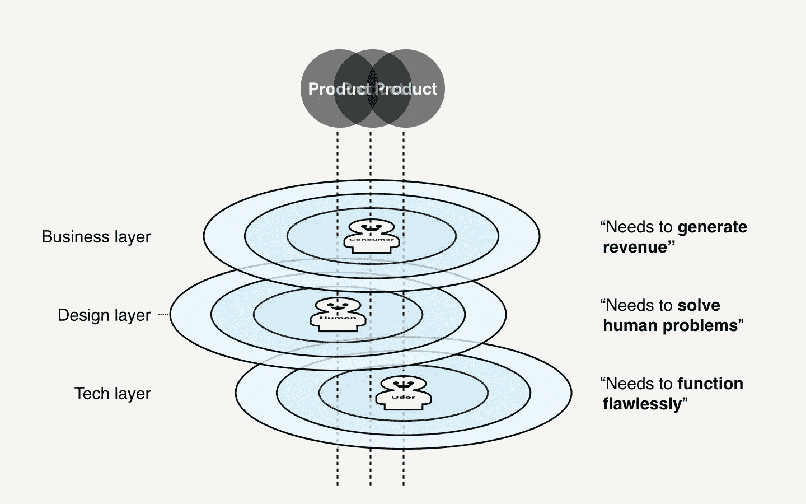

# 分布式计算的产品信号

> 原文：<https://medium.com/hackernoon/designing-for-distributed-computing-be5d4c1ab2a1>

## 从设计思维、指数思维和系统思维的角度来看，“分布式计算”对我意味着什么

# 区块链的产品化

## 设置场景

作为一名数码产品设计师(UX/UI/IX 设计师/研究员/战略家)，自从 2015 年我第一次见到 Vitalik 以来，我有幸[走进了区块链的世界，我一直在思考我对这两个世界(区块链和设计)的看法。](/innovation-thinking/my-journey-into-the-worlds-of-blockchain-cryptocurrencies-pt-i-75c2f64d68a4)

自 2017 年加密货币泡沫以来，我一直在思考以下两个问题:

**就个人而言:**关于分布式计算，我理想的设计是什么？

就分布式计算而言，这个世界理想地需要什么？

这可以重新表述为“对我和这个世界最重要的理想分布式计算产品是什么？”

这个问题最终是为了解决这个问题:

Which distributed computing products will be the most feasible, viable, and desirable?

这个问题也有以下变化:

*   什么是杀手级应用……或者说区块链的“DApps ”?
*   区块链如何才能实现产品与市场的契合？
*   区块链的成功是什么样的？

在我试图回答这个问题之前，我必须定义“分布式计算”的含义:

**一般来说**:分布式计算是计算机科学中研究分布式系统的一个领域，分布式系统是组件位于不同联网计算机上的系统。然后这些人通过互相传递消息来交流和协调他们的行动；他们为了实现一个共同的目标而相互作用。

**具体来说**:分布式计算包含了很多用例，比如对等网络。其中 3 个在本出版物中无论何时使用该术语都将被置于聚光灯下。这三个用例是“区块链”、“加密资产”和“加密网络”。同样为了忠于分权哲学，私有和联邦区块链将被排除在论文之外。警告——只有当它们被视为实现真正去中心化的垫脚石时，才会被包含/引用。

## 想出一个论文

答案其实可以在这里找到:

 [## 过去、现在、未来:从合作到加密网络

### 上面要注意的关键现象是这些平台不再与他们的用户合作(“补充”/…

a16z.com](https://a16z.com/2019/03/02/cooperatives-cryptonetworks/) 

我得出这个简单的结论是因为我前面提到的问题只考虑了设计思维和指数思维。然而，三位一体的难题中缺少了一块——系统思维。如果我把它应用于所有这些，我可以把上面的问题重新表述为下面的命题:

加密网络合作将是最可行、最可行、最受欢迎的分布式计算产品。

我坚信，从长远来看，它们将成为分布式计算世界中的杀手级数字产品。然而，你可能想知道——这具体是为什么以及如何发生的？那么所有已经出现的分布式计算产品呢？你是说这些都不重要吗？

不，但我要说的是，就 Web 3.0 产品化而言，从长远来看，它们将是最有影响力的。我这样说的原因是因为当前存在的分布式计算产品可以分为 3 种不同类型的产品:

*   [第 2.0 层](https://www.coindesk.com/layer-2-blockchain-tech-even-bigger-deal-think)解决方案(链接到 Coindesk 发表的一篇文章)——基础设施项目，如等离子、Lodestar、雷电等。
*   [Web 2.5](https://projects.invisionapp.com/boards/UD3RSPZ4APR/) 解决方案(链接是我设计的 Web 2.5 产品的一个 Invision Board，比如[万能水龙头](http://faucets.blockxlabs.com)——[Consensys](https://media.consensys.net/an-definitive-list-of-ethereum-developer-tools-2159ce865974)认为的众多顶级以太坊开发者工具之一)——与 Web 3.0 接口的产品，比如 MetaMask、Kaleido、比特币基地等。
*   [Web 3.0](https://www.stateofthedapps.com/) 解决方案(链接是一个叫国家的 Dapps 的网站)——Cryptokitties，Decentraland，MakerDAO 等。

当我试图回答“成功是什么样的？”这个问题时，我指的是什么？，它只与 Web 3.0 相关。

事实是，分布式计算世界中大多数成功的解决方案都属于第 2 层或 Web 2.5 解决方案。

这两种类型的解决方案确实受到了高度重视，例如，第 2 层解决方案已经获得了大量的资助和资金，而 Web 2.5 解决方案已经获得了大量的用户和用户活动。

另一方面，Web 3.0 产品已经看到了相对较强的可行性，但在可行性和合意性方面却没有。截至目前，Web 3.0 产品仍在努力实现产品与市场的高度契合。这样做的原因是因为我坚信，直到现在，用户还没有被清楚地识别、定义和理解。

此外，我们必须记住，并不是所有的“杀手级软件解决方案”,即使是在 Web 2.0 中，都是从杀手级解决方案开始的。他们中的许多人成长为杀手级的解决方案。我们不能忽视这样一个事实，即在 Web 3.0 甚至 Web 2.5 中今天不被认为是“杀手”的东西，在(不久的)将来的某一天不会成为“杀手 DApp”。我们还必须考虑 Web 2.0 和私有/联合区块链解决方案也有同样的潜力。

## 这一切的理论

有必要问一问北极星是什么，我们在整个去中心化运动中的目标是什么？是简单地给社会增加一个技术层，还是在论文提供的情况下，我们不应该寻找一个业务层和设计层来适应所有这些吗？

一些人试图将这一技术层与业务层结合起来，这就是众筹模式，这也是 ico 诞生的原因。他们当然有不同的名字，比如 TGE 的代币生成活动，但最终——[这种商业模式被证明是不可持续的](https://hackernoon.com/icos-epic-failures-of-2018-doomed-from-the-start-814e4a9645bc)。甚至[ieo](/xtechblog/are-ieos-the-new-icos-what-is-an-initial-exchange-offering-ieo-c1aa76a8aac4)也是无效的，因为它们仍然需要一个采取集中交易形式的中介；这违背了权力下放运动的全部目的。另一方面，DAICOs 符合哲学标准。

另一种商业模式是[“…即服务”](/mavennet/mavenstamp-an-immutability-as-a-service-solution-afbd142adef9)商业模式，一些人试图将分布式计算与之相结合。然而，从哲学层面来看，这显然又是一件事——并不真正符合分权原则。如果人们定期向一个中央机构付费，以访问上述数字服务，这应该被视为真正的 Web 3.0 产品吗？虽然，这可能已经是不真诚的，因为这些“…作为服务”的分布式计算产品并不是真正的 Web 3.0 产品，而是 Web 2.5 产品。

因此，我和 Andreessen Horowitz 认为最有意义和最合适的商业层是商业合作社。这样做的原因非常清楚:

> 因为加密网络是基于开放源代码、共享状态、自动化“智能合同”和 24/7 国际市场的信息网络——所有这些工具都允许参与者找到彼此、共享信息和进行协调——这些网络可以更容易地克服合作企业传统上面临的引导驼峰。通过对软件持续合作的承诺进行编码，加密网络可以在新的尺度上产生信任，既有粒度的(由于成本效率)也有宏观的(由于[社会可扩展性](http://unenumerated.blogspot.com/2017/02/money-blockchains-and-social-scalability.html))。

作为一种审视未来状态、长期可行性的手段，并提供旨在系统解决我们世界的重大挑战的解决方案:加密网络合作社可能是[资本主义 2.0](/fusion-by-fresco-capital/capitalism-2-0-eb47c87214e6) 的最佳表现形式之一。

 [## 为什么以及如何改革资本主义(第一和第二部分)

### 我很幸运地在一个中产阶级家庭被父母抚养长大，他们对我照顾得很好，我要去好的…

www.linkedin.com](https://www.linkedin.com/pulse/why-how-capitalism-needs-reformed-parts-1-2-ray-dalio/)  [## 金融包容性，我敢说是包容性资本主义吗

### 最近我想了很多关于金融包容性的问题。我们每天都感受到日益扩大的贫富差距的影响…

medium.com](/@jacob/financial-inclusion-dare-i-say-inclusive-capitalism-1bf2511a1bf1) 

说了这么多，设计层呢？为了扩展安德森·霍洛维茨发表的文章，我认为最后缺失的部分必须考虑到资本主义 2.0 中一个更重要的因素。通过考虑人类今天面临的最大挑战，换句话说，可持续发展目标和许多人认为分布式计算最相关的领域，我们应该寻找与大规模系统和过程相关的问题的答案。

我曾为一家总部位于区块链的名为 [Raise](http://getraise.io) 的社会企业做过设计，并与露西娅( [Emerge](http://emergedev.co) 的创始人)这样的人成为朋友，我可以自信地说，区块链和社会影响力是携手并进的。然而，事实是，一切仍在发展，在我看来——为了让分布式计算产生它需要的那种社会影响，应该研究一定的知识体系。

这就是循环经济发挥作用的地方:

 [## 什么是循环经济？

### 埃伦·麦克阿瑟基金会

www.ellenmacarthurfoundation.org](https://www.ellenmacarthurfoundation.org/circular-economy/what-is-the-circular-economy) 

通过窥视这个世界，我们会找到上述问题的答案:

 [## 圆形设计指南

### 如果你能重新设计一切会怎么样？圆形设计指南是 IDEO 和 Ellen 之间的合作…

www.circulardesignguide.com](https://www.circulardesignguide.com/) 

我们的设计层——圆形设计——合作社与生俱来的品质，让它们的结合变得顺理成章。合作社本质上是共有的，因此本质上有可能是循环的，因为循环系统是自我延续、自我维持和自我支持的。原则上来说，合作社和循环经济有很多共同点，这使它们成为天生的一对。

## 摘要

为了使分布式计算产品实现并满足技术可行性、战略可行性以及人类需求和愿望，它们应该在以下几层内保持一致:

商业=合作社

设计=圆形

技术=加密网络

Circular crypto-network cooperatives

重要的是要理解，所有 3 层的对齐不仅仅是与现有的商业合作社对齐，也不仅仅是将圆形设计原则融入其中。考虑到关于互联网是如何崩溃的以及如何从头开始重建的许多争论。

 [## 独家报道:蒂姆·伯纳斯·李告诉我们他颠覆万维网的激进新计划

### 上周，万维网的发明者蒂姆·伯纳斯·李请我去看他正在做的一个项目…

www.fastcompany.com](https://www.fastcompany.com/90243936/exclusive-tim-berners-lee-tells-us-his-radical-new-plan-to-upend-the-world-wide-web) 

鉴于许多人呼吁对整个万维网进行重组、重构和改造，使之更符合伦理道德，这意味着这也是一次范式转变。

这种转变可能意味着新的加密网络合作社的出现，这些合作社具有内置的循环设计原则，重新定义了未来的商业格局。这种转变的形式既可以是现有商业合作社的一个进化步骤，也可以是不属于合作社的现有企业和消费者的革命性变化，允许他们在新的基础上建立新的企业和消费者。

Kleros 和 Nexus Mutual 就是这样的例子:

 [## 克莱罗斯，法律结构

### 费德里科·阿斯特和威廉·奥洛克

medium.com](/kleros/kleros-the-legal-structure-9cd8fca40b1c)  [## 我们已经发射了！

### 我们很高兴地宣布 Nexus Mutual 已经推出。我们是一个完全数字化的自由裁量相互运行在…

medium.com](/nexus-mutual/weve-launched-2bc8ba1049f2) 

## 后续步骤

接下来，我想从以下几个方面应用分布式计算的观点:

*   接下来会有一篇文章，也许不止一篇，探讨上述三个层面的交叉性。马上就会有一篇文章记录我在前述初创公司 Kleros 担任[设计研究员](https://blog.kleros.io/the-kleros-fellowship-welcomes/)的经历。
*   我目前正在加拿大皇家银行(Royal Bank of Canada)完成一份设计研究员的合同(合同将于 4 月底到期)，因此我很愿意在英国《金融时报》供职于一家区块链公司，这家公司可能会与我在本文中所说的任何/所有内容产生共鸣。
*   如果你想从客户的角度与我合作，我也愿意与你们任何人交谈。我目前在 [MetaMesh](http://metameshgroup.com) 做一些兼职顾问的工作。如果你对我所说的有任何共鸣，那么我很乐意和你进一步谈谈你的需求。

# 在你走之前！🥳

👏🏻 **SPAM 50 CLAPS** 如果你喜欢这篇文章，我愿意分享更多！
👨🏻‍💻**在[**Linkedin**](https://www.linkedin.com/in/tntyzhao/)上连接**与我💭**评论**你的想法，反馈，任何东西！

*我叫赵天，是一名年轻的专业人士，拥有多伦多大学工业/系统/人因工程的背景，热衷于以可扩展、可持续和系统的方式解决问题。特别是，我对工业 4.0 技术非常感兴趣，比如我想称为“计算三位一体”的技术，它分为认知(AI) +连接(IoT) +分布式(区块链)计算。我的任务是应用设计思维、指数思维和系统思维，以有效、高效和便捷的方式优化我所做的每一件事的系统和流程。*