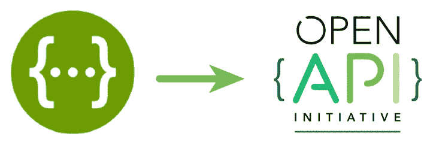
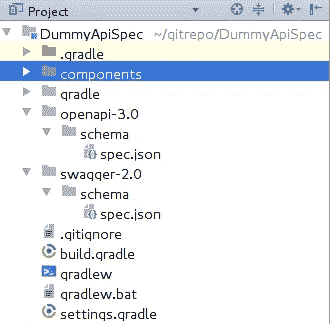
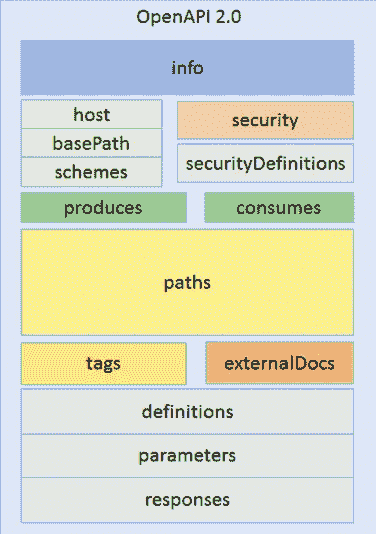
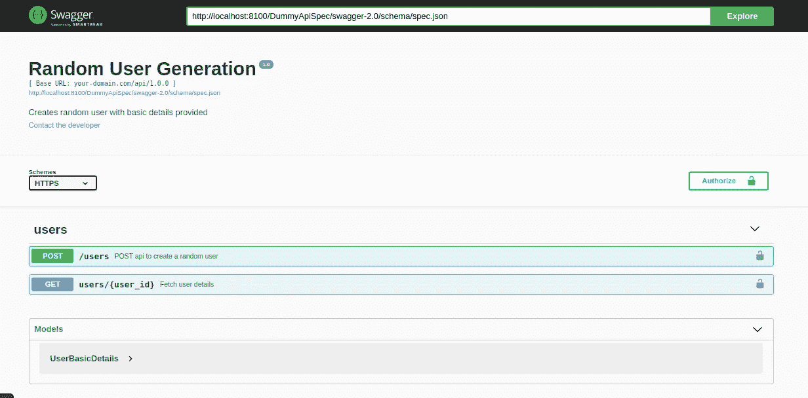
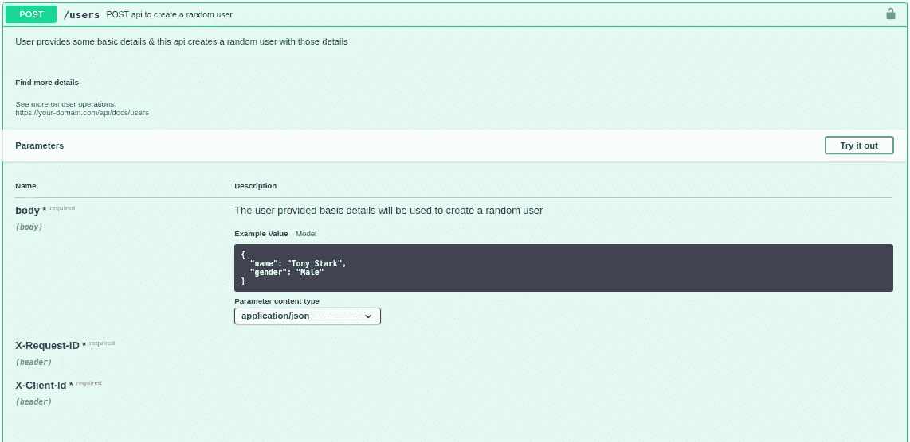
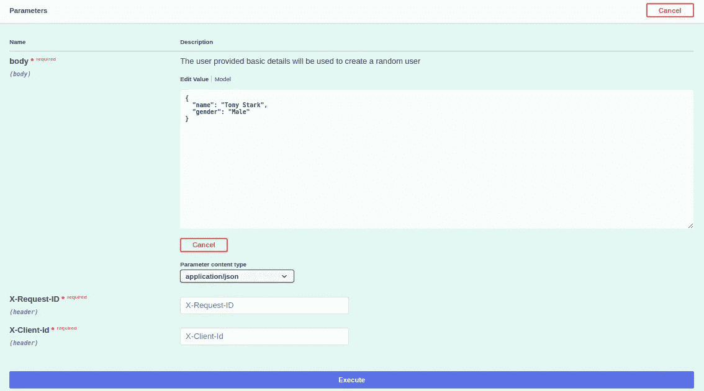
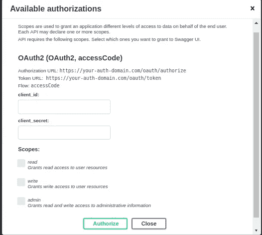
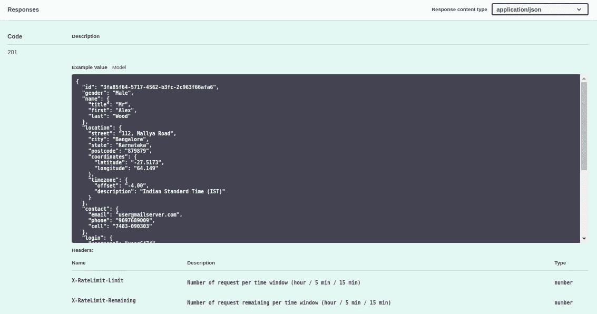
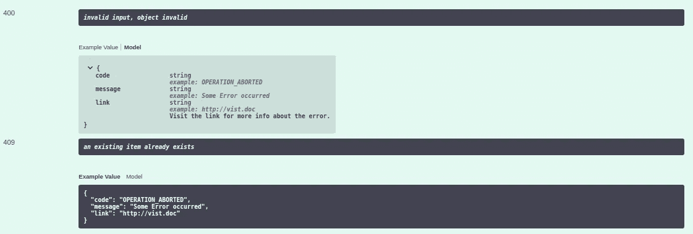
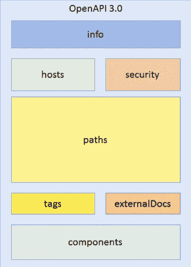

# 使用 Swagger 设计具有开放 API 规范(OAS)2.0 和 3.0 版的 REST API

> 原文：<https://medium.com/hackernoon/designing-rest-api-with-open-api-specification-oas-v2-0-v3-0-using-swagger-11dd4ef8cea6>



**免责声明:**我假设我们在职业生涯中的某个时间点都编写过一个或多个 API，否则您不会看到这篇文章。本文并没有描述什么是 REST API，相反，在阅读本文之前，您应该对 REST API 有一些基本的了解。

# 简介:

一般来说，当我们编写 REST API 时，我们将大量精力放在实现上&很少花时间去设计适当的请求/响应模式、API 资源模型。我们在文档中记下所有必要的请求和响应(在大多数情况下是 HTTP Code 200 series response)参数，快速查看它，相应地，我们创建一些资源模型并开始实现。这种策略适用于中小型公司或初创公司。但是，一旦你开始为企业公司或消费者互联网公司中的更多受众设计 API，你就不能这么容易地摆脱这种极简设计，许多利益相关者/团队都参与到这个过程中，许多系统都可能参与其中，所以必须开发一个同质且一致的设计策略，让你组织中的每个利益相关者(甚至外部组织也是如此)都能参与其中并做出贡献。开放式 API 规范(以下称为 OAS)解决了这个问题。这是一个以机器和人类可理解的格式全面描述 API 的标准。这个想法是，API 应该能够用足够的粒度级细节来描述自己。

# 拥有 API 设计标准的主要优势:

1.  它迫使你采取“设计第一”的态度。不要快速钻研实现，花足够的时间设计 API，首先纠正所有可能的错误。
2.  它促进合作。组织应该有一个共同的标准，以便所有开发人员理解 API 描述和文档，而不需要获得每个 API 的专业知识，当每个人都遵循相同的标准时，API 设计评审会变得更好。可以围绕这个标准构建一个工具生态系统，它可以自动验证 API 设计，自动生成代码和文档，增强所有 API 的安全性。
3.  如果 API 创建者和消费者(可能是不同的组织)都以一种通用的设计标准来表达 API，那么 API 的使用会变得更加容易。因此，您可以跨团队标准化 API 设计，从而减少开发人员以不同方式理解每个 API 的时间。

# OpenAPI 标准简介:

2009 年，一个叫 Tony Tam 的人开始致力于创建一个 API 规范标准，后来成为了 Swagger API 规范。2012 年 8 月，他在 Reverb Technologies 工作时发布了 1.1 版的 Swagger spec。2014 年 3 月，1.2 版本发布，更倾向于 [JSON 模式草案 4 标准](https://tools.ietf.org/html/draft-zyp-json-schema-04)。这是第一个被 API 行业广泛采用的版本，今天仍被一些 API 提供商使用。Swagger specification 2.0 于 2014 年 9 月发布，进行了大量更改&改进。2015 年 3 月， [SmartBear Technologies](https://smartbear.com/) 从 Reverb Technologies 收购了 Swagger 知识产权&其他开源技术的权益。2015 年 12 月，SmartBear 将 Swagger 规范捐赠给了一个新的开放治理组织，该组织成立于 Linux 基金会之下:OpenAPI 计划。这十家公司是 OpenAPI 倡议的创始成员:3Scale、Apigee、CapitalOne、Google、IBM、Intuit、微软、PayPal、Restlet 和 SmartBear。目前大约有 30 家公司是 OpenAPI 计划的活跃成员。2017 年 7 月，OpenAPI 倡议宣布发布 OAS v3.0.0，该规范符合 JSON 模式草案 5 &它围绕模式引入了一些变化，引入了链接、回调等新概念。

# 关于招摇的简介:

Swagger 是一个围绕 OpenAPI 规范构建的工具生态系统。以下是不同 Swagger 工具的一些功能:

1.  **Swagger 编辑器:** Swagger 提供在线(称为 [SwaggerHub](https://swagger.io/tools/swaggerhub/) ) &离线([可下载 UI](https://swagger.io/tools/swagger-ui/) )界面，开发者可以在其中以 YAML 格式编写 API 规范&编辑器实时验证设计，检查与 OAS 标准的兼容性，即时检测错误&直观地显示它们。所以它简化了 API 开发&帮助开发者准确地建模资源&API。
2.  **Swagger Codegen:** [该工具](https://swagger.io/tools/swagger-codegen/)可以从 20 多种语言的规范中生成 API 样板代码& API 模型(服务器存根)等。这大大减少了开发人员手动编写这些代码的工作量。Swagger Codegen 可以生成客户端代码来使用 API。如果开发人员想在客户端应用程序中使用 SDK，这个工具也可以生成客户端 SDK。
3.  **模仿 API:** [SwaggerHub](https://swagger.io/tools/swaggerhub/) 提供了动态模仿规范中定义的 API 的能力。这个工具极大地有助于以一种更干净的方式测试 API，而不需要在开发生命周期中花费额外的金钱和时间来创建模拟服务器。离线 Swagger UI 不提供这种功能。
4.  **API 文档:**手动维护 API 文档很困难，因为 API 一直在发展&对于每个微小的变化，你都不需要创建新的 API 版本。Swagger 能够从 OAS 创建&同步文档。如果您想要为已经存在的 API 生成文档，您可以使用[Swagger infector](https://github.com/swagger-api/swagger-inflector)在运行时使用注释或使用 [Swagger Inspector](https://swagger.io/tools/swagger-inspector/) 创建文档，您可以点击 API 端点&从此接口生成开放 API 规范&也可以从该规范生成文档。
5.  **API 测试:**使用 Swagger Inspector，您可以点击适当请求的端点&检查响应。

在许多情况下，您的公司可能不允许您使用 SwaggerHub 来维护 API，因为 SwaggerHub 不是免费的(在非常有限的使用范围内免费)&您的组织可能不信任它。因此，为了方便开发过程，您可能需要在本地机器上安装 Swagger UI。按照下面的说明创建一个本地 Swagger 环境，您可以在其中无限制地创建和维护 API:

1.  我们将使用 docker 安装 Swagger UI 和 Swagger 编辑器。所以先安装 docker。[在这里下载](https://docs.docker.com/v17.09/engine/installation/) docker，根据你的操作系统按照说明操作。
2.  安装 Swagger UI，运行:`docker pull swaggerapi/swagger-ui`
3.  运行 Swagger UI: `docker run -p 8000:8080 swaggerapi/swagger-ui`。
    这将在端口 8000 上运行 UI。进入浏览器&类型:`[http://localhost](http://localhost/):8000`。您将看到 Swagger UI 正在运行。
4.  安装招摇编辑器:`docker pull swaggerapi/swagger-editor`
5.  跑霸气编辑:`docker run -p 81:8080 swaggerapi/swagger-editor`。这将在端口 81 上运行编辑器。
6.  在任何合适的位置创建一个项目文件夹。我在`/home/kousik/gitrepo`下创建了文件夹(我有 Ubuntu 机器)。我的项目名称是:`DummyApiSpec`。所以项目的完整目录路径是:`/home/kousik/gitrepo/DummyApiSpec`。你可以克隆我的项目【https://github.com/kousiknath/OpenAPISpecExample.git】见代码:[见](https://github.com/kousiknath/OpenAPISpecExample.git)
7.  Swagger UI 需要一个 URL 来获取 API 规范。因为我们在本地托管 Swagger，所以我们必须从`localhost`服务器提供规范文件。因此，我们将在 python &中安装一个简单的 HTTP 文件服务器，使用它来服务驻留在`/home/kousik/gitrepo`或其任何子目录中的任何文件。转到`/home/kousik/gitrepo`文件夹&创建一个名为`server.py`的文件&粘贴下面的代码:

```
#!/usr/bin/env python
try:
    # Python 3
    from http.server import HTTPServer, SimpleHTTPRequestHandler, test as test_orig
    import sys
    def test (*args):
        test_orig(*args, port=int(sys.argv[1]) if len(sys.argv) > 1 else 8000)
except ImportError: # Python 2
    from BaseHTTPServer import HTTPServer, test
    from SimpleHTTPServer import SimpleHTTPRequestHandlerclass CORSRequestHandler (SimpleHTTPRequestHandler):
    def end_headers (self):
        self.send_header('Access-Control-Allow-Origin', '*')
        SimpleHTTPRequestHandler.end_headers(self)if __name__ == '__main__':
    test(CORSRequestHandler, HTTPServer)
```

您可以转到包含文件`server.py`的文件夹&运行这个简单的服务器，发出以下命令:

```
python server.py
```

默认情况下，这将在端口`8000`运行服务器。为了在任何特定端口运行服务器，您可以像这样运行它:

```
python server.py 8100
```

上述命令将在端口 8100 运行服务器。这将创建一个本地 HTTP 文件服务器，它可以为驻留在其父目录或任何嵌套子目录下的任何文件提供服务。父目录充当 web 服务器的基目录，其他路径必须相对于此基目录。由于我的项目`DummyApiSpec` & `server.py` 位于`/home/kousik/gitrepo`下，我可以从本地主机访问 API 规范，比如:`[http://localhost:8100/DummyApiSpec/openapi-3.0/schema/spec.json](http://localhost:8100/DummyApiSpec/openapi-3.0/schema/spec.json)`。相应地安排目录&确保您能够从本地主机访问 API 规范文件。

## OpenAPI 规范实践:

我们将创建一个 API 规范来更好地理解 OAS v2.0 和 v3.0 的不同方面。
假设您想要创建一个拥有所有用户数据的用户服务(微服务)。假设该服务具有创建随机用户的功能，该用户仅在沙箱/测试环境中工作。您还可以通过使用相应的用户 id 查询服务来获取特定用户的详细信息。用户详细信息包含 id、姓名、出生日期、性别、联系方式、用户家庭位置、用户设备偏好等。我们将创建开放 API 规范，用于创建使用 Swagger 获取用户详细信息的&。

转到创建项目的位置。在我的例子中，项目名称为`DummyApiSpec` &位置为:`/home/kousik/gitrepo/DummyApiSpec`。
目录结构应该如下图所示:



我用的是 IntelliJIDEA，任何 IDE 都应该有相同的结构。`openapi-3.0`下的`schema` 文件夹包含按照 OAS v3.0 定义的规范文件`spec.json`，`swagger-2.0`内定义的文件`spec.json`是按照 Swagger-2.0 规范定义的，记住 OAS v3.0 是从 Swagger 规范 v2.0 的&改进版派生而来的，`components`文件夹包含所有可复用的 API 资源模型在单独的 JSON 文件中。现在你可以创建如图所示的文件夹。可以忽略`gradle`相关文件夹&文件。

我们将在下面看到如何在 2.0 版和 3.0 版中创建 OAS 规范，并对它们进行比较。

## 使用 OAS v2.0 创建随机用户生成 API:

OAS v2.0 是当今最流行的 OAS 版本。它具有以下模式结构。所有彩色矩形块代表规范中全局/根级别的不同组件。



以下要点是我们的随机用户生成 API 的 OAS v2.0 的 JSON 表示。让我们解码不同的组件。

JSON 文件中的第一部分是`'swagger'`,它代表了文件所代表的规范版本。

键`info`映射到一个对象，该对象包含关于 API 的基本信息，如 API 版本、标题、基本描述、开发人员联系方式等。相应地填写您自己的详细信息。

关键字`schemes`、`host`、`basePath`一起表示 API 服务器 URL，API 应该被托管在该 URL 处。所以按照上面的 spec，API 服务器 URL 是:`[https://your-domain.com/api/1.0.0](https://your-domain.com/api/1.0.0.)`。当你使用 Swagger UI 或 SwaggerHub 来测试规范文件中提到的任何 API 时，他们内部使用这个 API 服务器 URL 来测试&所有的 API 请求都命中这个地址来获取数据。

部分`securityDefinitions`代表了我们的 API 支持的所有安全方案，它没有将这些方案中的任何一个应用于任何 API，它只定义了可用的方案。Swagger / OAS v2.0 标准支持基本授权，通过头或查询参数进行基于 API 密钥的认证& OAuth 2.0 认证。这取决于你为你的 API 使用什么样的方案，你可以在同一个规范文件中为不同的 API 混合使用认证方案，我在这里展示了所有的方案作为例子。

`securityDefinitions`映射的对象包含许多密钥，如`BasicAuth`、`ApiKey`、`AppId`、`SessionKey`、`OAuth2` —这些都是随机的名称，您可以使用任何名称来表示安全方案，重要的是这些密钥所代表的对象:
`BasicAuth`表示通过内置的`HTTP`机制进行基本授权。`HTTP`支持发送一个包含“基本”字的`Authorization`头，后跟一个空格& base 64 编码的`username:password`字符串。示例`Authorization`表头:`Authorization: Basic 63jYu7uu38uqt356q=`。这种机制不安全，因为 base 64 编码的字符串也可以被解码，使用`HTTPS`使其更加安全。

`ApiKey` / `AppId` / `SessionKey`映射到一个 JSON 对象，这些对象表示通过头密钥传递的认证密钥值对:

```
**"ApiKey"**: {
  **"type"**: **"apiKey"**,
  **"in"**: **"header"**,
  **"name"**: **"X-API-KEY"** },
**"AppId"**: {
  **"type"**: **"apiKey"**,
  **"in"**: **"header"**,
  **"name"**: **"X-APP-ID"** },
**"SessionKey"**: {
  **"type"**: **"apiKey"**,
  **"in"**: **"query"**,
  **"name"**: **"SESSION-ID"** }
```

这里，键`type`的值为`apiKey`，这是一个 Swagger / OAS 定义的类型，键`in`表示键必须被传递到的位置——或者是`header`或者是`query`参数部分，`name`表示键的名称。

`OAuth2`代表 OAuth2 标准授权方案:

```
**"OAuth2"**: {
  **"type"**: **"oauth2"**,
  **"flow"**: **"accessCode"**,
  **"authorizationUrl"**: **"https://your-auth-domain.com/oauth/authorize"**,
  **"tokenUrl"**: **"https://your-auth-domain.com/oauth/token"**,
  **"scopes"**: {
    **"read"**: **"Grants read access to user resources"**,
    **"write"**: **"Grants write access to user resources"**,
    **"admin"**: **"Grants read and write access to administrative information"** }
}
```

OAuth2 需要一些基于`scope`的客户端才会被授予访问相应资源的权限。

`security`部分定义了哪个认证/授权方案将被应用于哪个 API。我们已经在根级别定义了全局`security`部分，该部分由规范中定义的所有 API 继承，稍后我们将看到如何在单个 API 级别覆盖授权机制。`security`是 JSON 对象中的方案列表，如:

```
**"security"**: [
  {
    **"OAuth2"**: [**"read"**]
  }
]
```

当列表中存在多个 JSON 对象时，由任何一个 JSON 对象表示的模式都可以工作。表示为独立 JSON 对象的多个方案维护`logical OR`关系。示例:查看`GET /users/{user_id}` API 的`security`部分:

```
**"security"**: [
  {
    **"OAuth2"**: [**"read"**]
  },
  {
    **"ApiKey"**: [],
    **"ApiId"**: []
  },
  {
    **"BasicAuth"**: []
  },
  {
    **"SessionKey"**: []
  }
]
```

在上面的列表中，出于演示目的，有四种身份验证方案适用于此 API。所有这些方案都处于`logical OR`关系中。因此，向这些方案中的任何一个提供正确的数据都将通过授权检查。对于`logical AND`关系，可以将多个方案放在同一个 JSON 对象中。例如，考虑上面代码片段中的以下部分:

```
{
  **"ApiKey"**: [],
  **"ApiId"**: []
}
```

您需要提供 API key 和 API Id 来传递这个组合授权，因为它们都是同一个 JSON 对象的一部分——这是`logical AND`关系。

在 JSON 对象中，键名应该与`securityDefinition`部分中定义的任何方案名完全相同，即:在这个例子中，键名是`OAuth2`，它注册在`securityDefinitions`中，值是一个作用域列表，即；在上面的例子中，`read`范围被指定。

更多关于 Swagger / OAS v2.0 认证[在这里](https://swagger.io/docs/specification/2-0/authentication/)。

关键字`consumes` & `produces`映射到 API 可以在请求体中使用的 MIME 类型列表(显然不是 GET 请求)&产生响应。顶级 MIME 类型由所有定义的 API 继承，尽管单个 API 可以覆盖这些类型。

更多关于 Swagger / OAS v2.0 MIME 类型的信息请点击。

`paths`部分描述了所有 API 端点&操作。下面我们来探究一下`/user` API，了解一下各个方面。

```
**"/users"**: {
  **"post"**: {
    **"description"**: **"User provides some basic details & this api creates a random user with those details"**,
    **"summary"**: **"POST api to create a random user"**,
    **"operationId"**: **"generate_user.post"**,
    **"deprecated"**: **false**,
    **"produces"**: [
      **"application/json"** ],
    **"security"**: [
      {
        **"OAuth2"**: [**"read"**, **"write"**]
      }
    ],
    **"parameters"**: [
      {
        **"name"**: **"body"**,
        **"in"**: **"body"**,
        **"required"**: **true**,
        **"description"**: **"The user provided basic details will be used to create a random user"**,
        **"schema"**: {
          **"$ref"**: **"#/definitions/UserBasicDetails"** }
      },
      {
        **"$ref"**: **"../../components/header_request_id.json"** },
      {
        **"$ref"**: **"../../components/header_client_id.json"** }
    ],
    **"responses"**: {
      **"201"**: {
        **....**
      },
      **"400"**: {
        **....**
      },
      **"409"**: {
        **....**
    },
    **"tags"**: [
      **"users"** ],
    **"externalDocs"**: {
      **"url"**: **"https://your-domain.com/api/docs/users"**,
      **"description"**: **"See more on user operations."** }
  }
}
```

在 OAS 术语中，像`/user`这样的 API 端点被称为路径，所有路径都是相对于前面提到的 API 服务器 URL 的&相关的 HTTP 动词被称为操作。因为我们想要创建一个随机用户，所以我们的`/user`端点与`post`操作相关联(相当于 HTTP 动词 POST)。

> Swagger 2.0 支持 get、post、put、patch、delete、head 和 options。
> 
> Swagger 将唯一操作定义为路径和 HTTP 方法的组合。这意味着不允许对同一路径使用两个 GET 或两个 POST 方法——即使它们有不同的参数(参数对唯一性没有影响)。

关键字`operationId`是可选的，但是如果提供的话，它对于每个操作应该是唯一的。

`deprecated`表示该 API 是否应该很快退役，如果该 API 已经被一些客户端使用，但您有新版本或替代 API，这将非常有用。

我们已经使用`produces`在全局/根级别指定了一个 MIME 类型列表，我们在`/user` API 的`post`操作中再次指定了相同的列表，只是为了展示如何覆盖从根级别继承的属性。一旦被覆盖，根级功能对该操作没有影响。您也可以用类似的方式覆盖`consumes`。

在这个操作中，我们也覆盖了`security`方案，因为我们在这里创建用户，所以我们只使用了`read` & `write`范围的`OAuth2`安全方案。一旦被覆盖，全局级的`security`方案将不再应用于该操作。

`parameters`部分是表示为 JSON 对象的参数列表。parameter 对象的`in`键表示参数所在的位置。基于位置，以下是参数类型:

**主体参数:**这种参数应该是请求主体的一部分，在参数对象内部的位置用“`in": "body"`表示。不适用于 HTTP GET 请求。

**查询参数:**如果你想在 URL 中暴露参数，比如:`/api/users?attributes=location,devices`，这里的`attributes`是一个查询参数，在 Parameter 对象中用`"in": "query"`表示。

**路径参数:**如果你想把 API 路径表示成这样的 URL:`/api/user/{user_id}`，这里`user_id`包裹在`{}`里面是一个强制的路径参数。在参数对象中用`"in": "path"`表示。

更多关于 Swagger v2.0 的参数可以在[这里](https://swagger.io/docs/specification/2-0/describing-parameters/)找到。

`required`表示该参数是否为必填项，当键值设置为`true`时为必填项。

`schema`用于描述原语值，以及简单数组和序列化为字符串的对象。

`$ref`允许您引用不同部分中定义的内容，如同一规范文件中的全局`definitions`部分，或同一服务器中不同目录中的另一个 JSON 文件，或托管在另一个服务器中的文件等。在我们的规范中，下面的代码片段描述了这个特定 API 操作的请求体作为映射到键`UserBasicDetails`的 JSON 对象存在于 global `definitions`部分下。

```
**"schema"**: {
   **"$ref"**: **"#/definitions/UserBasicDetails"** }
```

> `*$ref*`的值使用 [JSON 引用](https://tools.ietf.org/html/draft-pbryan-zyp-json-ref-03)表示法，以`*#*`开头的部分使用 [JSON 指针](https://tools.ietf.org/html/rfc6901)表示法。这种表示法允许您指定目标文件或想要引用的文件的特定部分。

在`#/definitions/UserBasicDetails`中，解析从当前规范文件的根开始，然后在根下找到`definitions`段，在这个`definition`段中找到`UserBasicDetails`。所以类似于文件系统目录结构解析。

`$ref`也可以引用任何目录下的任何 JSON 文件，你只需要提供那个 JSON 文件相对于当前 JSON 文件的相对路径。示例:

```
{
  **"$ref"**: **"../../components/header_request_id.json"** }
```

上面的代码片段的意思是，在我们的规范文件的父文件的父文件中的目录`components`中存在一个名为`header_request_id.json`的文件，请参考目录结构图来正确理解。

**注意:**当`$ref`在一个节中使用时，它的所有兄弟都被忽略，这是因为`$ref`用它所指向的值替换了它自己&的所有兄弟。因此，在下面的代码片段中，`description`、`title`或与`$ref`处于同一级别的任何属性都将被忽略。

```
**"schema"**: {
    **"$ref"**: **"#/definitions/UserBasicDetails",
    "description": "A reusable user basic details component",
    "title": "xyzab"** }
```

更多关于`$ref`和[的细节请点击](https://swagger.io/docs/specification/using-ref/)。

任何 API 操作下的`responses`部分定义了该操作所有可能的响应模式。它是一个 JSON 对象，其中键名是 HTTP 状态代码，如`200`、`400`等&映射值定义了响应对象的模式&元数据。您对特定 HTTP 状态代码的 API 响应将完全遵循相同的结构。让我们看看创建用户对象时 HTTP 状态 201 的响应结构:

```
**"201"**: {
  **"description"**: **""**,
  **"headers"**: {
    **"X-RateLimit-Limit"**: {
      **"description"**: **"Number of request per time window (hour / 5 min / 15 min)"**,
      **"schema"**: {
        **"type"**: **"number"**,
        **"format"**: **"integer"** }
    },
    **"X-RateLimit-Remaining"**: {
      **"description"**: **"Number of request remaining per time window (hour / 5 min / 15 min)"**,
      **"schema"**: {
        **"type"**: **"number"**,
        **"format"**: **"integer"** }
    }
  },
  **"schema"**: {
    **"$ref"**: **"../../components/user.json"** }
}
```

响应结构有一般`description`关于响应、`header`实际响应`schema`。在我们的 API 中，`X-RateLimit-Limit` & `X-RateLimit-Remaining`头文件是用它们自己的描述&模式定义的，你可以把任何合适的头文件关键字&它们的类型如上图所示。

同样，实际的响应体驻留在`components`文件夹&中的`user.json`文件中，我们使用`$ref`来引用相对于当前文件(这里是我们的`spec.json`文件路径)路径的那个文件。

API 操作中的`tags`部分包含标签名列表，Swagger UI 等工具使用这些标签名对 UI 中的操作进行逻辑分组。为了更加清晰，它只是 UI 中的一组操作。这是一个可选字段。

在规范文件的最后，定义了一个全局`tags`段，它是 JSON 对象的数组:

```
**"tags"**: [
  {
    **"name"**: **"users"**,
    **"description"**: **"User related operations exposed by this service"**,
    **"externalDocs"**: {
      **"url"**: **"https://some-domain.com/users/operations"** }
  }
]
```

这个部分也是一个可选字段，它描述了我们前面看到的各个 API 操作级别中使用的所有标签。我们已经在单独的 API 操作中使用了`users`标签，这里我们用`name`、`description` & `externalDocs`来描述这些标签，以获得更多信息。这些对象中的标记名应该与各个 API 级别操作的标记完全匹配。如果在全局`tags`对象中有任何标签名称不匹配，将创建一个不必要的组&显示在 UI 中。

章节`externalDocs`为 API 操作&标签定义了额外的文档。这是可选字段。

## 可重用对象/ API 组件的表示:

在现实生活中，我们的许多与相同业务问题或领域相关的 API 最终使用了许多公共组件或资源模型。因此，为每个规范一次又一次地编写这些组件是没有意义的，相反，您可以将它们放在一个公共模块或 git 存储库中并重用它们。在我们的目录结构中，`component`文件夹保存了所有可重用的组件。可重用组件可以通过以下方式定义:

**1。“定义”部分:** Swagger / OAS 2.0 定义了一个全局`definitions`部分，您可以在其中定义所有的资源模型。示例:在我们的规范中，我们定义`UserBasicDetails`模型只是为了演示。您可以根据需要定义任意数量的模型。

```
**"definitions"**: {
  **"UserBasicDetails"**: {
    **"title"**: **"UserBasicDetails"**,
    **"type"**: **"object"**,
    **"properties"**: {
      **"name"**: {
        **"example"**: **"Tony Stark"**,
        **"type"**: **"string"** },
      **"gender"**: {
        **"example"**: **"Male"**,
        **"type"**: **"string"** }
    },
    **"required"**: [
      **"name"**,
      **"gender"** ]
  }
}
```

我们从`POST /users` api 的`parameters`部分引用该部分，如下所示:

```
**"parameters"**: [
  {
    **"name"**: **"body"**,
    **"in"**: **"body"**,
    **"required"**: **true**,
    **"description"**: **"The user provided basic details will be used to create a random user"**,
    **"schema"**: {
      **"$ref"**: **"#/definitions/UserBasicDetails"** },
......
]
```

`#/definitions/YourModelName`指全局定义部分的`YourModelName`。

**2。访问驻留在不同目录中的模型:**我们已经讨论过将模型放在任何目录中，比如`components`在我们的例子中&通过相对路径访问驻留在这些位置的 JSON 文件，比如:

```
**"schema"**: {
    **"$ref"**: **"../../components/user.json"** }
```

当您不想将所有模型放在同一个规范文件中，而是维护一个模块化的目录结构时，这种方法特别有用。

## 一些重要的数据类型:

让我们看看代表一个人出生日期的文件`components/dob.json`的内容:

```
{
  **"required"** : [ **"age"**, **"date"** ],
  **"type"** : **"object"**,
  **"properties"** : {
    **"date"** : {
      **"maxLength"** : 50,
      **"minLength"** : 1,
      **"type"** : **"string"**,
      **"format"** : **"date-time"** },
    **"age"** : {
      **"type"** : **"number"**,
      **"format"** : **"integer"**,
      **"minimum"**: 10,
      **"maximum"**: 60
    }
  }
}
```

我们这里有两处房产。`date`属性表示人的出生日期。这个字段的类型是`string`，我们已经指定了这个字段的`minLength` & `maxLength`属性，那些是可选的，但是有边界还是不错的。`format`字段是如何在 UI 中显示数据或处理数据的提示。

`age`是具有`integer`格式的`number`类型。类型`number`的其他可用格式有:`float`、`double`、`int32`、`int64`。属性`minimum` & `maximum`是`age`应该存在的边界。

**定义数组:**

我们的`components/devices.json`文件如下所示:

```
{
  **"type"** : **"array"**,
  **"items"** : {
    **"$ref"** : **"./device.json"** },
  **"minItems"**: 0,
  **"maxItems"**: 20
}
```

`array`对象的类型是&数组对象被放置在`items`字段下。如上所示，您可以在`items`中定义对象，或者使用`$ref`引用其他现有的 JSON 文件。`minItems` & `maxItems`定义一个数组中总项数的限制，这些是可选字段，但是知道限制是很好的。

更多关于 Swagger(2.0 和 3.0 版)数据类型的信息可以在[这里](https://swagger.io/docs/specification/data-models/data-types/)找到。

## **定义枚举:**

看一下`GET /users/{user_id}` API。在参数部分，我们定义了一个`minimal`参数:

```
{
  **"name"**: **"minimal"**,
  **"in"**: **"query"**,
  **"description"**: **"When set to true, returned user object will have only minimum necessary fields, otherwise verbose object will be returned"**,
  **"required"**: **false**,
  **"type"**: **"boolean"**,
  **"enum"**: [**true**, **false**]
}
```

该参数标识 API 响应中的对象表示应该是具有极其必要的数据的最小表示还是完整表示。这是一个布尔型字段，默认设置为 false。布尔值被定义为`enum`列表，在`enum`字段中定义的值必须与参数定义的类型相匹配，在本例中为`boolean`。

还有另一种定义 enum 的方法——使用供应商扩展。看一看`components/state.json`文件:

```
{
  **"maxLength"** : 50,
  **"minLength"** : 1,
  **"type"** : **"string"**,
  **"example"** : **"Karnataka"**,
  **"x-enum"** : [ {
    **"value"** : **"KA"**,
    **"description"** : **"Karnataka"** }, {
    **"value"** : **"AP"**,
    **"description"** : **"Andhra Pradesh"** }, {
    **"value"** : **"TN"**,
    **"description"** : **"Tamilnadu"** }, {
    **"value"** : **"MH"**,
    **"description"** : **"Maharasthra"** } ]
}
```

由于我们的 API 支持的状态数量有限，为了演示的目的，我们将状态设置为 enum。`x-enum`是 Swagger 支持的[厂商扩展](https://swagger.io/docs/specification/2-0/swagger-extensions/)。它将枚举值定义为带有值描述的 JSON 对象，从而使枚举常量的含义有意义。此处枚举的值属于类型`string`，最大长度为 50。

更多关于 enum 的信息可以在[这里](https://swagger.io/docs/specification/2-0/enums/)找到。

现在我们来看看 Swagger UI 是如何展示 API 文档的:
进入浏览器&点击 Swagger UI 运行的 URL。在我的机器里，网址是:`[http://localhost:8000](http://localhost:8000.)` [。](http://localhost:8000.)页面加载后，将 swagger 规范文件的 URL 放入顶部栏文本框&中，点击“浏览”按钮。我的规格文件 URL:

```
[http://localhost:8100/DummyApiSpec/swagger-2.0/schema/spec.json](http://localhost:8100/DummyApiSpec/swagger-2.0/schema/spec.json)
```



image1

在上图中，`HTTPS`显示为 http scheme，因为在我们的 API 规范中，我们将`schemes`定义为`["https"]`。`users`部分列出了所有标有`users`的 API。因为我们为两个 API 使用了相同的`users`标签，所以它们出现在相同的部分。`Models`部分显示了全局`definitions`部分下定义的所有 API 模型/资源。因为我们在`definitions`部分只定义了`UserBasicDetails`，所以它出现在这里。

一旦您点击`Authorize`绿色边框按钮，它将列出我们在`securityDefinitions`部分定义的所有可用授权方案。

让我们单击绿色的`POST /users` API 部分，它将展开为&的样子:



image2

这个绿色部分代表这个部分顶部的`HTTP`动词/操作——这里是`POST`，然后在下一个部分，`description` & `externalDocs`数据被呈现。在页面的`Parameters`部分，所有的`body`、`header`、&、`query`参数都显示有红色星号(*)，表示该参数是必需的。请求体支持的内容类型显示在`body section`下方的下拉列表中。

让我们点击右侧的`Try It Out`按钮。我们看到以下用户界面:



image3

UI 为`body` &文本字段打开可编辑的文本区域，用于其他适用的参数，如`header` & `query`(此处未显示，因为它是 POST API)。你可以插入适当的数据&点击`Execute`蓝色按钮，UI 将点击规范文件中描述的服务器&显示响应。这个 UI 可用于在开发期间测试 API。点击红色`Cancel`按钮&返回上一个界面——图 2。

现在，在图 2 中，单击锁符号(显示在图 2 的右上角)，它将向您显示适用于该 API 的授权方案。这个适用的方案来自定义在 API 操作内部的`security`部分，或者来自全局/根级别定义。我们覆盖了这个 API 中的`security`部分来使用`OAuth2`。所以授权 UI 只显示与 OAuth 相关的文本框。如果你想测试 API &请输入正确的数据，确保你的`OAuth`URL 如规范文件中所描述的那样工作。



image4

关闭用户界面，返回图 2。向下滚动到`Responses`部分，该部分显示了规范文件中定义的所有响应以及规范中提供的示例值。如果某个字段没有提供示例值，那么`string`、`integer`等字段类型将成为该字段的值。



image5

在上图中，左栏对应于 API 规范的`responses`部分描述的`HTTP`状态代码，右边的下拉列表显示响应对象的相应数据类型，它来自规范文件的`consumes`部分。在黑色部分的正上方，您可以看到`Example Value`在此图像中以粗体显示，这意味着黑色响应主体部分仅显示样本响应，您可以单击它旁边的`Model`链接，将显示与响应相关的模型。

在`body`部分之后，显示所有`headers`及其`description` & `type`。在我们的 API 规范中，我们返回了`X-RateLimit-Limit` & `X-RateLimit-Remaining`头。你可以退任何东西。

`400`部分误差具有以下型号&示例值:



image6

类似地，`GET /users/{user_id}`的`Try It Out`用户界面看起来像这样:


image7

由于这是一个`GET` API，所以`Parameters`部分没有`body`(请求体)参数，只有`path`、`query` & `header`参数。您可以看到包含布尔字段`minimal`的`true` / `false`值的下拉列表，这些值来自规范文件中为`minimal`查询参数定义的枚举。

现在，您对 Swagger 文档从 UI 的角度看起来是什么样子已经有了相当的了解，一旦您在本地安装了 Swagger 或者使用了 SwaggerHub，您就可以使用 UI 并探索更多内容了。

## 相同 API 的 OAS v3.0 规范:

OAS v3.0 规范的基本结构:



这是我们的 API 规范的开放 API 规范 3.0 版的样子:

OAS v3.0 在文件的结构上做了一些改变。

在 OAS v3.0 中，没有使用`schemes`、`basePath`或`host`参数来描述服务器地址或 API 基本 URL，而是使用以下内容:

```
**"servers"**: [
  {
    **"url"**: **"https://your-domain.com/api/1.0.0"** }
]
```

因此，您可以容纳多台服务器，而不是一台。

OAS v3.0 强调可重用性，因为多个 API / API 操作可以共享相同的参数、请求和响应主体以及其他元数据。所以 OAS v3.0 定义了一个全局`components`部分&它将以下可重用的可选子部分放入其中:

```
components:
  # Reusable schemas (data models)
  schemas:
    ...
  # Reusable path, query, header and cookie parameters
  parameters:
    ...
  # Security scheme definitions (see Authentication)
  securitySchemes:
    ...
  # Reusable request bodies
  requestBodies:
    ...
  # Reusable responses, such as 401 Unauthorized or 400 Bad Request
  responses:
    ...
  # Reusable response headers
  headers:
    ...
  # Reusable examples
  examples:
    ...
  # Reusable links
  links:
    ...
```

此部分中的任何模型都可以通过以下方式访问:

```
**"$ref"**: **"#/components/requestBodies/YourComponent" 
    or 
"$ref"**: **"#/components/examples/YourComponent"**
```

如果您计划使用多个描述模型的文件，那么您可以像前面所示的那样访问:

```
**"$ref"**: **"relative/path/to/your/component_file"**
```

更多关于组件的信息请点击。

OAS v3.0 使用一个 API 操作内的`parameters`段来描述`path`、`query`、`header`、&、`cookie`参数。`Cookie`参数是 OAS v3.0 新引入的，本节不再支持请求体或`body`类型参数。对于请求体，在 API 操作部分中引入了一个名为`requestBody`的新部分，这个新部分可以获取基于文本的请求体数据和表单数据。

关于参数[的更多信息，请点击](https://swagger.io/docs/specification/describing-parameters/)。

更多关于请求正文[在这里](https://swagger.io/docs/specification/describing-request-body/)。

OAS v3.0 中没有`securityDefinitions`，它被重命名为`securitySchemes`，T30 被移到全局`components`部分下。还介绍了一种新的安全方案——基于 cookie 的方案。描述如下:

```
**"CookieAuth"**: {
  **"type"**: **"apiKey"**,
  **"in"**: **"cookie"**,
  **"name"**: **"SESSION_ID"** }
```

像所有其他安全方案一样，它也可以用于全局或 API 操作级别，如下所示:

```
**"security"**: [
  {
    **"CookieAuth"**: []
  }
]
```

这里，`security`对象中的名称应该与`securityScheme`中描述的安全方案的名称完全匹配。

基本授权方案的定义方式发生了一些变化，`type: basic`已被`type: basic, scheme: http`取代。所有基于`http`的安全机制，如基本或基于承载令牌的授权，都被转移到类型`http`。下面是对 http 机制的描述:

```
**"BasicAuth"**: {
  **"type"**: **"http"**,
  **"scheme"**: **"basic"** }
```

更多关于认证的信息请点击。

让我们看看 OAS v3,0 版在`POST /login` API 中的具体变化:

在 OAS v3.0 中，请求正文部分的定义非常不同:

```
**"requestBody"**: {
  **"content"**: {
    **"application/json"**: {
      **"oneOf"**: [
        {
          **"$ref"**: **"#/components/requestBodies/EmailLoginRequest"** },
        {
          **"$ref"**: **"#/components/requestBodies/MobileLoginRequest"** }
      ]
    }
  }
}
```

实际的请求体结构定义在相应的内容类型中，如`application/json`或`text/plain`或类似的内容。所有这些内容类型都包含在`content`中。所以这使得内容协商描述起来非常清晰，不再需要`consumes`数组，你可以自由选择内容类型&它们对应的主体&你可以如上描述它们。Open API v3.0 提供了通过模式集合来验证请求体模式的支持，关键字如`oneOf`、`allOf`、`anyOf`就是为此而构建的。这些关键字接受模式列表&相应地检查请求主体模式是否与模式匹配。`oneOf`检查它给定的请求主体模式是否与列表中的一个给定模式完全匹配，`anyOf`检查它是否与任何给定模式匹配，`allOf`检查它是否与所有模式匹配。因此，在我们的示例中，`/login` API 的请求主体模式应该只与提供的模式之一— `EmailLoginRequest`或`MobileLoginRequest`完全匹配。

更多关于`oneOf`、`allOf`、`anyOf`支持[这里](https://swagger.io/docs/specification/data-models/oneof-anyof-allof-not/)。

OAS v3.0 引入了回调支持。回调部分为`POST /login` API 定义如下:

```
**"callbacks"**: {
  **"loginEvent"**: {
    **"{$request.body#/callback/url}"**: {
      **"post"**: {
        **"requestBody"**: {
          **"required"**: **true**,
          **"content"**: {
            **"application/json"**: {
              **"schema"**: {
                **"type"**: **"object"**,
                **"properties"**: {
                  **"message"**: {
                    **"type"**: **"string"**,
                    **"example"**: **"Login happened, please process the event."** }
                }
              }                    }
          }
        }
      }
    }
  }
}
```

我们的`/login` API 接受一个回调 URL，当一些用户登录时，我们将调用这个回调 URL，用适当的数据&通知登录事件。此示例用于演示目的。在这里的`callbacks`部分，我们定义了一个名为`loginEvent`的随机事件名称，你可以定义任何名称。该事件定义了哪个回叫 URL 将用什么数据来调用&。`{$request.body#/callback/url}`表示我们的请求体有一个名为`callback`的部分，在该部分下有一个`url`键。这个表达式在运行时被求值&它通过那个键检索在请求体中传递的实际回调 URL。回调 URL 下的`post`部分描述了如何形成请求体来调用回调 URL。

更多关于回调和运行时表达式求值的信息请点击。

让我们考虑一下`/login` API 的`responses`部分:

```
**"responses"**: {
  **"200"**: {
    **"headers"**: {
      **"Set-Cookie"**: {
        **"description"**: **"Session key is set in cookie named SESSION_ID"**,
        **"schema"**: {
          **"type"**: **"string"**,
          **"example"**: **"SESSION_ID=hfuy8747b7gb4dgy466t46; Path=/; HttpOnly"** }
      }
    },
    **"description"**: **"Successful login"**,
    **"content"**: {
      **"application/json"**: {
        **"schema"**: {
          **"$ref"**: **"../../components/user.json"** },
        **"examples"**: {
          **"ex1"**: {
            **"id"**: **"90d640ab-548a-4a72-a89e-b86cdf4f1887"**,
            **"gender"**: **"Male"**,
            **"name"**: {
              **"title"**: **"Mr."**,
              **"first"**: **"Kousik"**,
              **"last"**: **"Nath"** },
            **"contact"**: {
              **"email"**: **"you@your-domain.com"**,
              **"phone"**: **"140000"**,
              **"cell"**: **"9090909090"** }
          },
          **"ex2"**: {
            **"id"**: **"4f7386f6-3c89-11e9-b210-d663bd873d93"**,
            **"gender"**: **"Female"**,
            **"name"**: {
              **"title"**: **"Mrs."**,
              **"first"**: **"XYZ"**,
              **"last"**: **"ABC"** },
            **"contact"**: {
              **"email"**: **"xyz@abc.com"**,
              **"phone"**: **"111200"**,
              **"cell"**: **"9090909090"** }
          }
        }
      }
    },
    **"links"**: {
      **"GetUserById"**: {
        **"$ref"**: **"#/components/links/GetUserById"** }
    }
  },
   ...
   ...
}
```

在上面的代码片段中，我们返回了`"Set-Cookie"`头，这样对于基于 cookie 的认证，这个 cookie 可以一直使用到过期。

在这个规范文件中没有`produces`部分，而是通过将响应模式放在特定的内容类型下(如`content`下的`application-json`)映射到单独的响应代码(如上面代码片段中的`200`),使内容协商变得更简单。您可以使用尽可能多的内容类型及其内容描述。

示例可以添加到参数、对象、属性等，以使 API 规范清晰，因为示例描述了字段可以取什么值。在 OAS v3.0 中，`example`得到了增强。现在可以使用`examples`——一个例子的 JSON 对象。这个 JSON 对象中的所有键都是不同的。您可以在全局`components/examples`部分下定义示例模式，并通过用`$ref`引用它们来重用它们。

更多例子请点击。

> 链接是 OpenAPI 3.0 的新特性之一。使用链接，您可以描述如何将一个操作返回的各种值用作其他操作的输入。这样，链接提供了操作之间的已知关系和遍历机制。链接的概念有点类似于[超媒体](https://smartbear.com/learn/api-design/what-is-hypermedia/)，但是 OpenAPI 链接不需要实际响应中存在的链接信息。

我们在全局`components`部分下定义了`links`部分:

```
**"links"**: {
  **"GetUserById"**: {
    **"description"**: **"Retrieve the user with GET /users/{user_id} API using `id` from the response body"**,
    **"operationId"**: **"users.get"**,
    **"parameters"**: {
      **"user_id"**: **"$response.body#/id"** }
  }
}
```

我们也在`POST /users`中定义了`links`。因此，一旦通过`POST /users`创建了一个新用户，或者用户通过`POST /login` API 登录，我们就公开通过`GET /users/{user_id` API 检索创建/登录的用户的操作。我们在`links`部分中定义了`GetUserById`字段，它映射到一个 JSON 对象，该对象声明了我们要将哪个操作公开为超媒体链接。这里的`operationId`—`users.get`指向`GET /users/{user_id}` API，由于两个 API 都定义在同一个规范文件中，我们可以使用`operationId`，如果 API 定义在不同的规范文件中，我们就必须使用`operationRef`。更多详情请点击下面的链接。JSON `GetUserById`中的`parameters`部分描述了在调用公开的 API 时需要发送什么参数，在这一部分中，我们基本上计算了必须发送给公开的 API 的任何类型的参数/请求体。`$response.body#/id`在运行时从当前 API 响应体中检索`id`字段。

更多关于链接[这里](https://swagger.io/docs/specification/links/)。

OpenAPI v2.0 是一个相当广泛的标准，组织正在缓慢地迁移到 OAS v3.0，但使用这种规范的好处是它扩展了 API 设计过程，这对大型组织来说是绝对必要的。这篇文章描述了 OAS 2.0 和 OAS 3.0 中的 API 设计，剩下的就看你自己了，如果你能体会到这种设计的好处，就去做吧。

参考资料:

1.  [https://swagger.io/specification/](https://swagger.io/specification/)
2.  [https://swagger.io/blog/news/whats-new-in-openapi-3-0/](https://swagger.io/blog/news/whats-new-in-openapi-3-0/)
3.  [https://github.com/kousiknath/OpenAPISpecExample.git](https://github.com/kousiknath/OpenAPISpecExample.git)