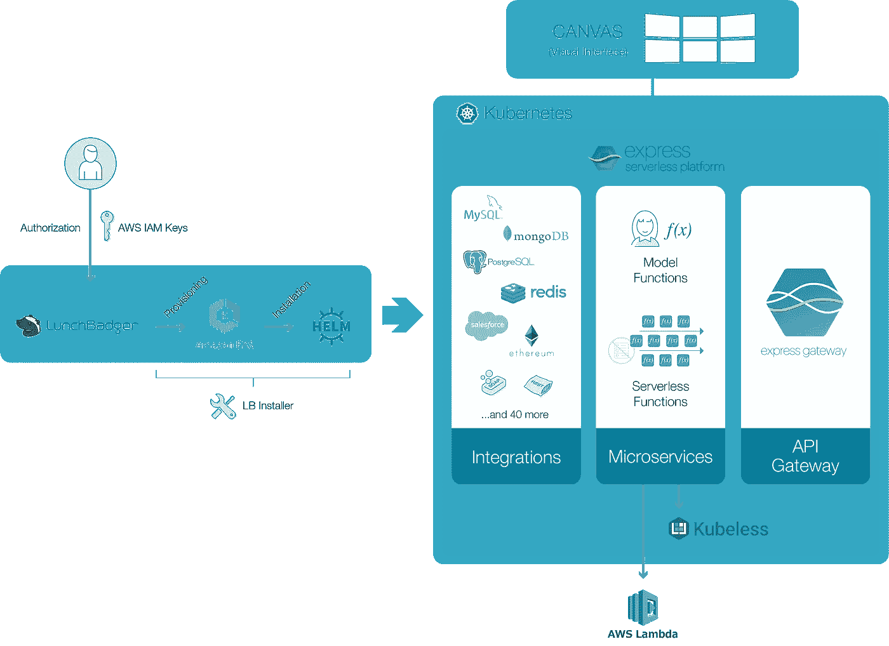

# 无服务器和 AWS Lambda 的开发者挑战

> 原文：<https://medium.com/hackernoon/developer-challenges-of-serverless-and-aws-lambda-8b8d5e299a34>

AWS 在引入 AWS Lambda 时开创了无服务器背后的理念:专注于你的业务逻辑，直到你的应用程序的原子部分— **功能**——让他们去担心其余的。这整个想法最终导致了 [NoOps](https://go.forrester.com/blogs/11-02-07-i_dont_want_devops_i_want_noops/) 运动。

无服务器是个好主意！这是一种新的范式，可以应用于如何在云中开发和运行现代应用程序，以大幅提高开发人员的关注度和生产力。

但是也有挑战，甚至是“陷阱”…

1.  **厨房水槽**——与任何新技术一样，开发者希望将它用于任何可以想象的用例。我们称之为“闪亮物体综合症”，这导致了对何时使用无服务器功能的最佳实践的许多误解
2.  杀手级延迟(killer latency)—运行无服务器功能的底层容器的加速和减速都是有成本的。这种延迟可能非常令人望而却步，具体取决于您的使用情形。
3.  **供应商锁定** —依赖单一云提供商的无服务器解决方案意味着在一项技术上投入大量时间和金钱，如果您的需求在未来发生变化，这项技术将无法移植。
4.  **没有本地对等产品** —虽然已经尝试过几次将无服务器引入本地数据中心，但它们通常都很笨重、难以维护，并且与基于云的解决方案不兼容。
5.  **每云复制** —即使您找到了采用多个无服务器实施的方法，也是以不一致和复制为代价的

# AWS Lambda 和 Amazon API Gateway 背后的成本和定价真相

当你从两个完全不同的产品开始，并试图将它们集成在一起时，你通常会有一个淡化的体验和功能上的妥协。

*AWS Lambda 和亚马逊 API Gateway 正是如此。*

如果您想从 HTTP 请求中触发 AWS Lambda 函数，AWS 会强制您使用 Amazon API Gateway，这是对所有基于 Web 的用例的考虑和约束。

将 AWS Lambda 用于基于 Web 的用例的真正成本不是 AWS Lambda 本身；它通过 Amazon API Gateway 公开 Lambda 函数。

已经有很多文章讨论了利用 Lambda 的这一挑战和其他挑战。这里有几个…

*   [Amiram Shachar 的媒体文章](/@amiram_26122/the-hidden-costs-of-serverless-6ced7844780b)
*   [Sumit Maingi 的无服务器流量成本分析](https://cloudncode.blog/2018/03/22/is-aws-lambda-expensive-to-run/)
*   [维亚康姆的 Lambda 成本和功能权衡](https://blog.viacom.tech/2017/03/27/aws-lambda-vs-amazon-ec2-a-discussion-of-lambdas-hidden-costs/)

# 高性能体验，同样的 AWS。

我们看到了这些挑战，并与想要更好体验或需要真正的云计算解决方案的公司合作。

我们采用了无服务器背后的理念，并通过在 AWS 上使用 Express 无服务器平台来提供无缝体验。

它为开发人员提供了一种更好的方式来编写和编排无服务器功能。它消除了隐藏成本，并通过更好的 API 网关体验提供了对 API 管理的完全控制。

采用 Express 无服务器平台意味着您也可以通过编写一次功能并在任何地方运行它们(包括您自己的数据中心)来实现混合云或多云战略，并具有相同的效率和体验。

# Express 无服务器平台如何让开发者拥有无服务器和 Kubernetes 蛋糕并吃掉它

Express 无服务器平台在 Kubernetes 的 AWS 帐户上安装和运行。你不必管理 Kubernetes，因为 AWS 上的 EKS 会为你做这件事。

安装程序在 EKS 上提供了一个 Kubernetes 集群。一旦 Kubernetes 启动并运行，Express 无服务器平台将通过 Helm 安装到 Kubernetes 中。

以下组件通过 Express 无服务器平台部署为在 Kubernetes pods 中运行的微服务:

*   模型函数
*   无服务器功能
*   集成(连接器)
*   API 网关

Express Serverless Platform 是唯一一个可以无缝地让您编写功能并在公共云基础架构中运行它们，或者选择在托管 Kubernetes 集群中使用长期运行的容器的平台。

不用被迫将 AWS Lambda 功能连接到 Amazon API Gateway，您可以将它们连接到 [Express Gateway](https://express-gateway.io/?utm_campaign=dzone_ESPvsAWS_article) ，并通过内置策略和开箱即用的企业功能获得一个更好的起点。

您可以阅读并下载我们完整而深入的指南，了解 AWS 上的 [Express 无服务器平台与 AWS Lambda](https://www.lunchbadger.com/compare-aws-lambda-pricing-vs-express-serverless-on-aws/?utm_campaign=dzone_ESPvsAWS_article) 在多个方面的主要差异和相似之处，包括功能和定价，此处为。

我们希望这篇文章对你有所帮助。我们即将发布的帖子将探索 Express 无服务器平台在各种情况和行业中的实际使用案例和实现。

如果你对这些话题感兴趣，可以在 Twitter ( [@lunchbadger](https://www.twitter.com/lunchbadger) )或( [@express_gateway](https://twitter.com/express_gateway) )上加入现场讨论。