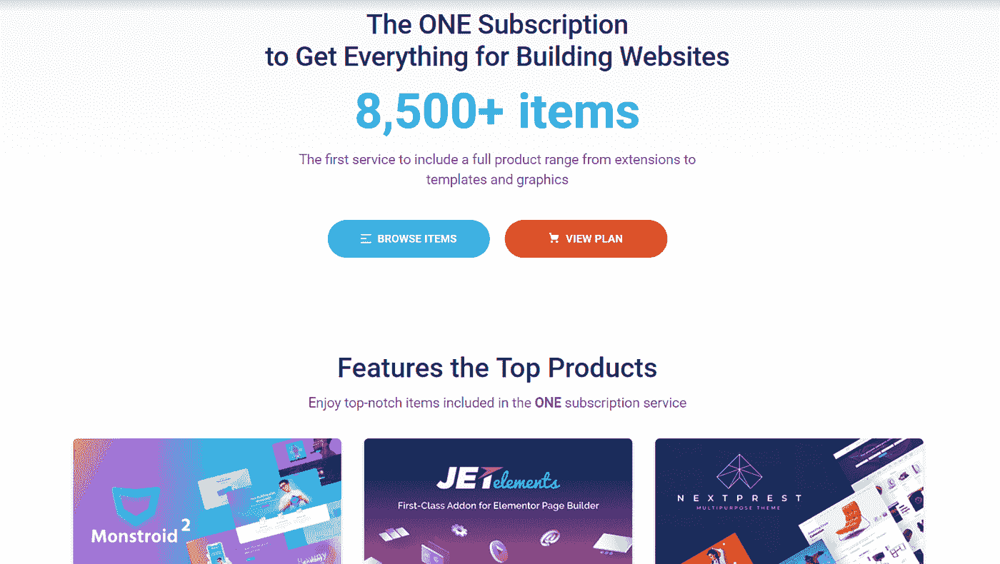
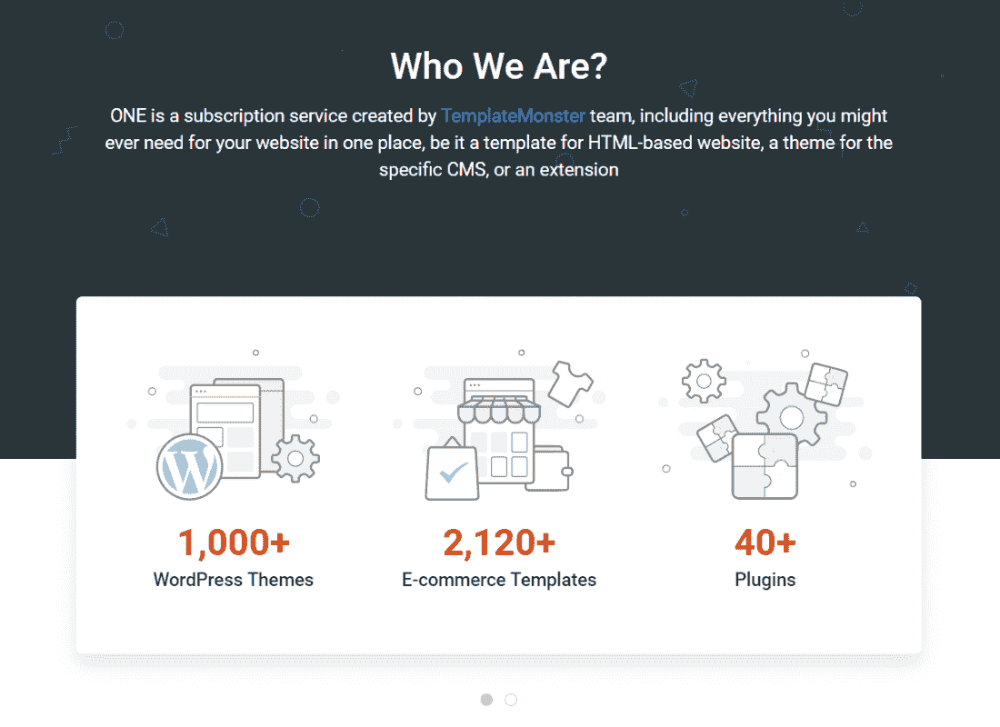
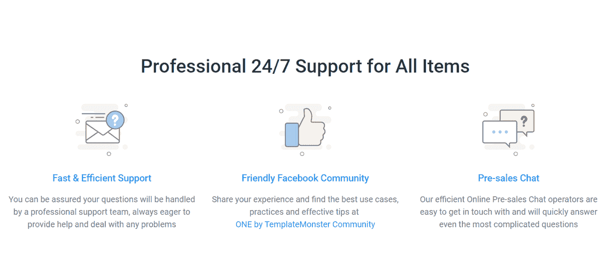
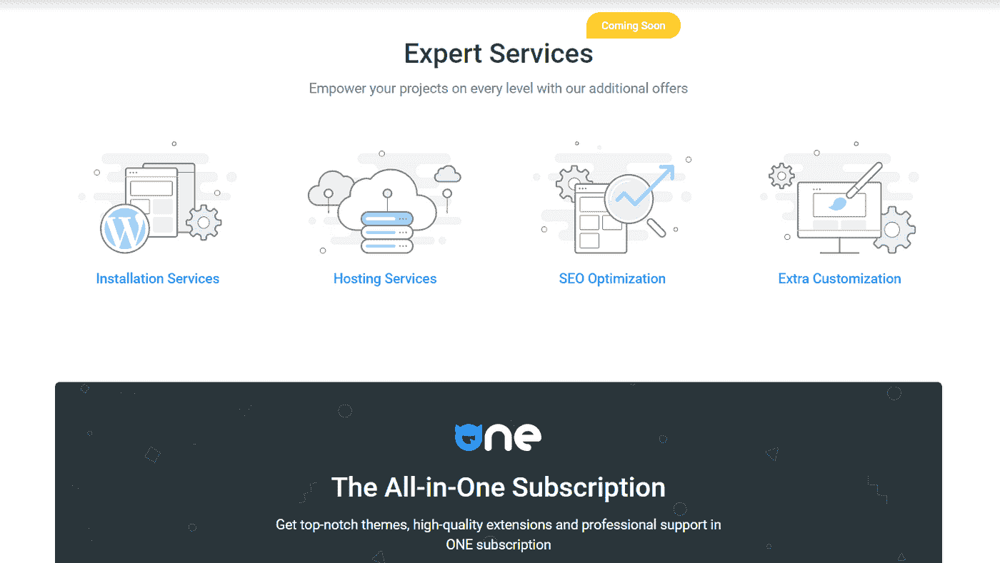
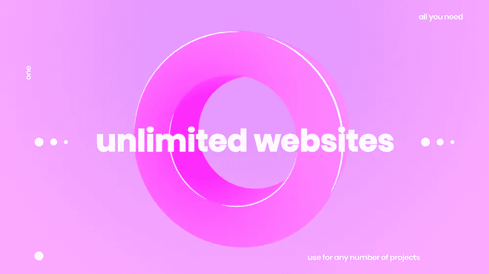
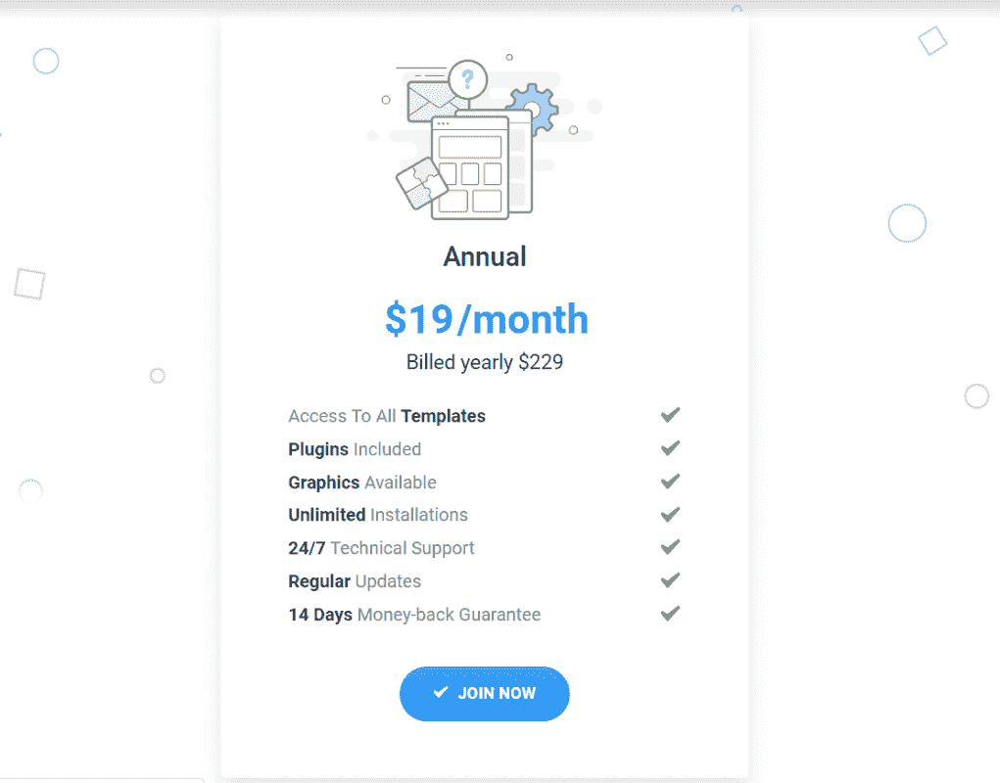
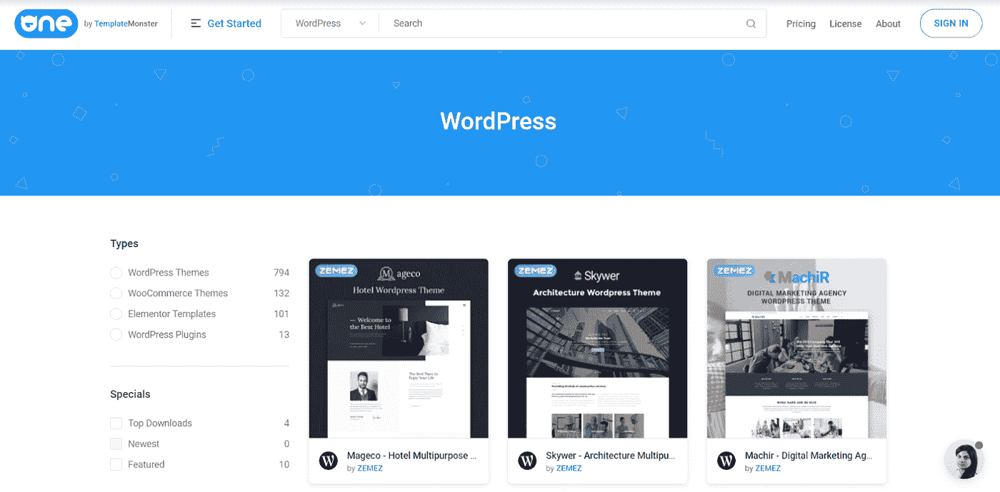
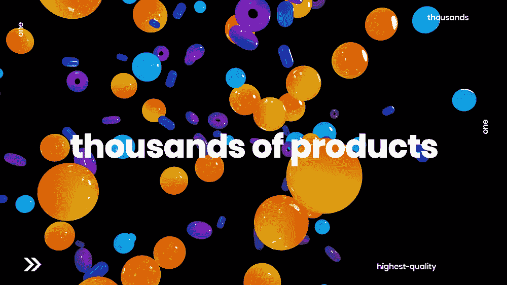

# 开发者包:一个订阅

> 原文：<https://medium.com/hackernoon/developers-pack-the-one-subscription-8b86c5a6ebc>

ONE Subscription 是一项新的服务，它为网站建设提供数千种预制产品，如 HTML 模板和 WordPress 主题。这个网站将为你提供你能想象到的所有网站建设的东西。此外，对于开发人员来说，这种订阅是一种非常有利可图的服务，他们建立了大量的各种网站，同时不得不保持预算，不想单独购买他们需要的所有项目。

所以现在让我们来探讨一下 **ONE 订阅**的所有利弊，以便帮助你最终决定这项服务对你来说是否足够好。

**它到底是什么，为什么你可能需要它？**

[ONE 是一种订阅](https://one.templatemonster.com/?aff=hackernoon)服务，提供 8500 多种不同的项目，用于以相当实惠的价格创建无数的网站。因此，基本上，订阅只有一个定价方案，即年度订阅。这款手机的价格为 229 美元，每月仅 19 美元。

[**Join Now**](https://one.templatemonster.com/?aff=hackernoon)

这种订阅服务提供了大量插件、模板、图片等等。如果这还不够，我们将为您提供定期更新、无限数量的安装，以及非常有用的专业 24/7 支持团队，如果您对服务有任何疑问或问题，他们将始终帮助您。

那些对 ONE subscription 服务不满意的用户可以在购买后的 14 天内取消服务，并获得全额退款。但是，请注意，如果您还没有下载任何一个订阅项目，您将只能获得退款。

再谈一谈钱，TemplateMonster 有一个安全的支付政策。换句话说，你不必担心你的货币交易的安全性，该公司只使用诸如万事达卡、维萨卡和贝宝等安全金融公司的服务。

**支持&服务**

如果您在安装 ONE subscription 服务中的项目时遇到任何问题，您可以随时向他们的 24/7 支持团队寻求一些建议，无论是凌晨 2 点还是下午 2 点。他们都会帮助您解决问题。此外，在购买 ONE b 之前，您还可以在他们的售前聊天中以及在他们的[脸书官方页面](https://www.facebook.com/groups/ONE.by.TemplateMonster/)上考虑该订阅服务的所有优点和缺点。

[**Join Now**](https://one.templatemonster.com/?aff=hackernoon)

ONE service 本身提供了大量有用的服务，包括托管服务、安装服务、额外定制和 SEO 优化。更准确地说，托管服务将处理您的所有托管问题，安装服务将帮助项目安装过程以及设置扩展，额外的定制旨在满足您的所有需求和愿望，最后但并非最不重要的是，搜索引擎优化优化将提升您的网站流量。

**ONE 订阅给谁？**

ONE 无疑是一项出色的服务，但我敢说，它可能不会对所有人都同样有用。换句话说，如果你的一些朋友从订阅中受益，并不一定意味着你也会从中受益。

[**Join Now**](https://one.templatemonster.com/?aff=hackernoon)

首先，让我们定义 ONE subscription 的目标受众，更重要的是，谁将从中受益最大？因此，在我看来，这是一个潜在群体的列表，他们将最大限度地利用这一群体:

*   **网站开发人员**，他们需要为他们的新项目和现有网站提供大量预制模板和主题选择；
*   需要专业 WordPress 主题或 HTML 模板的博客作者；
*   网页设计师**,他们的项目需要大量预制的专业设计的 WordPress 主题和 HTML 模板；**
*   ****需要在其公司网站上放置高分辨率图片的商家**；**
*   ****创业者**他们需要专业的网站，同时也需要为自己的创业和业务设计精美的网站；**
*   ****需要获得更多字体、样式等的插画师**和**平面设计师**。**

**我敢说，这些人群肯定会从这项服务中受益最多。与此同时，我当然不能说那些不属于上述群体的人不会从一次订阅中受益。总而言之，几乎所有使用互联网和为互联网创造内容的人都会从这项服务中获益 99.9%。**

**这个要花我多少钱？**

**ONE 只提供一种定价方案。但是，我可以说，这个方案非常实惠，比其他同类公司的大部分定价方案成本都要低。年费只需 229 美元或每月 19 美元。相当公平的价格政策，不是吗？**

****

**[**Join Now**](https://one.templatemonster.com/?aff=hackernoon)**

**ONE Subscription 到底会打开哪些访问权限？**

**现在，当我们已经建立了所有的成本，是时候弄清楚订阅实际上将为您提供什么了。这是 ONE subscription 提供的所有项目的准确列表:**

*   **1040 个 WordPress 主题；**
*   **2128 个电子商务；**
*   **41 个插件；**
*   **3198 图形；**
*   **1855 个 HTML 模板；**
*   **14 个演示模板；**
*   **1455 个 CMS 模板。**

**显然，这并不是该服务将为您提供的一切。ONE Subscription 会定期向您发送更新，您基本上每个月都会收到更新。因此，订阅提供的项目选择实际上是巨大的，这意味着你一定会找到创建你的梦想网站所需的一切。此外，找到最符合你需求的项目肯定不是问题，因为一个人的图书馆是用户友好的，超级容易导航。**

**那一个许可证呢？**

**《一个人》的许可是明确的，没有任何隐藏的诡计。订阅有一个年度许可证，可以在无限数量的安装上使用。也就是说，你将能够安装任何项目多次和无限数量的领域。**

****

**有了一年的许可证，你可以使用订阅中提供的所有产品为最终用户和你自己创建网站。你必须注意这样一个事实，你将能够使用你购买的所有项目只有一个有效的订阅。换句话说，当您的订购到期时，您将无法访问 ONE subscription 产品。但是，即使您的订购已经过期，您已经使用 ONE 产品建立的所有网站仍将继续工作。**

**关于 ONE service 的另一个重要细节是，您应该在许可证到期前将包含 ONE Subscription 产品的最终产品提供给最终用户，否则您将违反他们的许可证政策。**

**当然，您有权延长您的一个订阅，并在您未来的项目中继续使用该订阅提供的所有项目。**

**因此，这里有一些您希望避免的严重违反 **ONE Subscription 许可的情况**:**

*   **在您的许可证过期后使用 ONE items**
*   **共享和分发由一个订阅提供的项目；**
*   **转售产品和物品；**
*   **主张您对 ONE Subscription 的任何产品的权利。**

****ONE 的用户体验****

**一如既往，提供的产品超级好用。也就是说，你可以一键下载并安装任何模板或主题。ONE Subscription 产品的安装和定制实际上非常简单，不需要太多时间。此外，如果您在安装项目时遇到任何问题，您可以随时联系他们优秀的支持团队。**

****

**ONE Subscription 的存储所有商品的库很容易使用，因为您可以根据不同的标准对产品进行排序，以便更快地找到您想要的商品。**

**一个服务是用户友好的，很容易得到底部。您只需从库中选择您喜欢的项目，下载 zip 存档，从该存档中检索文件，并在每个模板或主题的清晰文档的帮助下，将选择的主题或模板安装在您的网站上。**

**ONE Subscription 中的所有 WordPress 主题和 HTML 模板都很容易定制，如果你有任何问题，你可以联系他们的 24/7 支持团队。**

**更新呢？**

**一旦你最终买了一个，你就可以访问成千上万个不同的网站建设项目，当然，这还不是全部。您将每月收到定期更新，包括不同的新主题、模板和项目。ONE Subscription 提供的另一个好处是，即使在您的许可证到期后，您也可以收到现有网站的更新。**

****关于 ONE 的最后想法****

**这个给我留下了深刻的印象。一开始，我真的不敢相信一个当代公司可以用这么少的钱给你这么多。想象一下，只需每月 19 美元，你就可以获得各种各样的高质量网站建设产品。**

**作为一名博客作者，我非常清楚拥有自己的专业博客是多么重要。我也知道创办一个像样的博客需要多少钱。它为你提供了一个很好的机会来建立一个漂亮整洁的博客，更重要的是，一个便宜的博客。**

****

**[Join Now](https://one.templatemonster.com/?aff=hackernoon)**

**我确实认为 ONE 也是那些需要多种网站设计选择的网站开发者的最佳选择。ONE Subscription 对那些将业务转移到网上的企业家来说也非常有用。总的来说，ONE 对所有工作(或者甚至爱好)与互联网有关的人都非常有益。当然，ONE 是所有需要物美价廉产品的聪明人的选择。**

**我真正关心的唯一问题是，在订阅到期后，我将无法使用订阅中的项目。不过，好消息是，我可以随时延长我的一个订阅，并继续体验它可以为我提供的所有好处。无论如何，ONE 可能是目前同类服务中最好的。**

****综上所述，让我们定义所有的利弊****

****优点:****

*   **WordPress 主题的巨大选择；**
*   **所有必要的插件都包括在内；**
*   **各种各样的 HTML 模板；**
*   **成千上万不同的网站建设项目；**
*   **方便用户；**
*   **无限年度许可证；**
*   **您的最终产品将继续正常工作，即使在您的订阅到期后；**
*   **最后但同样重要的是，价格实惠。**

****缺点:****

*   **许可证到期后，您将无法使用购买的产品。**

**我试着尽可能仔细地复习了一遍，现在我可以说出我的结论了。我可以肯定地向每一个需要各种各样的 WordPress 主题、HTML 模板以及大量视觉内容、图形和功能强大的插件的人推荐这一款，而且价格相当合理。这种订阅实际上有你建立一个网站可能需要的一切，是用户友好的，便宜的。**

**你呢？你在工作中使用订阅吗？**