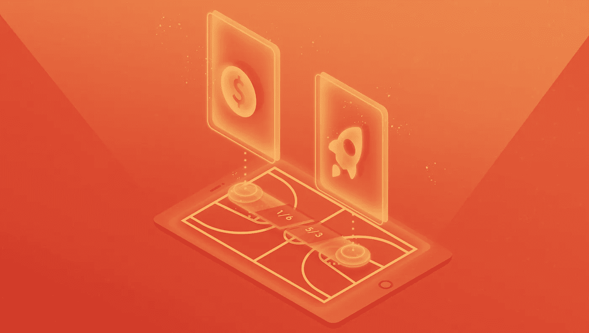

# 开发体育博彩平台:购买还是构建

> 原文：<https://medium.com/hackernoon/developing-a-sports-betting-platform-buy-vs-build-dab564bd54b2>

体育博彩的爆炸性增长在去年美国最高法院裁决废除联邦博彩禁令后继续上升。

当广播和体育行业兴奋不已的时候，博彩市场会变得有多大？尽管预测各不相同，但它们都表明，体育博彩总收入的增长没有放缓的迹象，美银美林分析师 Shaun Kelley 表示，他预计目前的 2 亿美元规模将在未来五年内飙升至 50-100 亿美元。

随着体育博彩市场的快速扩张，许多新玩家都加入到这场多年来最大的行业淘金热中来。虽然现在显然是进入这个领域的好时机，但确定开发体育博彩平台的最佳方法是一项复杂的任务。选择最合适的选项可以决定是取得巨大成功，带来长期盈利，还是不冷不热，迅速消退。

## **问题:购买还是建造**

每个参与数字平台开发的人都面临着购买还是构建的问题。但是正确的答案是什么呢？当然，这取决于具体的行业和你想要达到的特定目标。此外，赌博包含独特的挑战，在最终决定如何创建一个能够在不断扩大的市场中获得牵引力的赌博平台之前，必须仔细考虑这些挑战。一个主要障碍是美国体育博彩的历史现实，由于缺乏本地存在，赌徒选择离岸网站。另一个复杂因素是，除了遵守在线和移动解决方案的州际赌博法规所涉及的困难之外，美国公众对各种类型的赌博选项缺乏熟悉。

## **选项**

**1。购买白牌解决方案**

随着大型企业进入美国，购买白标解决方案成为一个可行的选择。通过建立现有体育博彩平台的品牌版本或将博彩整合到当前网站，体育公司创造了提高参与度和新收入流的潜力。

**优点:**

该平台可以很快投入使用，从而允许快速进入市场。

通过产品定制保留您现有网站的外观和感觉。

内置本地化提供了进入每个合法赌博国家的市场，包括欧洲、亚洲、印度和俄罗斯。

**缺点:**

公司通常仍然需要开发团队来成功地集成产品和支持环境。

白标解决方案可能包含您不需要的某些功能，而对附加功能的请求可能需要很长时间才能开发出来，或者根本不可能。

一旦投入使用，该产品可能不支持您的解决方案所需的负载。

通常，购买的解决方案不包含跟踪分析，因此需要您与 Google analytics、记分板或其他报告系统集成。

由于白标解决方案由外部团队提供支持，您可能意识不到生产或性能方面的问题。

**2。构建自己的平台**

**优点:**

根据您的特定需求完全控制应用的架构和功能，从而更容易预测未来，并使用微服务和最新的技术堆栈创建可扩展的系统。

更新和新特性可能会被积压、安排和定期实现。

保持对支持生产的团队的控制，详细说明出现的任何问题，以帮助避免将来出现类似问题。

**缺点:**

定制开发需要大量的资金投入。

你需要雇佣一个项目团队，在紧张的劳动力市场中包括业务、产品和技术资源。

由于产品开发时间，进入市场的时间会更长；最初的发布会持续 3-6 个月。

无论您选择哪种方法，都要记住以下几个重要因素:

在选择主机提供商之前，一定要全面分析你的需求，以确保与你的项目相适应。

雇用有效的客户服务代表，将问题重新导向外部或内部开发团队。

考虑您与任何其他服务或合作伙伴集成数据馈送、视频等的需求..

考虑对第三方服务、网络和托管提供商的依赖。

虽然决定购买还是建造是一项复杂的任务，但新的博彩市场显然保证了必要的时间投资。通过精心开发与您的目标相匹配的平台，您将处于有利地位，能够充分利用爆炸性的体育博彩市场。游戏肯定开始了，前途无量！

谈到体育博彩平台，你对 buy vs build 有什么想法？请在下面的评论中分享你的观点。

*由* [*拉塞尔·卡普*](https://www.linkedin.com/in/russell-karp-76bb2811/) *，*

*VP 媒体&娱乐* [*数据艺术*](https://www.dataart.com/industry/media-and-entertainment?utm_source=medium.com&utm_medium=referral&utm_campaign=m-regular&utm_content=rkarp-hn-buybuild)