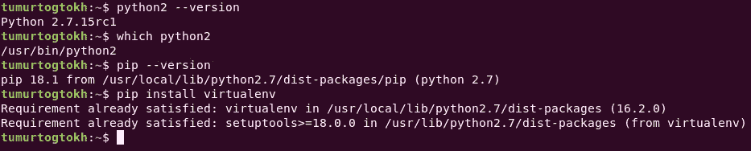
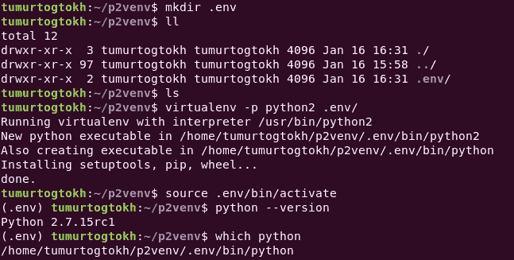
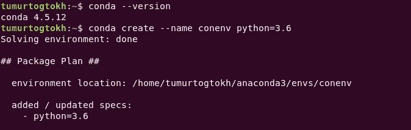
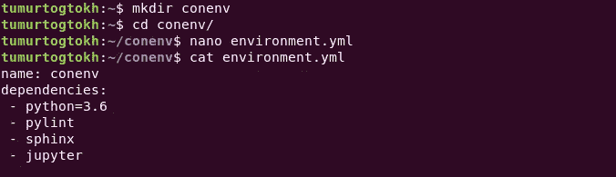

# 开发 Python 应用程序:虚拟环境

> 原文：<https://medium.com/hackernoon/developing-python-application-virtual-environment-95fa8ae5b098>


Photo by [Martin W. Kirst](https://unsplash.com/@nitram509?utm_source=medium&utm_medium=referral) on [Unsplash](https://unsplash.com?utm_source=medium&utm_medium=referral)

Python 无处不在——学术、数据科学、机器学习、企业应用、web 应用、脚本等等。无论您做什么，python 要么帮助您，要么让您头疼。让我们说，你已经学会了 python 编程，并准备用它来开发应用程序，让你未来的雇主惊叹不已，让你的未来辉煌无比。当然，这听起来很棒，您开始编写 python 脚本，并最终开始安装 python 包。从那里开始，人们沿着一条危险的道路走进了开发者的噩梦。

软件包安装可能会导致不兼容问题或使其他应用程序无法运行。您可能会发现您的代码在某些机器上无法运行，而在您的本地机器上却可以完美运行。为什么？Python 环境。

因此，为了避免每天都有不兼容问题的噩梦，需要为一个项目创建单独的 python 环境。虚拟环境是一堆可以独立运行 python 的脚本和目录。通过使用虚拟环境，每个 python 项目都可以拥有自己的依赖项，而与其他项目和系统 python 环境无关。在这里，我将讲述如何在 python2 和 python3 中创建和使用虚拟环境。对于 python2 我会用 virtualenv，对于 python3 我会用 venv，virtualenvwrapper，用 conda。

从 python2 开始，需要安装 virtualenv 包。



python2 and pip version with virtualenv installation command

看，我已经安装好了。安装后，您可以通过以下方式查看其命令:

```
virtualenv -h
```

我们不需要使用这些命令中的大部分。为了创建一个虚拟环境，我们使用 ***virtualenv【选项】目的地*** 。具体来说，打电话

```
virtualenv –python=python2 path/to/virtual/environment/dir
```

显然，我们可以通过*–python = python3*创建 python3 虚拟环境，假设您的机器上安装了 python 3。该命令创建一个与给定 python 路径相同的隔离虚拟环境。如果愿意，我们可以给出一个直接的 python 路径，而不是使用 python2 和 python3。

创建虚拟环境后，我们可以通过调用以下命令来使用它:

```
source path/to/virtual/environment/bin/activate
```

并且当虚拟环境被激活时调用 ***去激活*** ，离开虚拟环境。在 python3 上，它将 venv 包作为虚拟环境的默认包。要使用它，我们只需要打电话

```
python3 -m venv path/to/virtual/environment
```

其他都一样。

我们所做的是创建了一个全新的 python 环境，并将依赖项复制到一个指定的目录中。因此，通过激活环境，我们可以安装任何包，而不会影响其他环境和本地 python。

## 绝对轻而易举。不是吗？

然而，我们不想把它推到 git 仓库，但是我们确实需要知道所需的依赖关系，因为我们大多数人在不同的机器上工作。就我而言，我在三台不同的机器上运行 windows 和 linux 系统。

解决这个问题的一个方法是为虚拟环境创建一个文件夹，并为 git 忽略它。这样，我们可以在不同的机器和不同的操作系统上处理一个项目。我们只需要跟踪所需的依赖关系。使用 pip，我们可以将已安装依赖项的信息保存到一个文件中，并在需要时将这些依赖项安装到不同的环境中。 ***Pip 冻结*** 命令显示安装在 python 环境中的包。我们需要将它保存到一个文件中。保存为' ***requirement.txt*** '是个不错的做法。稍后，在另一台机器上，我们通过使用

```
pip install -r requirement.txt
```

现在我们处于一个非常方便的位置，我们可以在任何安装了所需操作系统的机器上进行 python 项目。



Here I created .env folder and initialised a virtual environment there.

但是什么是？env 在我的终端上，那么虚拟环境所占用的磁盘空间呢？显然，那些虚拟环境文件是必要的。然而，当您有许多已完成的 python 项目，并且出于某种原因想要释放一些空间时，您会检查每个项目并手动删除那些文件吗？或者，如果所有虚拟环境文件都在一个目录中，不是更容易吗？还有。env 是创建虚拟环境的目录名。好吧，酷。但是，在使用虚拟环境时，看到实际的 python 项目名称不是更方便吗？

为了解决这些小的不便，我们可以使用 virtualenvwrapper 包。用以下内容安装此软件包:

```
pip install virtualenvwrapper
```

安装之后，我们需要激活它的 shell 函数，并创建一个环境变量来指示虚拟环境的位置。通过运行 which virtualenvwrapper.sh，我们得到了它的 shell 函数的路径。我们需要将它添加到 shell 启动中。因为我使用的是 ubuntu，所以我把它添加到~/.bashrc 中。我还为保存虚拟环境的位置创建了一个环境变量。到目前为止，我已经将这些行添加到。bashrc:

```
export WORKON=$HOME/.virtualenvssource /usr/local/bin/virtualenvwrapper.sh
```


Creating python environment with p3venv name

现在，您可以创建一个虚拟环境，包括:

```
mkvirtualenv -p python3 name/of/virtual/env
```

激活并使用它。此外，virtualenvwrapper 提供了一些有用的 shell 函数。其中之一是 ***工作于*** 。看，这让生活变得更容易。要查看完整指南，请访问此[页面](https://virtualenvwrapper.readthedocs.io/en/latest/command_ref.html)。因为它保存了创建的每个虚拟环境的所有文件，所以如果需要，可以很容易地删除这些文件。实际上，在终端中看到项目名称非常酷。这就是使用 pip 创建和管理虚拟环境的目的。

## 现在我们来看看用康达怎么做。

[Conda](https://conda.io/docs/) 是一个针对 Python、R、Lua、Scala、Java、JavaScript、Fortran 的包管理系统。广泛应用于学术领域，我们可以通过 Anaconda 来了解它。人们声称 conda 是数据科学项目的一个更好的工具(在这里阅读)。Anaconda 发行版被大学使用，它有自己的 GUI 环境管理工具和导航器。然而，并不是每个开发人员都喜欢使用基于 gui 的工具，对吗？



Creating conda environment

假设安装了 conda(如果没有从[这里](https://conda.io/projects/conda/en/latest/user-guide/install/index.html)安装)，创建一个 conda 环境

```
conda create --name name/of/env python=3.x 
```

并激活创建的环境

```
conda activate name/of/env
```

Conda 创建虚拟环境并将所有相关文件存储到其安装位置。这使得它易于管理。要查看所有康达环境，我们可以拨打:康达信息–envs。为了消除特定的环境，我们称之为 conda

```
conda remove --name name/of/env — — all
```

Conda 将所有环境名称存储在*主目录/中的 *environment.txt* 中。康达*文件夹。其内容与***conda info–envs***命令相同。另一方面，所有可执行文件和包都存储在 anaconda installation *目录/envs* 文件夹中。了解这一点非常有用，因为 anaconda 存储了数 GB 的文件。



Peek into my environment.yml

这不是创建 conda 虚拟环境的唯一方法。我们可以在 yml 文件中保存所需的信息，并使用它来创建 conda 环境。通常，人们会创建 environment.yml 并将 python 信息、环境名称和依赖项放在那里。有了这个 yml 文件，我们可以通过调用

```
conda env create -f environment.yml
```

更新 environment.yml 很容易，只需要写下需要放在那里并调用的内容

```
conda env update -f environment.yml 
```

可以通过 conda list 命令来确认。我知道它打印了大量的包裹。看在上帝的份上，我希望康达能有效地利用它们。为了分发我们的项目，我们需要保存依赖信息。调用 conda env export 向您显示所有需要保存的信息。我们需要将其复制粘贴到 requirement.yml 中(对于 ubuntu，只需运行*conda env export>environment . yml*)。

原来如此。现在我希望管理 python 虚拟环境变得更容易。从这里，我们可以轻松地编写我们的应用程序，并最终打包和分发它。那是另一个故事，改天再说。

如果你喜欢它，请鼓掌或评论让我知道！我正在研究一些有趣的东西，包括自适应智能、基于代理的建模和 VFX 管道开发。我会继续发表文章。