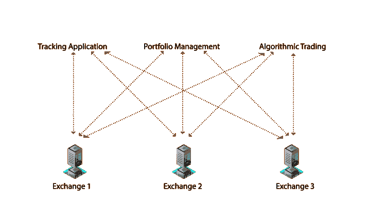
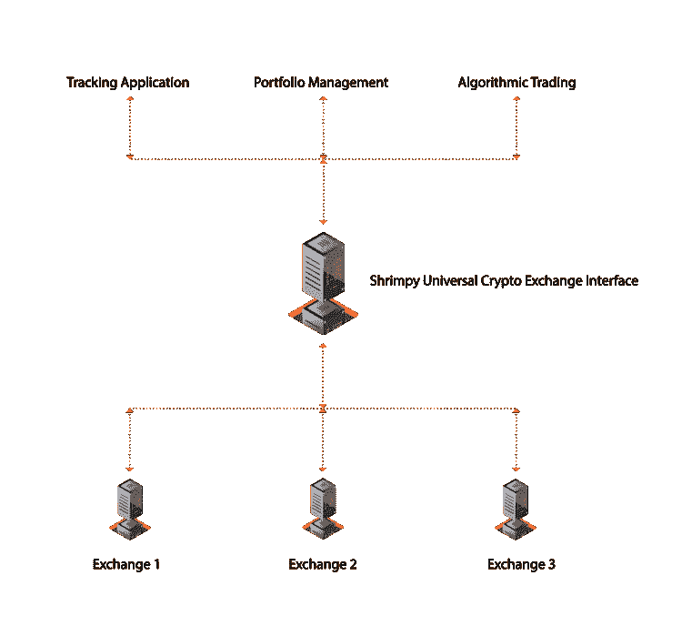
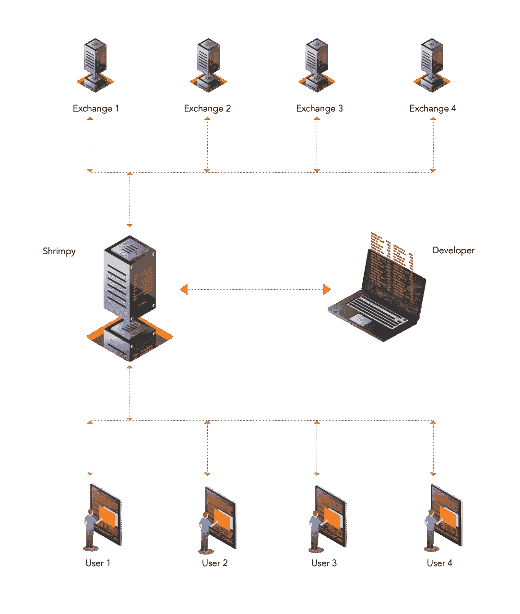

# 使用 Shrimpy 的加密交换 API 开发交易应用程序

> 原文：<https://medium.com/hackernoon/developing-trading-applications-with-shrimpys-crypto-exchange-api-4ee3c8f2552>

随着加密货币和数字资产市场的不断扩大和成熟，对强大的基础设施解决方案的需求日益增加，以连接分散在不同交易所的分散的流动性市场。加密领域已经出现了大量创新的加密货币跟踪和管理产品。

然而，将全功能交易功能集成到这些应用程序中仍然存在挑战。尽管目前市场上存在诸如 [CCXT](https://github.com/ccxt) 之类的解决方案，但这些解决方案主要作为纯软件解决方案存在。像 CCXT 这样的开源项目对于希望构建供个人使用的应用程序的开发人员来说是一个很好的解决方案，但是在为商业和企业使用进行扩展时却显得力不从心。

The current state of crypto trading APIs

在创建实际的交易应用程序时，开发人员仍然负责管理运行应用程序所需的后端基础设施。对代码库的更新需要重新部署，这涉及到不可避免的停机时间。在单个基础上整合每个交易所是不切实际的。每个交换都有自己的怪癖、独特的端点和任意的更新周期。对于大多数开发时间已经很紧的应用程序开发人员来说，这是一个噩梦。

# Shrimpy 通用加密交换 API

想象一下，在一个世界里，所有的交易都唾手可得。一个简单的世界，集成一个 API 意味着集成每一个交换。 [Shrimpy 的开发者 API](https://developers.shrimpy.io/) 旨在通过处理交换集成来解决这些问题，以便可以在任意数量的交换中使用一组 API。不再需要更改代码，不再需要重新部署，不再需要额外的 exchange 集成，当然也不再需要服务器扩展！

Shrimpy’s Universal Crypto Exchange Interface

[Shrimpy 的通用加密交易所 API](https://developers.shrimpy.io/) 消除了与每个交易所集成的艰苦过程，允许开发者专注于构建他们实际的交易产品。通过提供一个底层的交易和交易所基础设施来加速该领域的发展，Shrimpy 希望解决维护基础设施以支持每个交易所这一普遍遇到的问题。

[Shrimpy 的通用加密交换 API](https://developers.shrimpy.io/) 旨在解决加密领域的关键开发挑战:

1.  **低延迟订单执行&** [**自动化交易**](https://www.shrimpy.io/#features)
2.  **用户授权和管理**
3.  **业务&产品规模化**
4.  **实时数据&分析**

# 低延迟订单执行和自动化交易

## 智能交易路线和订单执行

虽然许多交易库提供了一定程度的便利，但开发人员仍然需要实现交易策略。这包括复杂的交易逻辑、数据收集和错误处理。Shrimpy 明白执行有效的策略需要做多少工作。我们通过提供智能订单路由、自动交易执行和投资组合分配选项，减轻了开发人员的负担。这些选项都是现成的 Shrimpy APIs。

虽然智能订单路由可能对一些人来说很方便，但我们理解其他开发人员希望完全控制他们的订单执行。Shrimpy 支持低延迟即时或取消(IOC)和开放式订单。这些端点是实时、算法和高频交易的理想选择。

## 投资组合再平衡和管理

Shrimpy 的通用加密交易 API 允许开发人员将 Shrimpy 易于使用的索引和重新平衡功能直接实现到自己的应用程序中。在几秒钟内，开发人员可以为每个用户分配一个投资组合并自动执行一个重新平衡策略。每个通过 Shrimpy 的 API 管理用户的开发人员都可以访问我们花在完善策略上的几个月的工作。

# 用户授权和管理

## 无服务器用户授权

Shrimpy 的通用加密交易 API 为开发人员提供了一个管理所有用户的解决方案，本质上是一个完整的用户管理解决方案。每个用户都可以直接与 Shrimpy 通信来访问他们的帐户、执行交易和收集数据，而不是让您的服务器陷入用户请求的泥潭。这释放了开发资源，并允许您的团队专注于您的核心产品。

## [用户账户& API 密钥安全](https://www.shrimpy.io/#security)

每个 API 密钥都使用 FIPS 140–2 验证硬件安全模块(HSM)进行安全加密和存储，以保护用户 exchange API 密钥的机密性和完整性。开发人员不再需要维护自己复杂的安全架构来管理用户 API 密钥。Shrimpy 通过利用我们强大的安全基础设施来促进 API 密钥管理。

# 业务和产品扩展

Shrimpy 明白，对于独立开发者来说，上述问题对于构建可扩展的加密交易和管理产品来说是一个巨大的挑战。Shrimpy 的通用加密交换 API 旨在通过提供一个简单而统一的 API 解决方案来解决这一开发者难题。

## 基于云的基础设施

尽管空间中存在过多的加密交易库，但是这些开源交易库不提供部署可扩展的功能应用程序所需的基础设施。

对于支持全功能跟踪和交易应用程序的企业来说，需要不成比例的服务器来支持相对较少的用户。很高的准入门槛使得容纳一个大型的活跃社区变得极其困难。

## [交换维护](https://www.shrimpy.io/#exchanges)

除了创建低延迟交易应用程序所需的后端系统架构之外，试图手动集成交易所的开发人员还面临着通过零星更新来维护每个交易所的问题。随着交换数量的增加，维护这些交换的难度也在增加。使用 Shrimpy APIs 不需要这种级别的维护。Shrimpy 团队将处理每个 exchange 集成和任何需要立即关注的更新。

## 端点管理

每个交换都支持一组唯一的端点。没有端点交换实现的标准，也没有它们将来将继续支持的端点的标准。Shrimpy APIs 通过在每个交换中提供一组公共端点简化了这个问题。即使交换不支持我们提供的端点，我们的团队也会构建一个功能相同的端点。这样，开发人员永远不需要担心在每次集成新的交易所时开发新的交易逻辑。永远都是统一的。

# 实时数据和分析

## 实时订单和市场数据

许多加密货币交易服务利用从 CoinMarketCap 等来源收集的通用市场数据。虽然这为大多数交易者提供了基本的功能，但完整的订单簿细节对于深入了解高级市场洞察(如套利机会)是必需的。Shrimpy 的通用加密交易 API 提取完整的订单簿和实时市场数据，以便及时做出决策。

## 回溯测试

Shrimpy 的通用加密交易 API 还包括一个独特的回溯测试功能，让用户分析各种基于时间的再平衡策略。由于集成的便利性，大多数加密回溯测试工具倾向于从 CoinMarketCap 等聚合源中提取数据。但是，不建议将汇总的 exchange 数据用于详细和精确的回溯测试，因为完整的订单簿详细信息在汇总时会被忽略。

Shrimpy 的 API 包括一个内置的回溯测试工具，用于分析精确的交换数据。与大多数分析不准确的 OHLCV 数据的加密货币回溯测试不同，Shrimpy 的回溯测试包括从各个交易所收集的完整价格和订单数据，确保只获得最准确和精确的结果。

Shrimpy’s API takes care of User Management and Exchange Interaction

# 定价

Shrimpy 明白，开发人员面临的最大麻烦之一是运行他们的应用程序所基于的云计算解决方案的成本。现有的云解决方案根据计算能力收费，这对于寻求开发依赖于实时数据和套利机会的低成本加密交易应用程序的小规模和独立开发者来说是一个巨大的难题。

Shrimpy 的 API 解决了开发人员最常遇到的障碍，它提供了一个负担得起的托管解决方案，价格仅为[**【0.99 美元/月/用户**](https://developers.shrimpy.io/#pricing) ！开发者将根据使用 Shrimpy 的 API 进行交易的用户数量付费。

# 面向开发人员的 Shrimpy

Shrimpy 的使命是促进开发者活动，并建立一个连接全球交易所和流动性市场的平台。Shrimpy 的 Universal Exchange API 是作为一个托管解决方案创建的，旨在解决开发人员在**功能开发**、**产品可伸缩性**和**用户管理方面的主要障碍。有了 Shrimpy 的 API 在手，开发人员就有能力创造新的和创新的服务，这将塑造加密空间的未来。**

从这里开始:[https://developers . shrimpy . io](https://developers.shrimpy.io)

# 关于虾皮

Shrimpy.io 是一个加密管理工具，任何人都可以管理自己的加密货币资产，如指数投资组合或共同基金。用户能够配置定制的加密货币组合，并实施被动管理策略，消除了必须主动交易加密的麻烦。

除了免费的加密交易和投资组合管理，Shrimpy 还提供每月订阅服务，包括以下内容:

*   社交:跟踪、交流和分享其他交易者的策略
*   [洞察](https://blog.shrimpy.io/blog/shrimpy-introduces-social-insights):了解其他 Shrimpy 用户如何构建和管理他们的加密组合。
*   [高级回溯测试](https://blog.shrimpy.io/blog/the-crypto-portfolio-rebalancing-backtest-tool):用于评估定制加密货币投资组合&策略的强大回溯测试工具。

免费报名:[https://www.shrimpy.io/signup](https://www.shrimpy.io/signup)

[电报](http://t.me/ShrimpyGroup)

[推特](https://twitter.com/ShrimpyApp)

[脸书](https://www.facebook.com/ShrimpyApp/)

*原载于*[*blog . shrimpy . io*](https://blog.shrimpy.io/blog/developing-crypto-trading-applications-shrimpy-api)*。*