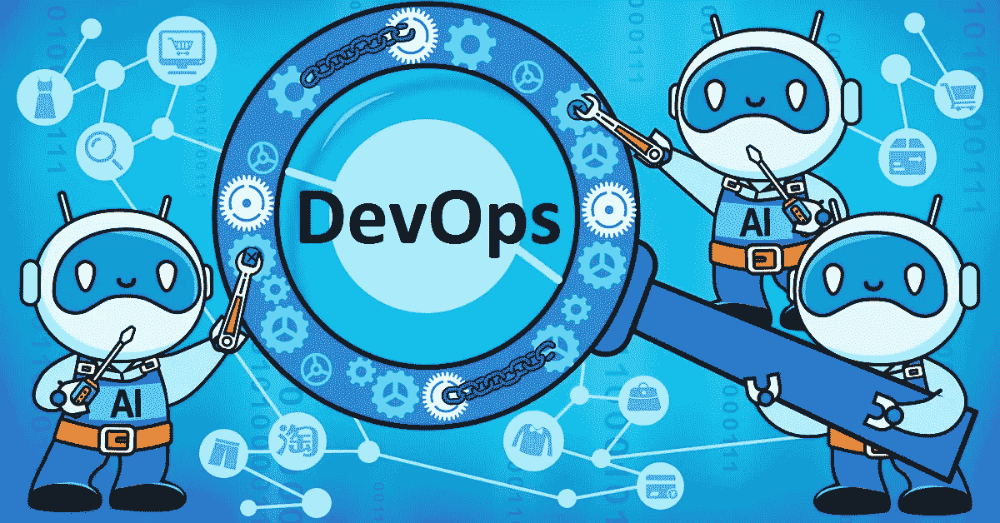
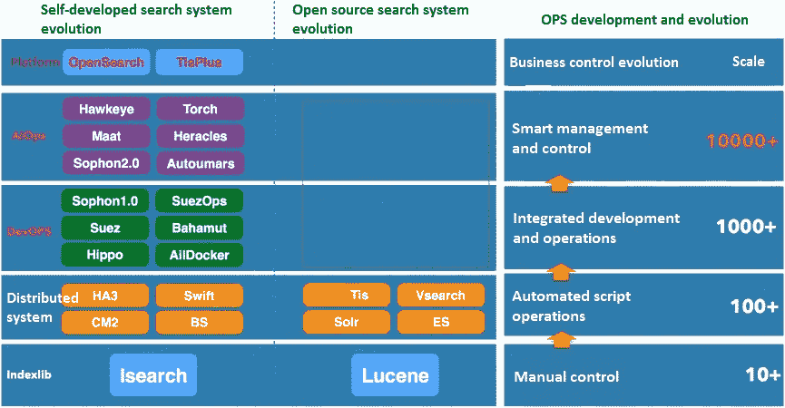
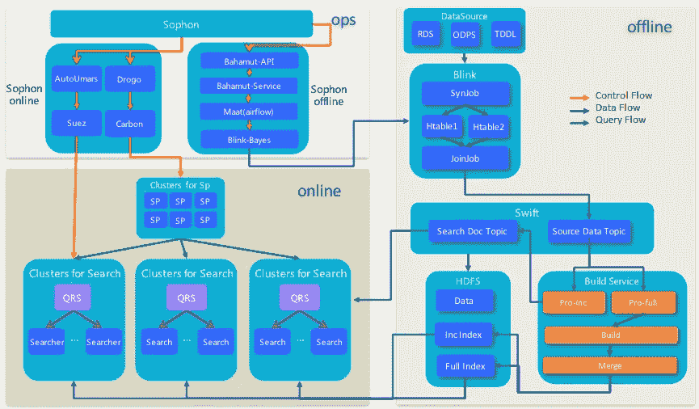
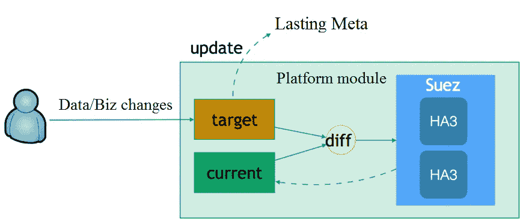
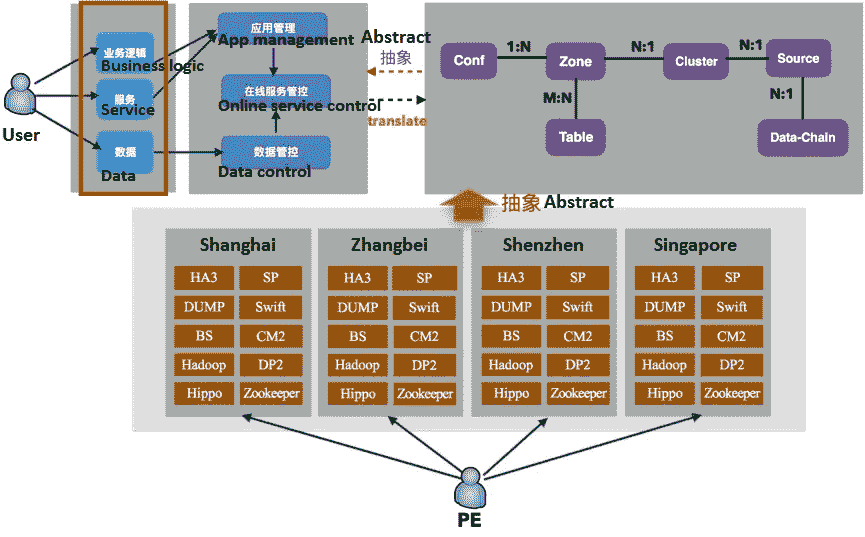
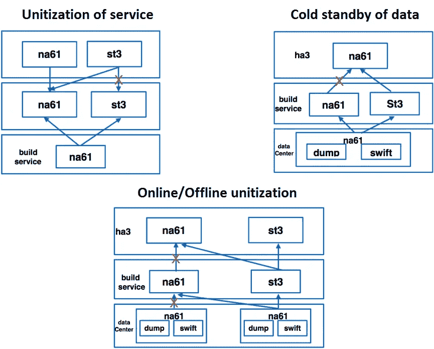
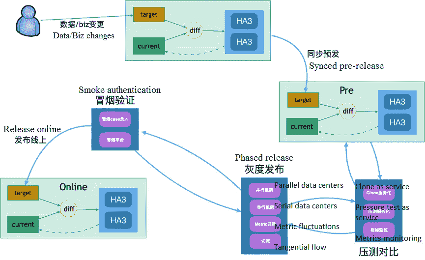
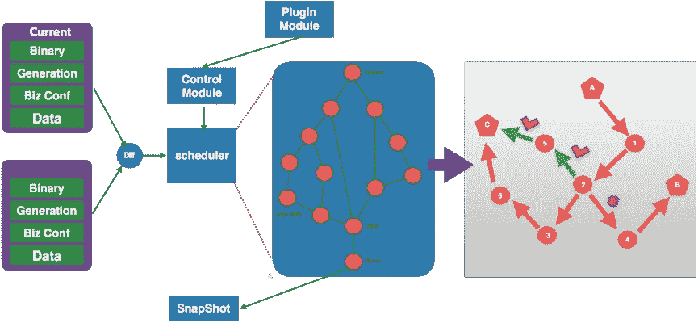
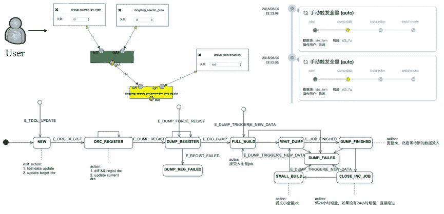
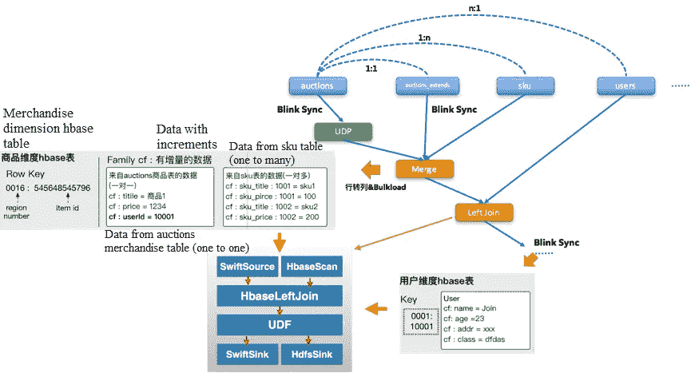

# DevOps 让低效的搜索开发成为过去

> 原文：<https://medium.com/hackernoon/devops-makes-inefficient-development-for-search-a-thing-of-the-past-28ab1b432011>

*阿里巴巴技术团队如何使用 DevOps 来提高其搜索支持平台的灵活性和适应性*

*本文是* [***搜索 AIOps***](/@alitech_2017/aiops-for-alibaba-search-operations-765854c60752) *迷你系列的一部分。*

2015 年底，阿里巴巴技术团队发布了基于“大赋能平台，小前端”的创新灵活理念构建组织和业务机制的赋能平台战略这一概念的基础是使前端更加敏捷，并赋予其快速适应市场的能力，而使能平台用于整合数字化运营和产品及技术能力，为各种前线服务提供强有力的支持。

阿里巴巴赋能平台布局链中至关重要的一环是让赋能平台处理搜索。然而，由于搜索技术固有的复杂性和巨大的商业规模，这使得搜索使能平台面临关于技术和产品的巨大挑战。

阿里巴巴搜索使能平台的建立是为了通过提高前端服务的敏捷性来支持前端服务，帮助它们更快地适应市场的变化，并最终消除不方便的搜索功能。为了实现这一目标，阿里巴巴科技团队在三年的时间里从零开始构建了他们的搜索支持平台，积累了在平台上运行 DevOps、AIOps 和离线服务的尖端知识和经验。

# 阿里巴巴如何开发搜索支持平台

下图显示了搜索支持平台在三年内的预测发展趋势，包括其实施情况摘要。

该图中表示的三个关键开发阶段是手动控制、自动化脚本操作以及集成开发和操作。

## 人工控制

在这一阶段，搜索服务部门和开源搜索技术的运行完全依赖于人工。大量的人力被浪费在多余的、低效的工作上。然而，随着时间的推移，PE 逐渐积累了经验，并确定可以使用自动化脚本来实现常见的重复操作，并在专业知识和领域知识刚刚开始积累的时候节省人力和提高操作效率。

## 自动化脚本操作

这个阶段的特点是使用开放源码技术系统。然而，以这种方式工作自然会将开发人员和操作人员分开，并将这两个角色对立起来。开发人员需要快速迭代，而运营商则专注于保持更少的迭代以保持在线稳定性。由于配置更改和软件更新导致的在线故障，这种分离导致了互不信任。最终，双方达成妥协，在发布窗口期间，每周二和周四发布更新。然而，这种妥协导致了较低的业务运营效率，进而在系统容量和业务方面的迭代需求之间产生了很大的差距。

## 集成开发和运营

这是阿里巴巴搜索支持平台目前的发展阶段。

为了解决自动化脚本操作的问题，该团队开发了一种基于 DevOps 的新控制系统，用于集成开发和操作，为迭代发布提供更好的解决方案。

由于业务场景本质上是一个技术系统管理过程，该团队认为 DevOps 应该不仅仅是一个简单的方法，用于集成各个系统的开发和操作。阿里巴巴希望将 DevOps 建立为单个系统 Ops 之上的“ops”。这本质上将工作与其他阿里巴巴 DevOps 平台分开，并以管理从部署到服务源代码更新的端到端流程的 Apsara Base 为代表。

本质上，Apsara 基地用户仍然被认为是运营商。因此，Apsara Base 使用 IAC (Infrastructure As Code)的 dimension +Git 管理和部署配置来创建产品。这是设计 DevOps 平台的典型方法，符合主要工作要求。

然而，阿里巴巴经常面对缺乏在线系统操作专业知识的最终用户，当他们只能看到配置或代码时，他们会迷失方向。从根本上说，团队必须提高他们对 DevOps 的理解，并转向将平台视为产品。为此，团队必须避免向用户公开配置、代码和复杂的行业专业知识，并转变系统协作以控制端到端的体验。只有通过简化流程和控制端到端全链路体验，才能彻底提高复杂搜索的迭代效率。

多年的努力投入到尝试这两种方法，导致了一系列 DevOps 系统的实现，包括索丰比特大陆，巴哈姆特和玛特。这些承诺的具体细节将在随后的章节中详细描述。

# 集成开发和运营— DevOps

在检查用于集成开发和运营的索丰-比特大陆系统之前，重要的是要理解涉及到哪些系统，以及当切换到具有复杂搜索场景的服务时，它们是如何协同工作的。

上图概述的系统分为三个模块:OPS、Online 和 Offline。如图所示，ops 层分为在线有状态服务 ops、在线无状态服务 ops 和离线 Ops。换句话说，每个服务分别依赖 OPS 进行控制。但是，上图也显示了多个服务系统协作的复杂交易结果。

在启动 tisplus 和在一个复杂的项目中切换之前，在线有状态服务团队、在线无状态服务团队、离线转储团队、业务方和 PE 被召集在一起，就如何合作发布项目交换意见。发布后，在线更改和故障排除是在支持小组频繁紧张的交流中进行的，这影响了效率，并且只支持十个单独的业务部门。

考虑到这些痛点，团队现在可以回头检查将 DevOps 构建为复杂搜索系统的必备功能:

1.提供端到端体验的全链路运营，精确匹配复杂场景的开发运维定义。

2.常识性的、面向流程的操作在复杂的操作控制环节中更新为目标驱动的操作控制。

3.体面的操作和产品抽象，更好地支持用户。

4.提高业务迭代效率，作为确保业务可靠性的基础。

阿里巴巴创建了索丰-比特大陆平台来解决这些棘手问题，这将在后续章节中详细阐述。

# 目标驱动的操作

许多用户不熟悉目标驱动的操作，最初觉得这个概念太抽象。然而，从实际搜索中检查操作场景可以帮助更好地理解目标驱动的操作控制的需要。

考虑以下示例:索引系统正在使用索引版本 A，并被请求切换到版本 B。当系统推出版本 B 时，接收到切换到版本 c 的新指令。对于以前的方法，以这种方式切换会导致崩溃。PEs 只能通过终止当前的切换过程、检查每个节点前进了哪一步、清除中间过程并释放操作来成功执行该过程。这证明了在复杂的操作系统下，面向过程的操作控制是多么的低效。

相反，如果在目标驱动的流程下遇到相同的场景，则通过设置新版本 C 以供系统滚动来执行切换。这将更新最新目标的系统，并与当前执行的渐进目标进行比较。一旦检测到目标发生变化，系统立即终止当前的执行路径，自动清除不一致的状态，并开始分发执行最新目标状态的关键路径的通知。收到最新命令后，每个节点开始向新目标前进。

这种递进一致的操作方式自然屏蔽了中间操作状态的复杂性，使得复杂的操作控制更加简单灵活。阿里巴巴的运营平台都是因为这些好处，自上而下的改成了目标驱动运营。

# 简化的操作概念

简化操作的另一种常用方法是用启用代替托管，这意味着用户在享受更强大的搜索能力之前必须承担更多的责任。然而，支持终端用户并不意味着他们应该接触到搜索系统及其操作的深奥、复杂的概念。简化系统的运营理念，将复杂的信息和行业诀窍密封在系统内部，是阿里巴巴旗下索丰-比特大陆的核心任务之一。

上图的下半部分从 PE 的角度显示了每个数据中心的基础架构和在线服务。如果没有控制抽象层，用户将面临与 PE 相同的复杂程度，这可能会非常混乱。索丰-比特大陆从几个方面限制了复杂性。首先，它将对象抽象成一组称为操作控制模型的数据关系模型(如上图右侧所示)。然而，最终的操作抽象层对于用户来说仍然太复杂，应该只向用户显示包含业务场景的特定业务抽象。

作为一个解决方案，索丰-比特大陆在操作抽象的第一层上增加了一个业务抽象层。上图左上角的三个概念层就是一个例子:业务逻辑(插件、配置)、服务(部署关系)和数据(数据源&离线数据处理)。用户几乎不用花钱就可以接受这一层的定义。因此，索丰-比特大陆在抽象操作和简化业务概念方面的能力，使得从托管切换到启用用户成为可能。

## 保证服务可靠性

索丰-比特大陆在几个方面保证了服务的可靠性。由于索丰-比特大陆支持越来越多的领先核心业务，阿里巴巴必须为搜索服务提供 SLA 保证，并通过灵活部署在线和离线服务来响应每个业务的可靠性要求。自动容灾切换也是一个必需的功能。

在目前的服务可靠性水平上，索风比特大陆支持在线和离线搜索服务的统一、离线数据的冷备部署、查询和数据回流链路的自动容灾切换，如下图所示:

迭代效率提高的一个指标是，现在可以随时随地发布迭代，而不是使用以前基于时间窗口的在线发布方法。然而，这并不意味着发布可以在不考虑快速迭代发布的潜在风险的情况下随意执行。

为了实现安全高效的迭代发布目标，阿里巴巴设计并标准化了一套迭代发布代码。例如，一个正常的业务迭代必须在日常和预发布环境中得到验证。该团队还增加了多层认证机制，以确保发布的可靠性。例如，当升级插件和算法策略时，团队要求在克隆上执行压力测试。如果性能下降太多，发布过程将被拒绝。此外，可以在启动程序中定义单数据中心切向流分阶段释放、烟雾验证和类似功能。

这些变化赋予了索风比特大陆强大的多层认证和快速容灾切换能力，同时快速发布业务迭代和提高迭代效率的风险。

## 积累专业知识

虽然搜索技术系统的功能很强大，但它们在众多令日常用户不知所措的内部规则(例如，复杂操作控制和业务迭代的专业知识要求)的控制下运行。

例如，在搜索场景中，在业务端更改单个字段可能需要对相关配置进行多次在线和离线更改。让用户参与这一过程可能需要他们做出复杂的判断，例如:

线上服务、线下服务或两者都会受到影响吗？

推送的配置是先在线生效还是先离线生效？

完整备份后，所有配置会同时进行吗？

要求用户做出这种判断会导致他们感到恼怒和困惑。因此，对于阿里巴巴来说，重要的是利用索丰-比特大陆 DevOps 层的引擎服务专业知识，将这些复杂性控制在平台内，并在幕后管理所有相关的复杂知识和决策。运营平台可以分解，然后根据预先定义的专家运营 DAG 图分阶段在内部执行复杂的运营，如下图所示:

不断地向系统输入操作专业知识(操作 DAG 的执行流)，降低了平台的使用成本，同时提高了迭代的效率。在操作越来越复杂的情况下(例如，当向用户公开的操作覆盖越来越多的服务时)，操作 DAG 执行链接可以从简单阶段发展到存在多个执行分支的复杂阶段。确定最佳执行链接也变成了一项细致的工作(如上图右侧所示)。阿里巴巴将这种操作称为“最短路径路由”。这代表了实现智能运营的一种尝试，也表明了阿里巴巴在这一领域未来努力的方向。

## 从系统到全链路

在讨论离线平台技术之前，有必要了解一下搜索对离线处理的普遍需求的背景。在复杂业务的线下平台建立之前，这已经是线下跨团队讨论的一个常见主题。

对于引擎来说，业务数据不仅仅由一个简单的数据库表组成，而是可以来自许多同构数据源或异构数据源。每个搜索业务都需要完整备份和增量备份。因此，重要的是确定团队如何将业务对应的不同数据源关系转化为上层抽象，阻塞内部流程，并整合增量备份和完整备份。

对每个新业务实施完全备份代码和增量备份代码并不理想。回顾以前的工作，阿里巴巴的离线支持不足归结为引擎模式定义的数据源被削弱到资源对进行抽象和管理，导致无法提取基本的抽象。

目前，所有接入的数据资源都是动态表。当使用表摘要定义这些资源时，某些通用 API 可以聚合并消除重复开发的需要，包括:

创建表格

删除表格

修改表格

添加、删除、修改和查询表格数据

定义表关系，

这启发了阿里巴巴在建立线下组件平台 bahamut 时的做法和整体心态。

线上组件的平台化只是将线下的数据处理能力平台化。搜索场景总是一个动态的过程，以在线和离线协作和结合为特征。如前所述，所有的业务场景都是协调技术系统的结果。这一过程中最重要和最具挑战性的部分是确保高效的在线和离线协作，并为用户提供端到端的体验。

下图显示了当使用离线数据时，最终用户如何总是看到可视化数据关系定义和简单的执行列表 dump->Build->switchindex。系统背后是一个复杂的状态机，它管理在线和离线协作，因为团队已经屏蔽了所有的复杂性。

接下来，该团队将分享他们如何将每个在线搜索业务对离线数据处理的个性化需求转化为抽象，并最终通过一个平台满足需求。

bahamut 平台支持用户定义各自数据源信息与表之间的关系(团队支持异构表之间的联合操作，如 odps 和 mysql)。然后，团队将这个前端图提交给巴哈姆特进行翻译。然后，巴哈姆特对这个图形进行解析、优化、拆分和翻译，使之成为可以由 blink 执行的几个图形，包括:

增量备份同步闪烁任务

完整备份批量装载 MR 任务

眨眼加入任务。

在这个实例中，两个最关键的图节点是 merge 和 left join。Merge 将所有 1:1 和 1:N 关系表的处理转换为一个 HBASE 临时表。关于 N:1 关系表的处理，目前只在主表 N(商品表)一侧支持驱动。换句话说，N 端表通过 blink sync 更新，然后通过 blink Join1 与 1 端的表(用户表)合并，形成完整的行记录。然后，这些行记录被发送到 SwiftSink(增量)和 HDFSSink(完整)。最后，它们流回 BuildService(一个索引构造服务)来构造索引，如下图所示:

线上和线下的控制和协作，加上巴哈姆特组件平台的构建，通过可视化的手段赋予用户强大的处理和计算复杂的线下数据关系的能力。这确保了更高效的业务支持，并突出了该平台在离线整合能力和提供端到端离线体验方面的里程碑意义。

阿里巴巴也在努力将线下能力转化为一般的在线服务能力。阿里巴巴相信，在不久的将来，线下组件平台将不会只专注于 HA3 搜索场景，而是会全面扩展到在线搜索服务。

***(The original article is written by Liu Ming 柳明)***

# 阿里巴巴科技

关于阿里巴巴最新技术的第一手深度资料→脸书: [**“阿里巴巴科技”**](http://www.facebook.com/AlibabaTechnology) 。推特: [**【阿里巴巴技术】**](https://twitter.com/AliTech2017) 。